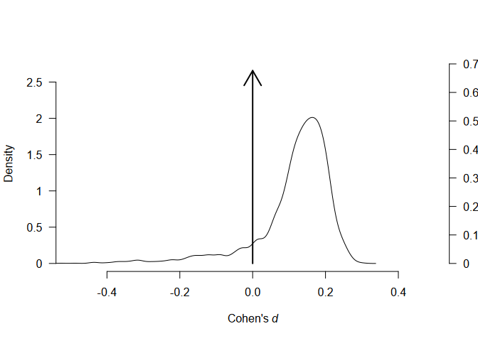
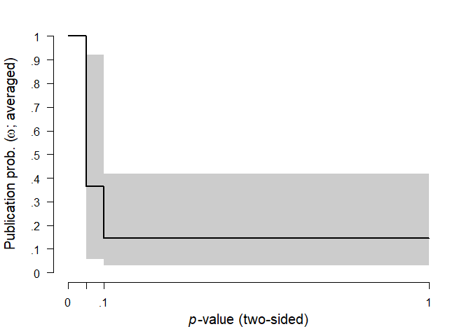
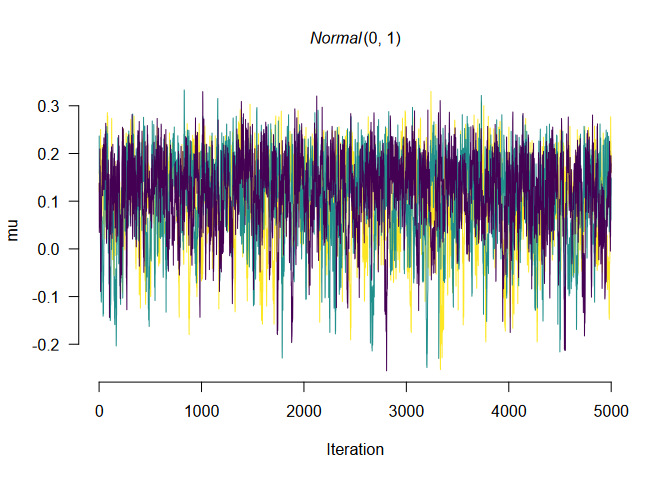

README
================

<!-- README.md is generated from README.Rmd. Please edit that file -->

# Robust Bayesian Meta-Analysis (RoBMA)

Please note that since version 1.2.0, (1) studies’ true effects are now
marginalized out of the random effects models and are no longer
estimated and (2) all models are now estimated using the likelihood of
effect sizes and standard errors (see Appendix A of our
[prerint](https://psyarxiv.com/u4cns/) for more details). As a results,
arguments referring to the true effects are now disabled. And results
obtained with previous versions of the package are not reproducible.

This package estimates an ensemble of meta-analytic models (assuming
either presence or absence of the effect, heterogeneity, and publication
bias) and uses Bayesian model averaging to combine them. The ensemble
uses Bayes factors to test for the presence of absence of the individual
components (e.g., effect vs. no effect) and model-averages parameter
estimates based on posterior model probabilities. The user can define a
wide range of non-informative or informative priors for the effect size,
heterogeneity, and weight functions. The package provides convenient
functions for summary, visualizations, and fit diagnostics.

See our preprint, Maier et al. (2020) at
<https://doi.org/10.31234/osf.io/u4cns>, for more details about the
implementation, examples, and simulation studies or try out the package
functionality in the user-friendly graphical user interface of JASP with
our preprint of a tutorial paper with additional examples (Bartoš et
al., 2020) at <https://doi.org/10.31234/osf.io/75bqn>.

We also prepared multiple vignettes that illustrate functionality of the
package:

  - [Explanation and dealing with warnings and
    errors](https://fbartos.github.io/RoBMA/articles/WarningsAndErrors.html)
  - [Reproducing Bayesian Model-Averaged Meta-Analysis
    (BMA)](https://fbartos.github.io/RoBMA/articles/ReproducingBMA.html)
  - [Fitting custom meta-analytic
    ensembles](https://fbartos.github.io/RoBMA/articles/CustomEnsembles.html)

## Installation

The package requires [JAGS 4.3.0](http://mcmc-jags.sourceforge.net/) to
be installed. The release version can be installed from CRAN:

``` r
install.packages("RoBMA")
```

and the development version of the package can be installed from GitHub:

``` r
devtools::install_github("fbartos/RoBMA")
```

## Example

To illustrate the functionality of the package, we reproduce\(^1\) the
example in Maier et al. (2020) where we use the RoBMA package to
re-analyze a subset of Anderson et al. (2010) meta-analysis of effects
of violent video games on aggression (the original dataset can be found
[here](https://github.com/Joe-Hilgard/Anderson-meta)).

First, we load the dataset which is included with the package. The
dataset contains correlational coefficients, sample sizes, and labels
for 27 experimental studies focusing on the effect of violent videogames
on aggressive behavior.

``` r
library(RoBMA)
#> Loading required namespace: runjags
#> module RoBMA loaded
#> Please, note the following changes in version 1.2.0 (see NEWS for more details):
#> - all models are now estimated using the likelihood of effects sizes (instead of t-statistics)
#> - parametrization of random effect models changed (the studies' true effects are marginalized out of the likelihood)

data("Anderson2010", package = "RoBMA")
head(Anderson2010)
#>        r   n                    name
#> 1 0.2445  90 Anderson (2004; Exp. 2)
#> 2 0.1883 204 Anderson (2004; Exp. 3)
#> 3 0.2441 103     Anderson (in press)
#> 4 0.1585 196         Anderson (2000)
#> 5 0.1680 148          Arriaga (2008)
#> 6 0.2698  90         Anderson (2003)
```

Then, we fit the meta-analytic model ensemble that is composed of 12
models (the default settings of RoBMA fitting function). These models
are all possible combinations of priors for the following parameters
(the prior parameters for \(\mu\) and \(\tau\) are defined on Cohen’s d
transformed scale if correlation coefficients are supplied):

  - \(\mu\) (the mean parameter)
      - a spike at zero, representing a null effect
      - a standard normal distribution, representing the alternative
        hypothesis
  - \(\tau\) (the heterogeneity parameter)
      - a spike at zero, representing no heterogeneity (fixed effect)
      - an inverse gamma distribution with shape = 1 and scale = 0.15,
        representing presence of heterogeneity (random effects), based
        on Erp et al. (2017)
  - \(\omega\) (the weights parameters for modeling publication bias)
      - a spike at 1, representing no publication bias (all studies have
        the same probability of being published)
      - a two-steps two-sided weight-function with *p*-values cut-off at
        0.05 and weights following a cumulative sum of Dirichlet
        distribution with alpha = (1,1)
      - a three-steps two-sided weight-function with *p*-values cut-offs
        at 0.05 and 0.10 and weights following a cumulative sum of
        Dirichlet distribution with alpha = (1,1,1)

The prior odds of these prior distributions are by default set to make
all three model categories equally likely a priory (0.5 prior
probability of an effect, 0.5 prior probability of heterogeneity, and
0.5 prior probability of publication bias).

The default models using the correlation coefficients can then be fitted
using the `RoBMA()` function (all input is internally transformed into
t-statistics and degrees of freedom):

``` r
fit <- RoBMA(r = Anderson2010$r, n = Anderson2010$n, study_names = Anderson2010$name)
```

The main model summary can be obtained using the `summary.RoBMA()`
function.

The first table shows an overview of the model types -the number of
models, prior and posterior probability, and inclusion Bayes factor. As
we can see, the data show strong evidence for the presence of effect and
publication bias and weak evidence for lack of heterogeneity.

The second table shows model-averaged estimates weighted by the
individual models’ posterior probabilities. The mean estimate \(\mu\)
(converted back to correlation scale) is considerably lower than in the
original meta-analysis due to the publication bias correction. The
heterogeneity estimate \(\tau\) (on the Cohen’s d scale) has most of its
probability mass around zero due to the higher support of models with no
heterogeneity. The parameters omega, representing the weights at each
*p*-value interval are decreasing with increasing *p*-values, showing
the publication bias.

``` r
summary(fit)
#> Call:
#> RoBMA(r = Anderson2010$r, n = Anderson2010$n, study_names = Anderson2010$name)
#> 
#> Robust Bayesian Meta-Analysis
#>               Models Prior prob. Post. prob.     Incl. BF
#> Effect          6/12       0.500       1.000 10523514.159
#> Heterogeneity   6/12       0.500       0.138        0.160
#> Pub. bias       8/12       0.500       0.997      382.271
#> 
#> Model-averaged estimates
#>                  Mean Median 0.025 0.975
#> mu              0.152  0.152 0.096 0.206
#> tau             0.010  0.000 0.000 0.105
#> omega[0,0.05]   1.000  1.000 1.000 1.000
#> omega[0.05,0.1] 0.364  0.307 0.057 0.920
#> omega[0.1,1]    0.146  0.117 0.029 0.418
#> (Tau is on Cohen's d scale.)
#> (Estimated omegas correspond to two-sided p-values)
```

We can visualize the estimated parameters using the `plot.RoBMA()`
function. In the case of parameter tau, the arrow stands for probability
mass at \(\tau\) = 0. Weights \(\omega\) are by default plotted as the
weight function, which can be changed to the individual weights
estimates by setting `weights = TRUE`.

``` r
plot(fit, parameter = "mu")
```



``` r
plot(fit, parameter = "tau")
```


``` r
plot(fit, parameter = "omega")
```



Furthermore, we can inspect the individual models’ estimates mu,
including the prior and posterior probability.

``` r
plot(fit, parameter = "mu", type = "individual")
```


Apart from plotting, the individual model performance can be inspected
using the `summary.RoBMA()` function with argument `type =
"individual"`. An overview of the individual model MCMC diagnostics can
be obtained by setting `type = "models", diagnostics = TRUE` (not shown
here for the lack of space).

We can also visualize the MCMC diagnostics using the diagnostics
function. The function can display the chains `type = "chain"` /
posterior sample densities `type = "densities"`, and averaged
autocorrelations `type = "autocorrelation"`. Here, we request the chains
trace plot of the \(\mu\) parameter of the most complex model by setting
`show_models = 12` (the model numbers can be obtained from the summary
function with `type = "models"` argument.)

``` r
RoBMA::diagnostics(fit, parameter = "mu", type = "chains", show_models = 12)
```



The package allows to fit highly customized models with different prior
distribution functions, prior model probabilities, and provides more
visualization options. See the documentation to find out more about the
specific functions: `RoBMA()`, `priors()`, `plot.RoBMA()`. The main
package functionalities are to be implemented within the Meta Analysis
module of JASP 0.14 (JASP Team, 2020).

### Footnotes

1 - There have been changes in the way the seed is set since finishing
the paper. Use the archival version of the package stored at the [OSF
repository](https://osf.io/buk8g/) to obtain identical results to those
reported in the paper.

### References

<div id="refs" class="references">

<div id="ref-Anderson2010">

Anderson, C. A., Shibuya, A., Ihori, N., Swing, E. L., Bushman, B. J.,
Sakamoto, A., Rothstein, H. R., & Saleem, M. (2010). Violent video game
effects on aggression, empathy, and prosocial behavior in Eastern and
Western countries: A meta-analytic review. *Psychological Bulletin*,
*136*(2), 151. <https://doi.org/10.1037/a0018251>

</div>

<div id="ref-bartos2020">

Bartoš, F., Maier, M., & Wagenmakers, E.-J. (2020). Adjusting for
publication bias in JASP — selection models and robust bayesian
meta-analysis. In *PsyArXiv*. <https://doi.org/10.31234/osf.io/75bqn>

</div>

<div id="ref-vanErp2017">

Erp, S. van, Verhagen, J., Grasman, R. P., & Wagenmakers, E.-J. (2017).
Estimates of between-study heterogeneity for 705 meta-analyses reported
in Psychological Bulletin from 1990–2013. *Journal of Open Psychology
Data*, *5*(1). <https://doi.org/10.5334/jopd.33>

</div>

<div id="ref-jasp">

JASP Team. (2020). *JASP (Version 0.14)*. <https://jasp-stats.org/>

</div>

<div id="ref-maier2020">

Maier, M., Bartoš, F., & Wagenmakers, E.-J. (2020). Robust Bayesian
meta-analysis: Addressing publication bias with model-averaging. In
*PsyArXiv*. <https://doi.org/10.31234/osf.io/u4cns>

</div>

</div>
