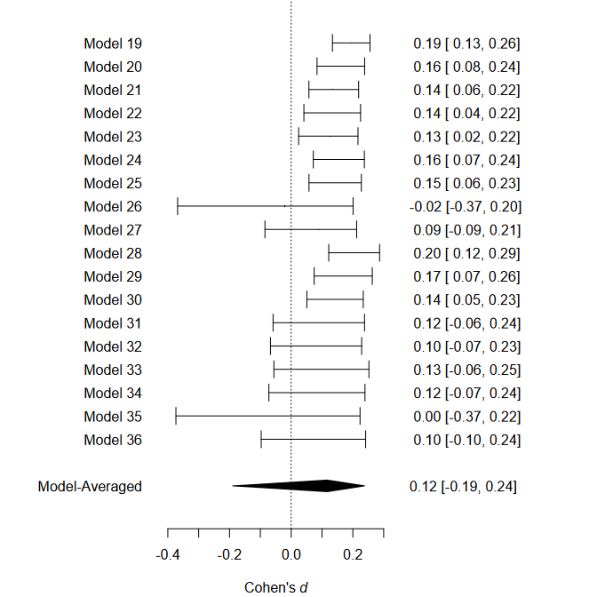

README
================

<!-- README.md is generated from README.Rmd. Please edit that file -->

# Robust Bayesian Meta-Analysis (RoBMA)

This package estimates and ensemble of meta-analytical models (assuming
either presence or absence of the effect, heterogeneity, and publication
bias) and uses Bayesian model averaging to combine them. The ensemble
uses Bayes Factors to test for the presence of absence of the individual
components (e.g., effect vs no effect) and model-averages parameter
estimates based on posterior model probabilities. The user can define a
wide range of non-informative or informative priors for the effect size,
heterogeneity, and weight functions. The package provides convenient
functions for summary, visualizations, and fit diagnostics.

See our pre-print, Maier, Bartoš, & Wagenmakers (2020) at
<https://doi.org/10.31234/osf.io/u4cns>, for more details about the
implementation, examples, and simulation studies.

## Installation

The development version can be installed from
[GitHub](https://github.com/) with:

``` r
# install.packages("devtools")
devtools::install_github("FBartos/RoBMA")
```

In case of compilations problems, please, install the package from
source using the following
[RoBMA.tar.gz](https://drive.google.com/file/d/11rlNum7YpsjzaF0aRqzi3XjedmRLjwX9/view?usp=sharing)

``` r
# install.packages("devtools")
install.packages("RoBMA.tar.gz", repos = NULL, type="source")
```

## Example

This is a reproduction of an example in Maier, Bartoš, & Wagenmakers
where we use the RoBMA package to re-analyze a subset of Anderson et
al. (2010) meta-analysis of effects of violent video games on
aggression (the original dataset can be found
[here](https://github.com/Joe-Hilgard/Anderson-meta)).

First, we load the dataset which is included with the package. The
dataset contains correlational coefficients, sample sizes, and labels
for 27 experimental studies focusing on the effect of violent videogames
on aggressive behavior.

``` r
library(RoBMA)
#> Loading required namespace: runjags
#> module RoBMA loaded

data("Anderson2010", package = "RoBMA")
head(Anderson2010)
#>        r   n                    name
#> 1 0.2445  90 Anderson (2004; Exp. 2)
#> 2 0.1883 204 Anderson (2004; Exp. 3)
#> 3 0.2441 103     Anderson (in press)
#> 4 0.1585 196         Anderson (2000)
#> 5 0.1680 148          Arriaga (2008)
#> 6 0.2698  90         Anderson (2003)
```

Then, we fit the meta-analytic model ensemble that is composed of 12
models (the default settings of RoBMA fitting function). These models
are all possible combinations of priors for the following parameters
(the prior parameters for mu and tau are defined on Cohen’s d
transformed scale if correlation coefficients are supplied):

  - mu (the mean parameter)
      - a spike at zero, representing a null effect
      - a standard normal distribution, representing the alternative
        hypothesis
  - tau (the heterogeneity parameter)
      - a spike at zero, representing no heterogeneity (fixed effect)
      - an inverse gamma distribution with shape = 1 and scale = 0.15,
        representing presence of heterogeneity (random effects), based
        on van Erp et al. (2017)
  - omega (the weights parameters for modeling publication bias)
      - a spike at 1, representing no publication bias (all studies have
        the same probability of being published)
      - a two-steps two-sided weight-function with p-values cut-off at
        0.05 and weights following a cumulative sum of Dirichlet
        distribution with alpha = (1,1)
      - a three-steps two-sided weight-function with p-values cut-offs
        at 0.05 and 0.10 and weights following a cumulative sum of
        Dirichlet distribution with alpha = (1,1,1)

The prior odds of these prior distributions are by default set to make
all three model categories equally likely a priory (0.5 prior
probability of an effect, 0.5 prior probability of heterogeneity, and
0.5 prior probability of publication bias).

The default models using the correlation coefficients can then be fitted
using the `RoBMA()` function (all input is internally transformed into
t-statistics and degrees of
freedom):

``` r
fit <- RoBMA(r = Anderson2010$r, n = Anderson2010$n, study_names = Anderson2010$name)
```

The main model summary can be obtained using the `summary()` function.

The first table shows an overview of the model types -the number of
models, prior and posterior probability, and inclusion Bayes factor. As
we can see, the data show strong evidence for the presence of effect and
publication bias and weak evidence for lack of heterogeneity.

The second table shows model-averaged estimates weighted by the
individual models’ posterior probabilities. The mean estimate mu
(converted back to correlation scale) is considerably lower than in the
original meta-analysis due to the publication bias correction. The
heterogeneity estimate tau (on the Cohen’s d scale) has most of its
probability mass around zero due to the higher support of models with no
heterogeneity, and the parameters omega, representing the weights at
each p-value interval are decreasing with increasing p-values, showing
the publication bias.

``` r
summary(fit)
#> Call:
#> RoBMA(r = settings$r, n = settings$n, study_names = settings$name, 
#>     seed = 666)
#> 
#> Robust Bayesian Meta-Analysis
#>               Models Prior prob. Post. prob.     Incl. BF
#> Effect          6/12       0.500       1.000 11547021.531
#> Heterogeneity   6/12       0.500       0.137        0.159
#> Pub. bias       8/12       0.500       0.998      529.088
#> 
#> Model-averaged estimates
#>                  Mean Median 0.025 0.975
#> mu              0.151  0.151 0.092 0.205
#> tau             0.000  0.000 0.000 0.098
#> omega[0,0.05]   1.000  1.000 1.000 1.000
#> omega[0.05,0.1] 0.496  0.496 0.100 0.969
#> omega[0.1,1]    0.096  0.096 0.021 0.367
#> (Tau is on Cohen's d scale.)
#> (Estimated omegas correspond to two-sided p-values)
```

We can visualize the estimated parameters using the `plot()` function.
In the case of parameter tau, the arrow stands for probability mass at
tau = 0. Weights omega are by default plotted as the weight function,
which can be changed to the individual weights estimates by setting
`weights =
TRUE`.

``` r
plot(fit, parameter = "mu")
```


``` r
plot(fit, parameter = "tau")
```


``` r
plot(fit, parameter = "omega")
```


Furthermore, we can inspect the individual models’ estimates mu,
including the prior and posterior
probability.

``` r
plot(fit, parameter = "mu", type = "individual")
```



Apart from plotting, the individual model performance can be inspected
using the `summary()` function with argument `type = "individual"`. An
overview of the individual model MCMC diagnostics can be obtained by
setting `type = "models", diagnostics = TRUE` (not shown here for the
lack of space).

We can also visualize the MCMC diagnostics using the diagnostics
function. The function can display the chains `type = "chain"` /
posterior sample densities `type = "densities"`, and averaged
autocorrelations `type = "autocorrelation"`. Here, we request the chains
trace plot of the mu parameter of the most complex model by setting
`show_models = 12` (the model numbers can be obtained from the summary
function with `type = "models"`
argument.)

``` r
RoBMA::diagnostics(fit, parameter = "mu", type = "chains", show_models = 12)
```


The package allows to fit highly customized models with different prior
distribution functions, prior model probabilities, and provides more
visualization options. See the documentation to find out more about the
specific functions: `?RoBMA`, `?priors`, `?plot.RoBMA`. The main package
functionalities are to be implemented within the Meta Analysis module of
JASP 0.13.

## Sources

Anderson, C. A., Shibuya, A., Ihori, N., Swing, E. L., Bushman, B. J.,
Sakamoto, A., … & Saleem, M. (2010). Violent video game effects on
aggression, empathy, and prosocial behavior in Eastern and Western
countries: A meta-analytic review. Psychological bulletin, 136(2), 151.

Maier, M., Bartoš, F., & Wagenmakers, E. (2020, June 23). Robust
Bayesian meta-analysis: Addressing publication bias with
model-averaging. <https://doi.org/10.31234/osf.io/u4cns>

JASP Team. (2020). JASP (Version 0.13)\[Computer software\].

van Erp, S., Verhagen, J., Grasman, R. P., & Wagenmakers, E. J. (2017).
Estimates of between-study heterogeneity for 705 meta-analyses reported
in Psychological Bulletin from 1990–2013. Journal of Open Psychology
Data, 5(1).
