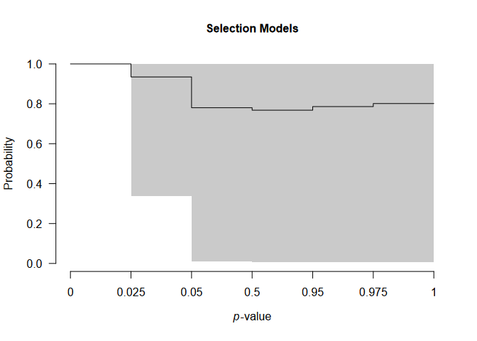
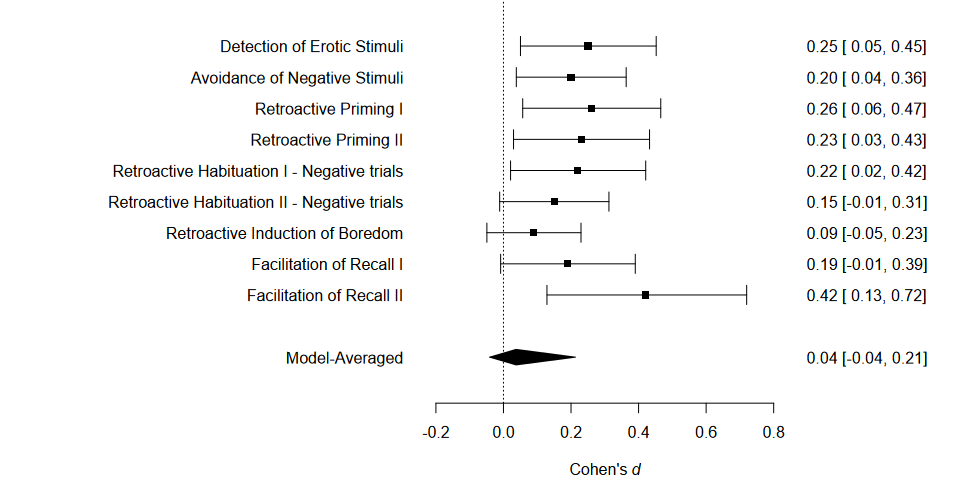

README
================

<!-- README.md is generated from README.Rmd. Please edit that file -->

<!-- badges: start -->

[](https://github.com/FBartos/RoBMA/actions)
[](https://github.com/FBartos/RoBMA/actions)
[](https://app.codecov.io/gh/FBartos/RoBMA?branch=master)
[](https://CRAN.R-project.org/package=RoBMA)
<!-- badges: end -->

# Robust Bayesian Meta-Analysis (RoBMA)

This package estimates an ensemble of meta-analytic models (assuming
either the presence or absence of effect, heterogeneity, and publication
bias) and uses Bayesian model averaging to combine them. The ensemble
uses Bayes factors to test for the presence of absence of the individual
components (e.g., effect vs. no effect) and model-averages parameter
estimates based on posterior model probabilities. The user can define a
wide range prior distributions for the effect size, heterogeneity,
publication bias components (including selection, PET, and PEESE style
models), and moderators. The package provides convenient functions for
summary, visualizations, and fit diagnostics. The package is designed to
be user-friendly and provides a wide range of customization options. The
package is also integrated into the JASP software (JASP Team, 2020) and
can be used via the graphical user interface.

See our manuscripts that for technical details and examples:

- Bartoš et al. (2025) (<https://doi.org/10.1037/met0000737>) extends
  RoBMA-PSMA into meta-regression
- Bartoš, Otte, et al. (2023)
  (<https://doi.org/10.48550/arXiv.2306.11468>) outlines binomial-normal
  Bayesian model-averaged meta-analysis for binary outcomes (+ develops
  informed prior distributions for log OR, log RR, RD, and log HR in
  medical settings, also see Bartoš et al. (2021) for informed prior
  distributions for Cohen’s d, based on the Cochrane Database of
  Systematic Reviews)
- Bartoš, Maier, et al. (2023) (<https://doi.org/10.1002/jrsm.1594>)
  describes the newest version of publication bias adjustment,
  RoBMA-PSMA, which combines selection models and PET-PEESE,
- Maier et al. (2023) (<https://doi.org/10.1037/met0000405>) introduces
  the RoBMA framework and the original version of the method,
- Bartoš et al. (2022) (<https://doi.org/10.1177/25152459221109259>)
  provides an accessible tutorial on the method including the
  implementation in the the user-friendly graphical user interface of
  JASP (JASP Team, 2020)

We also prepared multiple vignettes that illustrate functionality of the
package:

- [Tutorial: Adjusting for publication bias in JASP and R - Selection
  models, PET-PEESE, and Robust Bayesian
  meta-analysis](https://fbartos.github.io/RoBMA/articles/Tutorial.html)
- [Reproducing Bayesian model-averaged meta-analysis
  (BMA)](https://fbartos.github.io/RoBMA/articles/ReproducingBMA.html)
- [Robust Bayesian model-averaged
  meta-regression](https://fbartos.github.io/RoBMA/articles/MetaRegression.html)
- [Hierarchical Bayesian model-averaged
  meta-analysis](https://fbartos.github.io/RoBMA/articles/HierarchicalBMA.html)
- [Informed Bayesian model-averaged meta-analysis in
  medicine](https://fbartos.github.io/RoBMA/articles/MedicineBMA.html)
- [Informed Bayesian model-averaged meta-analysis with binary
  outcomes](https://fbartos.github.io/RoBMA/articles/MedicineBiBMA.html)
- [Fitting custom meta-analytic
  ensembles](https://fbartos.github.io/RoBMA/articles/CustomEnsembles.html)
- [Fast Robust Bayesian Meta-Analysis via Spike and Slab
  Algorithm](https://fbartos.github.io/RoBMA/articles/FastRoBMA.html)

## Updates

### Backwards Compatibility

Please note that the major releases of RoBMA break backwards
compatibility. The latest version of RoBMA 1 can be installed using

``` r
remotes::install_version("RoBMA", version = "1.2.1")
```

and the latest version of RoBMA 2 can be installed using

``` r
remotes::install_version("RoBMA", version = "2.3.2")
```

(Or use the source packages archived with at OSF repositories associated
with the corresponding projects.)

### News

The 3.0 version brings several features to the package:

- meta-regression models via the `RoBMA.reg()` function
- binomial-normal meta-analytic models via the `BiBMA()` function
- publication bias unadjusted models via the `NoBMA()` and `NoBMA.reg()`
  functions (wrappers around `RoBMA()` and `RoBMA.reg()`)
- marginal summaries and plots of the regression models via the
  `marginal_summary()` and `marginal_plot()` function
- prediction intervals, I^2, and H^2 statistics using
  `summary_heterogeneity()` function
- the spike and slab algorithm for faster model estimation via the
  `algorithm = "ss"` argument

The 2.0 version brought several updates to the package:

- naming of the arguments specifying prior distributions for the
  different parameters/components of the models changed (`priors_mu` -\>
  `priors_effect`, `priors_tau` -\> `priors_heterogeneity`, and
  `priors_omega` -\> `priors_bias`),
- prior distributions for specifying weight functions now use a
  dedicated function
  (`prior(distribution = "two.sided", parameters = ...)` -\>
  `prior_weightfunction(distribution = "two.sided", parameters = ...)`),
- new dedicated function for specifying no publication bias adjustment
  component / no heterogeneity component (`prior_none()`),
- new dedicated functions for specifying models with the PET and PEESE
  publication bias adjustments
  (`prior_PET(distribution = "Cauchy", parameters = ...)` and
  `prior_PEESE(distribution = "Cauchy", parameters = ...)`),
- new default prior distribution specification for the publication bias
  adjustment part of the models (corresponding to the RoBMA-PSMA model
  from Bartoš, Maier, et al. (2023)),
- new `model_type` argument allowing to specify different “pre-canned”
  models (`"PSMA"` = RoBMA-PSMA, `"PP"` = RoBMA-PP, `"2w"` =
  corresponding to Maier et al. (2023)),
- `combine_data` function allows combination of different effect sizes /
  variability measures into a common effect size measure (also used from
  within the `RoBMA` function)
- better and improved automatic fitting procedure now enabled by default
  (can be turned of with `autofit = FALSE`)
- prior distributions can be specified on the different scale than the
  supplied effect sizes (the package fits the model on Fisher’s z scale
  and back transforms the results back to the scale that was used for
  prior distributions specification, Cohen’s d by default, but both of
  them can be overwritten with the `prior_scale` and `transformation`
  arguments),
- new prior distributions, e.g., beta or fixed weight functions,
- and plenty of small changes to the arguments, output, and etc…

## Installation

The package requires [JAGS 4.3.2](https://mcmc-jags.sourceforge.io/) to
be installed. The release version can be installed from CRAN:

``` r
install.packages("RoBMA")
```

and the development version of the package can be installed from GitHub:

``` r
devtools::install_github("FBartos/RoBMA")
```

## Example

To illustrate the functionality of the package, we fit the RoBMA-PSMA
model from the example in Bartoš, Maier, et al. (2023) to adjust for
publication bias in the infamous Bem (2011) “Feeling the future”
pre-cognition study. The RoBMA-PSMA model combines six selection models
and PET-PEESE to adjust for publication bias. As in the pre-print, we
analyze the data as described by Bem et al. (2011) in his reply to
methodological critiques.

First, we load the package and the data set included in the package.

``` r
library(RoBMA)
#> Loading required namespace: runjags
#> Loading required namespace: mvtnorm
#> RoBMA version 3.3 now features spike-and-slab style model-averaging via the 'algorithm = "ss"' argument.
#> See 'vignette("FastRoBMA", package = "RoBMA")' for more details ('algorithm = "ss"' argument will become the default setting in the future major release of the package).

data("Bem2011", package = "RoBMA")
Bem2011
#>      d         se                                        study
#> 1 0.25 0.10155048                  Detection of Erotic Stimuli
#> 2 0.20 0.08246211                Avoidance of Negative Stimuli
#> 3 0.26 0.10323629                        Retroactive Priming I
#> 4 0.23 0.10182427                       Retroactive Priming II
#> 5 0.22 0.10120277  Retroactive Habituation I - Negative trials
#> 6 0.15 0.08210765 Retroactive Habituation II - Negative trials
#> 7 0.09 0.07085372             Retroactive Induction of Boredom
#> 8 0.19 0.10089846                     Facilitation of Recall I
#> 9 0.42 0.14752627                    Facilitation of Recall II
```

Then, we fit the meta-analytic model ensemble that is composed of 36
models (the new default settings of RoBMA fitting function). These
models represent all possible combinations of prior distributions for
the following components:

- effect size (the mean parameter $\mu$)
  - a spike at zero, representing the null hypothesis of the absence of
    effect
  - a standard normal distribution, representing the alternative
    hypothesis of the presence of effect
- heterogeneity (the heterogeneity parameter $\tau$)
  - a spike at zero, representing the null hypothesis of the absence of
    heterogeneity (i.e., fixed effect meta-analysis)
  - an inverse gamma distribution with shape = 1 and scale = 0.15, based
    on Erp et al. (2017), representing the alternative hypothesis of the
    presence of heterogeneity (i.e., random effect meta-analysis)
- publication bias
  - no prior distribution, representing the absence of publication bias
  - eight prior distributions specifying two two-sided weight functions,
    four one-sided weight functions, and PET and PEESE publication bias
    adjustment, representing the presence of publication bias

The prior odds of the components are by default set to make all three
model categories equally likely a priory (0.5 prior probability of the
presence of the effect, 0.5 prior probability of the presence of the
heterogeneity, and 0.5 prior probability of the presence of the
publication bias). The prior model probability of the publication bias
adjustment component is further split equally among the selection models
represented by the six weightfunctions and the PET-PEESE models.

``` r
fit <- RoBMA(d = Bem2011$d, se = Bem2011$se, study_names = Bem2011$study, seed = 1)
```

The main summary can be obtained using the `summary.RoBMA()` function.

The first table shows an overview of the ensemble composition. The
number of models, the prior and posterior model probabilities, and
inclusion Bayes factor of the ensemble components representing the
alternative hypothesis of the presence of the effect, heterogeneity, and
publication bias, We can see the data show very weak evidence, barely
worth mentioning, against the presence of the effect
($\text{BF}_{10} = 0.479$ -\> $\text{BF}_{01} = 2.09$), moderate
evidence for the absence of heterogeneity
($\text{BF}_{\text{rf}} = 0.143$ -\> $BF_{\text{fr}} = 7.00$), and
strong evidence for the presence of publication bias
($\text{BF}_{\text{pb}} = 16.32$).

The second table shows model-averaged estimates weighted by the
individual models’ posterior probabilities. The mean estimate
$\mu =0.037$, 95% CI \[-0.041, 0.213\], is very close to zero,
corresponding to the a priory expected absence of pre-cognition. The
heterogeneity estimate $\tau$ has most of its probability mass around
zero due to the higher support of models assuming absence of the
heterogeneity. The parameters omega, representing the publication
weights at each *p*-value interval are decreasing with increasing
*p*-values, showing the publication bias, as well as the non zero PET
and PEESE estimates.

``` r
summary(fit)
#> Call:
#> RoBMA(d = Bem2011$d, se = Bem2011$se, study_names = Bem2011$study, 
#>     seed = 1)
#> 
#> Robust Bayesian meta-analysis
#> Components summary:
#>               Models Prior prob. Post. prob. Inclusion BF
#> Effect         18/36       0.500       0.324        0.479
#> Heterogeneity  18/36       0.500       0.125        0.143
#> Bias           32/36       0.500       0.942       16.323
#> 
#> Model-averaged estimates:
#>                    Mean Median  0.025  0.975
#> mu                0.037  0.000 -0.041  0.213
#> tau               0.010  0.000  0.000  0.113
#> omega[0,0.025]    1.000  1.000  1.000  1.000
#> omega[0.025,0.05] 0.935  1.000  0.338  1.000
#> omega[0.05,0.5]   0.780  1.000  0.009  1.000
#> omega[0.5,0.95]   0.768  1.000  0.007  1.000
#> omega[0.95,0.975] 0.786  1.000  0.007  1.000
#> omega[0.975,1]    0.801  1.000  0.007  1.000
#> PET               0.759  0.000  0.000  2.805
#> PEESE             6.183  0.000  0.000 25.463
#> The estimates are summarized on the Cohen's d scale (priors were specified on the Cohen's d scale).
#> (Estimated publication weights omega correspond to one-sided p-values.)
```

We can visualize the estimated mean and heterogeneity parameters using
the `plot.RoBMA()` function. The arrows in both figures represent the
point probability mass at $\mu = 0$ and $\tau = 0$, corresponding to the
null hypotheses of the absence of effect and heterogeneity, both
increasing in the posterior model probability from 0.5 to 0.676 and
0.875 respectively.

``` r
plot(fit, parameter = "mu", xlim = c(-0.5, 0.5))
```


``` r
plot(fit, parameter = "tau")
```


We can further visualize the publication bias adjustments of selection
models, visualizing the posterior estimate of the model-averaged
weightfunction that shows a sharp decrease in the publication weights of
studies with *p*-values above the “marginal significance” (0.10) level,

``` r
plot(fit, parameter = "weightfunction", rescale_x = TRUE)
```



and the PET-PEESE publication bias adjustment, visualizing the
individual studies’ standard errors and effect sizes as diamonds and the
model-averaged estimate of the regression lines that shows a steady
increase of effect sizes with increasing standard errors.

``` r
plot(fit, parameter = "PET-PEESE", xlim = c(0, 0.25))
```


The usual meta-analytic forest plot can be obtained with the `forest()`
function,

``` r
forest(fit)
```



and visualization of the effect size estimates from models assuming
presence of the effect can be obtained with the `plot_models()`
function.

``` r
plot_models(fit, conditional = TRUE)
```


Apart from plotting, the individual model performance can be inspected
using the `summary.RoBMA()` function with argument `type = "models"` or
the overview of the individual model MCMC diagnostics can be obtained by
setting `type = "diagnostics"` (not shown here for the lack of space).

We can also visualize the MCMC diagnostics using the diagnostics
function. The function can display the chains `type = "chain"` /
posterior sample densities `type = "densities"`, and averaged
auto-correlations `type = "autocorrelation"`. Here, we request the
chains trace plot of the $\mu$ parameter of the most complex model by
setting `show_models = 36` (the model numbers can be obtained from the
summary function with `type = "models"` argument).

``` r
diagnostics(fit, parameter = "mu", type = "chains", show_models = 36)
```


The package allows to fit highly customized models with different prior
distribution functions, prior model probabilities, and provides more
visualization options. See the documentation to find out more about the
specific functions: `RoBMA()`, `priors()`, `plot.RoBMA()`. The main
package functionality is also implemented within the Meta Analysis
module of JASP 0.14 (JASP Team, 2020) and will be soon updated to
accommodate the 2.0 version of the package.

### References

<div id="refs" class="references csl-bib-body hanging-indent"
entry-spacing="0" line-spacing="2">

<div id="ref-bartos2021bayesian" class="csl-entry">

Bartoš, F., Gronau, Q. F., Timmers, B., Otte, W. M., Ly, A., &
Wagenmakers, E.-J. (2021). Bayesian model-averaged meta-analysis in
medicine. *Statistics in Medicine*, *40*(30), 6743–6761.
<https://doi.org/10.1002/sim.9170>

</div>

<div id="ref-bartos2020adjusting" class="csl-entry">

Bartoš, F., Maier, Maximilian, Quintana, D. S., & Wagenmakers, E.-J.
(2022). Adjusting for publication bias in JASP and R — Selection models,
PET-PEESE, and robust Bayesian meta-analysis. *Advances in Methods and
Practices in Psychological Science*, *5*(3), 1–19.
<https://doi.org/10.1177/25152459221109259>

</div>

<div id="ref-bartos2023robust" class="csl-entry">

Bartoš, F., Maier, M., Stanley, T., & Wagenmakers, E.-J. (2025). Robust
Bayesian meta-regression: Model-averaged moderation analysis in the
presence of publication bias. *Psychological Methods*.
<https://doi.org/10.1037/met0000737>

</div>

<div id="ref-bartos2021no" class="csl-entry">

Bartoš, F., Maier, M., Wagenmakers, E.-J., Doucouliagos, H., & Stanley,
T. D. (2023). Robust Bayesian meta-analysis: Model-averaging across
complementary publication bias adjustment methods. *Research Synthesis
Methods*, *14*(1), 99–116. <https://doi.org/10.1002/jrsm.1594>

</div>

<div id="ref-bartos2023empirical" class="csl-entry">

Bartoš, F., Otte, W. M., Gronau, Q. F., Timmers, B., Ly, A., &
Wagenmakers, E.-J. (2023). *Empirical prior distributions for Bayesian
meta-analyses of binary and time-to-event outcomes*.
<https://doi.org/10.48550/arXiv.2306.11468>

</div>

<div id="ref-bem2011feeling" class="csl-entry">

Bem, D. J. (2011). Feeling the future: Experimental evidence for
anomalous retroactive influences on cognition and affect. *Journal of
Personality and Social Psychology*, *100*(3), 407–425.
<https://doi.org/10.1037/a0021524>

</div>

<div id="ref-bem2011must" class="csl-entry">

Bem, D. J., Utts, J., & Johnson, W. O. (2011). Must psychologists change
the way they analyze their data? *Journal of Personality and Social
Psychology*, *101*(4), 716–719. <https://doi.org/10.1037/a0024777>

</div>

<div id="ref-erp2017estimates" class="csl-entry">

Erp, S. van, Verhagen, J., Grasman, R. P., & Wagenmakers, E.-J. (2017).
Estimates of between-study heterogeneity for 705 meta-analyses reported
in Psychological Bulletin from 1990–2013. *Journal of Open Psychology
Data*, *5*(1), 1–5. <https://doi.org/10.5334/jopd.33>

</div>

<div id="ref-jasp14" class="csl-entry">

JASP Team. (2020). *JASP (Version 0.14)*. <https://jasp-stats.org/>

</div>

<div id="ref-maier2020robust" class="csl-entry">

Maier, M., Bartoš, F., & Wagenmakers, E.-J. (2023). Robust Bayesian
meta-analysis: Addressing publication bias with model-averaging.
*Psychological Methods*, *28*(1), 107–122.
<https://doi.org/10.1037/met0000405>

</div>

</div>
