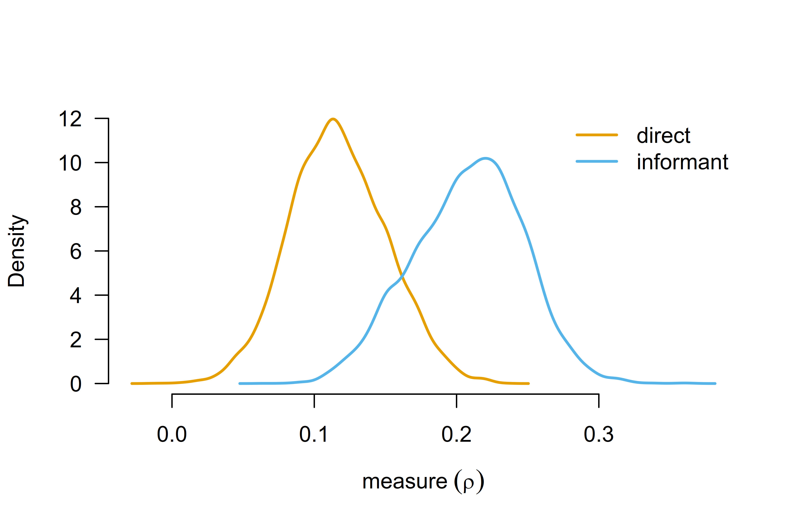
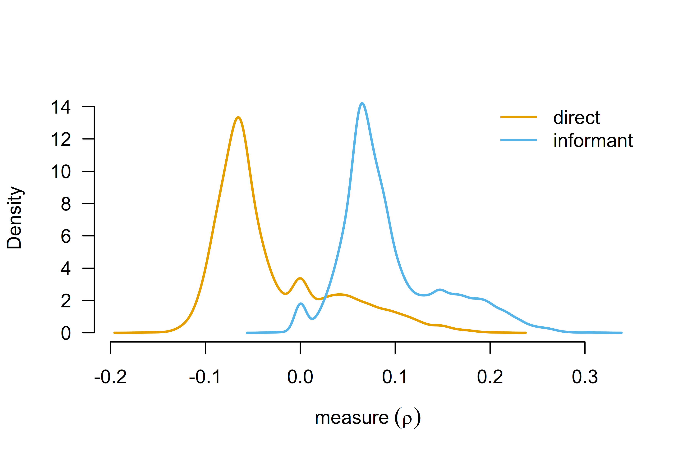

# Robust Bayesian Model-Averaged Meta-Regression

Robust Bayesian model-averaged meta-regression (RoBMA-reg) extends the
robust Bayesian model-averaged meta-analysis (RoBMA) by including
covariates in the meta-analytic model. RoBMA-reg allows for estimating
and testing the moderating effects of study-level covariates on the
meta-analytic effect in a unified framework (e.g., accounting for
uncertainty in the presence vs. absence of the effect, heterogeneity,
and publication bias). This vignette illustrates how to fit a robust
Bayesian model-averaged meta-regression using the `RoBMA` R package. We
reproduce the example from Bartoš et al. (2025), who re-analyzed a
meta-analysis of the effect of household chaos on child executive
functions with the mean age and assessment type covariates based on
Andrews et al. (2021)’s meta-analysis.

First, we fit a frequentist meta-regression using the `metafor` R
package. Second, we explain the Bayesian meta-regression model
specification, the default prior distributions for continuous and
categorical moderators, and standardized effect sizes input
specification. Third, we estimate Bayesian model-averaged
meta-regression (without publication bias adjustment). Finally, we
estimate the complete robust Bayesian model-averaged meta-regression.

### Data

We start by loading the `Andrews2021` dataset included in the `RoBMA` R
package, which contains 36 estimates of the effect of household chaos on
child executive functions with the mean age and assessment type
covariates. The dataset includes correlation coefficients (`r`),
standard errors of the correlation coefficients (`se`), the type of
executive function assessment (`measure`), and the mean age of the
children (`age`) in each study.

``` r
library(RoBMA)
data("Andrews2021", package = "RoBMA")
head(Andrews2021)
#>       r         se measure      age
#> 1 0.070 0.04743416  direct 4.606660
#> 2 0.033 0.04371499  direct 2.480833
#> 3 0.170 0.10583005  direct 7.750000
#> 4 0.208 0.08661986  direct 4.000000
#> 5 0.270 0.02641969  direct 4.000000
#> 6 0.170 0.05147815  direct 4.487500
```

### Frequentist Meta-Regression

We start by fitting a frequentist meta-regression using the `metafor` R
package (Wolfgang, 2010). While Andrews et al. (2021) estimated
univariate meta-regressions for each moderator, we directly proceed by
analyzing both moderators simultaneously. For consistency with original
reporting, we estimate the meta-regression using the correlation
coefficients and the standard errors provided by (Andrews et al., 2021);
however, note that Fisher’s z transformation is recommended for
estimating meta-analytic models (e.g., Stanley et al. (2024)).

``` r
fit_rma <- metafor::rma(yi = r, sei = se, mods = ~ measure + age, data = Andrews2021)
fit_rma
#> 
#> Mixed-Effects Model (k = 36; tau^2 estimator: REML)
#> 
#> tau^2 (estimated amount of residual heterogeneity):     0.0150 (SE = 0.0045)
#> tau (square root of estimated tau^2 value):             0.1226
#> I^2 (residual heterogeneity / unaccounted variability): 91.28%
#> H^2 (unaccounted variability / sampling variability):   11.47
#> R^2 (amount of heterogeneity accounted for):            15.24%
#> 
#> Test for Residual Heterogeneity:
#> QE(df = 33) = 340.7613, p-val < .0001
#> 
#> Test of Moderators (coefficients 2:3):
#> QM(df = 2) = 7.5445, p-val = 0.0230
#> 
#> Model Results:
#> 
#>                   estimate      se    zval    pval    ci.lb   ci.ub     
#> intrcpt             0.0898  0.0467  1.9232  0.0545  -0.0017  0.1813   . 
#> measureinformant    0.1202  0.0466  2.5806  0.0099   0.0289  0.2115  ** 
#> age                 0.0030  0.0062  0.4867  0.6265  -0.0091  0.0151     
#> 
#> ---
#> Signif. codes:  0 '***' 0.001 '**' 0.01 '*' 0.05 '.' 0.1 ' ' 1
```

The results reveal a statistically significant moderation effect of the
executive function assessment type on the effect of household chaos on
child executive functions ($p = 0.0099$). To explore the moderation
effect further, we estimate the estimated marginal means for the
executive function assessment type using the `emmeans` R package (Lenth
et al., 2017).

``` r
emmeans::emmeans(metafor::emmprep(fit_rma), specs = "measure")
#>  measure   emmean     SE  df asymp.LCL asymp.UCL
#>  direct     0.109 0.0305 Inf    0.0492     0.169
#>  informant  0.229 0.0347 Inf    0.1612     0.297
#> 
#> Confidence level used: 0.95
```

Studies using the informant-completed questionnaires show a stronger
effect of household chaos on child executive functions, r = 0.229, 95%
CI \[0.161, 0.297\], than the direct assessment, r = 0.109, 95% CI
\[0.049, 0.169\]; both types of studies show statistically significant
effects.

The mean age of the children does not significantly moderate the effect
($p = 0.627$) with the estimated regression coefficient of b = 0.003,
95% CI \[-0.009, 0.015\]. As usual, frequentist inference limits us to
failing to reject the null hypothesis. Here, we try to overcome this
limitation with Bayesian model-averaged meta-regression.

### Bayesian Meta-Regression Specification

Before we proceed with the Bayesian model-averaged meta-regression, we
provide a quick overview of the regression model specification. In
contrast to frequentist meta-regression, we need to specify prior
distributions on the regression coefficients, which encode the tested
hypotheses about the presence vs. absence of the moderation (specifying
different prior distributions corresponds to different hypotheses and
results in different conclusions). Importantly, the treatment of
continuous and categorical covariates differs in the Bayesian
model-averaged meta-regression.

#### Continuous vs. Categorical Moderators and Default Prior Distributions

The default prior distribution for continuous moderators is a normal
prior distribution with mean of 0 and a standard deviation of 1/4. In
other words, the default prior distribution assumes that the effect of
the moderator is small and smaller moderation effects are more likely
than larger effects. The default choice for continuous moderators can be
overridden by the `prior_covariates` argument (for all continuous
covariates) or by the `priors` argument (for specific covariates, see
[`?RoBMA.reg`](reference/RoBMA.reg.md) for more information). The
package automatically standardizes the continuous moderators. This
achieves scale-invariance of the specified prior distributions and
ensures that the prior distribution for the intercept correspond to the
grand mean effect. This setting can be overridden by specifying the
`standardize_predictors = FALSE` argument.

The default prior distribution for the categorical moderators is a
normal distribution with a mean of 0 and a standard deviation of 1/4,
representing the deviation of each level from the grand mean effect. The
package uses standardized orthonormal contrasts (`contrast = "meandif"`)
to model deviations of each category from the grand mean effect. The
default choice for categorical moderators can be overridden by the
`prior_factors` argument (for all categorical covariates) or by the
`priors` argument (for specific covariates, see
[`?RoBMA.reg`](reference/RoBMA.reg.md) for more information). The
`"meandif"` contrasts achieve label invariance (i.e., the coding of the
categorical covariates does not affect the results) and the prior
distribution for the intercept corresponds to the grand mean effect.
Alternatively, the package also allows specifying `"treatment"`
contrasts, which result in a prior distribution on the difference
between the default level and the remaining levels of the categorical
covariate (with the intercept corresponding to the effect in the default
factor level).

#### Effect Size Input Specification

Prior distributions for Bayesian meta-analyses are calibrated for the
standardized effect size measures. As such, the fitting function needs
to know what kind of effect size was supplied as the input. In
[`RoBMA()`](reference/RoBMA.md) function, this is achieved by the `d`,
`r`, `logOR`, `OR`, `z`, `se`, `v`, `n`, `lCI`, and `uCI` arguments. The
input is passed to the [`combine_data()`](reference/combine_data.md)
function in the background that combines the effect sizes and merges
them into a single data.frame. The
[`RoBMA.reg()`](reference/RoBMA.reg.md) (and
[`NoBMA.reg()`](reference/NoBMA.reg.md)) function requires the dataset
to be passed as a data.frame (without missing values) with column names
identifying the - moderators passed using the formula interface (i.e.,
`~ measure + age` in our example) - and the effect sizes and standard
errors (i.e., `r` and `se` in our example).

As such, it is crucial for the column names to correctly identify the
standardized effect sizes, standard errors, sample sizes, and
moderators.

### Bayesian Model-Averaged Meta-Regression

We fit the Bayesian model-averaged meta-regression using the
[`NoBMA.reg()`](reference/NoBMA.reg.md) function (the
[`NoBMA.reg()`](reference/NoBMA.reg.md) function is a wrapper around the
[`RoBMA.reg()`](reference/RoBMA.reg.md) function that automatically
removes models adjusting for publication bias). We specify the model
formula with the `~` operator similarly to the
[`rma()`](https://wviechtb.github.io/metafor/reference/rma.uni.html)
function and pass the dataset as a data.frame with named columns as
outlined in the section above (the names need to identify the moderators
and effect size measures). We also set the `parallel = TRUE` argument to
speed up the computation by running the chains in parallel and
`seed = 1` argument to ensure reproducibility.

``` r
fit_BMA <- NoBMA.reg(~ measure + age, data = Andrews2021, parallel = TRUE, seed = 1)
```

Note that the [`NoBMA.reg()`](reference/NoBMA.reg.md) function specifies
the combination of all models assuming presence vs. absence of the
effect, heterogeneity, moderation by `measure`, and moderation by `age`,
which corresponds to $2*2*2*2 = 16$ models. Including each additional
moderator doubles the number of models, leading to an exponential
increase in model count and significantly longer fitting times.

Once the ensemble is estimated, we can use the
[`summary()`](https://rdrr.io/r/base/summary.html) functions with the
`output_scale = "r"` argument, which produces meta-analytic estimates
that are transformed to the correlation scale.

``` r
summary(fit_BMA, output_scale = "r")
#> Call:
#> RoBMA.reg(formula = formula, data = data, test_predictors = test_predictors, 
#>     study_names = study_names, study_ids = study_ids, transformation = transformation, 
#>     prior_scale = prior_scale, standardize_predictors = standardize_predictors, 
#>     effect_direction = "positive", priors = priors, model_type = model_type, 
#>     priors_effect = priors_effect, priors_heterogeneity = priors_heterogeneity, 
#>     priors_bias = NULL, priors_effect_null = priors_effect_null, 
#>     priors_heterogeneity_null = priors_heterogeneity_null, priors_bias_null = prior_none(), 
#>     priors_hierarchical = priors_hierarchical, priors_hierarchical_null = priors_hierarchical_null, 
#>     prior_covariates = prior_covariates, prior_covariates_null = prior_covariates_null, 
#>     prior_factors = prior_factors, prior_factors_null = prior_factors_null, 
#>     algorithm = algorithm, chains = chains, sample = sample, 
#>     burnin = burnin, adapt = adapt, thin = thin, parallel = parallel, 
#>     autofit = autofit, autofit_control = autofit_control, convergence_checks = convergence_checks, 
#>     save = save, seed = seed, silent = silent)
#> 
#> Bayesian model-averaged meta-regression (normal-normal model)
#> Components summary:
#>               Models Prior prob. Post. prob. Inclusion BF
#> Effect          8/16       0.500       1.000 6.643142e+05
#> Heterogeneity   8/16       0.500       1.000 3.438539e+40
#> 
#> Meta-regression components summary:
#>         Models Prior prob. Post. prob. Inclusion BF
#> measure   8/16       0.500       0.826        4.748
#> age       8/16       0.500       0.197        0.245
#> 
#> Model-averaged estimates:
#>      Mean Median 0.025 0.975
#> mu  0.163  0.163 0.118 0.208
#> tau 0.121  0.120 0.086 0.167
#> The effect size estimates are summarized on the correlation scale and heterogeneity is summarized on the Fisher's z scale (priors were specified on the Cohen's d scale).
#> 
#> Model-averaged meta-regression estimates:
#>                            Mean Median  0.025 0.975
#> intercept                 0.163  0.163  0.118 0.208
#> measure [dif: direct]    -0.047 -0.051 -0.099 0.000
#> measure [dif: informant]  0.047  0.051  0.000 0.099
#> age                       0.003  0.000 -0.011 0.043
#> The effect size estimates are summarized on the correlation scale and heterogeneity is summarized on the Fisher's z scale (priors were specified on the Cohen's d scale).
```

The summary function produces output with multiple sections The first
section contains the `Components summary` with the hypothesis test
results for the overall effect size and heterogeneity. We find
overwhelming evidence for both with inclusion Bayes factors
(`Inclusion BF`) above 10,000.

The second section contains the `Meta-regression components summary`
with the hypothesis test results for the moderators. We find moderate
evidence for the moderation by the executive function assessment type,
$\text{BF}_{\text{measure}} = 4.75$. Furthermore, we find moderate
evidence for the null hypothesis of no moderation by mean age of the
children, $\text{BF}_{\text{age}} = 0.245$ (i.e., BF for the null is
$1/0.245 = 4.08$). These findings extend the frequentist meta-regression
by disentangling the absence of evidence from the evidence of absence.

The third section contains the `Model-averaged estimates` with the
model-averaged estimates for mean effect $\rho = 0.16$, 95% CI \[0.12,
0.21\] and between-study heterogeneity
$\tau_{\text{Fisher’s z}} = 0.12$, 95% CI \[0.09, 0.17\].

The fourth section contains the
`Model-averaged meta-regression estimates` with the model-averaged
regression coefficient estimates. The main difference from the usual
frequentist meta-regression output is that the categorical predictors
are summarized as a difference from the grand mean for each factor
level. Here, the `intercept` regression coefficient estimate corresponds
to the grand mean effect and the `measure [dif: direct]` regression
coefficient estimate of -0.047, 95% CI \[-0.099, 0.000\] corresponds to
the difference between the direct assessment and the grand mean. As
such, the results suggest that the effect size in studies using direct
assessment is lower in comparison to the grand mean of the studies. The
`age` regression coefficient estimate is standardized, therefore, the
increase of 0.003, 95% CI \[-0.011, 0.043\] corresponds to the increase
in the mean effect when increasing mean age of children by one standard
deviation.

Similarly to the frequentist meta-regression, we can use the
[`marginal_summary()`](reference/marginal_summary.md) function to obtain
the marginal estimates for each of the factor levels.

``` r
marginal_summary(fit_BMA, output_scale = "r")
#> Call:
#> RoBMA.reg(formula = formula, data = data, test_predictors = test_predictors, 
#>     study_names = study_names, study_ids = study_ids, transformation = transformation, 
#>     prior_scale = prior_scale, standardize_predictors = standardize_predictors, 
#>     effect_direction = "positive", priors = priors, model_type = model_type, 
#>     priors_effect = priors_effect, priors_heterogeneity = priors_heterogeneity, 
#>     priors_bias = NULL, priors_effect_null = priors_effect_null, 
#>     priors_heterogeneity_null = priors_heterogeneity_null, priors_bias_null = prior_none(), 
#>     priors_hierarchical = priors_hierarchical, priors_hierarchical_null = priors_hierarchical_null, 
#>     prior_covariates = prior_covariates, prior_covariates_null = prior_covariates_null, 
#>     prior_factors = prior_factors, prior_factors_null = prior_factors_null, 
#>     algorithm = algorithm, chains = chains, sample = sample, 
#>     burnin = burnin, adapt = adapt, thin = thin, parallel = parallel, 
#>     autofit = autofit, autofit_control = autofit_control, convergence_checks = convergence_checks, 
#>     save = save, seed = seed, silent = silent)
#> 
#> Robust Bayesian meta-analysis
#> Model-averaged marginal estimates:
#>                     Mean Median 0.025 0.975 Inclusion BF
#> intercept          0.163  0.163 0.118 0.208          Inf
#> measure[direct]    0.117  0.116 0.052 0.185       62.803
#> measure[informant] 0.208  0.210 0.130 0.280          Inf
#> age[-1SD]          0.160  0.161 0.106 0.208          Inf
#> age[0SD]           0.163  0.163 0.118 0.208          Inf
#> age[1SD]           0.166  0.165 0.117 0.220          Inf
#> The estimates are summarized on the correlation scale (priors were specified on the Cohen's d scale).
#> mu_intercept: Posterior samples do not span both sides of the null hypothesis. The Savage-Dickey density ratio is likely to be overestimated.
#> mu_measure[informant]: Posterior samples do not span both sides of the null hypothesis. The Savage-Dickey density ratio is likely to be overestimated.
#> mu_age[-1SD]: Posterior samples do not span both sides of the null hypothesis. The Savage-Dickey density ratio is likely to be overestimated.
#> mu_age[0SD]: There is a considerable cluster of prior samples at the exact null hypothesis values. The Savage-Dickey density ratio is likely to be invalid.
#> mu_age[0SD]: Posterior samples do not span both sides of the null hypothesis. The Savage-Dickey density ratio is likely to be overestimated.
#> mu_age[1SD]: Posterior samples do not span both sides of the null hypothesis. The Savage-Dickey density ratio is likely to be overestimated.
```

The estimated marginal means are similar to the frequentist results.
Studies using the informant-completed questionnaires again show a
stronger effect of household chaos on child executive functions,
$\rho = 0.208$, 95% CI \[0.130, 0.280\], than the direct assessment,
$\rho = 0.117$, 95% CI \[0.052, 0.185\].

The last column summarizes results from a test against a null hypothesis
of marginal means equals 0. Here, we find very strong evidence for the
effect size of studies using the informant-completed questionnaires
differing from zero, $\text{BF}_{10} = 62.8$ and extreme evidence for
the effect size of studies using the direct assessment differing from
zero, $\text{BF}_{10} = \infty$. The test is performed using the change
from prior to posterior distribution at 0 (i.e., the Savage-Dickey
density ratio) assuming the presence of the overall effect or the
presence of difference according to the tested factor. Because the tests
use prior and posterior samples, calculating the Bayes factor can be
problematic when the posterior distribution is far from the tested
value. In such cases, warning messages are printed and
$\text{BF}_{10} = \infty$ returned (like here)—while the actual Bayes
factor is less than infinity, it is still too large to be computed
precisely given the posterior samples.

The full model-averaged posterior marginal means distribution can be
visualized by the [`marginal_plot()`](reference/marginal_plot.md)
function.

``` r
marginal_plot(fit_BMA, parameter = "measure", output_scale = "r", lwd = 2)
```



### Robust Bayesian Model-Averaged Meta-Regression

Finally, we adjust the Bayesian model-averaged meta-regression model by
fitting the robust Bayesian model-averaged meta-regression. In contrast
to the previous publication bias unadjusted model ensemble, RoBMA-reg
extends the model ensemble by the publication bias component specified
via 6 weight functions and PET-PEESE (Bartoš et al., 2023). We use the
[`RoBMA.reg()`](reference/RoBMA.reg.md) function with the same arguments
as in the previous section. The estimation time further increases as the
ensemble now contains 144 models.

``` r
fit_RoBMA <- RoBMA.reg(~ measure + age, data = Andrews2021, parallel = TRUE, seed = 1)
```

``` r
summary(fit_RoBMA, output_scale = "r")
#> Call:
#> RoBMA.reg(formula = ~measure + age, data = Andrews2021, chains = 1, 
#>     parallel = TRUE, save = "min", seed = 1)
#> 
#> Robust Bayesian meta-regression
#> Components summary:
#>                Models Prior prob. Post. prob. Inclusion BF
#> Effect         72/144       0.500       0.339 5.130000e-01
#> Heterogeneity  72/144       0.500       1.000 1.051976e+23
#> Bias          128/144       0.500       0.966 2.825100e+01
#> 
#> Meta-regression components summary:
#>         Models Prior prob. Post. prob. Inclusion BF
#> measure 72/144       0.500       0.951       19.213
#> age     72/144       0.500       0.154        0.181
#> 
#> Model-averaged estimates:
#>                    Mean Median 0.025  0.975
#> mu                0.032  0.000 0.000  0.164
#> tau               0.106  0.104 0.074  0.146
#> omega[0,0.025]    1.000  1.000 1.000  1.000
#> omega[0.025,0.05] 0.999  1.000 1.000  1.000
#> omega[0.05,0.5]   0.998  1.000 1.000  1.000
#> omega[0.5,0.95]   0.997  1.000 1.000  1.000
#> omega[0.95,0.975] 0.997  1.000 1.000  1.000
#> omega[0.975,1]    0.997  1.000 1.000  1.000
#> PET               2.046  2.489 0.000  3.292
#> PEESE             1.955  0.000 0.000 19.101
#> The effect size estimates are summarized on the correlation scale and heterogeneity is summarized on the Fisher's z scale (priors were specified on the Cohen's d scale).
#> (Estimated publication weights omega correspond to one-sided p-values.)
#> 
#> Model-averaged meta-regression estimates:
#>                            Mean Median  0.025 0.975
#> intercept                 0.032  0.000  0.000 0.164
#> measure [dif: direct]    -0.063 -0.064 -0.106 0.000
#> measure [dif: informant]  0.063  0.064  0.000 0.106
#> age                       0.000  0.000 -0.024 0.022
#> The effect size estimates are summarized on the correlation scale and heterogeneity is summarized on the Fisher's z scale (priors were specified on the Cohen's d scale).
```

All previously described functions for manipulating the fitted model
work identically with the publication bias adjusted model. As such, we
just briefly mention the main differences found after adjusting for
publication bias.

RoBMA-reg reveals strong evidence of publication bias
$\text{BF}_{\text{pb}} = 28.0$. Furthermore, accounting for publication
bias turns the previously found evidence for the overall effect into a
weak evidence against the effect $\text{BF}_{10} = 0.51$ and notably
reduces the mean effect estimate $\rho = 0.032$, 95% CI \[0.000,
0.164\].

``` r
marginal_summary(fit_RoBMA, output_scale = "r")
#> Call:
#> RoBMA.reg(formula = ~measure + age, data = Andrews2021, chains = 1, 
#>     parallel = TRUE, save = "min", seed = 1)
#> 
#> Robust Bayesian meta-analysis
#> Model-averaged marginal estimates:
#>                      Mean Median  0.025 0.975 Inclusion BF
#> intercept           0.032  0.000  0.000 0.164        0.526
#> measure[direct]    -0.031 -0.056 -0.105 0.120        0.709
#> measure[informant]  0.094  0.077  0.000 0.222        8.230
#> age[-1SD]           0.032  0.000 -0.015 0.164        0.307
#> age[0SD]            0.032  0.000  0.000 0.164        0.381
#> age[1SD]            0.031  0.000 -0.024 0.168        0.311
#> The estimates are summarized on the correlation scale (priors were specified on the Cohen's d scale).
#> mu_age[0SD]: There is a considerable cluster of posterior samples at the exact null hypothesis values. The Savage-Dickey density ratio is likely to be invalid.
#> mu_age[0SD]: There is a considerable cluster of prior samples at the exact null hypothesis values. The Savage-Dickey density ratio is likely to be invalid.
```

The estimated marginal means now suggest that studies using the
informant-completed questionnaires show a much smaller effect of
household chaos on child executive functions, $\rho = 0.094$, 95% CI
\[0.000, 0.222\] with only moderate evidence against no effect,
$\text{BF}_{10} = 8.23$, while studies using direct assessment even
provide weak evidence against the effect of household chaos on child
executive functions, $\text{BF}_{10} = 0.71$, with most likely effect
sizes around zero, $\rho = - 0.031$, 95% CI \[-0.105, 0.120\].

A visual summary of the estimated marginal means highlights the
considerably wider model-averaged posterior distributions of the
marginal means—a consequence of accounting and adjusting for publication
bias.

``` r
marginal_plot(fit_RoBMA, parameter = "measure", output_scale = "r", lwd = 2)
```



The Bayesian model-averaged meta-regression models are compatible with
the remaining custom specification, visualization, and summary functions
included in the `RoBMA` R package, highlighted in other vignettes. E.g.,
custom model specification is demonstrated in the vignette [Fitting
Custom Meta-Analytic Ensembles](articles/CustomEnsembles.md) and
visualizations and summaries are demonstrated in the [Reproducing
BMA](articles/ReproducingBMA.md) and [Informed Bayesian Model-Averaged
Meta-Analysis in Medicine](articles/MedicineBMA.md) vignettes.

### References

Andrews, K., Atkinson, L., Harris, M., & Gonzalez, A. (2021). Examining
the effects of household chaos on child executive functions: A
meta-analysis. *Psychological Bulletin*, *147*(1), 16–32.
<https://doi.org/10.1037/bul0000311>

Bartoš, F., Maier, M., Stanley, T., & Wagenmakers, E.-J. (2025). Robust
Bayesian meta-regression: Model-averaged moderation analysis in the
presence of publication bias. *Psychological Methods*.
<https://doi.org/10.1037/met0000737>

Bartoš, F., Maier, M., Wagenmakers, E.-J., Doucouliagos, H., & Stanley,
T. D. (2023). Robust Bayesian meta-analysis: Model-averaging across
complementary publication bias adjustment methods. *Research Synthesis
Methods*, *14*(1), 99–116. <https://doi.org/10.1002/jrsm.1594>

Lenth, R. V., Bolker, B., Buerkner, P., Giné-Vázquez, I., Herve, M.,
Jung, M., Love, J., Miguez, F., Riebl, H., & Singmann, H. (2017).
*emmeans: Estimated marginal means, aka least-squares means*.
<https://cran.r-project.org/package=emmeans>

Stanley, T., Doucouliagos, H., Maier, M., & Bartoš, F. (2024).
Correcting bias in the meta-analysis of correlations. *Psychological
Methods*. <https://doi.org/10.1037/met0000662>

Wolfgang, V. (2010). Conducting meta-analyses in R with the metafor
package. *Journal of Statistical Software*, *36*(3), 1–48.
<https://www.jstatsoft.org/v36/i03/>
