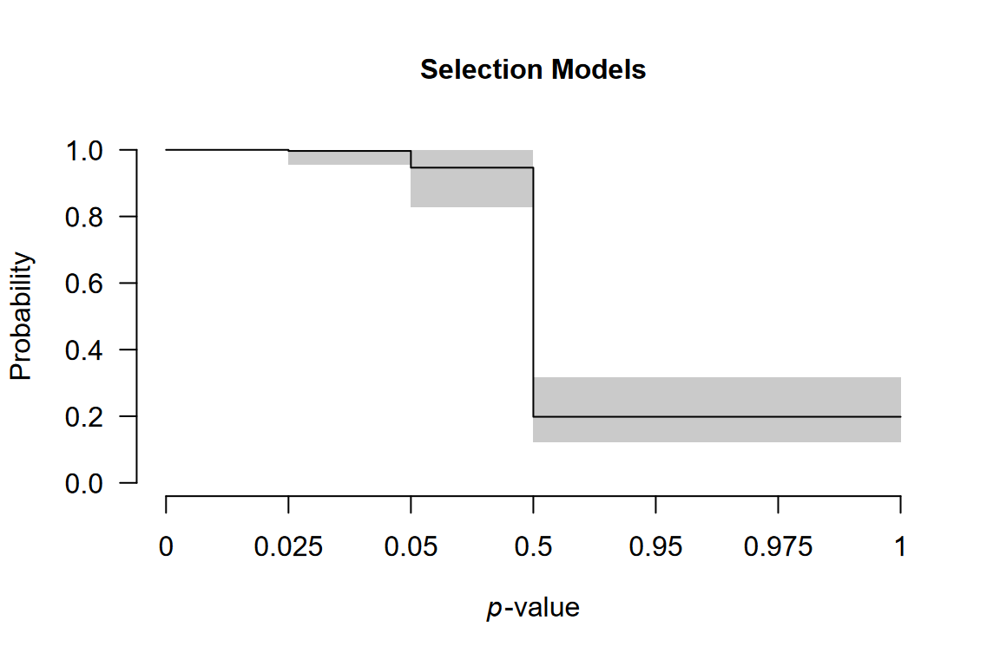

# Multilevel Robust Bayesian Meta-Analysis

**This vignette accompanies the manuscript [Robust Bayesian Multilevel
Meta-Analysis: Adjusting for Publication Bias in the Presence of
Dependent Effect Sizes](https://doi.org/10.31234/osf.io/9tgp2_v1)
preprinted at *PsyArXiv* (Bartoš et al., 2025).**

This vignette reproduces the first example from the manuscript. For
multilevel meta-regression with moderators see [Multilevel Robust
Bayesian Model-Averaged
Meta-Regression](articles/MultilevelRoBMARegression.md).

Multilevel Robust Bayesian Meta-Analysis (RoBMA) extends the standard
RoBMA framework to datasets containing multiple effect sizes from the
same studies. We demonstrate the method using data from Johnides et al.
(2025), who meta-analyzed 412 effect sizes from 128 studies
investigating secondary benefits of family-based treatments for
childhood disorders.

### When to Use Multilevel RoBMA

Multilevel RoBMA is appropriate for dataset that contain multiple effect
sizes from the same studies. The multilevel approach explicitly models
the clustering structure through the `study_ids` argument, which:

- accounts for dependencies among effect sizes from the same study,
- partitions heterogeneity into within-study and between-study
  components,
- while simultaneously adjusting for publication bias at the study level
  (corresponding to selective reporting).

### Loading the Data

We load the package and examine the dataset structure.

``` r
library(RoBMA)
data("Johnides2025", package = "RoBMA")
```

The dataset contains effect sizes (`d`), standard errors (`se`), and
study identifiers (`study`).

``` r
head(Johnides2025)
#>                 study       d        se
#> 1 Price et al. (2012)  0.0000 0.1337909
#> 2 Price et al. (2012) -0.1250 0.1337909
#> 3 Price et al. (2012)  0.0000 0.1337909
#> 4 Price et al. (2012)  0.2112 0.1337909
#> 5 Price et al. (2012)  0.0140 0.1337909
#> 6 Price et al. (2012) -0.0186 0.1337909
```

Multiple rows share the same study name, indicating that these effect
sizes come from the same study. For example, the first five effect sizes
are from “Price et al. (2012)” and might be more similar to each other
than to effect sizes from other studies.

### Fitting the Multilevel Model

The `study_ids` argument specifies which effect sizes belong together.
We use `algorithm = "ss"` (spike-and-slab), which is faster for complex
models and neccessary for estimating multilevel selection models. The
`"ss"` algorithm estimates the models and parameters simultaneously,
therefore we increase MCMC adaptation, iteration, and sampling to obtain
more reliable estimates (we disable automatic convergence checking with
`autofit = FALSE` to speed up the fitting process here).

``` r
fit <- RoBMA(
  d         = Johnides2025$d, 
  se        = Johnides2025$se, 
  study_ids = Johnides2025$study, 
  algorithm = "ss",
  adapt     = 5000, 
  burnin    = 5000, 
  sample    = 10000, 
  parallel  = TRUE, 
  seed      = 1, 
  autofit   = FALSE
)
```

*Note: This model takes 10-15 minutes with parallel processing enabled.
Without parallel processing, expect over an hour.*

### Interpreting the Results

The [`summary()`](https://rdrr.io/r/base/summary.html) output contains
two main sections.

``` r
summary(fit)
#> Call:
#> RoBMA(d = Johnides2025$d, se = Johnides2025$se, study_ids = Johnides2025$study, 
#>     algorithm = "ss", sample = 10000, burnin = 5000, adapt = 5000, 
#>     parallel = TRUE, autofit = FALSE, seed = 1)
#> 
#> Robust Bayesian meta-analysis
#> Components summary:
#>               Prior prob. Post. prob. Inclusion BF
#> Effect              0.500       0.481        0.927
#> Heterogeneity       0.500       1.000          Inf
#> Bias                0.500       1.000          Inf
#> Hierarchical        1.000       1.000          Inf
#> 
#> Model-averaged estimates:
#>                    Mean Median 0.025 0.975
#> mu                0.050  0.000 0.000 0.173
#> tau               0.400  0.400 0.348 0.458
#> rho               0.461  0.464 0.306 0.603
#> omega[0,0.025]    1.000  1.000 1.000 1.000
#> omega[0.025,0.05] 0.997  1.000 0.955 1.000
#> omega[0.05,0.5]   0.946  0.959 0.827 0.998
#> omega[0.5,0.95]   0.198  0.190 0.122 0.317
#> omega[0.95,0.975] 0.198  0.190 0.122 0.317
#> omega[0.975,1]    0.198  0.190 0.122 0.317
#> PET               0.000  0.000 0.000 0.000
#> PEESE             0.000  0.000 0.000 0.000
#> The estimates are summarized on the Cohen's d scale (priors were specified on the Cohen's d scale).
#> (Estimated publication weights omega correspond to one-sided p-values.)
#> ESS 453 is lower than the set target (500).
```

#### Components Summary

This table shows Bayes factors testing the presence of effect,
heterogeneity, and publication bias. Each row displays the prior
probability, posterior probability after observing the data, and the
inclusion Bayes factor comparing models with versus without that
component.

In our example, the inclusion BF for the effect is 0.927, indicating
weak evidence against an effect. The inclusion BF for heterogeneity and
publication bias are reported as `Inf`, i.e., beyond the numerical
precision of the `ss` algorithm (\> 10⁶), indicating extreme evidence
for both components.

We also notice warning about effective sample size (ESS) below the set
target. The difference is however not substantial and we can safely
ignore it.

#### Model-Averaged Estimates

This section provides meta-analytic estimates averaged across all
models, weighted by their posterior probabilities. The average effect
size is `mu`, overall heterogeneity is `tau`, and the heterogeneity
allocation parameter `rho`. The heterogeneity allocation parameter `rho`
indicates the proportion of heterogeneity within versus between studies:
`rho = 0` means all heterogeneity is between studies, `rho = 1` means
all is within studies, and `rho = 0.5` means equal split. The remaining
parameters summarize the weight function and PET/PEESE regression for
publication bias.

In our example, we find small effect size (*d* = 0.050, 95% CI \[0.000,
0.173\]), substantial heterogeneity (τ = 0.40, 95% CI \[0.348, 0.458\]),
and nearly balanced heterogeneity allocation (ρ = 0.461, 95% CI \[0.306,
0.603\]). The large heterogeneity combined with the small pooled effect
suggests substantial variation in true effects. This distribution of
true effect sizes can be obtain by the
[`summary_heterogeneity()`](reference/summary_heterogeneity.md)
function:

``` r
summary_heterogeneity(fit)
#> Call:
#> RoBMA(d = Johnides2025$d, se = Johnides2025$se, study_ids = Johnides2025$study, 
#>     algorithm = "ss", sample = 10000, burnin = 5000, adapt = 5000, 
#>     parallel = TRUE, autofit = FALSE, seed = 1)
#> 
#> Robust Bayesian meta-analysis
#> Model-averaged heterogeneity estimates:
#>        Mean Median  0.025  0.975
#> PI    0.050  0.053 -0.752  0.845
#> tau   0.400  0.400  0.348  0.458
#> tau2  0.080  0.080  0.060  0.105
#> I2   85.609 85.720 81.979 88.735
#> H2    7.051  7.003  5.549  8.877
#> The prediction interval (PI) is summarized on the Cohen's d scale.
#> The absolute heterogeneity (tau, tau^2) is summarized on the Cohen's d scale.
#> The relative heterogeneity indicies (I^2 and H^2) were computed on the Fisher's z scale.
#> ESS 453 is lower than the set target (500).
```

The wide prediction interval (*d* = -0.752 to 0.845) quantifies the
degree of this heterogeneity: some studies may show benefits while
others show harm.

### Model Types Summary

To understand which publication bias mechanisms the data support, we
examine the posterior distribution across model types:

``` r
summary(fit, type = "models")
#> Call:
#> RoBMA(d = Johnides2025$d, se = Johnides2025$se, study_ids = Johnides2025$study, 
#>     algorithm = "ss", sample = 10000, burnin = 5000, adapt = 5000, 
#>     parallel = TRUE, autofit = FALSE, seed = 1)
#> 
#> Robust Bayesian meta-analysis
#> Publication bias adjustment summary:
#>                  Prior prob. Post. prob. Inclusion BF
#> None                   0.500       0.000        0.000
#> Weight functions       0.250       1.000          Inf
#> PET-PEESE              0.250       0.000        0.000
#> 
#> Publication bias adjustment models summary:
#>                                           Prior prob. Post. prob. Inclusion BF
#> None                                            0.500       0.000        0.000
#> Weight function[two-sided: .05]                 0.042       0.000        0.000
#> Weight function[two-sided: .1, .05]             0.042       0.000        0.000
#> Weight function[one-sided: .05]                 0.042       0.000        0.000
#> Weight function[one-sided: .05, .025]           0.042       0.000        0.000
#> Weight function[one-sided: .5, .05]             0.042       0.903      214.358
#> Weight function[one-sided: .5, .05, .025]       0.042       0.097        2.468
#> PET                                             0.125       0.000        0.000
#> PEESE                                           0.125       0.000        0.000
```

Most (all) posterior probability is allocated to selection models
(weight functions). The publication bias adjustment therefore reflects
selective reporting rather than small study effects (PET/PEESE
regression), specifically, one-sided selection operating on marginally
significant $p$-values and direction of the effect.

### Visualizing the Weight Function

The weight function shows how publication probability varies across
*p*-value ranges:

``` r
plot(fit, parameter = "weightfunction", rescale_x = TRUE)
```



The plot displays one-sided *p*-value cutoffs (x-axis) against relative
publication probability (y-axis), averaged across weight function
specifications. A flat line at 1.0 indicates no publication bias; values
below 1.0 indicate suppression.

In our example, we notice a small drop in the relative publication
probability at cutoff corresponding to p = 0.05 (one-sided, i.e., 0.10
two-sided: selection on marginally significant $p$-values) and a much
sharper drop corresponding to the direction of the effect (p = 0.50).

### Comparison with Single-Level RoBMA

To understand the importance of accounting for nested structure, we
compare our results with a standard single-level RoBMA that ignores
dependencies among effect sizes from the same study.

``` r
fit_simple <- RoBMA(
  d         = Johnides2025$d, 
  se        = Johnides2025$se, 
  algorithm = "ss",
  adapt     = 5000, 
  burnin    = 5000, 
  sample    = 10000, 
  parallel  = TRUE, 
  seed      = 1, 
  autofit   = FALSE
)
```

``` r
summary(fit_simple)
#> Call:
#> RoBMA(d = Johnides2025$d, se = Johnides2025$se, algorithm = "ss", 
#>     sample = 10000, burnin = 5000, adapt = 5000, parallel = TRUE, 
#>     autofit = FALSE, seed = 1)
#> 
#> Robust Bayesian meta-analysis
#> Components summary:
#>               Prior prob. Post. prob. Inclusion BF
#> Effect              0.500       0.042        0.044
#> Heterogeneity       0.500       1.000          Inf
#> Bias                0.500       1.000          Inf
#> 
#> Model-averaged estimates:
#>                    Mean Median 0.025 0.975
#> mu                0.001  0.000 0.000 0.005
#> tau               0.374  0.373 0.339 0.411
#> omega[0,0.025]    1.000  1.000 1.000 1.000
#> omega[0.025,0.05] 0.997  1.000 0.963 1.000
#> omega[0.05,0.5]   0.955  0.965 0.853 0.999
#> omega[0.5,0.95]   0.222  0.220 0.168 0.286
#> omega[0.95,0.975] 0.222  0.220 0.168 0.286
#> omega[0.975,1]    0.222  0.220 0.168 0.286
#> PET               0.000  0.000 0.000 0.000
#> PEESE             0.000  0.000 0.000 0.000
#> The estimates are summarized on the Cohen's d scale (priors were specified on the Cohen's d scale).
#> (Estimated publication weights omega correspond to one-sided p-values.)
```

The single-level model differs by:

- omitting `study_ids`: it treats all effect sizes as independent,
- estimating only one heterogeneity parameter: it cannot distinguish
  within-study from between-study variation,
- potentially biased inference: ignoring dependencies can lead to
  overconfident conclusions.

For the Johnides et al. data, the single-level RoBMA finds strong
evidence for the absence of an effect, while the multilevel model
provides only weak evidence against it. Properly accounting for data
structure leads to more conservative and appropriate inferences.

### References

Bartoš, F., Maier, M., & Wagenmakers, E.-J. (2025). *Robust Bayesian
multilevel meta-analysis: Adjusting for publication bias in the presence
of dependent effect sizes*. <https://doi.org/10.31234/osf.io/9tgp2_v1>

Johnides, B. D., Borduin, C. M., Sheerin, K. M., & Kuppens, S. (2025).
Secondary benefits of family member participation in treatments for
childhood disorders: A multilevel meta-analytic review. *Psychological
Bulletin*, *151*(1), 1–32. <https://doi.org/10.1037/bul0000462>
