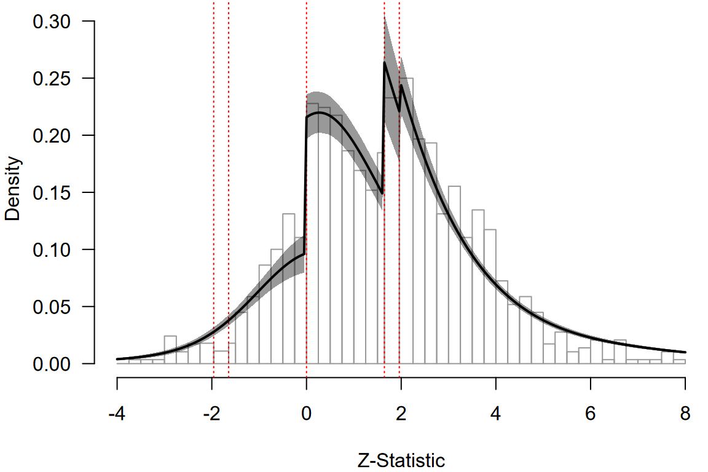

# Multilevel Robust Bayesian Model-Averaged Meta-Regression

**This vignette accompanies the manuscript [Robust Bayesian Multilevel
Meta-Analysis: Adjusting for Publication Bias in the Presence of
Dependent Effect Sizes](https://doi.org/10.31234/osf.io/9tgp2_v1)
preprinted at *PsyArXiv* (Bartoš et al., 2025).**

This vignette reproduces the second example from the manuscript,
re-analyzing data from Havránková et al. (2025) on the relationship
between beauty and professional success (1,159 effect sizes from 67
studies). We investigate whether the effect depends on the type of
customer contact (“no”, “some”, or “direct”). For the first example
describing a publication bias-adjusted multilevel meta-analysis see
[Multilevel Robust Bayesian Meta-Analysis](articles/MultilevelRoBMA.md).

### Rescaling Priors for Non-Standardized Effect Sizes

The effect sizes in this dataset are not standardized (percent increase
in earnings with one-standard deviation increase in beauty). Therefore,
we must rescale the default prior distributions to avoid specifying
overly narrow or wide priors. Overly narrow priors would make it
difficult to find evidence for the effect (as both models would predict
effects very close to zero–their predictions would overlap
substantially), while overly wide priors would bias the results towards
the null hypothesis (as alternative models would predict unrealistically
large effects–their predictions would never be supported by the data).

We rescale the priors by matching the default prior scale to the unit
information scale of the data (Mulder & Aert, 2025; Röver et al., 2021).
The unit information scale can be approximated by the standard error of
a fixed-effect model multiplied by the square root of the total sample
size. Since the default prior for standardized mean differences has a
standard deviation of one (corresponding to half the unit information),
we multiply the unit information scale by 0.5.

``` r
library(RoBMA)
data("Havrankova2025", package = "RoBMA")

fit_fe        <- metafor::rma(yi = y, sei = se, data = Havrankova2025, method = "FE")
unti_scale    <- fit_fe$se * sqrt(sum(Havrankova2025$N))
prior_scale   <- unti_scale * 0.5
```

The resulting `prior_scale`, in our example approximately 26, can be
used in the `rescale_priors` argument in the fitting functions of the
`RoBMA` package,

``` r
df_reg  <- data.frame(
  y               = Havrankova2025$y,
  se              = Havrankova2025$se, 
  facing_customer = Havrankova2025$facing_customer, 
  study_id        = Havrankova2025$study_id
)

fit_reg <- RoBMA.reg(
  ~ facing_customer, 
  study_ids      = df_reg$study_id,
  data           = df_reg, 
  rescale_priors = prior_scale,
  prior_scale    = "none", transformation = "none",
  algorithm = "ss", sample = 20000, burnin = 10000, adapt = 10000, 
  thin = 5, parallel = TRUE, autofit = FALSE, seed = 1)
)
```

where we first specify the input `data.frame` (with `y` and `se`
denoting the effect size and standard error inputs) and
`prior_scale = "none"` and `transformation = "none"` arguments disable
prior distributions for standardized effect sizes. We also notably
increase the number of adaptation, burn-in, and sampling iterations to
ensure convergence of the more complex model (and use the
`algorithm = "ss"` options since the bridge-sampling algorithm is
unfeasible for multilevel models).

*Note that the meta-regression model can take more than an hour to run
with parallel processing enabled.*

### Interpreting the Results

The `summary` and `marginal_summary` functions provide the overall model
estimates and the estimated marginal means.

``` r
summary(fit_reg)
#> Call:
#> RoBMA.reg(formula = ~facing_customer, data = df_reg, study_ids = df_reg$study_id, 
#>     transformation = "none", prior_scale = "none", rescale_priors = prior_scale, 
#>     algorithm = "ss", sample = 20000, burnin = 10000, adapt = 10000, 
#>     thin = 5, parallel = TRUE, autofit = FALSE, seed = 1)
#> 
#> Robust Bayesian meta-regression
#> Components summary:
#>               Prior prob. Post. prob. Inclusion BF
#> Effect              0.500       1.000          Inf
#> Heterogeneity       0.500       1.000          Inf
#> Bias                0.500       1.000          Inf
#> Hierarchical        1.000       1.000          Inf
#> 
#> Meta-regression components summary:
#>                 Prior prob. Post. prob. Inclusion BF
#> facing_customer       0.500       1.000          Inf
#> 
#> Model-averaged estimates:
#>                    Mean Median 0.025 0.975
#> mu                3.039  3.036 1.942 4.157
#> tau               4.523  4.493 3.860 5.349
#> rho               0.819  0.821 0.748 0.878
#> omega[0,0.025]    1.000  1.000 1.000 1.000
#> omega[0.025,0.05] 0.891  0.905 0.670 1.000
#> omega[0.05,0.5]   0.494  0.492 0.395 0.607
#> omega[0.5,0.95]   0.223  0.220 0.156 0.306
#> omega[0.95,0.975] 0.223  0.220 0.156 0.306
#> omega[0.975,1]    0.223  0.220 0.156 0.306
#> PET               0.000  0.000 0.000 0.000
#> PEESE             0.000  0.000 0.000 0.000
#> The estimates are summarized on the none scale (priors were specified on the none scale).
#> (Estimated publication weights omega correspond to one-sided p-values.)
#> R-hat 1.547 is larger than the set target (1.05).
#> 
#> Model-averaged meta-regression estimates:
#>                                 Mean Median  0.025  0.975
#> intercept                      3.039  3.036  1.942  4.157
#> facing_customer [dif: No]     -2.090 -2.185 -2.985 -1.107
#> facing_customer [dif: Some]    1.016  1.048  0.111  1.897
#> facing_customer [dif: Direct]  1.074  1.180  0.074  1.942
#> The estimates are summarized on the none scale (priors were specified on the none scale).
#> R-hat 1.547 is larger than the set target (1.05).
```

Using the rescaled prior distributions, the multilevel RoBMA
meta-regression finds extreme evidence for the presence of the average
effect, moderation by the degree of consumer contact, between-study
heterogeneity, and publication bias (all BFs \> 10^6). The
model-averaged average effect estimate of mu = 3.0, 95% CI \[1.9, 4.2\],
is accompanied by considerable overall heterogeneity tau = 4.5, 95% CI
\[3.9, 5.3\], and within-cluster allocation close to 1, rho = 0.82, 95%
CI \[0.75, 0.88\], indicating a high degree of similarity of estimates
from the same study.

The summary function also warns us about a large R-hat. Inspection of
the parameter-specific MCMC diagnostics via
`summary(fit_reg, type = "diagnostics")` shows that while some R-hats
are inflated, most parameters were sampled to an acceptable level. The
main source of issue seems to be the moderator coefficients
`facing_customer`. We visually assess the chains
`diagnostics_trace(fit_reg, "facing_customer")` but do not notice
substantial issues.

The average effect is moderated by the degree of consumer contact, to
examine the effect at each level of the moderator we can use the
[`marginal_summary()`](reference/marginal_summary.md) function.

``` r
marginal_summary(fit_reg)
#> Call:
#> RoBMA.reg(formula = ~facing_customer, data = df_reg, study_ids = df_reg$study_id, 
#>     transformation = "none", prior_scale = "none", rescale_priors = prior_scale, 
#>     algorithm = "ss", sample = 20000, burnin = 10000, adapt = 10000, 
#>     thin = 5, parallel = TRUE, autofit = FALSE, seed = 1)
#> 
#> Robust Bayesian meta-analysis
#> Model-averaged marginal estimates:
#>                          Mean Median  0.025 0.975 Inclusion BF
#> intercept               3.039  3.036  1.942 4.157          Inf
#> facing_customer[No]     0.949  0.933 -0.527 2.471        0.120
#> facing_customer[Some]   4.055  4.058  2.613 5.483          Inf
#> facing_customer[Direct] 4.113  4.127  2.731 5.456          Inf
#> The estimates are summarized on the none scale (priors were specified on the none scale).
#> R-hat 1.547 is larger than the set target (1.05).
#> mu_intercept: Posterior samples do not span both sides of the null hypothesis. The Savage-Dickey density ratio is likely to be overestimated.
#> mu_facing_customer[Some]: Posterior samples do not span both sides of the null hypothesis. The Savage-Dickey density ratio is likely to be overestimated.
#> mu_facing_customer[Direct]: Posterior samples do not span both sides of the null hypothesis. The Savage-Dickey density ratio is likely to be overestimated.
```

The estimated marginal means at each level of the moderator reveals
moderate evidence for the absence of the effect for no consumer contact
jobs mu = 0.9, 95% CI \[-0.5, 2.5\], BF10 = 0.11, and extreme evidence
for jobs with some consumer contact mu = 4.1, 95% CI \[2.6, 5.5\], BF10
\> 10^6 and jobs with direct consumer contact mu = 4.1, 95% CI \[2.7,
5.5\], BF10 \> 10^6.

### Visual Fit Assessment

We can visualize evalate the model fit using the meta-analytic z-curve
plot (Bartoš & Schimmack, 2025) (also see [Z-Curve Publication Bias
Diagnostics](articles/ZCurveDiagnostics.md) vignette for more details).
The z-curve plot shows the distribution of the observed $z$-statistics
(computed as the effect size / standard error), with dotted red
horizontal lines highlighting the typical steps on which publication
bias operates ($z = \pm 1.65$ and $z = \pm 1.96$ corresponding to
statistically significant and marginally significant $p$-values, and
$z = 0$ corresponding to the selection of the direction of the effect).

``` r
zfit_reg <- as_zcurve(fit_reg)
```

``` r
par(mar = c(4,4,0,0))
plot(zfit_reg, by.hist = 0.25, plot_extrapolation = FALSE, from = -4, to = 8)
#> 26 z-statistics are out of the plotting range
```



We can notice clear discontinuities corresponding to the selection on
the direction of the effect and marginal significance. The posterior
predictive density from the multilevel RoBMA meta-regression indicates
that the RoBMA meta-regression model approximates the observed data
reasonably well, capturing the discontinuities and the proportion of
statistically significant results. This reassures us that the model
provides a good fit to the data while adjusting for publication bias.

### References

Bartoš, F., Maier, M., & Wagenmakers, E.-J. (2025). *Robust Bayesian
multilevel meta-analysis: Adjusting for publication bias in the presence
of dependent effect sizes*. <https://doi.org/10.31234/osf.io/9tgp2_v1>

Bartoš, F., & Schimmack, U. (2025). Z-curve plot: A visual diagnostic
for publication bias in meta-analysis. In *arXiv*.
<https://doi.org/10.48550/arXiv.2509.07171>

Havránková, Z., Havránek, T., Bortnikova, K., & Bartoš, F. (2025).
*Meta-analysis of field studies on beauty and professional success*.

Mulder, J., & Aert, R. C. van. (2025). Bayes Factor hypothesis testing
in meta-analyses: Practical advantages and methodological
considerations. *Research Synthesis Methods*.
<https://doi.org/10.1017/rsm.2025.10060>

Röver, C., Bender, R., Dias, S., Schmid, C. H., Schmidli, H., Sturtz,
S., Weber, S., & Friede, T. (2021). On weakly informative prior
distributions for the heterogeneity parameter in Bayesian random-effects
meta-analysis. *Research Synthesis Methods*, *12*(4), 448–474.
<https://doi.org/10.1002/jrsm.1475>
