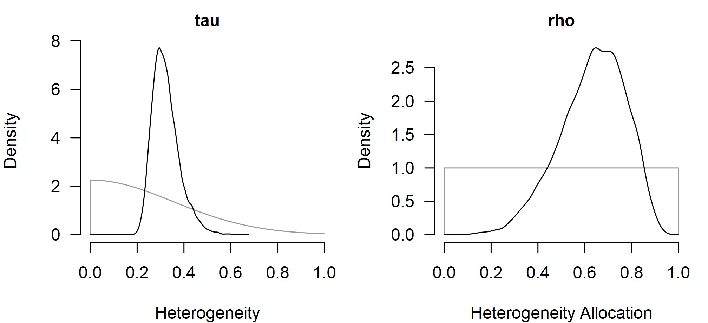

# Multilevel Meta-Analysis

This vignette illustrates how to use the `RoBMA` R package ([Bartoš &
Maier, 2020](#ref-RoBMA)) with multilevel meta-analytic data. We walk
through the school-calendar dataset from Konstantopoulos
([2011](#ref-konstantopoulos2011fixed)), showing the
[`brma()`](https://fbartos.github.io/RoBMA/reference/brma.md) call with
the `cluster` argument alongside its
[`metafor::rma.mv()`](https://wviechtb.github.io/metafor/reference/rma.mv.html)
counterpart ([Viechtbauer, 2010](#ref-metafor)).

All [`brma()`](https://fbartos.github.io/RoBMA/reference/brma.md) calls
keep the default prior distributions; see the [*Prior
Distributions*](https://fbartos.github.io/RoBMA/articles/v01-prior-distributions.md)
vignette for the prior definitions and customization options. For the
non-multilevel workflow showing more features (also applicable to the
multilevel models) see the [*Bayesian
Meta-Analysis*](https://fbartos.github.io/RoBMA/articles/v02-bayesian-meta-analysis.md)
vignette.

The `RoBMA` R package currently supports the simple multilevel structure
shown here, with one cluster grouping above the estimate level
(parameterized by total heterogeneity $`\tau^2`$ and cluster-level
allocation $`\rho`$). Broader support for multivariate models and more
complex random-effects structures is planned for a future release.

## Multilevel Random-Effects Model

The school-calendar dataset from the `metadat` package contains 56
standardized mean differences nested in 11 school districts. Effect
sizes `yi` and sampling variances `vi` are already provided, so no
`escalc()` step is needed.

``` r

data("dat.konstantopoulos2011", package = "metadat")
dat <- dat.konstantopoulos2011
head(dat)
#> 
#>   district school study year     yi    vi 
#> 1       11      1     1 1976 -0.180 0.118 
#> 2       11      2     2 1976 -0.220 0.118 
#> 3       11      3     3 1976  0.230 0.144 
#> 4       11      4     4 1976 -0.300 0.144 
#> 5       12      1     5 1989  0.130 0.014 
#> 6       12      2     6 1989 -0.260 0.014
```

[`metafor::rma.mv()`](https://wviechtb.github.io/metafor/reference/rma.mv.html)
fits a multilevel random-effects model with the compound-symmetric
structure `random = ~ school | district`, parameterized by the total
heterogeneity $`\tau`$ and the within-district correlation $`\rho`$.

``` r

fit1_metafor <- metafor::rma.mv(yi, vi, random = ~ school | district, data = dat)
fit1_metafor
#> 
#> Multivariate Meta-Analysis Model (k = 56; method: REML)
#> 
#> Variance Components:
#> 
#> outer factor: district (nlvls = 11)
#> inner factor: school   (nlvls = 11)
#> 
#>             estim    sqrt  fixed 
#> tau^2      0.0978  0.3127     no 
#> rho        0.6653             no 
#> 
#> Test for Heterogeneity:
#> Q(df = 55) = 578.8640, p-val < .0001
#> 
#> Model Results:
#> 
#> estimate      se    zval    pval   ci.lb   ci.ub    
#>   0.1847  0.0846  2.1845  0.0289  0.0190  0.3504  * 
#> 
#> ---
#> Signif. codes:  0 '***' 0.001 '**' 0.01 '*' 0.05 '.' 0.1 ' ' 1
```

The matching Bayesian fit replaces the `random = ...` argument with
`cluster = district`.
[`brma()`](https://fbartos.github.io/RoBMA/reference/brma.md)
parameterizes the multilevel model in the same compound-symmetric form:
a total heterogeneity $`\tau`$ and a cluster-level allocation $`\rho`$
where $`\tau_{between} = \tau\sqrt{\rho}`$ and
$`\tau_{within} = \tau\sqrt{1 - \rho}`$. `measure = "SMD"` selects the
default prior distributions for standardized mean differences.

``` r

fit1_brma <- brma(
  yi = yi, vi = vi, measure = "SMD",
  cluster = district,
  data = dat, seed = 1
)
```

[`summary()`](https://rdrr.io/r/base/summary.html) reports posterior
means, credible intervals, and (suppressed here) MCMC convergence
diagnostics for `mu`, `tau`, and `rho`.

``` r

summary(fit1_brma, include_mcmc_diagnostics = FALSE)
#> 
#> Bayesian Multilevel Random-Effects Model (k = 56, clusters = 11)
#> 
#> Estimates
#>      Mean    SD 0.025   0.5 0.975
#> mu  0.183 0.089 0.009 0.182 0.365
#> tau 0.323 0.058 0.233 0.314 0.461
#> rho 0.634 0.140 0.329 0.647 0.863
```

The posterior mean for the pooled effect tracks the REML estimate from
the `metafor` package, with comparable cluster-level allocation `rho`
and total heterogeneity `tau`.

## Heterogeneity: $`\tau`$ and $`\rho`$

[`metafor::confint()`](https://wviechtb.github.io/metafor/reference/confint.rma.html)
reports profile-likelihood confidence intervals for `tau^2`, `tau`, and
`rho`.

``` r

confint(fit1_metafor)
#> 
#>       estimate  ci.lb  ci.ub 
#> tau^2   0.0978 0.0528 0.2398 
#> tau     0.3127 0.2298 0.4897 
#> 
#>     estimate  ci.lb  ci.ub 
#> rho   0.6653 0.3282 0.8855
```

[`summary_heterogeneity()`](https://fbartos.github.io/RoBMA/reference/summary_heterogeneity.md)
is the Bayesian counterpart, reporting posterior summaries of the same
quantities along with the partitioned within- and between-cluster
components.

``` r

summary_heterogeneity(fit1_brma)
#> 
#> Heterogeneity Estimates:
#>                  Mean Median  0.025  0.975
#> tau             0.323  0.314  0.233  0.461
#> rho             0.634  0.647  0.329  0.863
#> tau [within]    0.187  0.185  0.132  0.255
#> tau [between]   0.258  0.248  0.150  0.417
#> tau2            0.108  0.099  0.054  0.213
#> tau2 [within]   0.036  0.034  0.017  0.065
#> tau2 [between]  0.071  0.062  0.022  0.174
#> I2             95.094 95.238 91.673 97.727
#> I2 [within]    34.673 33.498 13.262 62.913
#> I2 [between]   60.421 61.434 30.803 83.757
#> H2             22.745 21.000 12.010 43.998
```

[`plot()`](https://rdrr.io/r/graphics/plot.default.html) visualizes the
posterior, and `prior = TRUE` overlays the prior distribution so the
shift from prior to posterior is visible. Side-by-side panels for `tau`
and `rho` show the bulk of the posterior moving away from the weakly
informative defaults.

``` r

par(mfrow = c(1, 2), mar = c(4, 4, 2, 1), cex.axis = 0.8, cex.lab = 0.8, cex.main = 0.75)
plot(fit1_brma, parameter = "tau", prior = TRUE, main = "tau", xlim = c(0, 1))
plot(fit1_brma, parameter = "rho", prior = TRUE, main = "rho", xlim = c(0, 1))
```



The `tau` posterior concentrates around 0.3 with credible interval
comparable to the profile-likelihood bounds, while the `rho` posterior
favors a moderate-to-high cluster-level allocation, broadly consistent
with the REML point estimate of 0.67.

## Other Inference Helpers

All inference helpers available for any other
[`brma()`](https://fbartos.github.io/RoBMA/reference/brma.md) fit work
the same way for the multilevel fit specified via `cluster`. This
includes meta-regression and location-scale models, model comparison,
and fit diagnostics. See the [*Bayesian
Meta-Analysis*](https://fbartos.github.io/RoBMA/articles/v02-bayesian-meta-analysis.md)
vignette for the full walkthrough; the only thing that changes here is
the addition of `cluster = district`.

## References

Bartoš, F., & Maier, M. (2020). *RoBMA: An R package for robust Bayesian
meta-analyses*. <https://CRAN.R-project.org/package=RoBMA>

Konstantopoulos, S. (2011). Fixed effects and variance components
estimation in three-level meta-analysis. *Research Synthesis Methods*,
*2*(1), 61–76. <https://doi.org/10.1002/jrsm.35>

Viechtbauer, W. (2010). Conducting meta-analyses in R with the metafor
package. *Journal of Statistical Software*, *36*(3), 1–48.
<https://doi.org/10.18637/jss.v036.i03>
