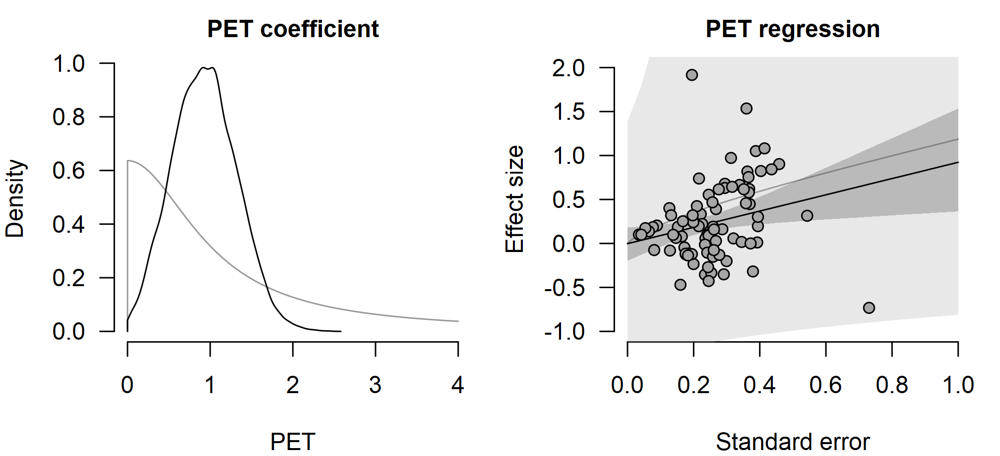
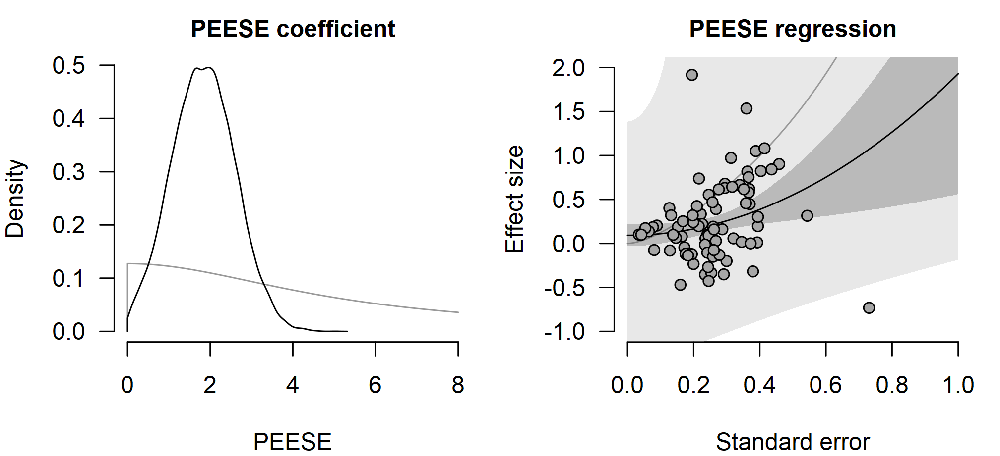
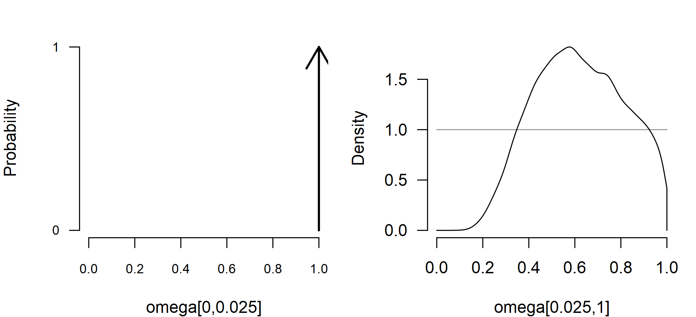
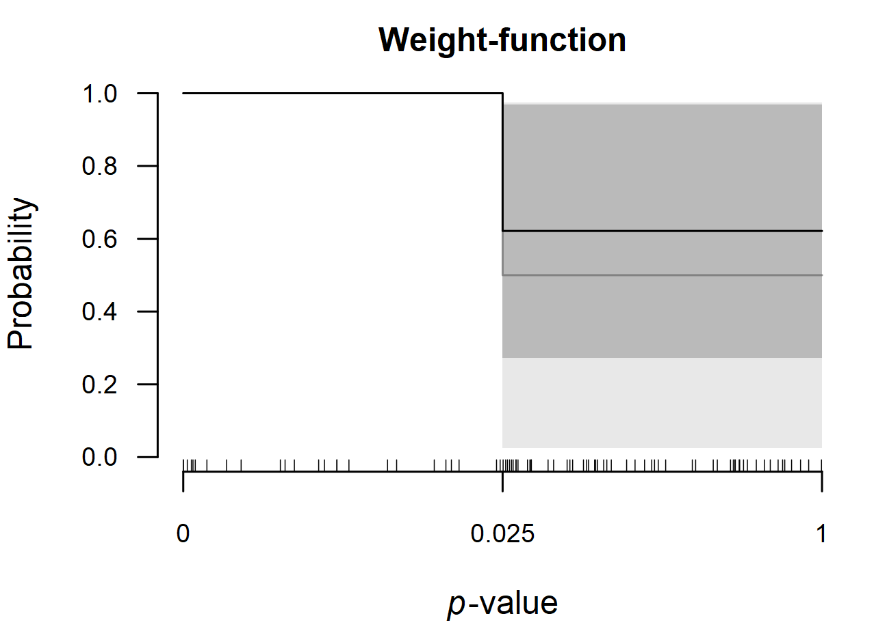
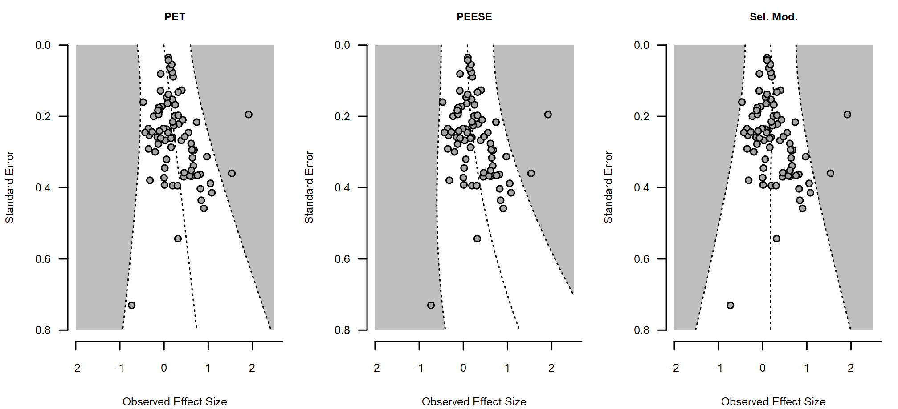
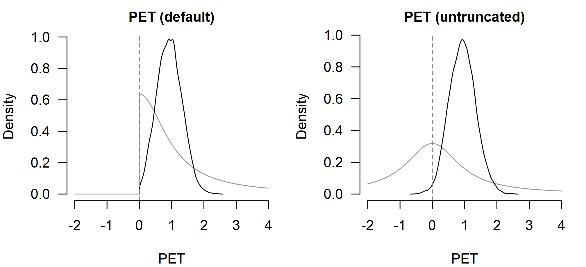
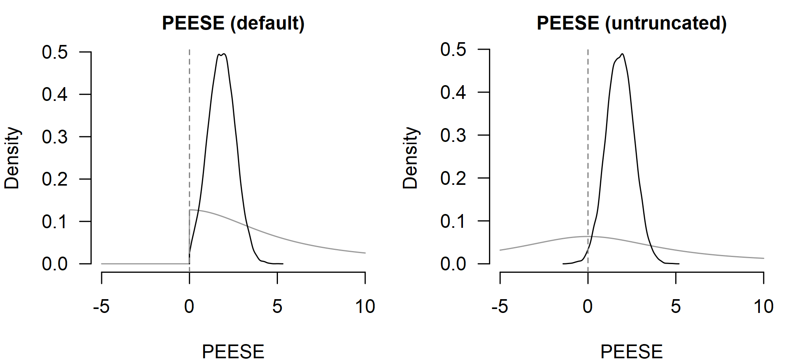
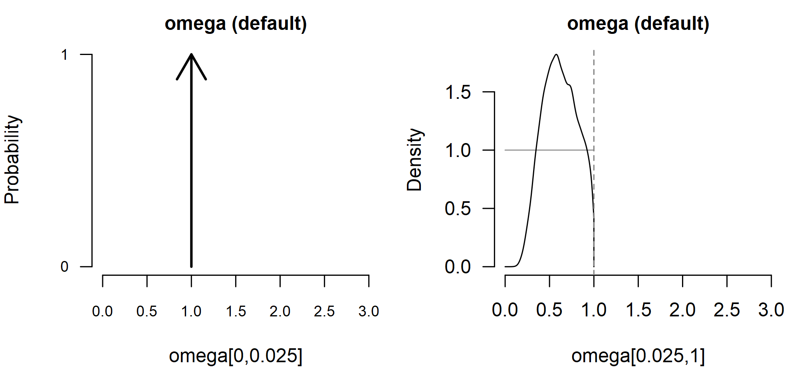
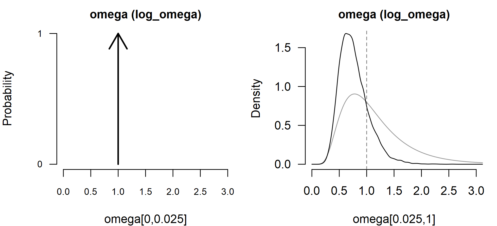

# Publication-Bias Adjustment

This vignette illustrates how to use the `RoBMA` R package ([Bartoš &
Maier, 2020](#ref-RoBMA)) for single-model publication-bias adjustment.
We walk through the ego-depletion dataset from the `metadat` package,
fitting three single-model bias adjustments alongside their `metafor`
package counterparts ([Viechtbauer, 2010](#ref-metafor)): PET and PEESE
([Stanley & Doucouliagos, 2014](#ref-stanley2014meta)), and a
weight-function selection model ([Vevea & Hedges,
1995](#ref-vevea1995general)). All of the models can also be combined
with Bayesian model-averaging into a Robust Bayesian meta-analysis as
described in the [*Robust Bayesian
Meta-Analysis*](https://fbartos.github.io/RoBMA/articles/v21-robust-bayesian-meta-analysis.md)
vignette.

The vignette is organized in three parts. First, we describe the default
prior distributions on the bias parameters. Second, we fit each model
with its default prior distribution, check parity against the `metafor`
package, and contrast the implied funnels. Third, we relax each default
in turn, placing the restricted and relaxed posteriors side by side.

For the non-bias-adjusted workflow showing more features (also
applicable to the bias-adjustment models) see the [*Bayesian
Meta-Analysis*](https://fbartos.github.io/RoBMA/articles/v02-bayesian-meta-analysis.md)
vignette. The [*Prior
Distributions*](https://fbartos.github.io/RoBMA/articles/v01-prior-distributions.md)
vignette covers setting prior distributions for the meta-analytic
parameters.

## Default Bias-Adjustment Prior Distributions

The three model types use a separate prior distribution on the
bias-adjustment parameter, independent of the prior distributions on
`mu`, `tau`, and the meta-regression coefficients.

| Model | Bias parameter | Default prior distribution |
|:---|:---|:---|
| [`bPET()`](https://fbartos.github.io/RoBMA/reference/bPET.md) | `PET` | Cauchy($`0`$, $`1`$), truncated to $`[0, \infty)`$ |
| [`bPEESE()`](https://fbartos.github.io/RoBMA/reference/bPEESE.md) | `PEESE` | Cauchy($`0`$, $`5 \cdot \text{UISD}_{\text{ratio}}`$), truncated to $`[0, \infty)`$ |
| [`bselmodel()`](https://fbartos.github.io/RoBMA/reference/bselmodel.md) | `omega` | one-sided weight function with `steps = c(0.025)` and `alpha = c(1, 1)` |

The PET prior distribution is invariant to the effect-size measure. The
PEESE scale is rescaled by
$`\text{UISD}_{\text{ratio}} = \text{UISD}_{\text{SMD}} / \text{UISD}_{\text{measure}}`$
so the prior distribution describes a comparable bias on each scale; the
ratio is $`1`$ for `measure = "SMD"`. The weight-function default
specifies a Dirichlet prior distribution on the relative publication
probabilities of one-sided p-values below and above $`0.025`$,
equivalent to a three-parameter selection model (3PSM). Unlike the prior
distributions for meta-analytic parameters, the bias-adjustment prior
distributions are not affected by `rescale_priors`; they can be replaced
via `prior_bias`, and the weight-function `steps` can be changed
directly via the `steps` argument. The bias-adjustment models rely on
the `effect_direction` argument. Selection models penalize one-sided
p-values evaluated against the expected sign of the effect, and the
truncated PET and PEESE prior distributions constrain the small-study
coefficient to pull the estimate toward zero from the dominant
direction. The `effect_direction` argument tells the model which side
that is. The default `effect_direction = "detect"` infers the direction
from the median of `yi` (positive median yields `"positive"`, negative
median yields `"negative"`). Set `effect_direction = "positive"` or
`effect_direction = "negative"` explicitly when the dominant direction
is known a priori.

These prior distributions correspond to the default settings tested in
the larger RoBMA-PSMA ensemble in Bartoš et al.
([2023](#ref-bartos2021no)). Note that all three defaults are
*restricted to assume the presence of publication bias*: the truncated
PET / PEESE coefficients are constrained to pull the estimate toward
zero, and the cumulative-Dirichlet weight function forces every
non-significant interval’s `omega` to be no greater than the
most-significant interval’s reference value of $`1`$. The “no
publication bias” case is therefore on the parameter-space boundary.

In a model-averaged
[`RoBMA()`](https://fbartos.github.io/RoBMA/reference/RoBMA.md) ensemble
this is exactly the desired behaviour: a separate no-bias model carries
the “no selection” hypothesis, and the bias-adjustment models are
deliberately one-sided so the contrast against the no-bias spike is
sharp and the inclusion Bayes factor is diagnostic. For the single-model
fits in this vignette there is no companion no-bias model in the
ensemble, so the same restriction can shrink estimates toward the
implied bias even when the data are consistent with no selection. The
*Flexible Bias Prior Distributions* section below relaxes the
restriction model by model via the `prior_bias` argument when the
single-model fit is the analysis of interest.

## Default Fits

The `dat.lehmann2018` dataset from the `metadat` package collects 81
standardized mean differences from the ego-depletion meta-analysis.
Effect sizes `yi` and sampling variances `vi` are already provided.

``` r

data("dat.lehmann2018", package = "metadat")
dat <- dat.lehmann2018
```

We fit each of the three bias-adjustment models with its default prior
distribution and contrast against the matching `metafor` package call.
The funnel-plot view at the end of the section then visualizes how each
adjustment encodes a different bias mechanism.

### PET

The PET model regresses effect sizes on the standard error. With
[`metafor::rma()`](https://wviechtb.github.io/metafor/reference/rma.uni.html)
it is fit by passing `mods = ~ sqrt(vi)`; the slope on `sqrt(vi)` is the
PET coefficient. The `RoBMA` R package implements PET as a
meta-regression (with a random-effects heterogeneity component) rather
than the UWLS variant, for consistency with the rest of the framework.

``` r

fit_PET_metafor <- metafor::rma(yi, vi, mods = ~ sqrt(vi), data = dat)
fit_PET_metafor
#> 
#> Mixed-Effects Model (k = 81; tau^2 estimator: REML)
#> 
#> tau^2 (estimated amount of residual heterogeneity):     0.0940 (SE = 0.0236)
#> tau (square root of estimated tau^2 value):             0.3065
#> I^2 (residual heterogeneity / unaccounted variability): 79.74%
#> H^2 (unaccounted variability / sampling variability):   4.94
#> R^2 (amount of heterogeneity accounted for):            8.96%
#> 
#> Test for Residual Heterogeneity:
#> QE(df = 79) = 234.7716, p-val < .0001
#> 
#> Test of Moderators (coefficient 2):
#> QM(df = 1) = 6.5617, p-val = 0.0104
#> 
#> Model Results:
#> 
#>           estimate      se     zval    pval    ci.lb   ci.ub    
#> intrcpt    -0.0359  0.1038  -0.3455  0.7297  -0.2394  0.1676    
#> sqrt(vi)    1.0765  0.4203   2.5616  0.0104   0.2528  1.9002  * 
#> 
#> ---
#> Signif. codes:  0 '***' 0.001 '**' 0.01 '*' 0.05 '.' 0.1 ' ' 1
```

[`bPET()`](https://fbartos.github.io/RoBMA/reference/bPET.md) fits the
same model with the default Cauchy prior distribution on the (positive)
PET coefficient. `measure = "SMD"` selects the default prior
distributions for standardized mean differences.

``` r

fit_PET_brma <- bPET(
  yi = yi, vi = vi, measure = "SMD",
  data = dat, seed = 1
)
```

``` r

summary(fit_PET_brma, include_mcmc_diagnostics = FALSE)
#> 
#> Bayesian Random-Effects PET Model (k = 81)
#> 
#> Estimates
#>       Mean    SD  0.025    0.5 0.975
#> mu  -0.004 0.097 -0.196 -0.002 0.181
#> tau  0.307 0.040  0.233  0.305 0.391
#> 
#> Publication Bias
#>      Mean    SD 0.025   0.5 0.975
#> PET 0.932 0.386 0.214 0.924 1.699
```

The posterior mean of `mu` is the bias-corrected average effect; the
`PET` coefficient quantifies how strongly small studies pull the
meta-analytic mean. The left panel shows the prior and posterior of the
`PET` coefficient with `prior = TRUE` overlaying the prior distribution;
the right panel shows the implied PET regression of effect on standard
error from
[`plot_pet_peese()`](https://fbartos.github.io/RoBMA/reference/plot_pet_peese.md),
with the prior band overlaid.

``` r

par(mfrow = c(1, 2), mar = c(4, 4, 2, 1), cex.axis = 0.8, cex.lab = 0.8, cex.main = 0.75)
plot(fit_PET_brma,  parameter = "PET", prior = TRUE, main = "PET coefficient", xlim = c(0, 4))
plot_pet_peese(fit_PET_brma, prior = TRUE, main = "PET regression")
```



The half-Cauchy prior distribution on `PET` is wide; the posterior
concentrates near $`1`$, broadly consistent with the `metafor` package
estimate but pulled toward zero by the prior distribution. The implied
regression line intersects the distribution of effect sizes and standard
errors.

### PEESE

The PEESE model regresses effect sizes on the sampling variance instead
of the standard error. With
[`metafor::rma()`](https://wviechtb.github.io/metafor/reference/rma.uni.html)
it is fit by passing `mods = ~ vi`; the slope on `vi` is the PEESE
coefficient. As with PET, the `RoBMA` R package PEESE is the
meta-regression version (retaining the heterogeneity component), not the
UWLS variant.

``` r

fit_PEESE_metafor <- metafor::rma(yi, vi, mods = ~ vi, data = dat)
fit_PEESE_metafor
#> 
#> Mixed-Effects Model (k = 81; tau^2 estimator: REML)
#> 
#> tau^2 (estimated amount of residual heterogeneity):     0.0917 (SE = 0.0232)
#> tau (square root of estimated tau^2 value):             0.3028
#> I^2 (residual heterogeneity / unaccounted variability): 79.77%
#> H^2 (unaccounted variability / sampling variability):   4.94
#> R^2 (amount of heterogeneity accounted for):            11.18%
#> 
#> Test for Residual Heterogeneity:
#> QE(df = 79) = 231.8504, p-val < .0001
#> 
#> Test of Moderators (coefficient 2):
#> QM(df = 1) = 5.6925, p-val = 0.0170
#> 
#> Model Results:
#> 
#>          estimate      se    zval    pval    ci.lb   ci.ub    
#> intrcpt    0.0903  0.0647  1.3959  0.1627  -0.0365  0.2171    
#> vi         1.8824  0.7890  2.3859  0.0170   0.3360  3.4287  * 
#> 
#> ---
#> Signif. codes:  0 '***' 0.001 '**' 0.01 '*' 0.05 '.' 0.1 ' ' 1
```

[`bPEESE()`](https://fbartos.github.io/RoBMA/reference/bPEESE.md) fits
the same model with the default Cauchy prior distribution on the
(positive) PEESE coefficient, with the prior scale rescaled to the
effect-size measure.

``` r

fit_PEESE_brma <- bPEESE(
  yi = yi, vi = vi, measure = "SMD",
  data = dat, seed = 1
)
```

``` r

summary(fit_PEESE_brma, include_mcmc_diagnostics = FALSE)
#> 
#> Bayesian Random-Effects PEESE Model (k = 81)
#> 
#> Estimates
#>      Mean    SD  0.025   0.5 0.975
#> mu  0.092 0.063 -0.031 0.092 0.216
#> tau 0.304 0.041  0.230 0.302 0.389
#> 
#> Publication Bias
#>        Mean    SD 0.025   0.5 0.975
#> PEESE 1.840 0.759 0.376 1.837 3.350
```

As for PET, the left panel shows the prior and posterior of the `PEESE`
coefficient and the right panel shows the implied PEESE regression of
effect on sampling variance.

``` r

par(mfrow = c(1, 2), mar = c(4, 4, 2, 1), cex.axis = 0.8, cex.lab = 0.8, cex.main = 0.75)
plot(fit_PEESE_brma, parameter = "PEESE", prior = TRUE, main = "PEESE coefficient", xlim = c(0, 8))
plot_pet_peese(fit_PEESE_brma, prior = TRUE, main = "PEESE regression")
```



The bias-corrected effect under PEESE is also closer to zero than the
random-effects estimate due to the weakly informative prior
distributions.

### Weight Function Selection Model

The selection model multiplies the likelihood of each study by a
p-value-dependent publication probability. With the `metafor` package, a
one-sided three-parameter model is fit by passing the random-effects fit
to
[`metafor::selmodel()`](https://wviechtb.github.io/metafor/reference/selmodel.html).

``` r

fit_rma_metafor      <- metafor::rma(yi, vi, data = dat, method = "ML")
fit_selmodel_metafor <- metafor::selmodel(fit_rma_metafor, type = "stepfun", steps = .025, decreasing = TRUE)
fit_selmodel_metafor
#> 
#> Random-Effects Model (k = 81; tau^2 estimator: ML)
#> 
#> tau^2 (estimated amount of total heterogeneity): 0.0811 (SE = 0.0261)
#> tau (square root of estimated tau^2 value):      0.2848
#> 
#> Test for Heterogeneity:
#> LRT(df = 1) = 37.3674, p-val < .0001
#> 
#> Model Results:
#> 
#> estimate      se    zval    pval   ci.lb   ci.ub    
#>   0.1328  0.0655  2.0267  0.0427  0.0044  0.2612  * 
#> 
#> Test for Selection Model Parameters:
#> LRT(df = 1) = 1.7646, p-val = 0.1840
#> 
#> Selection Model Results:
#> 
#>                      k  estimate      se     zval    pval   ci.lb   ci.ub    
#> 0     < p <= 0.025  25    1.0000     ---      ---     ---     ---     ---    
#> 0.025 < p <= 1      56    0.5485  0.2495  -1.8097  0.0703  0.0594  1.0000  . 
#> 
#> ---
#> Signif. codes:  0 '***' 0.001 '**' 0.01 '*' 0.05 '.' 0.1 ' ' 1
```

[`bselmodel()`](https://fbartos.github.io/RoBMA/reference/bselmodel.md)
fits the same model in one call. The default weight function uses a
single one-sided cutoff at $`0.025`$. Passing `steps = c(0.025, 0.5)`
(or any other vector) specifies a finer step function; the prior
distribution on the omega vector is uniform across the implied
intervals. The default Dirichlet prior distribution on `omega` in the
`RoBMA` R package enforces a monotonically decreasing weight function
(non-significant intervals cannot exceed the reference interval), which
matches `metafor::selmodel(..., decreasing = TRUE)` above.

``` r

fit_selmodel_brma <- bselmodel(
  yi = yi, vi = vi, measure = "SMD",
  data = dat, seed = 1
)
```

``` r

summary(fit_selmodel_brma, include_mcmc_diagnostics = FALSE)
#> 
#> Bayesian Random-Effects Selection Model (k = 81)
#> 
#> Estimates
#>      Mean    SD 0.025   0.5 0.975
#> mu  0.141 0.057 0.029 0.142 0.252
#> tau 0.293 0.043 0.212 0.292 0.380
#> 
#> Publication Bias
#>                 Mean    SD 0.025   0.5 0.975
#> omega[0,0.025] 1.000 0.000 1.000 1.000 1.000
#> omega[0.025,1] 0.621 0.192 0.273 0.614 0.969
#> P-value intervals for publication bias weights omega correspond to one-sided p-values.
```

The omega vector is reported with `omega[0, 0.025]` fixed to $`1`$ as
the reference interval; `omega[0.025, 1]` is the publication probability
of one-sided p-values above $`0.025`$ relative to the significant
interval. Values below $`1`$ indicate that non-significant studies are
reported less often than significant ones.

The omega vector has one panel per interval (the reference
$`[0, 0.025]`$ panel shows the spike at $`1`$).
[`plot_weightfunction()`](https://fbartos.github.io/RoBMA/reference/plot_weightfunction.md)
then visualizes the same weights as a step function over the one-sided
p-value scale, with the prior band overlaid.

``` r

par(mfrow = c(1, 2), mar = c(4, 4, 2, 1), cex.axis = 0.8, cex.lab = 0.8, cex.main = 0.75)
plot(fit_selmodel_brma, parameter = "omega", prior = TRUE, xlim = c(0, 1))
```



``` r

par(mar = c(4, 4, 2, 1), cex.axis = 0.8, cex.lab = 0.8, cex.main = 0.75)
plot_weightfunction(fit_selmodel_brma, prior = TRUE, main = "Weight-function")
```



The bias-corrected `mu` posterior is shifted toward zero relative to a
[`brma()`](https://fbartos.github.io/RoBMA/reference/brma.md)
random-effects fit, with the magnitude of the shift driven by the gap
between the prior and posterior of `omega[0.025, 1]`.

### Asymmetric Sampling Funnels

[`funnel()`](https://fbartos.github.io/RoBMA/reference/funnel.md)
extends the standard funnel plot by drawing the *full sampling
distribution implied by the fitted model*, including the
publication-bias adjustment. With a no-bias
[`brma()`](https://fbartos.github.io/RoBMA/reference/brma.md) fit the
funnel is symmetric; with a bias-adjustment model the funnel becomes
asymmetric in the direction the model identifies as suppressed.
Comparing the three default fits side by side shows how each adjustment
encodes a different mechanism.

``` r

par(mfrow = c(1, 3), mar = c(4, 4, 2, 1), cex.axis = 0.8, cex.lab = 0.8, cex.main = 0.75)
xlim <- c(-2, 2.5); ylim <- c(0, 0.8)
funnel(fit_PET_brma,      main = "PET",       xlim = xlim, ylim = ylim)
funnel(fit_PEESE_brma,    main = "PEESE",     xlim = xlim, ylim = ylim)
funnel(fit_selmodel_brma, main = "Sel. Mod.", xlim = xlim, ylim = ylim)
```



PET tilts the funnel by adding a linear effect of the standard error, so
the centerline shifts away from zero in the direction of the dominant
effect as precision drops. PEESE produces the same kind of shift but
curved (quadratic in standard error), so the displacement grows faster
for imprecise studies and the funnel walls bow outward. The
selection-model funnel keeps the centerline on the random-effects `mu`,
but the implied sampling density on each side of the $`p < 0.025`$
contour differs: the non-significant region is down-weighted by
`omega[0.025, 1]`, so non-significant studies are predicted to appear
less often than significant ones at the same precision.

## Flexible Bias Prior Distributions

The default prior distributions above encode a one-sided
publication-selection mechanism: PET and PEESE are constrained to be
non-negative, and the weight function is constrained to be monotonically
non-increasing in p-value. These restrictions are usually appropriate in
practice and help regularize estimates from the bias-adjusted models.
Analysts might still be interested in specifying more flexible prior
distributions for the bias adjustment. Each of
[`bPET()`](https://fbartos.github.io/RoBMA/reference/bPET.md),
[`bPEESE()`](https://fbartos.github.io/RoBMA/reference/bPEESE.md), and
[`bselmodel()`](https://fbartos.github.io/RoBMA/reference/bselmodel.md)
accepts a `prior_bias` argument that replaces the default with any
user-specified prior distribution of the matching type. Below we relax
each default in turn and place the restricted and relaxed posteriors
side by side. The relaxed prior distributions let the posterior settle
wherever the data prefer rather than being pinned against the boundary;
conversely, when a relaxed posterior concentrates on the same side as
its default counterpart, that agreement is data-driven and not a
consequence of the prior constraint.

### PET without truncation

For PET the natural relaxation is to drop the `[0, Inf]` truncation on
the bias coefficient. We keep the default Cauchy family and scale
(`Cauchy(0, 1)`) so the comparison isolates the effect of removing the
lower bound; the prior distribution now puts equal mass on negative-bias
regions, where small studies pull the estimate *up* rather than down.

``` r

fit_PET_brma_flex <- bPET(
  yi = yi, vi = vi, measure = "SMD",
  prior_bias = prior_PET(
    distribution = "cauchy",
    parameters = list(location = 0, scale = 1),
    truncation = list(lower = -Inf, upper = Inf)
  ),
  data = dat, seed = 1
)
```

``` r

summary(fit_PET_brma_flex, include_mcmc_diagnostics = FALSE)
#> 
#> Bayesian Random-Effects PET Model (k = 81)
#> 
#> Estimates
#>       Mean    SD  0.025    0.5 0.975
#> mu  -0.004 0.102 -0.207 -0.004 0.191
#> tau  0.308 0.040  0.234  0.305 0.391
#> 
#> Publication Bias
#>      Mean    SD 0.025   0.5 0.975
#> PET 0.933 0.408 0.167 0.929 1.755
```

The two panels below show the prior and posterior of the `PET`
coefficient under the default truncated prior distribution (left) and
the relaxed full-real-line prior distribution (right). The dashed line
at `PET = 0` marks where the default prior distribution is bounded and
where the relaxed prior distribution places mass on both sides.

``` r

par(mfrow = c(1, 2), mar = c(4, 4, 2, 1), cex.axis = 0.8, cex.lab = 0.8, cex.main = 0.85)
plot(fit_PET_brma,      parameter = "PET", prior = TRUE,
  main = "PET (default)",     xlim = c(-2, 4))
abline(v = 0, lty = 2, col = "grey50")
plot(fit_PET_brma_flex, parameter = "PET", prior = TRUE,
  main = "PET (untruncated)", xlim = c(-2, 4))
abline(v = 0, lty = 2, col = "grey50")
```



### PEESE without truncation

PEESE is relaxed analogously: keep `Cauchy(0, 5)` and remove the lower
bound, so the prior distribution is symmetric around zero.

``` r

fit_PEESE_brma_flex <- bPEESE(
  yi = yi, vi = vi, measure = "SMD",
  prior_bias = prior_PEESE(
    distribution = "cauchy",
    parameters = list(location = 0, scale = 5),
    truncation = list(lower = -Inf, upper = Inf)
  ),
  data = dat, seed = 1
)
```

``` r

summary(fit_PEESE_brma_flex, include_mcmc_diagnostics = FALSE)
#> 
#> Bayesian Random-Effects PEESE Model (k = 81)
#> 
#> Estimates
#>      Mean    SD  0.025   0.5 0.975
#> mu  0.093 0.064 -0.034 0.093 0.219
#> tau 0.305 0.041  0.228 0.303 0.392
#> 
#> Publication Bias
#>        Mean    SD 0.025   0.5 0.975
#> PEESE 1.827 0.780 0.306 1.825 3.351
```

``` r

par(mfrow = c(1, 2), mar = c(4, 4, 2, 1), cex.axis = 0.8, cex.lab = 0.8, cex.main = 0.85)
plot(fit_PEESE_brma, parameter = "PEESE", prior = TRUE, main = "PEESE (default)", xlim = c(-5, 10))
abline(v = 0, lty = 2, col = "grey50")
plot(fit_PEESE_brma_flex, parameter = "PEESE", prior = TRUE, main = "PEESE (untruncated)", xlim = c(-5, 10))
abline(v = 0, lty = 2, col = "grey50")
```



### Selection-model Weight Prior Distributions

The weight on each non-reference p-value bin is built from a *weight
prior* helper exported from the `BayesTools` package. Choosing a
different helper changes which weight vectors are *a priori* possible.

| Helper | What the prior distribution allows | Notes |
|:---|:---|:---|
| `wf_cumulative(alpha)` | monotone decreasing weights via a Dirichlet on cumulative bin probabilities; non-significant intervals cannot exceed the most-significant interval | the default; matches `metafor::selmodel(..., decreasing = TRUE)` and the canonical 3PSM-style assumption |
| `wf_fixed(omega)` | the weight vector is fixed to the supplied values; no parameters are sampled | sensitivity analyses with externally specified weights |
| `wf_independent(prior, scale = "omega")` | independent prior distribution placed directly on each non-reference `omega`; the prior distribution must have non-negative support (e.g., `Beta` or a positive-truncated distribution) | non-monotone weights drawn independently from a custom prior distribution |
| `wf_independent(prior, scale = "log_omega")` | independent prior distribution placed on `log(omega)`, with `omega = exp(log_omega)` | non-monotone weights drawn independently from a custom prior distribution |

The two `wf_independent` scales allow different parameterizations. The
`"omega"` scale breaks monotonicity and specifies weights directly on
the relative probability scale. The `"log_omega"` scale allows
specifying the prior distributions as multiplicative factors against the
baseline weight via log scale.

We refit the selection model with a `Normal(0, 0.5)` prior distribution
on `log_omega`, which is centered at “no selection” (`omega = 1`) and
places roughly 95% of its prior mass on `omega` between $`0.37`$ and
$`2.7`$:

``` r

fit_selmodel_brma_flex <- bselmodel(
  yi = yi, vi = vi, measure = "SMD",
  prior_bias = prior_weightfunction(
    "one-sided",
    steps   = c(0.025),
    weights = wf_independent(
      prior("normal", parameters = list(mean = 0, sd = 0.5)),
      scale = "log_omega"
    )
  ),
  data = dat, seed = 1
)
```

``` r

summary(fit_selmodel_brma_flex, include_mcmc_diagnostics = FALSE)
#> 
#> Bayesian Random-Effects Selection Model (k = 81)
#> 
#> Estimates
#>      Mean    SD 0.025   0.5 0.975
#> mu  0.167 0.060 0.057 0.165 0.291
#> tau 0.306 0.045 0.223 0.303 0.402
#> 
#> Publication Bias
#>                 Mean    SD 0.025   0.5 0.975
#> omega[0,0.025] 1.000 0.000 1.000 1.000 1.000
#> omega[0.025,1] 0.767 0.266 0.371 0.726 1.384
#> P-value intervals for publication bias weights omega correspond to one-sided p-values.
```

The dashed line at `omega = 1` marks the upper bound of the default
Dirichlet weight, where the `log_omega` prior distribution places equal
mass on both sides.

``` r

par(mfrow = c(1, 2), mar = c(4, 4, 2, 1), cex.axis = 0.8, cex.lab = 0.8, cex.main = 0.85)
plot(fit_selmodel_brma, parameter = "omega", prior = TRUE, main = "omega (default)", xlim = c(0, 3))
abline(v = 1, lty = 2, col = "grey50")
```



``` r

plot(fit_selmodel_brma_flex, parameter = "omega", prior = TRUE, main = "omega (log_omega)", xlim = c(0, 3))
abline(v = 1, lty = 2, col = "grey50")
```



## Other Inference Helpers

[`bPET()`](https://fbartos.github.io/RoBMA/reference/bPET.md),
[`bPEESE()`](https://fbartos.github.io/RoBMA/reference/bPEESE.md), and
[`bselmodel()`](https://fbartos.github.io/RoBMA/reference/bselmodel.md)
accept the same `mods`, `scale`, and `cluster` arguments as
[`brma()`](https://fbartos.github.io/RoBMA/reference/brma.md), so
meta-regression, location-scale, and multilevel bias-adjustment models
are directly available. The fits are also `brma` objects, so all
summaries, plots, predictions, and diagnostics examined in the
[*Bayesian
Meta-Analysis*](https://fbartos.github.io/RoBMA/articles/v02-bayesian-meta-analysis.md)
vignette work the same way here.

To average across bias-adjustment models rather than commit to a single
one, use
[`RoBMA()`](https://fbartos.github.io/RoBMA/reference/RoBMA.md); see the
[*Robust Bayesian
Meta-Analysis*](https://fbartos.github.io/RoBMA/articles/v21-robust-bayesian-meta-analysis.md)
vignette for the model-averaged workflow and the available `model_type`
presets.

## References

Bartoš, F., & Maier, M. (2020). *RoBMA: An R package for robust Bayesian
meta-analyses*. <https://CRAN.R-project.org/package=RoBMA>

Bartoš, F., Maier, M., Wagenmakers, E.-J., Doucouliagos, H., & Stanley,
T. D. (2023). Robust Bayesian meta-analysis: Model-averaging across
complementary publication bias adjustment methods. *Research Synthesis
Methods*, *14*(1), 99–116. <https://doi.org/10.1002/jrsm.1594>

Stanley, T. D., & Doucouliagos, H. (2014). Meta-regression
approximations to reduce publication selection bias. *Research Synthesis
Methods*, *5*(1), 60–78. <https://doi.org/10.1002/jrsm.1095>

Vevea, J. L., & Hedges, L. V. (1995). A general linear model for
estimating effect size in the presence of publication bias.
*Psychometrika*, *60*(3), 419–435. <https://doi.org/10.1007/BF02294384>

Viechtbauer, W. (2010). Conducting meta-analyses in R with the metafor
package. *Journal of Statistical Software*, *36*(3), 1–48.
<https://doi.org/10.18637/jss.v036.i03>
