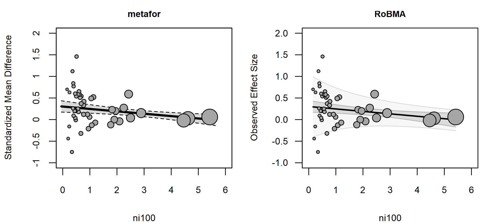
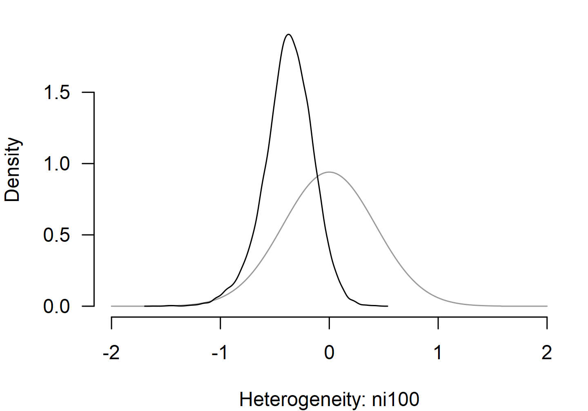

# Location-Scale Meta-Analysis

This vignette illustrates how to fit location-scale meta-analytic models
with the `RoBMA` R package ([Bartoš & Maier, 2020](#ref-RoBMA)). We walk
through the writing-to-learn dataset (`dat.bangertdrowns2004` in the
`metadat` package), showing the
[`brma()`](https://fbartos.github.io/RoBMA/reference/brma.md) call with
the `scale = ~ ...` argument alongside its
[`metafor::rma()`](https://wviechtb.github.io/metafor/reference/rma.uni.html)
counterpart ([Viechtbauer, 2010](#ref-metafor)), and build from a simple
random-effects model up to a model with different predictors in the
location and scale parts.

A location-scale model parameterizes the between-study heterogeneity
$`\tau`$ as a regression on study-level covariates, allowing $`\tau`$ to
vary across subgroups or as a function of continuous moderators. The
location side is the usual meta-regression on the effect.

All [`brma()`](https://fbartos.github.io/RoBMA/reference/brma.md) calls
keep the default prior distributions; see the [*Prior
Distributions*](https://fbartos.github.io/RoBMA/articles/v01-prior-distributions.md)
vignette for the prior definitions and customization options. For the
non-location-scale workflow showing more features (also applicable to
location-scale models) see the [*Bayesian
Meta-Analysis*](https://fbartos.github.io/RoBMA/articles/v02-bayesian-meta-analysis.md)
vignette.

## Random-Effects Model

The writing-to-learn dataset contains 48 standardized mean differences
from studies on the effectiveness of school-based writing interventions
on academic achievement. Effect sizes `yi` and sampling variances `vi`
are already provided.

``` r

data("dat.bangertdrowns2004", package = "metadat")
dat <- dat.bangertdrowns2004
dat$ni100 <- dat$ni / 100
dat$meta  <- as.factor(dat$meta)
dat$imag  <- as.factor(dat$imag)
```

We start from a standard random-effects model with no scale predictor.

``` r

fit1_metafor <- metafor::rma(yi, vi, data = dat)
fit1_metafor
#> 
#> Random-Effects Model (k = 48; tau^2 estimator: REML)
#> 
#> tau^2 (estimated amount of total heterogeneity): 0.0499 (SE = 0.0197)
#> tau (square root of estimated tau^2 value):      0.2235
#> I^2 (total heterogeneity / total variability):   58.37%
#> H^2 (total variability / sampling variability):  2.40
#> 
#> Test for Heterogeneity:
#> Q(df = 47) = 107.1061, p-val < .0001
#> 
#> Model Results:
#> 
#> estimate      se    zval    pval   ci.lb   ci.ub      
#>   0.2219  0.0460  4.8209  <.0001  0.1317  0.3122  *** 
#> 
#> ---
#> Signif. codes:  0 '***' 0.001 '**' 0.01 '*' 0.05 '.' 0.1 ' ' 1
```

``` r

fit1_brma <- brma(
  yi = yi, vi = vi, measure = "SMD",
  data = dat, seed = 1
)
```

``` r

summary(fit1_brma, include_mcmc_diagnostics = FALSE)
#> 
#> Bayesian Random-Effects Model (k = 48)
#> 
#> Estimates
#>      Mean    SD 0.025   0.5 0.975
#> mu  0.220 0.048 0.130 0.220 0.317
#> tau 0.227 0.053 0.131 0.224 0.340
```

The pooled effect and the single heterogeneity parameter `tau` track the
REML estimates from the `metafor` package.

## Adding a Scale Predictor

Sample size is a natural candidate for explaining heterogeneity: smaller
studies often produce more variable estimates than larger ones. We add
the rescaled total sample size (`ni100 = ni / 100`) on both the location
and the scale side.

``` r

fit2_metafor <- suppressWarnings(metafor::rma(
  yi, vi,
  mods  = ~ ni100,
  scale = ~ ni100,
  data = dat
))
fit2_metafor
#> 
#> Location-Scale Model (k = 48; tau^2 estimator: REML)
#> 
#> Test for Residual Heterogeneity:
#> QE(df = 46) = 95.1352, p-val < .0001
#> 
#> Test of Location Coefficients (coefficient 2):
#> QM(df = 1) = 7.8268, p-val = 0.0051
#> 
#> Model Results (Location):
#> 
#>          estimate      se     zval    pval    ci.lb    ci.ub      
#> intrcpt    0.3017  0.0661   4.5629  <.0001   0.1721   0.4313  *** 
#> ni100     -0.0553  0.0198  -2.7976  0.0051  -0.0940  -0.0165   ** 
#> 
#> Test of Scale Coefficients (coefficient 2):
#> QM(df = 1) = 3.1850, p-val = 0.0743
#> 
#> Model Results (Scale):
#> 
#>          estimate      se     zval    pval    ci.lb    ci.ub     
#> intrcpt   -1.9209  0.6690  -2.8713  0.0041  -3.2321  -0.6097  ** 
#> ni100     -0.9174  0.5141  -1.7847  0.0743  -1.9250   0.0901   . 
#> 
#> ---
#> Signif. codes:  0 '***' 0.001 '**' 0.01 '*' 0.05 '.' 0.1 ' ' 1
```

``` r

fit2_brma <- brma(
  yi = yi, vi = vi, measure = "SMD",
  mods  = ~ ni100,
  scale = ~ ni100,
  data = dat, seed = 1
)
```

``` r

summary(fit2_brma, include_mcmc_diagnostics = FALSE)
#> 
#> Bayesian Location-Scale Model (k = 48)
#> 
#> Location
#>             Mean    SD  0.025    0.5  0.975
#> intercept  0.303 0.068  0.171  0.302  0.437
#> ni100     -0.056 0.023 -0.103 -0.056 -0.013
#> 
#> Scale
#>                  Mean    SD  0.025    0.5 0.975
#> exp(intercept)  0.348 0.118  0.148  0.338 0.608
#> ni100          -0.375 0.225 -0.865 -0.366 0.042
#> exp(Intercept) corresponds to the between-study heterogeneity tau; the meta-regression coefficients correspond to the multiplicative effects on log-scale.
```

The location coefficient on `ni100` matches the REML estimate from the
`metafor` package. The scale block reports `exp(intercept)`, which is
the baseline between-study heterogeneity $`\tau`$, and a multiplicative
log-scale coefficient on `ni100`. Note that
[`metafor::rma()`](https://wviechtb.github.io/metafor/reference/rma.uni.html)
regresses $`\log(\tau^2)`$ while
[`brma()`](https://fbartos.github.io/RoBMA/reference/brma.md) regresses
$`\log(\tau)`$, so each `metafor` package scale coefficient is exactly
twice the matching
[`brma()`](https://fbartos.github.io/RoBMA/reference/brma.md)
coefficient.

[`regplot()`](https://fbartos.github.io/RoBMA/reference/regplot.md) with
`pi = TRUE` overlays the prediction interval on the bubble plot. Because
$`\tau`$ varies with `ni100`, the
[`brma()`](https://fbartos.github.io/RoBMA/reference/brma.md) prediction
band narrows toward larger sample sizes, where the model expects less
between-study heterogeneity.
[`metafor::regplot()`](https://wviechtb.github.io/metafor/reference/regplot.html)
does not currently draw a prediction interval for location-scale models,
so only the regression line and confidence band appear in the left
panel.

``` r

par(mfrow = c(1, 2), mar = c(4, 4, 2, 1), cex.axis = 0.8, cex.lab = 0.8, cex.main = 0.75)
metafor::regplot(fit2_metafor, mod = "ni100", pi = TRUE,
                 main = "metafor", xlim = c(0, 6), ylim = c(-1, 2))
regplot(fit2_brma, mod = "ni100", pi = TRUE,
        main = "RoBMA",   xlim = c(0, 6), ylim = c(-1, 2))
```



## Different Variables in Location and Scale

Variables in the location and scale parts can differ. The next fit adds
metacognitive reflection (`meta`) on the location side and
imaginative-component coding (`imag`) on the scale side.

``` r

fit3_metafor <- suppressWarnings(metafor::rma(
  yi, vi,
  mods  = ~ ni100 + meta,
  scale = ~ ni100 + imag,
  data = dat
))
fit3_metafor
#> 
#> Location-Scale Model (k = 46; tau^2 estimator: REML)
#> 
#> Test for Residual Heterogeneity:
#> QE(df = 43) = 82.2711, p-val = 0.0003
#> 
#> Test of Location Coefficients (coefficients 2:3):
#> QM(df = 2) = 12.4826, p-val = 0.0019
#> 
#> Model Results (Location):
#> 
#>          estimate      se     zval    pval    ci.lb    ci.ub      
#> intrcpt    0.2303  0.0655   3.5166  0.0004   0.1019   0.3586  *** 
#> ni100     -0.0565  0.0188  -3.0113  0.0026  -0.0933  -0.0197   ** 
#> meta1      0.1469  0.0690   2.1305  0.0331   0.0118   0.2820    * 
#> 
#> Test of Scale Coefficients (coefficients 2:3):
#> QM(df = 2) = 5.0289, p-val = 0.0809
#> 
#> Model Results (Scale):
#> 
#>          estimate      se     zval    pval    ci.lb    ci.ub     
#> intrcpt   -2.3456  0.8354  -2.8079  0.0050  -3.9829  -0.7084  ** 
#> ni100     -0.9995  0.6087  -1.6421  0.1006  -2.1925   0.1935     
#> imag1      2.1258  1.1857   1.7929  0.0730  -0.1981   4.4497   . 
#> 
#> ---
#> Signif. codes:  0 '***' 0.001 '**' 0.01 '*' 0.05 '.' 0.1 ' ' 1
```

``` r

fit3_brma <- brma(
  yi = yi, vi = vi, measure = "SMD",
  mods  = ~ ni100 + meta,
  scale = ~ ni100 + imag,
  data = dat, seed = 1
)
```

``` r

summary(fit3_brma, include_mcmc_diagnostics = FALSE)
#> 
#> Bayesian Location-Scale Model (k = 46)
#> 
#> Location
#>             Mean    SD  0.025    0.5  0.975
#> intercept  0.229 0.069  0.095  0.228  0.369
#> ni100     -0.058 0.023 -0.106 -0.058 -0.016
#> meta[1]    0.173 0.078  0.026  0.171  0.336
#> 
#> Scale
#>                  Mean    SD  0.025    0.5 0.975
#> exp(intercept)  0.291 0.113  0.100  0.281 0.542
#> ni100          -0.338 0.237 -0.826 -0.333 0.108
#> imag[1]         0.361 0.447 -0.600  0.383 1.180
#> exp(Intercept) corresponds to the between-study heterogeneity tau; the meta-regression coefficients correspond to the multiplicative effects on log-scale.
```

Each scale coefficient is again roughly half of its `metafor` package
counterpart, with
[`brma()`](https://fbartos.github.io/RoBMA/reference/brma.md) shrinking
the larger `metafor` package estimates more strongly because of the
weakly informative default prior distribution.

## Scale Predictor Prior Distributions

Scale regression coefficients are not on the effect-size scale: they
describe multiplicative changes in $`\tau`$ on the log scale and are
therefore scale-free. The default prior distribution is
`Normal(0, 0.5)`, which corresponds to a weakly informative prior
distribution on the multiplicative effect. A coefficient of $`\pm 0.5`$
corresponds to roughly $`\exp(\pm 0.5) \approx 0.6`$ or $`1.65`$, i.e.,
a $`40\%`$ decrease or $`65\%`$ increase in $`\tau`$ per unit change in
the predictor; values past $`\pm 1`$ correspond to a halving or
doubling, which the prior distribution treats as extreme.

[`plot()`](https://rdrr.io/r/graphics/plot.default.html) with
`prior = TRUE` overlays the prior distribution on the posterior so the
shift is visible. `parameter_scale = "ni100"` selects the scale-side
coefficient (the analogous selector on the location side is
`parameter_mods = "ni100"`).

``` r

par(mar = c(4, 4, 1, 1))
plot(fit2_brma, parameter_scale = "ni100", prior = TRUE, xlim = c(-2, 2))
```



## Other Inference Helpers

All inference helpers available for any other
[`brma()`](https://fbartos.github.io/RoBMA/reference/brma.md) fit work
the same way for the location-scale fit specified via `scale = ~ ...`.
This includes meta-regression bubble plots, marginal means, model
comparison via Bayes factors, multilevel structures via `cluster`, and
the full set of model-fit diagnostics. See the [*Bayesian
Meta-Analysis*](https://fbartos.github.io/RoBMA/articles/v02-bayesian-meta-analysis.md)
vignette for more details.

## References

Bartoš, F., & Maier, M. (2020). *RoBMA: An R package for robust Bayesian
meta-analyses*. <https://CRAN.R-project.org/package=RoBMA>

Viechtbauer, W. (2010). Conducting meta-analyses in R with the metafor
package. *Journal of Statistical Software*, *36*(3), 1–48.
<https://doi.org/10.18637/jss.v036.i03>
