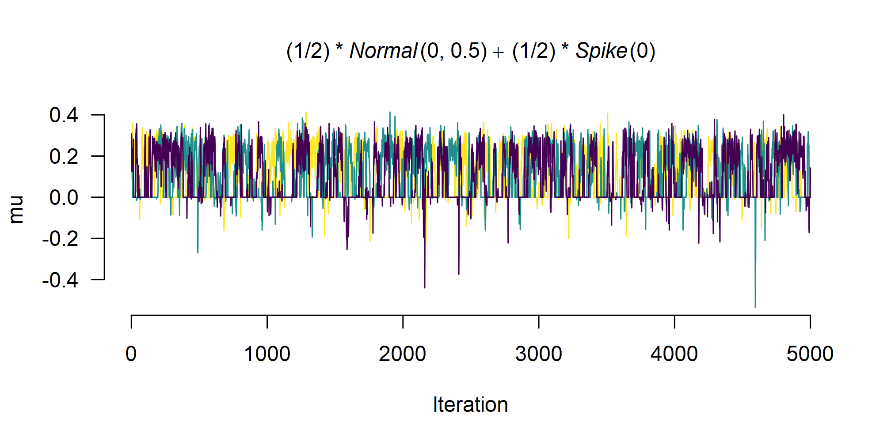
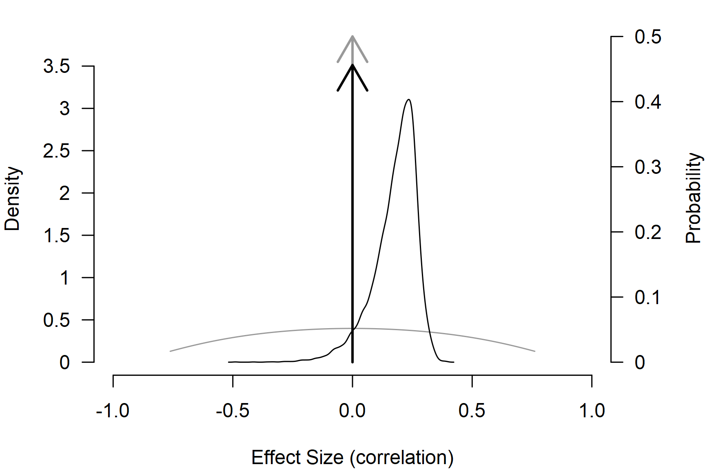

# Tutorial: Adjusting for Publication Bias in JASP and R - Selection Models, PET-PEESE, and Robust Bayesian Meta-Analysis

**This R markdown file accompanies the tutorial [Adjusting for
publication bias in JASP and R: Selection models, PET-PEESE, and robust
Bayesian meta-analysis](https://doi.org/10.1177/25152459221109259)
published in *Advances in Methods and Practices in Psychological
Science* ([Bartoš et al., 2022](#ref-bartos2020adjusting)).**

The following R-markdown file illustrates how to:

- Load a CSV file into R,
- Transform effect sizes,
- Perform a random effect meta-analysis,
- Adjust for publication bias with:
  - PET-PEESE ([Stanley, 2017](#ref-stanley2017limitations); [Stanley &
    Doucouliagos, 2014](#ref-stanley2014meta)),
  - Selection models ([Iyengar & Greenhouse,
    1988](#ref-iyengar1988selection); [Vevea & Hedges,
    1995](#ref-vevea1995general)),
  - Robust Bayesian meta-analysis (RoBMA) ([Bartoš et al.,
    2023](#ref-bartos2021no); [Maier et al.,
    2023](#ref-maier2020robust)).

See the full paper for additional details regarding the data set,
methods, and interpretation.

### Set-up

Before we start, we need to install `JAGS` (which is needed for
installation of the `RoBMA` R package) and the R packages that we use in
the analysis. Specifically, the `RoBMA`, `weightr`, and `metafor` R
packages.

JAGS can be downloaded from the [JAGS
website](https://sourceforge.net/projects/mcmc-jags/). Subsequently, we
install the R packages with the
[`install.packages()`](https://rdrr.io/r/utils/install.packages.html)
function.

``` r

install.packages(c("RoBMA", "weightr", "metafor"))
```

Once all of the packages are installed, we can load them into the
workspace with the [`library()`](https://rdrr.io/r/base/library.html)
function.

``` r

library("metafor")
library("weightr")
library("RoBMA")
```

### Lui (2015)

Lui ([2015](#ref-lui2015intergenerational)) studied how the
acculturation mismatch (AM) that is the result of the contrast between
the collectivist cultures of Asian and Latin immigrant groups and the
individualist culture in the United States correlates with
intergenerational cultural conflict (ICC). Lui
([2015](#ref-lui2015intergenerational)) meta-analyzed 18 independent
studies correlating AM with ICC. A standard reanalysis indicates a
significant effect of AM on increased ICC, r = 0.250, p \< .001.

#### Data manipulation

First, we load the Lui2015.csv file into R with the
[`read.csv()`](https://rdrr.io/r/utils/read.table.html) function and
inspect the first six data entries with the
[`head()`](https://rdrr.io/r/utils/head.html) function (the data set is
also included in the package and can be accessed via the
`data("Lui2015", package = "RoBMA")` call).

``` r

df <- read.csv(file = "Lui2015.csv")
```

``` r

head(df)
#>      r   n                   study
#> 1 0.21 115 Ahn, Kim, & Park (2008)
#> 2 0.29 283   Basanez et al. (2013)
#> 3 0.22  80         Bounkeua (2007)
#> 4 0.26 109        Hajizadeh (2009)
#> 5 0.23  61            Hamid (2007)
#> 6 0.54 107    Hwang & Wood (2009a)
```

We see that the data set contains three columns. The first column called
`r` contains the effect sizes coded as correlation coefficients, the
second column called `n` contains the sample sizes, and the third column
called `study` contains names of the individual studies.

We can access the individual variables using the data set name and the
dollar (`$`) sign followed by the name of the column. For example, we
can print all of the effect sizes with the `df$r` command.

``` r

df$r
#>  [1]  0.21  0.29  0.22  0.26  0.23  0.54  0.56  0.29  0.26  0.02 -0.06  0.38  0.25  0.08  0.17  0.33  0.36  0.13
```

The printed output shows that the data set contains mostly positive
effect sizes with the largest correlation coefficient r = 0.54.

#### Effect size transformations

Before we start analyzing the data, we transform the effect sizes from
correlation coefficients $`\rho`$ to Fisher’s *z*. Correlation
coefficients are not well suited for meta-analysis because (1) they are
bounded to a range (-1, 1) with non-linear increases near the boundaries
and (2) the standard error of the correlation coefficients is related to
the effect size. Fisher’s *z* transformation mitigates both issues. It
unwinds the (-1, 1) range to ($`-\infty`$, $`\infty`$), makes the
sampling distribution approximately normal, and breaks the dependency
between standard errors and effect sizes.

To apply the transformation, we use the
[`escalc()`](https://wviechtb.github.io/metafor/reference/escalc.html)
function from the `metafor` package. We pass the correlation
coefficients into the `ri` argument, the sample sizes to the `ni`
argument, and set `measure = "ZCOR"`. The function
[`escalc()`](https://wviechtb.github.io/metafor/reference/escalc.html)
then saves the transformed effect size estimates into a data frame
called `dfz`, where the `yi` column corresponds to Fisher’s *z*
transformation of the correlation coefficient and `vi` column
corresponds to the sampling variance of Fisher’s *z*.

``` r

dfz <- metafor::escalc(
  ri = r, ni = n, measure = "ZCOR",
  data = df
)
head(dfz)
#> 
#>      r   n                   study     yi     vi 
#> 1 0.21 115 Ahn, Kim, & Park (2008) 0.2132 0.0089 
#> 2 0.29 283   Basanez et al. (2013) 0.2986 0.0036 
#> 3 0.22  80         Bounkeua (2007) 0.2237 0.0130 
#> 4 0.26 109        Hajizadeh (2009) 0.2661 0.0094 
#> 5 0.23  61            Hamid (2007) 0.2342 0.0172 
#> 6 0.54 107    Hwang & Wood (2009a) 0.6042 0.0096
```

#### Re-analysis with random effect meta-analysis

We now estimate a random effect meta-analysis with the
[`rma()`](https://wviechtb.github.io/metafor/reference/rma.uni.html)
function imported from the `metafor` package ([Viechtbauer,
2010](#ref-metafor)) and verify that we arrive at the same results as
reported in the Lui ([2015](#ref-lui2015intergenerational)) paper. The
`yi` argument is used to pass the column name containing effect sizes,
the `vi` argument is used to pass the column name containing sampling
variances, and the `data` argument is used to pass the data frame
containing both variables.

``` r

fit_rma <- metafor::rma(yi = yi, vi = vi, data = dfz)
fit_rma
#> 
#> Random-Effects Model (k = 18; tau^2 estimator: REML)
#> 
#> tau^2 (estimated amount of total heterogeneity): 0.0229 (SE = 0.0107)
#> tau (square root of estimated tau^2 value):      0.1513
#> I^2 (total heterogeneity / total variability):   77.79%
#> H^2 (total variability / sampling variability):  4.50
#> 
#> Test for Heterogeneity:
#> Q(df = 17) = 73.5786, p-val < .0001
#> 
#> Model Results:
#> 
#> estimate      se    zval    pval   ci.lb   ci.ub      
#>   0.2538  0.0419  6.0568  <.0001  0.1717  0.3359  *** 
#> 
#> ---
#> Signif. codes:  0 '***' 0.001 '**' 0.01 '*' 0.05 '.' 0.1 ' ' 1
```

Indeed, we find that the effect size estimate from the random effect
meta-analysis corresponds to the one reported in Lui
([2015](#ref-lui2015intergenerational)). It is important to remember
that we used Fisher’s *z* to estimate the models; therefore, the
estimated results are on the Fisher’s *z* scale. To transform the effect
size estimate to the correlation coefficients, we can use
[`metafor::transf.ztor()`](https://wviechtb.github.io/metafor/reference/transf.html),

``` r

metafor::transf.ztor(fit_rma$b)
#>              [,1]
#> intrcpt 0.2484877
```

Transforming the effect size estimate results in the correlation
coefficient $`\rho`$ = 0.25.

### PET-PEESE

The first publication bias adjustment that we perform is PET-PEESE.
PET-PEESE adjusts for the relationship between effect sizes and standard
errors. To our knowledge, PET-PEESE is not currently implemented in any
R package. However, since PET and PEESE are weighted regressions of
effect sizes on standard errors (PET) or standard errors squared
(PEESE), we can estimate both PET and PEESE models with the
[`lm()`](https://rdrr.io/r/stats/lm.html) function. Inside the
[`lm()`](https://rdrr.io/r/stats/lm.html) function call, we specify that
`yi` is the response variable (left hand side of the `~` sign) and
`I(sqrt(vi))` is the predictor (the right-hand side). Furthermore, we
specify the `weights` argument that allows us to weight the
meta-regression by inverse variance and set the `data = dfz` argument,
which specifies that all of the variables come from the transformed,
`dfz`, data set.

``` r

fit_PET <- lm(yi ~ I(sqrt(vi)), weights = 1/vi, data = dfz)
summary(fit_PET)
#> 
#> Call:
#> lm(formula = yi ~ I(sqrt(vi)), data = dfz, weights = 1/vi)
#> 
#> Weighted Residuals:
#>     Min      1Q  Median      3Q     Max 
#> -3.8132 -0.9112 -0.0139  0.5166  3.3151 
#> 
#> Coefficients:
#>               Estimate Std. Error t value Pr(>|t|)  
#> (Intercept) -0.0008722  0.1081247  -0.008   0.9937  
#> I(sqrt(vi))  2.8549650  1.3593450   2.100   0.0519 .
#> ---
#> Signif. codes:  0 '***' 0.001 '**' 0.01 '*' 0.05 '.' 0.1 ' ' 1
#> 
#> Residual standard error: 1.899 on 16 degrees of freedom
#> Multiple R-squared:  0.2161, Adjusted R-squared:  0.1671 
#> F-statistic: 4.411 on 1 and 16 DF,  p-value: 0.05192
```

The [`summary()`](https://rdrr.io/r/base/summary.html) function allows
us to explore details of the fitted model. The `(Intercept)` coefficient
refers to the meta-analytic effect size (corrected for the correlation
with standard errors). Again, it is important to keep in mind that the
effect size estimate is on the Fisher’s *z* scale. We obtain the
estimate on correlation scale with the
[`metafor::transf.ztor()`](https://wviechtb.github.io/metafor/reference/transf.html)
function (we pass the estimated effect size using the
`summary(fit_PET)$coefficients["(Intercept)", "Estimate"]` command,
which extracts the estimate from the fitted model).

``` r

metafor::transf.ztor(summary(fit_PET)$coefficients["(Intercept)", "Estimate"])
#> [1] -0.000872208
```

Since the Fisher’s *z* transformation is almost linear around zero, we
obtain an almost identical estimate.

More importantly, since the test for the effect size with PET was not
significant at $`\alpha = .10`$, we interpret the PET model. However, if
the test for effect size were significant, we would fit and interpret
the PEESE model. The PEESE model can be fitted in an analogous way, by
replacing the predictor of standard errors with standard errors squared,
which corresponds to the sampling variances in `vi`.

``` r

fit_PEESE <- lm(yi ~ vi, weights = 1/vi, data = dfz)
summary(fit_PEESE)
#> 
#> Call:
#> lm(formula = yi ~ vi, data = dfz, weights = 1/vi)
#> 
#> Weighted Residuals:
#>     Min      1Q  Median      3Q     Max 
#> -3.7961 -0.9581 -0.1156  0.6718  3.4608 
#> 
#> Coefficients:
#>             Estimate Std. Error t value Pr(>|t|)  
#> (Intercept)  0.11498    0.06201   1.854   0.0822 .
#> vi          15.58064    7.96723   1.956   0.0682 .
#> ---
#> Signif. codes:  0 '***' 0.001 '**' 0.01 '*' 0.05 '.' 0.1 ' ' 1
#> 
#> Residual standard error: 1.927 on 16 degrees of freedom
#> Multiple R-squared:  0.1929, Adjusted R-squared:  0.1425 
#> F-statistic: 3.824 on 1 and 16 DF,  p-value: 0.06821
```

### Selection models

The second publication bias adjustment that we will perform is selection
models. Selection models adjust for the different publication
probabilities in different *p*-value intervals. Selection models are
implemented in the `weightr` package
([`weightfunct()`](https://rdrr.io/pkg/weightr/man/weightfunct.html)
function; Coburn et al. ([2019](#ref-weightr))) and newly also in the
`metafor` package
([`selmodel()`](https://wviechtb.github.io/metafor/reference/selmodel.html)
function; Viechtbauer ([2010](#ref-metafor))). First, we use the
`weightr` implementation and fit the “4PSM” selection model that
specifies three distinct *p*-value intervals: (1) covering the range of
significant *p*-values for effect sizes in the expected direction
(0.00-0.025), (2) covering the range of “marginally” significant
*p*-values for effect sizes in the expected direction (0.025-0.05), and
(3) covering the range of non-significant *p*-values (0.05-1). We use
the Fisher’s *z* effect sizes from `dfz`. To fit the model, we need to
pass the effect sizes (`dfz$yi`) into the `effect` argument and
variances (`dfz$vi`) into the `v` argument (note that we need to pass
the vector of values directly since the
[`weightfunct()`](https://rdrr.io/pkg/weightr/man/weightfunct.html)
function does not allow us to pass the data frame directly as did the
previous functions). We further set `steps = c(0.025, 0.05)` to specify
the appropriate cut-points (note that the steps correspond to one-sided
*p*-values), and we set `table = TRUE` to obtain the frequency of *p*
values in each of the specified intervals.

``` r

fit_4PSM <- weightr::weightfunct(
  effect = dfz$yi, v = dfz$vi,
  steps = c(0.025, 0.05), table = TRUE
)
fit_4PSM
#> 
#> Unadjusted Model (k = 18):
#> 
#> tau^2 (estimated amount of total heterogeneity): 0.0212 (SE = 0.0097)
#> tau (square root of estimated tau^2 value):  0.1456
#> 
#> Test for Heterogeneity:
#> Q(df = 17) = 73.5786, p-val = 1.110454e-08
#> 
#> Model Results:
#> 
#>           estimate std.error z-stat      p-val ci.lb  ci.ub
#> Intercept   0.2532   0.04092  6.188 6.1076e-10 0.173 0.3334
#> 
#> Adjusted Model (k = 18):
#> 
#> tau^2 (estimated amount of total heterogeneity): 0.0302 (SE = 0.0161)
#> tau (square root of estimated tau^2 value):  0.1737
#> 
#> Test for Heterogeneity:
#> Q(df = 17) = 73.5786, p-val = 1.110454e-08
#> 
#> Model Results:
#> 
#>                  estimate std.error z-stat   p-val    ci.lb  ci.ub
#> Intercept          0.1574   0.09582 1.6430 0.10039 -0.03037 0.3452
#> 0.025 < p < 0.05   1.1843   0.99195 1.1939 0.23251 -0.75988 3.1285
#> 0.05 < p < 1       0.2059   0.21253 0.9688 0.33263 -0.21065 0.6225
#> 
#> Likelihood Ratio Test:
#> X^2(df = 2) = 3.387474, p-val = 0.18383
#> 
#> Number of Effect Sizes per Interval:
#> 
#>                         Frequency
#> p-values <0.025                13
#> 0.025 < p-values < 0.05         2
#> 0.05 < p-values < 1             3
```

Note the warning message informing us about the fact that our data do
not contain a sufficient number of *p*-values in one of the *p*-value
intervals. The model output obtained by printing the fitted model object
`fit_4PSM` shows that there is only one *p*-value in the (0.025, 0.05)
interval. We can deal with this issue by joining the “marginally”
significant and non-significant *p*-value interval, resulting in the
“3PSM” model.

``` r

fit_3PSM <- weightr::weightfunct(
  effect = dfz$yi, v = dfz$vi,
  steps = c(0.025), table = TRUE
)
fit_3PSM
#> 
#> Unadjusted Model (k = 18):
#> 
#> tau^2 (estimated amount of total heterogeneity): 0.0212 (SE = 0.0097)
#> tau (square root of estimated tau^2 value):  0.1456
#> 
#> Test for Heterogeneity:
#> Q(df = 17) = 73.5786, p-val = 1.110454e-08
#> 
#> Model Results:
#> 
#>           estimate std.error z-stat      p-val ci.lb  ci.ub
#> Intercept   0.2532   0.04092  6.188 6.1076e-10 0.173 0.3334
#> 
#> Adjusted Model (k = 18):
#> 
#> tau^2 (estimated amount of total heterogeneity): 0.0237 (SE = 0.0115)
#> tau (square root of estimated tau^2 value):  0.1539
#> 
#> Test for Heterogeneity:
#> Q(df = 17) = 73.5786, p-val = 1.110454e-08
#> 
#> Model Results:
#> 
#>               estimate std.error z-stat     p-val    ci.lb  ci.ub
#> Intercept       0.2066   0.06948  2.974 0.0029393  0.07046 0.3428
#> 0.025 < p < 1   0.4643   0.38263  1.214 0.2249190 -0.28560 1.2143
#> 
#> Likelihood Ratio Test:
#> X^2(df = 1) = 0.8963672, p-val = 0.34376
#> 
#> Number of Effect Sizes per Interval:
#> 
#>                      Frequency
#> p-values <0.025             13
#> 0.025 < p-values < 1         5
```

The new model does not suffer from the estimation problem due to the
limited number of *p*-values in the intervals, so we can now interpret
the results with more confidence. First, we check the test for
heterogeneity that clearly rejects the null hypothesis
`Q(df = 17) = 75.4999, $p$ = 5.188348e-09` (if we did not find evidence
for heterogeneity, we could have proceeded by fitting the fixed-effect
version of the model by specifying the `fe = TRUE` argument). We follow
by checking the test for publication bias which is a likelihood ratio
test comparing the unadjusted and adjusted estimate
`X^2(df = 1) = 3.107176, $p$ = 0.077948`. The result of the test is
slightly ambiguous: we would reject the null hypothesis of no
publication bias with $`\alpha = 0.10`$ but not with $`\alpha = 0.05`$.

If we decide to interpret the estimated effect size, we have to again
transform it back to the correlation scale. The effect size estimate
corresponds to the second value in the `fit_3PSM$adj_est` object for the
random effect model.

``` r

metafor::transf.ztor(fit_3PSM$adj_est[2])
#> [1] 0.2037403
```

Alternatively, we could have conducted the analysis analogously but with
the `metafor` package. We use the random effect meta-analysis object
from above and specify the `type = "stepfun"` argument to obtain a step
weight function and set the appropriate steps with the
`steps = c(0.025)` argument.

``` r

fit_sel_z <- metafor::selmodel(fit_rma, type = "stepfun", steps = c(0.025))
fit_sel_z
#> 
#> Random-Effects Model (k = 18; tau^2 estimator: ML)
#> 
#> tau^2 (estimated amount of total heterogeneity): 0.0237 (SE = 0.0115)
#> tau (square root of estimated tau^2 value):      0.1538
#> 
#> Test for Heterogeneity:
#> LRT(df = 1) = 31.9928, p-val < .0001
#> 
#> Model Results:
#> 
#> estimate      se    zval    pval   ci.lb   ci.ub     
#>   0.2067  0.0695  2.9755  0.0029  0.0705  0.3428  ** 
#> 
#> Test for Selection Model Parameters:
#> LRT(df = 1) = 0.8964, p-val = 0.3438
#> 
#> Selection Model Results:
#> 
#>                      k  estimate      se     zval    pval   ci.lb   ci.ub    
#> 0     < p <= 0.025  13    1.0000     ---      ---     ---     ---     ---    
#> 0.025 < p <= 1       5    0.4645  0.3828  -1.3987  0.1619  0.0000  1.2149    
#> 
#> ---
#> Signif. codes:  0 '***' 0.001 '**' 0.01 '*' 0.05 '.' 0.1 ' ' 1
```

The output verifies the results obtained in the previous analysis.

### Robust Bayesian meta-analysis

The third and final publication bias adjustment that we will perform is
robust Bayesian meta-analysis (RoBMA). RoBMA uses Bayesian
model-averaging to combine inference from both PET-PEESE and selection
models. We use the `RoBMA` R package (and the
[`RoBMA()`](https://fbartos.github.io/RoBMA/reference/RoBMA.md)
function; Bartoš & Maier ([2020](#ref-RoBMA))) to fit the 36-model
ensemble based on an orthogonal combination of models assuming the
presence and absence of the effect size, heterogeneity, and publication
bias. The models assuming the presence of publication bias are further
split into six weight function models and models utilizing the PET and
PEESE publication bias adjustment. To fit the model, we pass the
Fisher’s *z* effect sizes and sampling variances into the `yi` and `vi`
arguments and set `measure = "ZCOR"`. We use the `seed` argument to make
the analysis reproducible (it uses MCMC sampling, in contrast to the
previous methods). We turn on parallel estimation by setting the
`parallel = TRUE` argument; if parallel processing fails, try rerunning
the model or turning parallel processing off.

The default prior distributions and estimation algorithm changed after
version 3.6.1, so we specify the prior distributions explicitly.

``` r

prior_effect_361        <- prior("normal", list(mean = 0, sd = 0.5))
prior_heterogeneity_361 <- prior("invgamma", list(shape = 1, scale = 0.075))
prior_bias_361          <- list(
  prior_weightfunction("two-sided", c(0.05),             wf_cumulative(c(1, 1)),       prior_weights = 1/12),
  prior_weightfunction("two-sided", c(0.05, 0.10),       wf_cumulative(c(1, 1, 1)),    prior_weights = 1/12),
  prior_weightfunction("one-sided", c(0.05),             wf_cumulative(c(1, 1)),       prior_weights = 1/12),
  prior_weightfunction("one-sided", c(0.025, 0.05),      wf_cumulative(c(1, 1, 1)),    prior_weights = 1/12),
  prior_weightfunction("one-sided", c(0.05, 0.50),       wf_cumulative(c(1, 1, 1)),    prior_weights = 1/12),
  prior_weightfunction("one-sided", c(0.025, 0.05, 0.50), wf_cumulative(c(1, 1, 1, 1)), prior_weights = 1/12),
  prior_PET("Cauchy",   list(location = 0, scale = 1),  truncation = list(0, Inf), prior_weights = 1/4),
  prior_PEESE("Cauchy", list(location = 0, scale = 10), truncation = list(0, Inf), prior_weights = 1/4)
)
```

These prior distributions reproduce the version 3.6.1 specification
after the old approximate Cohen’s *d* to Fisher’s *z* prior rescaling.
On the Cohen’s *d* scale, the effect prior was Normal(0, 1), the
heterogeneity prior was InvGamma(1, 0.15), and the PEESE prior scale was
5.

``` r

fit_RoBMA <- RoBMA(
  yi = yi, vi = vi, measure = "ZCOR",
  prior_effect                 = prior_effect_361,
  prior_heterogeneity          = prior_heterogeneity_361,
  prior_bias                   = prior_bias_361,
  data = dfz, seed = 1, parallel = TRUE
)
```

This step used to take some time depending on your CPU. The 4.0 version
of the package uses product-space parameterization, which notably speeds
up the sampling and usually takes under a minute for moderately large
datasets.

We use the [`summary()`](https://rdrr.io/r/base/summary.html) function
to explore details of the fitted model.

``` r

summary(fit_RoBMA)
#> 
#> Robust Bayesian Model-Averaged Random-Effects Model (k = 18)
#> 
#> Component Inclusion
#>                  Prior prob. Post. prob. Inclusion BF error%(Inclusion BF)
#> Effect                 0.500       0.544        1.192                8.035
#> Heterogeneity          0.500       1.000   >14999.000                   NA
#> Publication Bias       0.500       0.839        5.193                6.826
#> 
#> Estimates
#>      Mean    SD  0.025   0.5 0.975 error(MCMC) error(MCMC)/SD  ESS R-hat
#> mu  0.098 0.113 -0.007 0.039 0.300     0.00479          0.042  560 1.002
#> tau 0.166 0.057  0.085 0.156 0.300     0.00157          0.028 1460 1.002
#> 
#> Publication Bias
#>                    Mean    SD 0.025   0.5  0.975 error(MCMC) error(MCMC)/SD  ESS R-hat
#> omega[0,0.025]    1.000 0.000 1.000 1.000  1.000          NA             NA   NA    NA
#> omega[0.025,0.05] 0.929 0.164 0.400 1.000  1.000     0.00267          0.016 4078 1.004
#> omega[0.05,0.5]   0.724 0.366 0.058 1.000  1.000     0.00985          0.027 1478 1.005
#> omega[0.5,0.95]   0.679 0.410 0.026 1.000  1.000     0.01142          0.028 1414 1.005
#> omega[0.95,0.975] 0.685 0.408 0.026 1.000  1.000     0.01149          0.028 1387 1.005
#> omega[0.975,1]    0.696 0.410 0.026 1.000  1.000     0.01150          0.028 1392 1.005
#> PET               0.820 1.232 0.000 0.000  3.331     0.05421          0.044  551 1.003
#> PEESE             1.194 4.682 0.000 0.000 19.863     0.08932          0.019 2614 1.084
#> P-value intervals for publication bias weights omega correspond to one-sided p-values.
```

The printed output consists of three parts. The first table called
`Component Inclusion` contains information about the fitted models. The
second column summarizes the prior model probabilities of the models
assuming the presence of the individual components. The third column
contains information about the posterior probability of models assuming
the presence of the components; we can observe that the posterior model
probabilities of models assuming the presence of an effect slightly
increased. The last column contains information about the evidence in
favor of the presence of any of those components. Evidence for the
presence of an effect is undecided; the models assuming the presence of
an effect are only ~1.2 times more likely given the data than the models
assuming the absence of an effect. However, we find overwhelming
evidence in favor of heterogeneity, with the models assuming the
presence of heterogeneity being more than 10,000 times more likely given
the data than models assuming the absence of heterogeneity, and moderate
evidence in favor of publication bias.

The second table called `Estimates` contains information about the
model-averaged estimates. The first row labeled `mu` corresponds to the
model-averaged effect size estimate on Fisher’s *z* scale and the second
row labeled `tau` corresponds to the model-averaged heterogeneity
estimates. Below are the estimated model-averaged weights for the
different *p*-value intervals and the PET and PEESE regression
coefficients. We obtain the effect size estimate on the correlation
scale with
[`pooled_effect()`](https://fbartos.github.io/RoBMA/reference/pooled_effect.md).

``` r

pooled_effect(fit_RoBMA, output_measure = "COR")
#> 
#> Pooled Effect Size (correlation)
#>     Mean Median  0.025 0.975
#> mu 0.096  0.039 -0.007 0.291
#> Effect estimates are transformed from Fisher's z to correlation.
```

Now, we have obtained the model-averaged effect size estimate on the
correlation scale. If we were interested in estimates model-averaged
only across the models assuming the presence of an effect,
heterogeneity, and publication bias, we could add the
`conditional = TRUE` argument to the
[`summary()`](https://rdrr.io/r/base/summary.html) function.

``` r

summary(fit_RoBMA, conditional = TRUE)
#> 
#> Robust Bayesian Model-Averaged Random-Effects Model (k = 18)
#> 
#> Component Inclusion
#>                  Prior prob. Post. prob. Inclusion BF error%(Inclusion BF)
#> Effect                 0.500       0.544        1.192                8.035
#> Heterogeneity          0.500       1.000   >14999.000                   NA
#> Publication Bias       0.500       0.839        5.193                6.826
#> 
#> Estimates
#>      Mean    SD  0.025   0.5 0.975 error(MCMC) error(MCMC)/SD  ESS R-hat
#> mu  0.098 0.113 -0.007 0.039 0.300     0.00479          0.042  560 1.002
#> tau 0.166 0.057  0.085 0.156 0.300     0.00157          0.028 1460 1.002
#> 
#> Conditional Estimates
#>      Mean    SD  0.025   0.5 0.975
#> mu  0.180 0.094 -0.052 0.199 0.316
#> tau 0.166 0.057  0.085 0.156 0.300
#> 
#> Publication Bias
#>                    Mean    SD 0.025   0.5  0.975 error(MCMC) error(MCMC)/SD  ESS R-hat
#> omega[0,0.025]    1.000 0.000 1.000 1.000  1.000          NA             NA   NA    NA
#> omega[0.025,0.05] 0.929 0.164 0.400 1.000  1.000     0.00267          0.016 4078 1.004
#> omega[0.05,0.5]   0.724 0.366 0.058 1.000  1.000     0.00985          0.027 1478 1.005
#> omega[0.5,0.95]   0.679 0.410 0.026 1.000  1.000     0.01142          0.028 1414 1.005
#> omega[0.95,0.975] 0.685 0.408 0.026 1.000  1.000     0.01149          0.028 1387 1.005
#> omega[0.975,1]    0.696 0.410 0.026 1.000  1.000     0.01150          0.028 1392 1.005
#> PET               0.820 1.232 0.000 0.000  3.331     0.05421          0.044  551 1.003
#> PEESE             1.194 4.682 0.000 0.000 19.863     0.08932          0.019 2614 1.084
#> P-value intervals for publication bias weights omega correspond to one-sided p-values.
#> 
#> Conditional Publication Bias
#>                     Mean    SD 0.025    0.5  0.975
#> omega[0,0.025]     1.000 0.000 1.000  1.000  1.000
#> omega[0.025,0.05]  0.824 0.219 0.301  0.930  1.000
#> omega[0.05,0.5]    0.317 0.231 0.038  0.257  0.881
#> omega[0.5,0.95]    0.207 0.203 0.016  0.130  0.797
#> omega[0.95,0.975]  0.222 0.228 0.016  0.131  0.884
#> omega[0.975,1]     0.249 0.283 0.016  0.131  1.000
#> PET                2.340 0.881 0.234  2.557  3.609
#> PEESE             14.307 8.665 1.077 13.022 30.374
#> P-value intervals for publication bias weights omega correspond to one-sided p-values.
```

We can also obtain summary information about the individual models with
[`summary_models()`](https://fbartos.github.io/RoBMA/reference/summary_models.md).
The resulting table shows the prior and posterior model probabilities
and inclusion Bayes factors for the individual models.

``` r

summary_models(fit_RoBMA, type = "individual")
#> 
#> Individual Models
#>  Effect         Heterogeneity     Publication Bias                Prior prob. Post. prob. Inclusion BF error%(Inclusion BF)
#>  Spike(0)       Spike(0)          None                                  0.125       0.000        0.000                   NA
#>  Normal(0, 0.5) Spike(0)          None                                  0.125       0.000        0.000                   NA
#>  Spike(0)       InvGamma(1, 0.07) None                                  0.125       0.000        0.000                   NA
#>  Normal(0, 0.5) InvGamma(1, 0.07) None                                  0.125       0.161        1.348                6.826
#>  Spike(0)       Spike(0)          omega[two-sided: .05]                 0.010       0.000        0.000                   NA
#>  Normal(0, 0.5) Spike(0)          omega[two-sided: .05]                 0.010       0.000        0.000                   NA
#>  Spike(0)       InvGamma(1, 0.07) omega[two-sided: .05]                 0.010       0.000        0.000                   NA
#>  Normal(0, 0.5) InvGamma(1, 0.07) omega[two-sided: .05]                 0.010       0.013        1.258                8.325
#>  Spike(0)       Spike(0)          omega[two-sided: .05, .1]             0.010       0.000        0.000                   NA
#>  Normal(0, 0.5) Spike(0)          omega[two-sided: .05, .1]             0.010       0.000        0.000                   NA
#>  Spike(0)       InvGamma(1, 0.07) omega[two-sided: .05, .1]             0.010       0.000        0.000                   NA
#>  Normal(0, 0.5) InvGamma(1, 0.07) omega[two-sided: .05, .1]             0.010       0.020        1.919                7.333
#>  Spike(0)       Spike(0)          omega[one-sided: .05]                 0.010       0.000        0.000                   NA
#>  Normal(0, 0.5) Spike(0)          omega[one-sided: .05]                 0.010       0.000        0.000                   NA
#>  Spike(0)       InvGamma(1, 0.07) omega[one-sided: .05]                 0.010       0.034        3.364               10.331
#>  Normal(0, 0.5) InvGamma(1, 0.07) omega[one-sided: .05]                 0.010       0.049        4.944                5.385
#>  Spike(0)       Spike(0)          omega[one-sided: .025, .05]           0.010       0.000        0.000                   NA
#>  Normal(0, 0.5) Spike(0)          omega[one-sided: .025, .05]           0.010       0.000        0.000                   NA
#>  Spike(0)       InvGamma(1, 0.07) omega[one-sided: .025, .05]           0.010       0.046        4.539                9.147
#>  Normal(0, 0.5) InvGamma(1, 0.07) omega[one-sided: .025, .05]           0.010       0.044        4.414                5.362
#>  Spike(0)       Spike(0)          omega[one-sided: .05, .5]             0.010       0.000        0.000                   NA
#>  Normal(0, 0.5) Spike(0)          omega[one-sided: .05, .5]             0.010       0.000        0.000                   NA
#>  Spike(0)       InvGamma(1, 0.07) omega[one-sided: .05, .5]             0.010       0.042        4.172               10.041
#>  Normal(0, 0.5) InvGamma(1, 0.07) omega[one-sided: .05, .5]             0.010       0.044        4.352                5.399
#>  Spike(0)       Spike(0)          omega[one-sided: .025, .05, .5]       0.010       0.000        0.000                   NA
#>  Normal(0, 0.5) Spike(0)          omega[one-sided: .025, .05, .5]       0.010       0.000        0.000                   NA
#>  Spike(0)       InvGamma(1, 0.07) omega[one-sided: .025, .05, .5]       0.010       0.066        6.720                8.382
#>  Normal(0, 0.5) InvGamma(1, 0.07) omega[one-sided: .025, .05, .5]       0.010       0.046        4.581                5.185
#>  Spike(0)       Spike(0)          PET                                   0.031       0.000        0.000                   NA
#>  Normal(0, 0.5) Spike(0)          PET                                   0.031       0.000        0.000                   NA
#>  Spike(0)       InvGamma(1, 0.07) PET                                   0.031       0.242        9.919                9.488
#>  Normal(0, 0.5) InvGamma(1, 0.07) PET                                   0.031       0.108        3.761                4.979
#>  Spike(0)       Spike(0)          PEESE                                 0.031       0.000        0.000                   NA
#>  Normal(0, 0.5) Spike(0)          PEESE                                 0.031       0.000        0.000                   NA
#>  Spike(0)       InvGamma(1, 0.07) PEESE                                 0.031       0.026        0.821               11.822
#>  Normal(0, 0.5) InvGamma(1, 0.07) PEESE                                 0.031       0.058        1.897                7.284
```

MCMC diagnostics are included in the summary output. Visual diagnostics
can be requested with
[`plot_diagnostic_trace()`](https://fbartos.github.io/RoBMA/reference/plot_diagnostic.md),
[`plot_diagnostic_density()`](https://fbartos.github.io/RoBMA/reference/plot_diagnostic.md),
and
[`plot_diagnostic_autocorrelation()`](https://fbartos.github.io/RoBMA/reference/plot_diagnostic.md).

``` r

plot_diagnostic_trace(fit_RoBMA, parameter = "mu")
```



Finally, we can also plot the model-averaged posterior distribution with
the [`plot()`](https://rdrr.io/r/graphics/plot.default.html) function.
We set the `prior = TRUE` argument to include the prior distribution as
a grey line (and arrow for the point density at zero) and
`output_measure = "COR"` to transform the posterior distribution to the
correlation scale. (The `par(mar = c(4, 4, 1, 4))` call increases the
left margin of the figure, so the secondary y-axis text is not cut off.)

``` r

par(mar = c(4, 4, 1, 4))
plot(fit_RoBMA, parameter = "mu", prior = TRUE, output_measure = "COR", xlim = c(-1, 1))
```



#### Specifying Different Prior Distributions

The `RoBMA` R package allows us to fit ensembles of highly customized
meta-analytic models. Here we reproduce the ensemble for the perinull
directional hypothesis test from the Appendix (see the R package
vignettes for more examples and details). We explicitly specify the
prior distribution for the models assuming the presence of the effect
with the `prior_effect` argument, which assigns a Normal(0.30, 0.10)
distribution bounded to positive values to the $`\mu`$ parameter on the
Fisher’s *z* scale. Similarly, we replace the default prior distribution
for the models assuming absence of the effect with a perinull hypothesis
with the `prior_effect_null` argument.

``` r

prior_effect_perinull_361      <- prior("normal", list(mean = 0.30, sd = 0.10), truncation = list(0, Inf))
prior_effect_null_perinull_361 <- prior("normal", list(mean = 0, sd = 0.05))
```

On the Cohen’s *d* scale, these correspond to the version 3.6.1 Appendix
prior distributions Normal(0.60, 0.20) truncated to positive values and
Normal(0, 0.10).

``` r

fit_RoBMA2 <- RoBMA(
  yi = yi, vi = vi, measure = "ZCOR",
  prior_effect                 = prior_effect_perinull_361,
  prior_effect_null            = prior_effect_null_perinull_361,
  prior_heterogeneity          = prior_heterogeneity_361,
  prior_bias                   = prior_bias_361,
  data = dfz, seed = 2, parallel = TRUE
)
```

As previously, we can use
[`summary_models()`](https://fbartos.github.io/RoBMA/reference/summary_models.md)
to inspect the model fit and verify that the specified models correspond
to the settings.

``` r

summary_models(fit_RoBMA2, type = "individual")
#> 
#> Individual Models
#>  Effect                   Heterogeneity     Publication Bias                Prior prob. Post. prob. Inclusion BF error%(Inclusion BF)
#>  Normal(0, 0.05)          Spike(0)          None                                  0.125       0.000        0.000                   NA
#>  Normal(0.3, 0.1)[0, Inf] Spike(0)          None                                  0.125       0.000        0.000                   NA
#>  Normal(0, 0.05)          InvGamma(1, 0.07) None                                  0.125       0.001        0.004               43.714
#>  Normal(0.3, 0.1)[0, Inf] InvGamma(1, 0.07) None                                  0.125       0.335        3.529                3.941
#>  Normal(0, 0.05)          Spike(0)          omega[two-sided: .05]                 0.010       0.000        0.000                   NA
#>  Normal(0.3, 0.1)[0, Inf] Spike(0)          omega[two-sided: .05]                 0.010       0.000        0.000                   NA
#>  Normal(0, 0.05)          InvGamma(1, 0.07) omega[two-sided: .05]                 0.010       0.000        0.019               57.735
#>  Normal(0.3, 0.1)[0, Inf] InvGamma(1, 0.07) omega[two-sided: .05]                 0.010       0.020        1.965                6.890
#>  Normal(0, 0.05)          Spike(0)          omega[two-sided: .05, .1]             0.010       0.000        0.000                   NA
#>  Normal(0.3, 0.1)[0, Inf] Spike(0)          omega[two-sided: .05, .1]             0.010       0.000        0.000                   NA
#>  Normal(0, 0.05)          InvGamma(1, 0.07) omega[two-sided: .05, .1]             0.010       0.001        0.089               26.739
#>  Normal(0.3, 0.1)[0, Inf] InvGamma(1, 0.07) omega[two-sided: .05, .1]             0.010       0.029        2.797                5.445
#>  Normal(0, 0.05)          Spike(0)          omega[one-sided: .05]                 0.010       0.000        0.000                   NA
#>  Normal(0.3, 0.1)[0, Inf] Spike(0)          omega[one-sided: .05]                 0.010       0.000        0.000                   NA
#>  Normal(0, 0.05)          InvGamma(1, 0.07) omega[one-sided: .05]                 0.010       0.020        1.926               10.985
#>  Normal(0.3, 0.1)[0, Inf] InvGamma(1, 0.07) omega[one-sided: .05]                 0.010       0.061        6.207                3.910
#>  Normal(0, 0.05)          Spike(0)          omega[one-sided: .025, .05]           0.010       0.000        0.000                   NA
#>  Normal(0.3, 0.1)[0, Inf] Spike(0)          omega[one-sided: .025, .05]           0.010       0.000        0.000                   NA
#>  Normal(0, 0.05)          InvGamma(1, 0.07) omega[one-sided: .025, .05]           0.010       0.023        2.250                9.523
#>  Normal(0.3, 0.1)[0, Inf] InvGamma(1, 0.07) omega[one-sided: .025, .05]           0.010       0.048        4.748                4.417
#>  Normal(0, 0.05)          Spike(0)          omega[one-sided: .05, .5]             0.010       0.000        0.000                   NA
#>  Normal(0.3, 0.1)[0, Inf] Spike(0)          omega[one-sided: .05, .5]             0.010       0.000        0.000                   NA
#>  Normal(0, 0.05)          InvGamma(1, 0.07) omega[one-sided: .05, .5]             0.010       0.023        2.243               11.087
#>  Normal(0.3, 0.1)[0, Inf] InvGamma(1, 0.07) omega[one-sided: .05, .5]             0.010       0.054        5.387                4.043
#>  Normal(0, 0.05)          Spike(0)          omega[one-sided: .025, .05, .5]       0.010       0.000        0.000                   NA
#>  Normal(0.3, 0.1)[0, Inf] Spike(0)          omega[one-sided: .025, .05, .5]       0.010       0.000        0.000                   NA
#>  Normal(0, 0.05)          InvGamma(1, 0.07) omega[one-sided: .025, .05, .5]       0.010       0.032        3.093                9.838
#>  Normal(0.3, 0.1)[0, Inf] InvGamma(1, 0.07) omega[one-sided: .025, .05, .5]       0.010       0.043        4.303                4.545
#>  Normal(0, 0.05)          Spike(0)          PET                                   0.031       0.000        0.000                   NA
#>  Normal(0.3, 0.1)[0, Inf] Spike(0)          PET                                   0.031       0.000        0.000                   NA
#>  Normal(0, 0.05)          InvGamma(1, 0.07) PET                                   0.031       0.103        3.572               13.580
#>  Normal(0.3, 0.1)[0, Inf] InvGamma(1, 0.07) PET                                   0.031       0.076        2.559                4.542
#>  Normal(0, 0.05)          Spike(0)          PEESE                                 0.031       0.000        0.000                   NA
#>  Normal(0.3, 0.1)[0, Inf] Spike(0)          PEESE                                 0.031       0.000        0.000                   NA
#>  Normal(0, 0.05)          InvGamma(1, 0.07) PEESE                                 0.031       0.031        0.981               11.427
#>  Normal(0.3, 0.1)[0, Inf] InvGamma(1, 0.07) PEESE                                 0.031       0.100        3.462                3.999
```

### References

Bartoš, F., & Maier, M. (2020). *RoBMA: An R package for robust Bayesian
meta-analyses*. <https://CRAN.R-project.org/package=RoBMA>

Bartoš, F., Maier, M., Quintana, D. S., & Wagenmakers, E.-J. (2022).
Adjusting for publication bias in JASP and R — Selection models,
PET-PEESE, and robust Bayesian meta-analysis. *Advances in Methods and
Practices in Psychological Science*, *5*(3), 1–19.
<https://doi.org/10.1177/25152459221109259>

Bartoš, F., Maier, M., Wagenmakers, E.-J., Doucouliagos, H., & Stanley,
T. D. (2023). Robust Bayesian meta-analysis: Model-averaging across
complementary publication bias adjustment methods. *Research Synthesis
Methods*, *14*(1), 99–116. <https://doi.org/10.1002/jrsm.1594>

Coburn, K. M., Vevea, J. L., & Coburn, M. K. M. (2019). weightr:
Estimating weight-function models for publication bias.
*Https://CRAN.R-Project.org/Package=weightr*.

Iyengar, S., & Greenhouse, J. B. (1988). Selection models and the file
drawer problem. *Statistical Science*, *3*(1), 109–117.
<https://doi.org/10.1214/ss/1177013012>

Lui, P. P. (2015). Intergenerational cultural conflict, mental health,
and educational outcomes among Asian and Latino/a Americans: Qualitative
and meta-analytic review. *Psychological Bulletin*, *141*(2), 404–446.
<https://doi.org/10.1037/a0038449>

Maier, M., Bartoš, F., & Wagenmakers, E.-J. (2023). Robust Bayesian
meta-analysis: Addressing publication bias with model-averaging.
*Psychological Methods*, *28*(1), 107–122.
<https://doi.org/10.1037/met0000405>

Stanley, T. D. (2017). Limitations of PET-PEESE and other meta-analysis
methods. *Social Psychological and Personality Science*, *8*(5),
581–591. <https://doi.org/10.1177/1948550617693062>

Stanley, T. D., & Doucouliagos, H. (2014). Meta-regression
approximations to reduce publication selection bias. *Research Synthesis
Methods*, *5*(1), 60–78. <https://doi.org/10.1002/jrsm.1095>

Vevea, J. L., & Hedges, L. V. (1995). A general linear model for
estimating effect size in the presence of publication bias.
*Psychometrika*, *60*(3), 419–435. <https://doi.org/10.1007/BF02294384>

Viechtbauer, W. (2010). Conducting meta-analyses in R with the metafor
package. *Journal of Statistical Software*, *36*(3), 1–48.
<https://doi.org/10.18637/jss.v036.i03>
