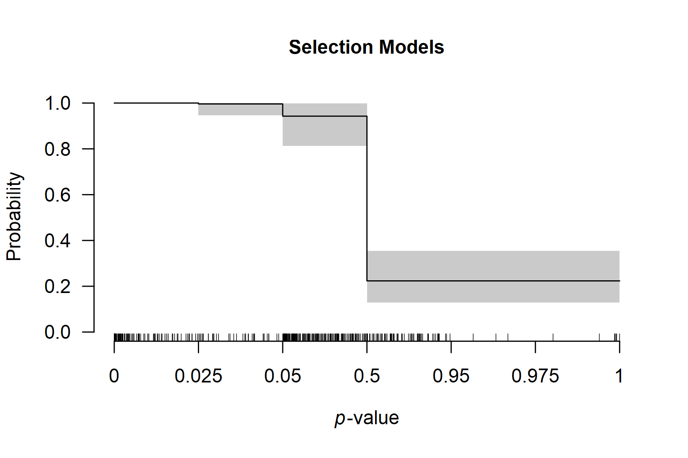

# Multilevel Robust Bayesian Meta-Analysis

**This vignette accompanies the manuscript [Robust Bayesian Multilevel
Meta-Analysis: Adjusting for Publication Bias in the Presence of
Dependent Effect Sizes](https://doi.org/10.31234/osf.io/9tgp2_v1)
preprinted at *PsyArXiv* ([Bartoš et al.,
2026](#ref-bartos2025robust)).**

This vignette reproduces the first example from the manuscript. For
multilevel meta-regression with moderators, see the [*Multilevel Robust
Bayesian Model-Averaged
Meta-Regression*](https://fbartos.github.io/RoBMA/articles/v33-robma-multilevel-metaregression.md)
vignette.

Multilevel Robust Bayesian Meta-Analysis (RoBMA) extends the standard
RoBMA framework to datasets containing multiple effect sizes from the
same studies. We demonstrate the method using data from Johnides et al.
([2025](#ref-johnides2025secondary)), who meta-analyzed 412 effect sizes
from 128 studies investigating secondary benefits of family-based
treatments for childhood disorders.

## When to Use Multilevel RoBMA

Multilevel RoBMA is appropriate for datasets that contain multiple
effect sizes from the same studies. The multilevel approach explicitly
models the clustering structure through the `cluster` argument, which:

- accounts for dependencies among effect sizes from the same study,
- partitions heterogeneity into within-study and between-study
  components,
- simultaneously adjusts for publication bias at the study level
  (corresponding to selective reporting).

## Loading the Data

We load the package and examine the dataset structure.

``` r

library(RoBMA)
data("Johnides2025", package = "RoBMA")
```

The dataset contains effect sizes (`d`), standard errors (`se`), and
study identifiers (`study`).

``` r

head(Johnides2025)
#>                 study       d        se
#> 1 Price et al. (2012)  0.0000 0.1337909
#> 2 Price et al. (2012) -0.1250 0.1337909
#> 3 Price et al. (2012)  0.0000 0.1337909
#> 4 Price et al. (2012)  0.2112 0.1337909
#> 5 Price et al. (2012)  0.0140 0.1337909
#> 6 Price et al. (2012) -0.0186 0.1337909
```

Multiple rows share the same study name, indicating that these effect
sizes come from the same study. For example, the first five effect sizes
are from “Price et al. (2012)” and might be more similar to each other
than to effect sizes from other studies.

## Prior Distributions

To reproduce the RoBMA 3.6.1 version results, which used a different
prior distribution formulation and scaling settings, we need to specify
the prior distributions manually (see the [*Prior
Distributions*](https://fbartos.github.io/RoBMA/articles/v01-prior-distributions.md)
vignette for more details on specifying prior distributions).

``` r

prior_effect_361        <- prior("normal",   list(mean = 0, sd = 1))
prior_heterogeneity_361 <- prior("invgamma", list(shape = 1, scale = 0.15))
```

## Fitting the Multilevel Model

We specify the effect sizes as `yi` and standard errors as `sei`
argument. Setting `measure = "SMD"` specifies that we are using
standardized mean differences as the effect-size input, which is
important for the prior distribution specification (here the effect size
and heterogeneity prior distributions are specified explicitly since
they differ from the default specification in the 3.6.1 version; the
publication-bias specification remains the same). The `cluster` argument
specifies which effect sizes belong together.

``` r

fit <- RoBMA(
  yi = d, sei = se, measure = "SMD", cluster = study,
  prior_effect        = prior_effect_361,
  prior_heterogeneity = prior_heterogeneity_361,
  adapt = 5000, burnin = 5000, sample = 10000, 
  parallel  = TRUE, seed = 1, data = Johnides2025
)
```

*Note: This model takes 10-15 minutes with parallel processing enabled.
Without parallel processing, expect over an hour.*

## Interpreting the Results

The [`summary()`](https://rdrr.io/r/base/summary.html) output contains
two main sections.

``` r

summary(fit)
#> 
#> Robust Bayesian Model-Averaged Multilevel Random-Effects Model (k = 412, clusters = 128)
#> 
#> Component Inclusion
#>                  Prior prob. Post. prob. Inclusion BF error%(Inclusion BF)
#> Effect                 0.500       0.749        2.990               11.031
#> Heterogeneity          0.500       1.000   >29999.000                   NA
#> Publication Bias       0.500       1.000   >29999.000                   NA
#> 
#> Estimates
#>      Mean    SD 0.025   0.5 0.975 error(MCMC) error(MCMC)/SD  ESS R-hat
#> mu  0.088 0.063 0.000 0.100 0.193     0.00253          0.040  611 1.006
#> tau 0.386 0.034 0.323 0.385 0.455     0.00073          0.021 2189 1.002
#> rho 0.497 0.080 0.334 0.500 0.645     0.00156          0.020 2638 1.001
#> 
#> Publication Bias
#>                    Mean    SD 0.025   0.5 0.975 error(MCMC) error(MCMC)/SD  ESS R-hat
#> omega[0,0.025]    1.000 0.000 1.000 1.000 1.000          NA             NA   NA    NA
#> omega[0.025,0.05] 0.996 0.016 0.947 1.000 1.000     0.00059          0.037  714 1.029
#> omega[0.05,0.5]   0.943 0.050 0.813 0.957 0.998     0.00077          0.015 4500 1.000
#> omega[0.5,0.95]   0.223 0.060 0.128 0.217 0.355     0.00161          0.027 1386 1.004
#> omega[0.95,0.975] 0.223 0.060 0.128 0.217 0.355     0.00161          0.027 1386 1.004
#> omega[0.975,1]    0.223 0.060 0.128 0.217 0.355     0.00161          0.027 1386 1.004
#> PET               0.000 0.000 0.000 0.000 0.000     0.00000             NA    0    NA
#> PEESE             0.000 0.000 0.000 0.000 0.000     0.00000             NA    0    NA
#> P-value intervals for publication bias weights omega correspond to one-sided p-values.
```

### Components Summary

This table shows Bayes factors testing the presence of effect,
heterogeneity, and publication bias. Each row displays the prior
probability, posterior probability after observing the data, and the
inclusion Bayes factor comparing models with versus without that
component.

In our example, the inclusion BF for the effect is 0.927, indicating
weak evidence against an effect. The inclusion BF for heterogeneity and
publication bias are reported as `Inf`, i.e., beyond the numerical
precision of the estimation algorithm (\> 10⁶), indicating extreme
evidence for both components.

We also notice a warning about the effective sample size (ESS) being
below the set target. The difference is, however, not substantial, and
we can safely ignore it.

### Model-Averaged Estimates

This section provides meta-analytic estimates averaged across all
models, weighted by their posterior probabilities. The average effect
size is `mu`, the overall heterogeneity is `tau`, and the heterogeneity
allocation parameter is `rho`. The heterogeneity allocation parameter
`rho` indicates the proportion of heterogeneity allocated to the
cluster-level component: `rho = 0` means all heterogeneity is within
clusters, `rho = 1` means all heterogeneity is between clusters, and
`rho = 0.5` means equal split. The remaining parameters summarize the
weight function and PET/PEESE regression for publication bias.

In our example, we find a small effect size (*d* = 0.050, 95% CI
\[0.000, 0.173\]), substantial heterogeneity (τ = 0.40, 95% CI \[0.348,
0.458\]), and nearly balanced heterogeneity allocation (ρ = 0.461, 95%
CI \[0.306, 0.603\]). The large heterogeneity combined with the small
pooled effect suggests substantial variation in true effects. This
distribution of true effect sizes can be obtained from the
[`summary_heterogeneity()`](https://fbartos.github.io/RoBMA/reference/summary_heterogeneity.md)
function:

``` r

summary_heterogeneity(fit)
#> 
#> Heterogeneity Estimates:
#>                  Mean Median  0.025  0.975
#> tau             0.386  0.385  0.323  0.455
#> rho             0.497  0.500  0.334  0.645
#> tau [within]    0.273  0.272  0.219  0.331
#> tau [between]   0.272  0.270  0.205  0.347
#> tau2            0.150  0.148  0.105  0.207
#> tau2 [within]   0.075  0.074  0.048  0.110
#> tau2 [between]  0.075  0.073  0.042  0.120
#> I2             84.691 84.841 79.795 88.680
#> I2 [within]    42.585 42.301 30.352 56.249
#> I2 [between]   42.106 42.230 27.900 55.548
#> H2              6.678  6.597  4.949  8.834
```

The wide prediction interval (*d* = -0.752 to 0.845) quantifies the
degree of this heterogeneity: some studies may show benefits while
others show harm.

## Model Types Summary

To understand which publication bias mechanisms the data support, we
examine the posterior distribution across model types:

``` r

summary_models(fit)
#> 
#> Effect
#>                Hypothesis  Prior prob. Post. prob. Inclusion BF error%(Inclusion BF)
#> Spike(0)       Null              0.500       0.251        0.334               11.031
#> Normal(0, 0.5) Alternative       0.500       0.749        2.990               11.031
#> 
#> Heterogeneity
#>                   Hypothesis  Prior prob. Post. prob. Inclusion BF error%(Inclusion BF)
#> Spike(0)          Null              0.500       0.000        0.000                   NA
#> InvGamma(1, 0.07) Alternative       0.500       1.000          Inf                   NA
#> 
#> Publication Bias
#>                                 Hypothesis  Prior prob. Post. prob. Inclusion BF error%(Inclusion BF)
#> None                            Null              0.500       0.000        0.000                   NA
#> omega[two-sided: .05]           Alternative       0.042       0.000        0.000                   NA
#> omega[two-sided: .05, .1]       Alternative       0.042       0.000        0.000                   NA
#> omega[one-sided: .05]           Alternative       0.042       0.000        0.000                   NA
#> omega[one-sided: .025, .05]     Alternative       0.042       0.000        0.000                   NA
#> omega[one-sided: .05, .5]       Alternative       0.042       0.891      188.268               18.769
#> omega[one-sided: .025, .05, .5] Alternative       0.042       0.109        2.810               18.769
#> PET                             Alternative       0.125       0.000        0.000                   NA
#> PEESE                           Alternative       0.125       0.000        0.000                   NA
```

Essentially all of the posterior probability is allocated to selection
models (weight functions). The publication-bias adjustment therefore
reflects selective reporting rather than small-study effects (PET/PEESE
regression); specifically, one-sided selection operating on marginally
significant p-values and on the direction of the effect.

## Visualizing the Weight Function

The weight function shows how publication probability varies across
p-value ranges:

``` r

plot_weightfunction(fit)
```



The plot displays one-sided p-value cutoffs (x-axis) against relative
publication probability (y-axis), averaged across weight function
specifications. A flat line at 1.0 indicates no publication bias; values
below 1.0 indicate suppression.

In our example, we notice a small drop in the relative publication
probability at the cutoff corresponding to p = 0.05 (one-sided, i.e.,
0.10 two-sided: selection on marginally significant p-values) and a much
sharper drop corresponding to the direction of the effect (p = 0.50).

## Comparison with Single-Level RoBMA

To understand the importance of accounting for nested structure, we
compare our results with a standard single-level RoBMA that ignores
dependencies among effect sizes from the same study.

``` r

fit_simple <- RoBMA(
  yi = d, sei = se, measure = "SMD", 
  prior_effect        = prior_effect_361,
  prior_heterogeneity = prior_heterogeneity_361,
  adapt = 5000, burnin = 5000, sample = 10000, 
  parallel  = TRUE, seed = 1, data = Johnides2025
)
```

``` r

summary(fit_simple)
#> 
#> Robust Bayesian Model-Averaged Random-Effects Model (k = 412)
#> 
#> Component Inclusion
#>                  Prior prob. Post. prob. Inclusion BF error%(Inclusion BF)
#> Effect                 0.500       0.104        0.117                4.448
#> Heterogeneity          0.500       1.000   >29999.000                   NA
#> Publication Bias       0.500       1.000   >29999.000                   NA
#> 
#> Estimates
#>      Mean    SD  0.025   0.5 0.975 error(MCMC) error(MCMC)/SD   ESS R-hat
#> mu  0.003 0.017 -0.001 0.000 0.059     0.00025          0.015  4563 1.003
#> tau 0.371 0.022  0.328 0.370 0.414     0.00019          0.009 12787 1.000
#> 
#> Publication Bias
#>                    Mean    SD 0.025   0.5 0.975 error(MCMC) error(MCMC)/SD  ESS R-hat
#> omega[0,0.025]    1.000 0.000 1.000 1.000 1.000          NA             NA   NA    NA
#> omega[0.025,0.05] 0.998 0.011 0.969 1.000 1.000     0.00047          0.042  595 1.008
#> omega[0.05,0.5]   0.951 0.043 0.840 0.963 0.999     0.00054          0.013 6433 1.000
#> omega[0.5,0.95]   0.224 0.035 0.168 0.221 0.299     0.00039          0.011 8618 1.006
#> omega[0.95,0.975] 0.224 0.035 0.168 0.221 0.299     0.00039          0.011 8618 1.006
#> omega[0.975,1]    0.224 0.035 0.168 0.221 0.299     0.00039          0.011 8618 1.006
#> PET               0.000 0.000 0.000 0.000 0.000     0.00000             NA    0    NA
#> PEESE             0.000 0.038 0.000 0.000 0.000     0.00049          0.013 1974 1.291
#> P-value intervals for publication bias weights omega correspond to one-sided p-values.
```

The single-level model differs by:

- omitting `cluster`: it treats all effect sizes as independent,
- estimating only one heterogeneity parameter: it cannot distinguish
  within-study from between-study variation,
- potentially biased inference: ignoring dependencies can lead to
  overconfident conclusions.

For the Johnides et al. data, the single-level RoBMA finds strong
evidence for the absence of an effect, while the multilevel model
provides only weak evidence against it. Properly accounting for data
structure leads to more conservative and appropriate inferences.

## References

Bartoš, F., Maier, M., & Wagenmakers, E.-J. (2026). Robust Bayesian
multilevel meta-analysis: Adjusting for publication bias in the presence
of dependent effect sizes. *Behavior Research Methods*.
<https://doi.org/10.31234/osf.io/9tgp2_v2>

Johnides, B. D., Borduin, C. M., Sheerin, K. M., & Kuppens, S. (2025).
Secondary benefits of family member participation in treatments for
childhood disorders: A multilevel meta-analytic review. *Psychological
Bulletin*, *151*(1), 1–32. <https://doi.org/10.1037/bul0000462>
