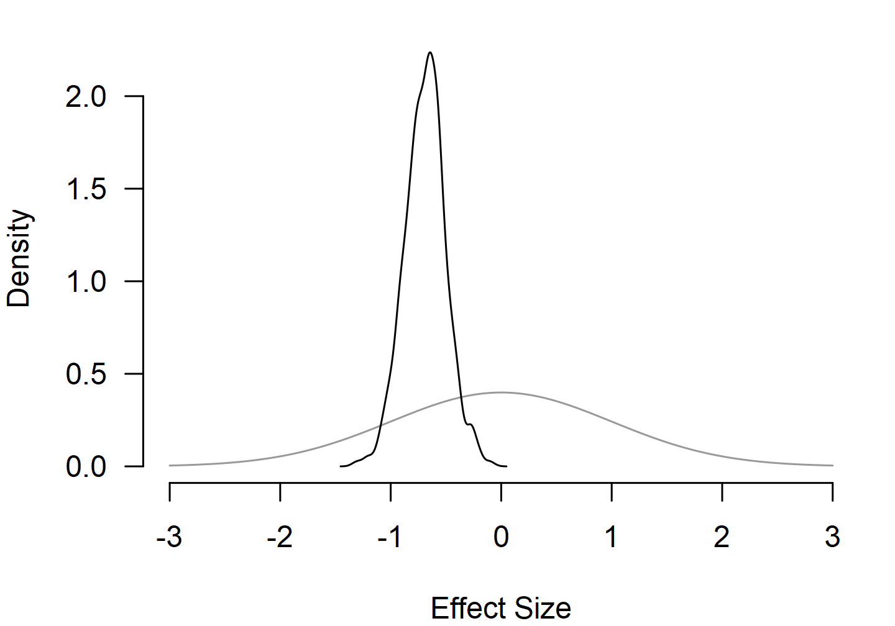
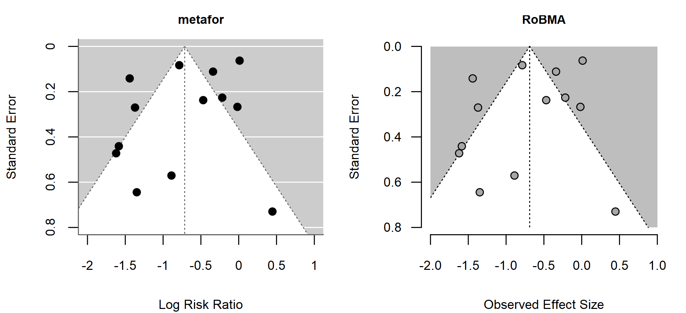
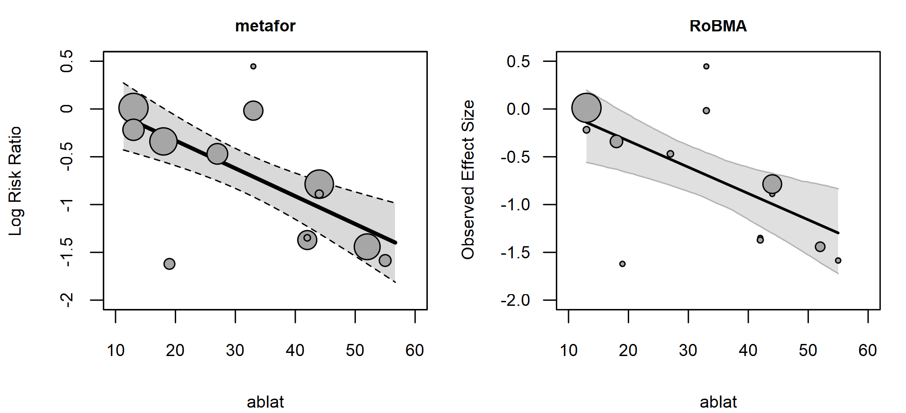
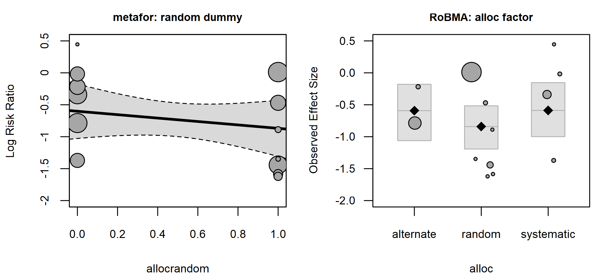
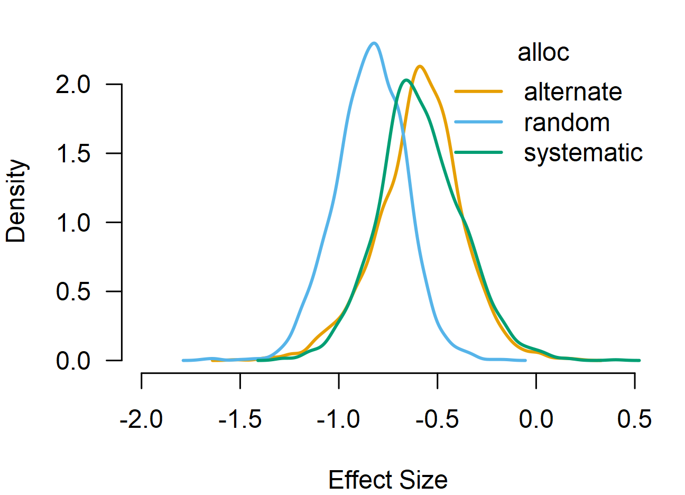
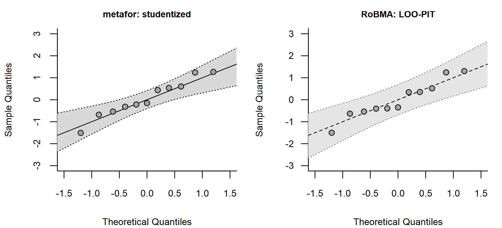

# Bayesian Meta-Analysis

This vignette is a starting point for using the `RoBMA` R package
([Bartoš & Maier, 2020](#ref-RoBMA)). We walk through the BCG vaccine
dataset from the `metafor` package ([Viechtbauer, 2010](#ref-metafor)),
showing each
[`brma()`](https://fbartos.github.io/RoBMA/reference/brma.md) call
alongside its
[`metafor::rma()`](https://wviechtb.github.io/metafor/reference/rma.uni.html)
counterpart and building from a simple random-effects model up to
meta-regression with a continuous and a categorical moderator. The
interface is intentionally close to the `metafor` package: the same
effect-size columns, moderator formulas, and standard plotting and
diagnostic functions apply.

All [`brma()`](https://fbartos.github.io/RoBMA/reference/brma.md) calls
keep the default prior distributions; see the [*Prior
Distributions*](https://fbartos.github.io/RoBMA/articles/01-prior-distributions.md)
vignette for the prior definitions and customization options.

## Random-Effects Model

The BCG vaccine dataset from the `metadat` package contains 13
randomized trials on tuberculosis prevention. `escalc()` computes log
risk ratios `yi` and their sampling variances `vi`.

``` r

data("dat.bcg", package = "metadat")

dat <- metafor::escalc(
  ai = tpos, bi = tneg, ci = cpos, di = cneg,
  measure = "RR", data = dat.bcg
)
```

[`metafor::rma()`](https://wviechtb.github.io/metafor/reference/rma.uni.html)
fits the random-effects model.

``` r

fit1_metafor <- metafor::rma(yi, vi, data = dat, method = "REML")
fit1_metafor
#> 
#> Random-Effects Model (k = 13; tau^2 estimator: REML)
#> 
#> tau^2 (estimated amount of total heterogeneity): 0.3132 (SE = 0.1664)
#> tau (square root of estimated tau^2 value):      0.5597
#> I^2 (total heterogeneity / total variability):   92.22%
#> H^2 (total variability / sampling variability):  12.86
#> 
#> Test for Heterogeneity:
#> Q(df = 12) = 152.2330, p-val < .0001
#> 
#> Model Results:
#> 
#> estimate      se     zval    pval    ci.lb    ci.ub      
#>  -0.7145  0.1798  -3.9744  <.0001  -1.0669  -0.3622  *** 
#> 
#> ---
#> Signif. codes:  0 '***' 0.001 '**' 0.01 '*' 0.05 '.' 0.1 ' ' 1
```

The matching Bayesian fit reuses the same effect-size columns.
`measure = "RR"` tells
[`brma()`](https://fbartos.github.io/RoBMA/reference/brma.md) to use the
default prior distributions for log risk ratios. The default prior
distributions are weakly informative and provide slight regularization
toward zero.

``` r

fit1_brma <- brma(
  yi = yi, vi = vi, measure = "RR",
  data = dat, seed = 1
)
```

[`summary()`](https://rdrr.io/r/base/summary.html) reports posterior
means, credible intervals, and (suppressed here) MCMC convergence
diagnostics. Convergence diagnostics are included by default;
chain-level visual diagnostics are available via
[`plot_diagnostic_trace()`](https://fbartos.github.io/RoBMA/reference/plot_diagnostic.md),
[`plot_diagnostic_density()`](https://fbartos.github.io/RoBMA/reference/plot_diagnostic.md),
and
[`plot_diagnostic_autocorrelation()`](https://fbartos.github.io/RoBMA/reference/plot_diagnostic.md).

``` r

summary(fit1_brma, include_mcmc_diagnostics = FALSE)
#> 
#> Bayesian Random-Effects Model (k = 13)
#> 
#> Estimates
#>       Mean    SD  0.025    0.5  0.975
#> mu  -0.688 0.186 -1.056 -0.682 -0.292
#> tau  0.563 0.136  0.334  0.552  0.858
```

The posterior mean for the log risk ratio is close to the REML estimate
from the `metafor` package; the slight pull toward zero reflects the
default `Normal(0, 1)` prior distribution.
[`pooled_effect()`](https://fbartos.github.io/RoBMA/reference/pooled_effect.md)
returns the same summary, backtransformed to the risk-ratio scale via
`transform = "EXP"`:

``` r

pooled_effect(fit1_brma, transform = "EXP")
#> 
#> Pooled Effect Size (risk ratio)
#>     Mean Median 0.025 0.975
#> mu 0.511  0.506 0.348 0.747
#> Effect estimates are summarized on the risk ratio scale using EXP on the log risk ratio measure.
```

[`plot()`](https://rdrr.io/r/graphics/plot.default.html) visualizes the
posterior distribution, and `prior = TRUE` overlays the prior
distribution so the shift from prior to posterior is visible.

``` r

par(mar = c(4, 4, 1, 1))
plot(fit1_brma, parameter = "mu", prior = TRUE, xlim = c(-3, 3))
```



## Heterogeneity

[`metafor::confint()`](https://wviechtb.github.io/metafor/reference/confint.rma.html)
reports profile-likelihood confidence intervals for `tau^2`, `tau`,
`I^2`, and `H^2`.
[`summary_heterogeneity()`](https://fbartos.github.io/RoBMA/reference/summary_heterogeneity.md)
is the Bayesian counterpart, returning posterior summaries of the same
quantities.

``` r

confint(fit1_metafor)
#> 
#>        estimate   ci.lb   ci.ub 
#> tau^2    0.3132  0.1197  1.1115 
#> tau      0.5597  0.3460  1.0543 
#> I^2(%)  92.2214 81.9177 97.6781 
#> H^2     12.8558  5.5303 43.0680
```

``` r

summary_heterogeneity(fit1_brma)
#> 
#> Heterogeneity Estimates:
#>        Mean Median  0.025  0.975
#> tau   0.563  0.552  0.334  0.858
#> tau2  0.336  0.305  0.112  0.735
#> I2   91.153 92.030 80.883 96.532
#> H2   13.712 12.547  5.231 28.832
```

## Funnel Plot

[`funnel()`](https://fbartos.github.io/RoBMA/reference/funnel.md) plots
observed effect sizes against the fitted sampling distribution. We turn
off the `sampling_heterogeneity` argument, since the `RoBMA` R package
shows the full sampling distribution under the model by default.

``` r

par(mfrow = c(1, 2), mar = c(4, 4, 2, 1), cex.axis = 0.8, cex.lab = 0.8, cex.main = 0.75)
metafor::funnel(fit1_metafor, main = "metafor", xlim = c(-2, 1), ylim = c(0, 0.8))
funnel(fit1_brma, main = "RoBMA", xlim = c(-2, 1), ylim = c(0, 0.8), sampling_heterogeneity = FALSE)
```



## Meta-Regression with a Continuous Moderator

A continuous moderator can be added with the standard formula syntax via
the `mods` argument. `ablat` is the absolute latitude of the trial,
frequently used to explain BCG effect-size variation.

``` r

fit2_metafor <- metafor::rma(yi, vi, mods = ~ ablat, data = dat)
fit2_metafor
#> 
#> Mixed-Effects Model (k = 13; tau^2 estimator: REML)
#> 
#> tau^2 (estimated amount of residual heterogeneity):     0.0764 (SE = 0.0591)
#> tau (square root of estimated tau^2 value):             0.2763
#> I^2 (residual heterogeneity / unaccounted variability): 68.39%
#> H^2 (unaccounted variability / sampling variability):   3.16
#> R^2 (amount of heterogeneity accounted for):            75.62%
#> 
#> Test for Residual Heterogeneity:
#> QE(df = 11) = 30.7331, p-val = 0.0012
#> 
#> Test of Moderators (coefficient 2):
#> QM(df = 1) = 16.3571, p-val < .0001
#> 
#> Model Results:
#> 
#>          estimate      se     zval    pval    ci.lb    ci.ub      
#> intrcpt    0.2515  0.2491   1.0095  0.3127  -0.2368   0.7397      
#> ablat     -0.0291  0.0072  -4.0444  <.0001  -0.0432  -0.0150  *** 
#> 
#> ---
#> Signif. codes:  0 '***' 0.001 '**' 0.01 '*' 0.05 '.' 0.1 ' ' 1
```

``` r

fit2_brma <- brma(
  yi = yi, vi = vi, measure = "RR",
  mods = ~ ablat,
  data = dat, seed = 1
)
```

``` r

summary(fit2_brma, include_mcmc_diagnostics = FALSE)
#> 
#> Bayesian Mixed-Effect Model (k = 13)
#> 
#> Common Estimates
#>      Mean    SD 0.025   0.5 0.975
#> tau 0.303 0.131 0.088 0.289 0.587
#> 
#> Meta-Regression
#>             Mean    SD  0.025    0.5  0.975
#> intercept  0.217 0.275 -0.362  0.237  0.712
#> ablat     -0.028 0.008 -0.043 -0.028 -0.011
```

[`regplot()`](https://fbartos.github.io/RoBMA/reference/regplot.md)
produces the familiar bubble plot with the fitted regression line.

``` r

par(mfrow = c(1, 2), mar = c(4, 4, 2, 1), cex.axis = 0.8, cex.lab = 0.8, cex.main = 0.75)
metafor::regplot(fit2_metafor, main = "metafor", xlim = c(10, 60), ylim = c(-2, 0.5))
regplot(fit2_brma, main = "RoBMA", xlim = c(10, 60), ylim = c(-2, 0.5))
```



[`predict()`](https://rdrr.io/r/stats/predict.html) returns posterior
summaries for user-specified moderator values.

``` r

new_data <- data.frame(ablat = c(15, 35, 55))
predict(fit2_brma, newdata = new_data, type = "terms")
#> 
#> Location Term Posterior Prediction:
#>         Mean Median  0.025  0.975
#> mu[1] -0.196 -0.182 -0.587  0.123
#> mu[2] -0.746 -0.743 -0.994 -0.506
#> mu[3] -1.297 -1.307 -1.722 -0.835
```

## Comparing Models with Bayes Factors

Marginal likelihoods enable model comparison via Bayes factors ([Kass &
Raftery, 1995](#ref-kass1995bayes)). After attaching marginal
likelihoods to both fits with
[`add_marglik()`](https://fbartos.github.io/RoBMA/reference/add_marglik.brma.md),
[`bf()`](https://rdrr.io/pkg/bridgesampling/man/bf.html) returns the
Bayes factor for one model against another.

``` r

fit1_brma <- add_marglik(fit1_brma)
fit2_brma <- add_marglik(fit2_brma)
```

``` r

bf(fit2_brma, fit1_brma)
#> Bayes factor in favor of Model 1 over Model 2: 14.76119
```

The Bayes factor quantifies how much the data shift the relative
predictive support between the two models. Here we obtain strong
evidence in favor of the model including the `ablat` predictor.

## Adding a Categorical Moderator

`alloc` is a three-level factor describing the trial allocation method
(random, alternate, systematic). The same formula syntax extends the
meta-regression.

``` r

fit3_metafor <- metafor::rma(yi, vi, mods = ~ ablat + alloc, data = dat)
```

``` r

fit3_brma <- brma(
  yi = yi, vi = vi, measure = "RR",
  mods = ~ ablat + alloc,
  data = dat, seed = 1
)
```

``` r

summary(fit3_brma, include_mcmc_diagnostics = FALSE)
#> 
#> Bayesian Mixed-Effect Model (k = 13)
#> 
#> Common Estimates
#>      Mean    SD 0.025   0.5 0.975
#> tau 0.344 0.144 0.100 0.330 0.674
#> 
#> Meta-Regression
#>                     Mean    SD  0.025    0.5  0.975
#> intercept          0.287 0.355 -0.468  0.312  0.929
#> ablat             -0.026 0.009 -0.042 -0.027 -0.008
#> alloc[random]     -0.249 0.251 -0.749 -0.248  0.251
#> alloc[systematic]  0.003 0.276 -0.489 -0.017  0.580
```

The `RoBMA` R package also allows direct visualization of categorical
moderators in the bubble plot (the `metafor` package only supports a
single dummy coefficient at the moment).

``` r

par(mfrow = c(1, 2), mar = c(4, 4, 2, 1), cex.axis = 0.8, cex.lab = 0.8, cex.main = 0.75)
metafor::regplot(fit3_metafor, mod = "allocrandom", main = "metafor: random dummy", ylim = c(-2, 0.5))
regplot(fit3_brma, mod = "alloc", main = "RoBMA: alloc factor", ylim = c(-2, 0.5))
```



[`marginal_means()`](https://fbartos.github.io/RoBMA/reference/marginal_means.md)
computes estimated marginal means for each moderator term, averaging
over the other moderators in the fit. Continuous moderators (here
`ablat`) are evaluated at $`-1`$, $`0`$, and $`+1`$ standard deviations
of the predictor; categorical moderators (here `alloc`) at each level.

``` r

emm <- marginal_means(fit3_brma)
summary(emm)
#> 
#> Marginal Means:
#>                     Mean    SD  0.025    0.5  0.975
#> intercept         -0.592 0.217 -1.061 -0.585 -0.180
#> ablat[-1SD]       -0.212 0.247 -0.737 -0.197  0.234
#> ablat[0SD]        -0.592 0.217 -1.061 -0.585 -0.180
#> ablat[1SD]        -0.971 0.254 -1.494 -0.971 -0.429
#> alloc[alternate]  -0.592 0.217 -1.061 -0.585 -0.180
#> alloc[random]     -0.841 0.177 -1.192 -0.833 -0.516
#> alloc[systematic] -0.588 0.214 -0.999 -0.605 -0.154
```

The [`plot()`](https://rdrr.io/r/graphics/plot.default.html) function
visualizes the posterior distribution of the estimated marginal means.

``` r

par(mar = c(4, 4, 1, 1), cex.axis = 0.8, cex.lab = 0.8, cex.main = 0.75)
plot(emm, parameter = "alloc", xlim = c(-2, 0.5), lwd = 2)
```



## Model Diagnostics

The `RoBMA` R package implements a wide set of model fit diagnostics.
Here, we highlight only a few.

[`metafor::rstudent()`](https://wviechtb.github.io/metafor/reference/residuals.rma.html)
returns frequentist studentized residuals computed by deletion;
[`RoBMA::rstudent()`](https://rdrr.io/r/stats/influence.measures.html)
returns LOO-PIT residuals, which propagate posterior uncertainty and
leverage through leave-one-out prediction. The two definitions are
comparable but not identical; the `RoBMA` R package’s LOO-PIT residuals
first require LOO computation via
[`add_loo()`](https://fbartos.github.io/RoBMA/reference/add_loo.brma.md).

``` r

fit3_brma <- add_loo(fit3_brma)
```

``` r

head(rstudent(fit3_metafor)$z)
#> [1]  0.4369227 -0.2024807 -0.3084436 -0.1187827 -0.4726194  0.4726194
head(rstudent(fit3_brma)$z)
#> [1]  0.3515262 -0.3483678 -0.3940142 -0.4052585 -0.5379945  0.3420329
```

[`qqnorm()`](https://rdrr.io/r/stats/qqnorm.html) checks the residuals
against a standard normal reference.

``` r

par(mfrow = c(1, 2), mar = c(4, 4, 2, 1), cex.axis = 0.8, cex.lab = 0.8, cex.main = 0.75)
qqnorm(fit3_metafor, main = "metafor: studentized", xlim = c(-1.5, 1.5), ylim = c(-3, 3))
qqnorm(fit3_brma, main = "RoBMA: LOO-PIT", xlim = c(-1.5, 1.5), ylim = c(-3, 3))
```



[`influence()`](https://rdrr.io/r/stats/lm.influence.html) collects
DFFITS, Cook’s distance, COVRATIO, leverage, and DFBETAS where the
diagnostic is available.

``` r

inf_brma <- influence(fit3_brma)
head(inf_brma$inf)
#>           rstudent      dffits      cook.d    cov.r   tau.del        hat
#> Study 1  0.3515262  0.09742742 0.003051713 1.352210 0.3611943 0.08676324
#> Study 2 -0.3483678 -0.16031362 0.009344464 1.672075 0.3683854 0.19988035
#> Study 3 -0.3940142 -0.09201147 0.002596289 1.247964 0.3566583 0.06776189
#> Study 4 -0.4052585 -0.25448939 0.028780571 2.209083 0.3775556 0.42974702
#> Study 5 -0.5379945 -0.24916951 0.024724592 1.683551 0.3457254 0.53991804
#> Study 6  0.3420329  0.21231431 0.022986373 2.516078 0.3785678 0.69164774
```

## References

Bartoš, F., & Maier, M. (2020). *RoBMA: An R package for robust Bayesian
meta-analyses*. <https://CRAN.R-project.org/package=RoBMA>

Kass, R. E., & Raftery, A. E. (1995). Bayes factors. *Journal of the
American Statistical Association*, *90*(430), 773–795.
<https://doi.org/10.1080/01621459.1995.10476572>

Viechtbauer, W. (2010). Conducting meta-analyses in R with the metafor
package. *Journal of Statistical Software*, *36*(3), 1–48.
<https://www.jstatsoft.org/v36/i03/>
