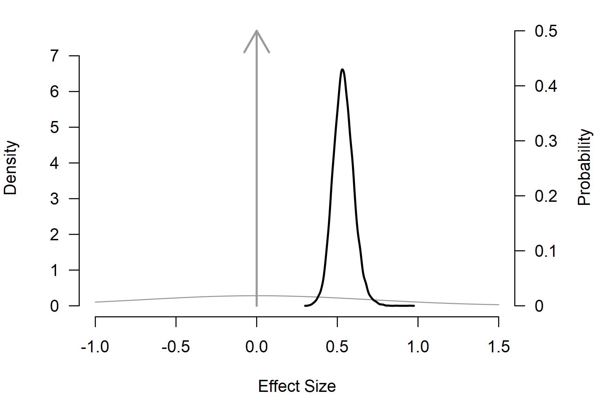
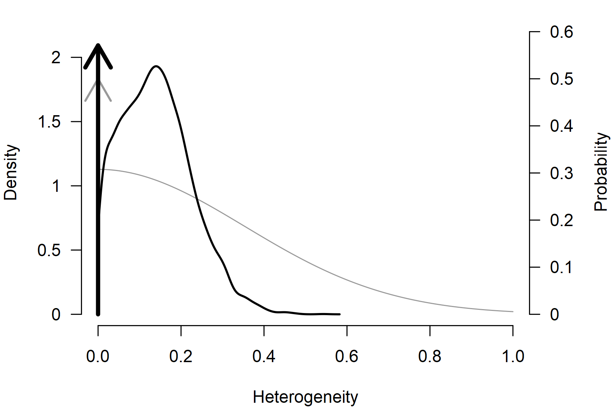
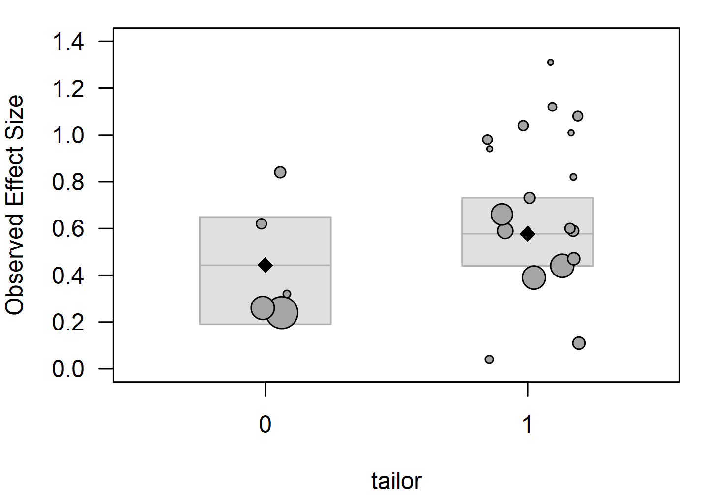
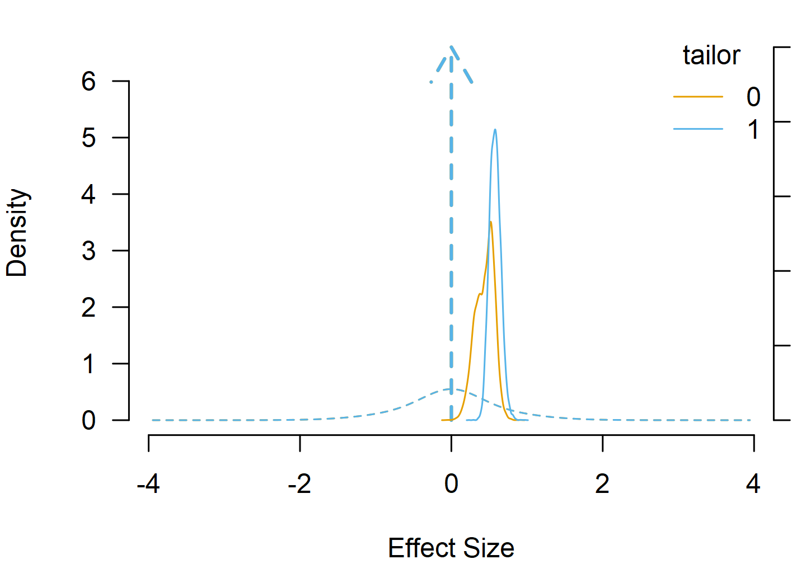

# Bayesian Model Averaging

In meta-analysis, analysts often have to balance different assumptions
about the data-generating process and decide what kind of model to fit,
which covariates to include, and what publication-bias adjustment method
to use. Bayesian model averaging (BMA) tries to alleviate this problem
by combining competing meta-analytic models based on their prior
predictive performance. Models that predicted the data better receive
higher posterior model probability and more weight in the overall
inference. The *model-averaged estimates* allow us to propagate
uncertainty about the selected model and *inclusion Bayes factors*
quantify evidence across sets of models ([Hoeting et al.,
1999](#ref-hoeting1999bayesian)).

In this vignette we illustrate Bayesian model-averaged meta-analysis
using [`BMA()`](https://fbartos.github.io/RoBMA/reference/BMA.md) on the
`dat.baskerville2012` dataset to highlight the basics of Bayesian
model-averaging using the `RoBMA` R package ([Bartoš & Maier,
2020](#ref-RoBMA)). In a later vignette [*Robust Bayesian
Meta-Analysis*](https://fbartos.github.io/RoBMA/articles/21-robust-bayesian-meta-analysis.md),
we illustrate robust Bayesian meta-analysis that extends this concept to
model-averaging across publication-bias adjustment models. All models
use the default prior distributions; see the [*Prior
Distributions*](https://fbartos.github.io/RoBMA/articles/01-prior-distributions.md)
vignette for the prior definitions and customization options.

We start by estimating simple fixed-effect and random-effects Bayesian
meta-analytic models, turn the model-comparison into a model-averaged
fit, and finally also average over the presence vs absence of the
effect. Finally, we extend the model into a Bayesian model-averaged
meta-regression. Note that we do not demonstrate all of the diagnostics
and summary features available to all models fitted via the `RoBMA` R
package (see the [*Bayesian
Meta-Analysis*](https://fbartos.github.io/RoBMA/articles/02-bayesian-meta-analysis.md)
vignette for more details).

## Dataset

The example dataset is distributed with the `metadat` package as
`dat.baskerville2012` and contains 23 randomized and controlled trials
of practice-facilitation interventions in primary care. The effect size
`smd` is the standardized mean difference for adherence to
evidence-based primary-care guidelines and `se` is its standard error.
The binary `tailor` indicator records whether the intervention was
tailored to the participating practice (1) or applied as a uniform
protocol (0); we treat it as a factor and use it as a moderator later in
the vignette.

``` r
library("RoBMA")

data("dat.baskerville2012", package = "metadat")
dat <- dat.baskerville2012
dat$tailor <- as.factor(dat$tailor)
head(dat[, c("year", "smd", "se", "tailor")])
#>   year  smd   se tailor
#> 1 1992 1.01 0.52      1
#> 2 2000 0.82 0.46      1
#> 3 2000 0.59 0.23      1
#> 4 2004 0.44 0.18      1
#> 5 2005 0.84 0.29      0
#> 6 2008 0.73 0.29      1
```

## Comparing Fixed and Random Effects

[`metafor::rma.uni()`](https://wviechtb.github.io/metafor/reference/rma.uni.html)
fits the conventional random-effects model on the standardized mean
differences.

``` r
res <- metafor::rma.uni(
  yi = smd, sei = se,
  data = dat, method = "REML"
)
res
#> 
#> Random-Effects Model (k = 23; tau^2 estimator: REML)
#> 
#> tau^2 (estimated amount of total heterogeneity): 0.0205 (SE = 0.0264)
#> tau (square root of estimated tau^2 value):      0.1431
#> I^2 (total heterogeneity / total variability):   22.44%
#> H^2 (total variability / sampling variability):  1.29
#> 
#> Test for Heterogeneity:
#> Q(df = 22) = 27.5518, p-val = 0.1910
#> 
#> Model Results:
#> 
#> estimate      se    zval    pval   ci.lb   ci.ub      
#>   0.5600  0.0652  8.5930  <.0001  0.4322  0.6877  *** 
#> 
#> ---
#> Signif. codes:  0 '***' 0.001 '**' 0.01 '*' 0.05 '.' 0.1 ' ' 1
```

The Bayesian counterpart uses
[`brma()`](https://fbartos.github.io/RoBMA/reference/brma.md) with the
default prior distributions: a `Normal(0, 0.71)` unit-information prior
distribution on the effect and a `Normal(0, 0.35)[0, Inf]` half-normal
prior distribution on the heterogeneity.

``` r
fit_RE <- brma(
  yi = smd, sei = se, measure = "SMD",
  data = dat, seed = 1
)
fit_RE <- add_marglik(fit_RE)
```

``` r
summary(fit_RE, include_mcmc_diagnostics = FALSE)
#> 
#> Bayesian Random-Effects Model (k = 23)
#> 
#> Estimates
#>      Mean    SD 0.025   0.5 0.975
#> mu  0.554 0.070 0.424 0.551 0.701
#> tau 0.140 0.084 0.008 0.134 0.318
```

Setting the heterogeneity prior distribution to a spike at zero turns
the random-effects model into a fixed-effect model.

``` r
fit_FE <- brma(
  yi = smd, sei = se, measure = "SMD",
  prior_heterogeneity = prior("spike", list(location = 0)),
  data = dat, seed = 1
)
fit_FE <- add_marglik(fit_FE)
```

``` r
summary(fit_FE, include_mcmc_diagnostics = FALSE)
#> 
#> Bayesian Random-Effects Model (k = 23)
#> 
#> Estimates
#>     Mean    SD 0.025   0.5 0.975
#> mu 0.525 0.055 0.418 0.525 0.633
```

With marginal likelihoods attached to the models via
[`add_marglik()`](https://fbartos.github.io/RoBMA/reference/add_marglik.brma.md),
[`bf()`](https://rdrr.io/pkg/bridgesampling/man/bf.html) returns the
Bayes factor between the two fits.

``` r
bf(fit_RE, fit_FE)
#> Bayes factor in favor of Model 1 over Model 2: 0.76191
```

The Bayes factor is close to one and neither model is decisively
preferred. Rather than picking one of the two models, we can
model-average over them and weight the inference by the posterior model
probabilities.

## From Two Fits to Model Averaging

[`BMA()`](https://fbartos.github.io/RoBMA/reference/BMA.md) fits a
mixture of the two models in one call. Each top-level prior-distribution
argument has a paired `_null` version; when we supply both, the model
averages over that component. Setting `prior_effect_null = NULL` drops
the null component on the effect (spike at zero) and leaves a 2-model
average over presence vs absence of heterogeneity, which is the BMA
analogue of the comparison above.

``` r
fit_BMA_he <- BMA(
  yi = smd, sei = se, measure = "SMD",
  prior_effect_null = NULL,
  data = dat, seed = 1
)
```

``` r
summary(fit_BMA_he)
#> 
#> Bayesian Model-Averaged Random-Effects Model (k = 23)
#> 
#> Component Inclusion
#>               Prior prob. Post. prob. Inclusion BF error%(Inclusion BF)
#> Effect              1.000       1.000           NA                   NA
#> Heterogeneity       0.500       0.429        0.752                2.363
#> 
#> Estimates
#>      Mean    SD 0.025   0.5 0.975 error(MCMC) error(MCMC)/SD   ESS R-hat
#> mu  0.538 0.063 0.421 0.536 0.670     0.00058          0.009 11883 1.000
#> tau 0.060 0.088 0.000 0.000 0.280     0.00095          0.011  8757 1.000
```

The *Components* table reports the posterior probability and inclusion
Bayes factor for heterogeneity. This BF closely matches
`bf(fit_RE, fit_FE)` above up to MCMC noise. The two routes compute the
same quantity differently:
[`bf()`](https://rdrr.io/pkg/bridgesampling/man/bf.html) bridge-samples
marginal likelihoods from two separate fits, while
[`BMA()`](https://fbartos.github.io/RoBMA/reference/BMA.md) runs a
single MCMC over the joint model space with a model indicator as a
latent variable and recovers the posterior model probabilities from the
indicator frequencies ([Lodewyckx et al.,
2011](#ref-lodewyckx2011tutorial)). Adding a third or fourth component
to this product-space sampler costs one more indicator instead of a set
of full model fits and bridge-sampling runs, which is what makes the
larger ensembles in
[`RoBMA()`](https://fbartos.github.io/RoBMA/reference/RoBMA.md)
tractable.

## Adding Effect Averaging

The default [`BMA()`](https://fbartos.github.io/RoBMA/reference/BMA.md)
call also averages over the presence vs absence of the effect, giving a
4-model ensemble (effect $`\times`$ heterogeneity, each present or
absent).

``` r
fit_BMA <- BMA(
  yi = smd, sei = se, measure = "SMD",
  data = dat, seed = 1
)
```

``` r
summary(fit_BMA)
#> 
#> Bayesian Model-Averaged Random-Effects Model (k = 23)
#> 
#> Component Inclusion
#>               Prior prob. Post. prob. Inclusion BF error%(Inclusion BF)
#> Effect              0.500       1.000   >14999.000                   NA
#> Heterogeneity       0.500       0.429        0.752                2.351
#> 
#> Estimates
#>      Mean    SD 0.025   0.5 0.975 error(MCMC) error(MCMC)/SD   ESS R-hat
#> mu  0.538 0.063 0.421 0.536 0.671     0.00058          0.009 11972 1.000
#> tau 0.060 0.089 0.000 0.000 0.284     0.00096          0.011  8682 1.000
```

Both inclusion Bayes factors come from the same MCMC. The effect BF is
overwhelming on this dataset; the heterogeneity BF is the same as
before. The model-averaged estimates are spike-and-slab mixtures: a
point mass at the null value with weight equal to the posterior
probability that the parameter is zero, and a slab carrying the
remaining weight.

[`plot()`](https://rdrr.io/r/graphics/plot.default.html) draws both
components together. The arrow at zero is the spike’s posterior
probability (right axis), the curve is the slab’s density, and the grey
shapes show the corresponding visualization for the prior distribution.

``` r
par(mar = c(4, 4, 1, 4))
plot(fit_BMA, parameter = "mu", prior = TRUE, xlim = c(-1, 1.5), lwd = 2)
```



``` r
par(mar = c(4, 4, 1, 4))
plot(fit_BMA, parameter = "tau", prior = TRUE, xlim = c(0, 1), lwd = 2)
```



The *Model-averaged estimates* summarize the marginal posterior (the
full mixture). For estimates conditional on the parameter being non-zero
(slab only) use the `conditional = TRUE` argument. The marginal and
conditional summaries diverge for $`\tau`$, which keeps substantial
posterior weight on the spike, and coincide for $`\mu`$, where the
spike’s posterior weight is essentially zero.

``` r
summary(fit_BMA, conditional = TRUE)
#> 
#> Bayesian Model-Averaged Random-Effects Model (k = 23)
#> 
#> Component Inclusion
#>               Prior prob. Post. prob. Inclusion BF error%(Inclusion BF)
#> Effect              0.500       1.000   >14999.000                   NA
#> Heterogeneity       0.500       0.429        0.752                2.351
#> 
#> Estimates
#>      Mean    SD 0.025   0.5 0.975 error(MCMC) error(MCMC)/SD   ESS R-hat
#> mu  0.538 0.063 0.421 0.536 0.671     0.00058          0.009 11972 1.000
#> tau 0.060 0.089 0.000 0.000 0.284     0.00096          0.011  8682 1.000
#> 
#> Conditional Estimates
#>      Mean    SD 0.025   0.5 0.975
#> mu  0.538 0.063 0.421 0.536 0.671
#> tau 0.141 0.084 0.008 0.136 0.319
```

## Meta-Regression with Model Averaging

Adding a moderator extends the averaging to its inclusion. With
`mods = ~ tailor`,
[`BMA()`](https://fbartos.github.io/RoBMA/reference/BMA.md) averages
over 8 sub-models (effect $`\times`$ heterogeneity $`\times`$`tailor`
coefficient, each present or absent).

``` r
res_mod <- metafor::rma.uni(
  yi = smd, sei = se, mods = ~ tailor,
  data = dat, method = "REML"
)
res_mod
#> 
#> Mixed-Effects Model (k = 23; tau^2 estimator: REML)
#> 
#> tau^2 (estimated amount of residual heterogeneity):     0.0037 (SE = 0.0207)
#> tau (square root of estimated tau^2 value):             0.0610
#> I^2 (residual heterogeneity / unaccounted variability): 4.79%
#> H^2 (unaccounted variability / sampling variability):   1.05
#> R^2 (amount of heterogeneity accounted for):            81.82%
#> 
#> Test for Residual Heterogeneity:
#> QE(df = 21) = 23.1124, p-val = 0.3380
#> 
#> Test of Moderators (coefficient 2):
#> QM(df = 1) = 3.9378, p-val = 0.0472
#> 
#> Model Results:
#> 
#>          estimate      se    zval    pval   ci.lb   ci.ub      
#> intrcpt    0.3652  0.1035  3.5277  0.0004  0.1623  0.5680  *** 
#> tailor1    0.2460  0.1240  1.9844  0.0472  0.0030  0.4890    * 
#> 
#> ---
#> Signif. codes:  0 '***' 0.001 '**' 0.01 '*' 0.05 '.' 0.1 ' ' 1
```

``` r
fit_BMA_mod <- BMA(
  yi = smd, sei = se, measure = "SMD",
  mods = ~ tailor,
  data = dat, seed = 1
)
```

``` r
summary(fit_BMA_mod)
#> 
#> Bayesian Model-Averaged Mixed-Effect Model (k = 23)
#> 
#> Component Inclusion
#>               Prior prob. Post. prob. Inclusion BF error%(Inclusion BF)
#> Effect              0.500       1.000   >14999.000                   NA
#> Heterogeneity       0.500       0.370        0.588                2.516
#> 
#> Meta-Regression Inclusion
#>        Prior prob. Post. prob. Inclusion BF error%(Inclusion BF)
#> tailor       0.500       0.557        1.257                3.513
#> 
#> Common Estimates
#>      Mean    SD 0.025   0.5 0.975 error(MCMC) error(MCMC)/SD  ESS R-hat
#> tau 0.047 0.079 0.000 0.000 0.259     0.00092          0.012 7317 1.000
#> 
#> Meta-Regression
#>                  Mean    SD  0.025    0.5 0.975 error(MCMC) error(MCMC)/SD  ESS R-hat
#> intercept       0.510 0.069  0.379  0.509 0.651     0.00085          0.012 6576 1.000
#> tailor[dif: 0] -0.067 0.075 -0.224 -0.043 0.000     0.00119          0.016 4066 1.001
#> tailor[dif: 1]  0.067 0.075  0.000  0.043 0.224     0.00119          0.016 4066 1.001
```

The *Components* table now also lists `tailor` and its inclusion BF.
Because we average the moderation across models in which the slope is
zero,
[`regplot()`](https://fbartos.github.io/RoBMA/reference/regplot.md)
shrinks the difference towards zero when the inclusion BF is modest.

``` r
par(mar = c(4, 4, 1, 1))
regplot(fit_BMA_mod, mod = "tailor")
```



Alternatively, we can directly compute the estimated marginal means via
the
[`marginal_means()`](https://fbartos.github.io/RoBMA/reference/marginal_means.md)
function and visualize the prior and posterior distributions at each
moderator level.

``` r
par(mar = c(4, 4, 1, 1))
emm <- marginal_means(fit_BMA_mod)
emm
#> 
#> Model-Averaged Marginal Means:
#>            Mean    SD 0.025   0.5 0.975 Inclusion BF
#> intercept 0.510 0.069 0.379 0.509 0.651          Inf
#> tailor[0] 0.443 0.124 0.191 0.459 0.649      130.849
#> tailor[1] 0.577 0.075 0.440 0.575 0.731          Inf
#> mu_intercept: Posterior samples do not span both sides of the null hypothesis. The Savage-Dickey density ratio is likely to be overestimated.
#> mu_tailor[1]: Posterior samples do not span both sides of the null hypothesis. The Savage-Dickey density ratio is likely to be overestimated.

plot(emm, parameter = "tailor", prior = TRUE)
```



## Customizing Prior Components

In Bayesian model-averaged meta-analysis, every component has a paired
`_null` argument (i.e. `prior_effect` and `prior_effect_null`). Either
side can be `NULL` (remove the component), a single prior distribution,
or a list of prior distributions (a sub-mixture). Common customizations
are tightening or widening the slab, replacing the point-zero null with
a region of practical equivalence, or forcing a moderator into every
model. The examples below use `only_priors = TRUE` to print the prior
structure without fitting the models.

Tighten the effect slab with `rescale_priors = 0.5`:

``` r
fit_priors <- BMA(
  yi = smd, sei = se, measure = "SMD",
  rescale_priors = 0.5,
  data = dat, only_priors = TRUE
)
print_prior(fit_priors, parameter = "mu")
#> mu:
#>   alternative:
#>     (1/2) * Normal(0, 0.35)
#>   null:
#>     (1/2) * Spike(0)
```

Replace the point-zero null on the effect with a small spread around
zero (a perinull) to test against a region of practical equivalence:

``` r
fit_priors <- BMA(
  yi = smd, sei = se, measure = "SMD",
  prior_effect_null = prior("normal", list(mean = 0, sd = 0.05)),
  data = dat, only_priors = TRUE
)
print_prior(fit_priors, parameter = "mu")
#> mu:
#>   alternative:
#>     (1/2) * Normal(0, 0.71)
#>   null:
#>     (1/2) * Normal(0, 0.05)
```

Force `tailor` into every model by dropping its null:

``` r
fit_priors <- BMA(
  yi = smd, sei = se, measure = "SMD",
  mods = ~ tailor,
  prior_mods_null = list(tailor = NULL),
  data = dat, only_priors = TRUE
)
print_prior(fit_priors, parameter_mods = "tailor")
#> mu_tailor:
#>   alternative:
#>     (1/1) * mean difference contrast: mNormal(0, 0.35)
```

A tighter half-normal slab on $`\tau`$:

``` r
fit_priors <- BMA(
  yi = smd, sei = se, measure = "SMD",
  prior_heterogeneity = prior(
    distribution = "normal",
    parameters   = list(mean = 0, sd = 0.25),
    truncation   = list(lower = 0)
  ),
  data = dat, only_priors = TRUE
)
print_prior(fit_priors, parameter = "tau")
#> tau:
#>   alternative:
#>     (1/2) * Normal(0, 0.25)[0, Inf]
#>   null:
#>     (1/2) * Spike(0)
```

Empirical informed prior distributions based on the Cochrane database
are available via `prior_informed_field` and `prior_informed_subfield`;
see [*Informed Bayesian Model-Averaged Meta-Analysis in
Medicine*](https://fbartos.github.io/RoBMA/articles/34-bma-norm-medicine.md).

## Other `brma` Features

A [`BMA()`](https://fbartos.github.io/RoBMA/reference/BMA.md) fit is
also a `brma` object:
[`summary()`](https://rdrr.io/r/base/summary.html),
[`plot()`](https://rdrr.io/r/graphics/plot.default.html),
[`print_prior()`](https://fbartos.github.io/RoBMA/reference/print_prior.md),
[`predict()`](https://rdrr.io/r/stats/predict.html),
[`marginal_means()`](https://fbartos.github.io/RoBMA/reference/marginal_means.md),
[`funnel()`](https://fbartos.github.io/RoBMA/reference/funnel.md),
[`rstudent()`](https://rdrr.io/r/stats/influence.measures.html),
[`qqnorm()`](https://rdrr.io/r/stats/qqnorm.html), and
[`influence()`](https://rdrr.io/r/stats/lm.influence.html) work the same
way as on a single-model fit; see [*Bayesian
Meta-Analysis*](https://fbartos.github.io/RoBMA/articles/02-bayesian-meta-analysis.md).
Prior-distribution families and informed prior distributions are covered
in [*Prior
Distributions*](https://fbartos.github.io/RoBMA/articles/01-prior-distributions.md).
For binary or count outcomes,
[`BMA.glmm()`](https://fbartos.github.io/RoBMA/reference/BMA.glmm.md)
does the same product-space averaging on a binomial-normal or
Poisson-normal likelihood. For model averaging that also adjusts for
publication bias, see [*Robust Bayesian
Meta-Analysis*](https://fbartos.github.io/RoBMA/articles/21-robust-bayesian-meta-analysis.md).

## References

Bartoš, F., & Maier, M. (2020). *RoBMA: An R package for robust Bayesian
meta-analyses*. <https://CRAN.R-project.org/package=RoBMA>

Hoeting, J. A., Madigan, D., Raftery, A. E., & Volinsky, C. T. (1999).
Bayesian model averaging: A tutorial. *Statistical Science*, *14*(4),
382–401.
[https://doi.org/10.1214/SS\\2F1009212519](https://doi.org/10.1214/SS\%2F1009212519)

Lodewyckx, T., Kim, W., Lee, M. D., Tuerlinckx, F., Kuppens, P., &
Wagenmakers, E.-J. (2011). A tutorial on Bayes factor estimation with
the product space method. *Journal of Mathematical Psychology*, *55*(5),
331–347. <https://doi.org/10.1016/j.jmp.2011.06.001>
