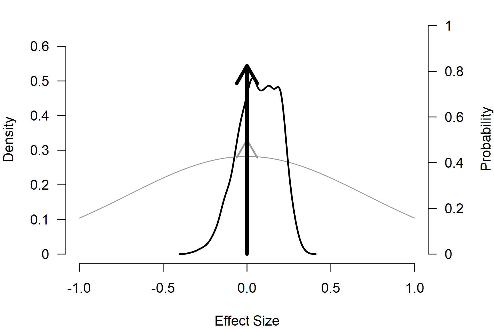

# Robust Bayesian Meta-Analysis

In the [*Publication-Bias
Adjustment*](https://fbartos.github.io/RoBMA/articles/11-metafor-parity-publication-bias.md)
vignette, we fit PET, PEESE, and a weight-function selection model on
the ego-depletion dataset and obtained three different bias-corrected
effect size estimates. The methods encoded different bias mechanisms:
PET and PEESE corrected for the relationship between effect sizes and
standard errors or sampling variances, and the selection model adjusted
for publication bias operating on p-values. There is no consensus on
which of the three is the right adjustment to apply. The [*Bayesian
Model
Averaging*](https://fbartos.github.io/RoBMA/articles/20-bayesian-model-averaging.md)
vignette highlighted how an analogous fixed-vs-random-effects question
can be resolved by combining the candidate models in one ensemble and
weighting them by their posterior model probabilities; the same idea
applies here.

Robust Bayesian model-averaged meta-analysis (RoBMA) is the application
of that idea to publication-bias adjustment ([Bartoš et al.,
2023](#ref-bartos2021no); [Maier et al., 2023](#ref-maier2020robust)).
The default
[`RoBMA()`](https://fbartos.github.io/RoBMA/reference/RoBMA.md) ensemble
averages over the presence vs absence of an effect, the presence vs
absence of heterogeneity, and a no-bias spike against several
weight-function and PET / PEESE bias models in one fit. Inclusion Bayes
factors quantify evidence for each of the three components, and the
model-averaged estimates propagate uncertainty across the bias
mechanisms instead of committing to a single one.

In this vignette we fit the default RoBMA ensemble on the same
ego-depletion data used in the [*Publication-Bias
Adjustment*](https://fbartos.github.io/RoBMA/articles/11-metafor-parity-publication-bias.md)
vignette, walk through the summary, the marginal posterior weights of
the bias components, and the
[`interpret()`](https://fbartos.github.io/RoBMA/reference/interpret.md)
shortcut. We list the available `model_type` presets and close with a
custom ensemble that combines only the three single-model bias
adjustments fit one at a time in that vignette.

## Dataset

The example dataset is `dat.lehmann2018` from the `metadat` package: 81
standardized mean differences from the ego-depletion meta-analysis with
effect sizes `yi` and sampling variances `vi` already computed. For the
matching single-model bias adjustments and `metafor` package parity
calls, see the [*Publication-Bias
Adjustment*](https://fbartos.github.io/RoBMA/articles/11-metafor-parity-publication-bias.md)
vignette.

``` r
library("RoBMA")

data("dat.lehmann2018", package = "metadat")
dat <- dat.lehmann2018
head(dat[, c("Short_Title", "Year", "yi", "vi")])
#>                                   Short_Title   Year        yi          vi
#> 1                Roberts et al., 2010 - Exp 2 2010.1 0.3337773 0.049046910
#> 2                Roberts et al., 2010 - Exp 2 2010.1 0.4014099 0.016037663
#> 3  Wartenberg et al., 2011 - Exp 1 - In Group 2011.0 0.2036116 0.007916124
#> 4 Gilston & Privitera, 2016 - Exp 1 - Healthy 2016.0 1.9163675 0.037967265
#> 5                Roberts et al., 2010 - Exp 1 2010.1 0.1884325 0.023258447
#> 6                Roberts et al., 2010 - Exp 1 2010.1 0.1852130 0.005905064
```

## Default RoBMA Ensemble

[`RoBMA()`](https://fbartos.github.io/RoBMA/reference/RoBMA.md) with
default arguments fits the RoBMA-PSMA ensemble ([Bartoš et al.,
2023](#ref-bartos2021no)): spike-and-slab prior distributions on the
effect and heterogeneity, and a 9-component bias mixture (no-bias spike,
six weight functions, PET, PEESE). The default prior distributions on
`mu`, `tau`, and the bias parameters match the single-model fits in the
[*Publication-Bias
Adjustment*](https://fbartos.github.io/RoBMA/articles/11-metafor-parity-publication-bias.md)
vignette.

``` r
fit_RoBMA <- RoBMA(
  yi = yi, vi = vi, measure = "SMD",
  data = dat, seed = 1
)
```

``` r
summary(fit_RoBMA)
#> 
#> Robust Bayesian Model-Averaged Random-Effects Model (k = 81)
#> 
#> Component Inclusion
#>                  Prior prob. Post. prob. Inclusion BF error%(Inclusion BF)
#> Effect                 0.500       0.175        0.212                7.411
#> Heterogeneity          0.500       1.000   >14999.000                   NA
#> Publication Bias       0.500       0.960       24.126               16.142
#> 
#> Estimates
#>      Mean    SD  0.025   0.5 0.975 error(MCMC) error(MCMC)/SD  ESS R-hat
#> mu  0.012 0.057 -0.064 0.000 0.203     0.00187          0.033  986 1.015
#> tau 0.305 0.041  0.229 0.303 0.391     0.00046          0.011 8238 1.000
#> 
#> Publication Bias
#>                    Mean    SD 0.025   0.5 0.975 error(MCMC) error(MCMC)/SD  ESS R-hat
#> omega[0,0.025]    1.000 0.000 1.000 1.000 1.000          NA             NA   NA    NA
#> omega[0.025,0.05] 0.990 0.064 0.871 1.000 1.000     0.00094          0.015 5753 1.015
#> omega[0.05,0.5]   0.978 0.109 0.508 1.000 1.000     0.00162          0.015 5103 1.004
#> omega[0.5,0.95]   0.971 0.140 0.315 1.000 1.000     0.00215          0.015 4842 1.002
#> omega[0.95,0.975] 0.971 0.140 0.315 1.000 1.000     0.00215          0.015 4848 1.002
#> omega[0.975,1]    0.971 0.140 0.315 1.000 1.000     0.00215          0.015 4848 1.002
#> PET               0.703 0.431 0.000 0.844 1.305     0.01067          0.025 1713 1.005
#> PEESE             0.370 0.920 0.000 0.000 3.074     0.01949          0.021 2352 1.001
#> P-value intervals for publication bias weights omega correspond to one-sided p-values.
```

The *Components* table reports inclusion Bayes factors for the three
components. *Model-averaged estimates* combine all 36 sub-models in the
ensemble (effect $`\times`$ heterogeneity $`\times`$ bias) weighted by
their posterior probabilities; we report the bias parameters only for
the bias-adjusted sub-models.

[`summary_models()`](https://fbartos.github.io/RoBMA/reference/summary_models.md)
breaks the mixture prior distributions of the three components down into
their individual sub-models and reports their prior weight, posterior
weight, and individual inclusion Bayes factor.

``` r
summary_models(fit_RoBMA)
#> 
#> Effect
#>                 Hypothesis  Prior prob. Post. prob. Inclusion BF error%(Inclusion BF)
#> Spike(0)        Null              0.500       0.825        4.712                7.411
#> Normal(0, 0.71) Alternative       0.500       0.175        0.212                7.411
#> 
#> Heterogeneity
#>                         Hypothesis  Prior prob. Post. prob. Inclusion BF error%(Inclusion BF)
#> Spike(0)                Null              0.500       0.000        0.000                   NA
#> Normal(0, 0.35)[0, Inf] Alternative       0.500       1.000          Inf                   NA
#> 
#> Publication Bias
#>                                 Hypothesis  Prior prob. Post. prob. Inclusion BF error%(Inclusion BF)
#> None                            Null              0.500       0.040        0.041               16.142
#> omega[two-sided: .05]           Alternative       0.042       0.001        0.026               33.781
#> omega[two-sided: .05, .1]       Alternative       0.042       0.000        0.005               57.747
#> omega[one-sided: .05]           Alternative       0.042       0.004        0.095               17.724
#> omega[one-sided: .025, .05]     Alternative       0.042       0.006        0.136               13.589
#> omega[one-sided: .05, .5]       Alternative       0.042       0.009        0.220               10.720
#> omega[one-sided: .025, .05, .5] Alternative       0.042       0.025        0.578                9.286
#> PET                             Alternative       0.125       0.766       22.923                6.008
#> PEESE                           Alternative       0.125       0.149        1.224                6.237
```

The posterior model weights show which sub-models the data prefer within
each component’s mixture. The bias side of the ensemble concentrates
posterior mass on PET (posterior probability $`0.77`$, individual
inclusion BF $`\approx 23`$) with a smaller share on PEESE; the weight
functions and the no-bias spike all receive negligible posterior weight.
The `inclusion BF` column is the Bayes factor for that one sub-model
against the rest of its mixture, so it does not need to agree with the
component-level inclusion BF reported by
[`summary()`](https://rdrr.io/r/base/summary.html).

[`plot()`](https://rdrr.io/r/graphics/plot.default.html) overlays the
prior and the model-averaged posterior of any model parameter. On `mu`
the spike at zero (right-axis arrow) carries the posterior probability
that the effect is null and the slab carries the rest; the grey shapes
are the corresponding prior distribution.

``` r
par(mar = c(4, 4, 1, 4))
plot(fit_RoBMA, parameter = "mu", prior = TRUE, xlim = c(-1, 1), lwd = 2)
```



[`interpret()`](https://fbartos.github.io/RoBMA/reference/interpret.md)
distills the components and the pooled estimates into prose. With
`scope = "all"`, the bias section is included.

``` r
interpret(fit_RoBMA, scope = "all")
#> Robust Bayesian Model-Averaged Random-Effects Model (k = 81).
#> Effect inclusion: moderate evidence against the effect (BF01 = 4.712).
#> Heterogeneity inclusion: strong evidence in favor of heterogeneity (BFrf > 14999.000).
#> Publication Bias inclusion: strong evidence in favor of publication bias (BFpb = 24.126).
#> Pooled effect: model-averaged mean standardized mean difference = 0.012, 95% CrI [-0.064, 0.203].
#> Pooled heterogeneity: model-averaged mean tau = 0.305, 95% CrI [0.229, 0.391].
#> Publication-bias estimate (omega[0,0.025]): model-averaged mean omega[0,0.025] = 1.000, 95% CrI [1.000, 1.000].
#> Publication-bias estimate (omega[0.025,0.05]): model-averaged mean omega[0.025,0.05] = 0.990, 95% CrI [0.871, 1.000].
#> Publication-bias estimate (omega[0.05,0.5]): model-averaged mean omega[0.05,0.5] = 0.978, 95% CrI [0.508, 1.000].
#> Publication-bias estimate (omega[0.5,0.95]): model-averaged mean omega[0.5,0.95] = 0.971, 95% CrI [0.315, 1.000].
#> Publication-bias estimate (omega[0.95,0.975]): model-averaged mean omega[0.95,0.975] = 0.971, 95% CrI [0.315, 1.000].
#> Publication-bias estimate (omega[0.975,1]): model-averaged mean omega[0.975,1] = 0.971, 95% CrI [0.315, 1.000].
#> Publication-bias estimate (PET): model-averaged mean PET = 0.703, 95% CrI [0.000, 1.305].
#> Publication-bias estimate (PEESE): model-averaged mean PEESE = 0.370, 95% CrI [0.000, 3.074].
```

## Preset Ensembles

`model_type` selects a preset bias-model ensemble. Each preset combines
the no-bias spike with a different alternative set; the prior weight on
“any bias” is $`0.5`$ in every preset.

| `model_type` | Alternative bias models |
|:---|:---|
| `"PSMA"` | 6 weight functions, PET, PEESE (the default RoBMA-PSMA ensemble ([Bartoš et al., 2023](#ref-bartos2021no))) |
| `"PP"` | PET and PEESE only |
| `"6w"` | 6 weight functions only (no PET / PEESE) |
| `"2w"` | 2 two-sided weight functions only |

The PEESE scale is rescaled by
$`\text{UISD}_{\text{ratio}} = \text{UISD}_{\text{SMD}} / \text{UISD}_{\text{measure}}`$
so the prior distribution describes a comparable bias on each
effect-size scale (the ratio is $`1`$ for `measure = "SMD"`).
Bias-adjustment prior distributions are not affected by
`rescale_priors`. Use `print_prior(fit, parameter = "bias")` on a
`RoBMA(..., only_priors = TRUE)` fit to inspect the alternative
components and prior weights inside any preset:

``` r
fit_priors <- RoBMA(
  yi = yi, vi = vi, measure = "SMD",
  model_type = "PP",
  data = dat, only_priors = TRUE
)
print_prior(fit_priors, parameter = "bias")
#> bias:
#>   alternative:
#>     (0.5/2) * PET ~ Cauchy(0, 1)[0, Inf]
#>     (0.5/2) * PEESE ~ Cauchy(0, 5)[0, Inf]
#>   null:
#>     (1/2) * None
```

## Custom Bias Ensembles

Beyond the presets, we can specify the bias model space directly via
`prior_bias`. This is useful when the publication process under study
has a specific shape (for example, two-sided selection only or a single
weight-function step at a non-default cutoff), or for sensitivity
analyses against the preset choice.

The example below builds a 3-model bias ensemble out of the three
single-model bias adjustments from the [*Publication-Bias
Adjustment*](https://fbartos.github.io/RoBMA/articles/11-metafor-parity-publication-bias.md)
vignette (default
[`bPET()`](https://fbartos.github.io/RoBMA/reference/bPET.md), default
[`bPEESE()`](https://fbartos.github.io/RoBMA/reference/bPEESE.md), and
default
[`bselmodel()`](https://fbartos.github.io/RoBMA/reference/bselmodel.md)),
so the ensemble averages over the same three bias mechanisms that
vignette fit one at a time, plus the no-bias spike.

``` r
fit_RoBMA_custom <- RoBMA(
  yi = yi, vi = vi, measure = "SMD",
  prior_bias = list(
    prior_PET(
      distribution = "Cauchy",
      parameters   = list(location = 0, scale = 1),
      truncation   = list(lower = 0, upper = Inf)
    ),
    prior_PEESE(
      distribution = "Cauchy",
      parameters   = list(location = 0, scale = 5),
      truncation   = list(lower = 0, upper = Inf)
    ),
    prior_weightfunction(
      "one-sided",
      steps   = c(0.025),
      weights = wf_cumulative(c(1, 1))
    )
  ),
  data = dat, seed = 1
)
```

``` r
interpret(fit_RoBMA_custom, scope = c("components", "estimates"))
#> Robust Bayesian Model-Averaged Random-Effects Model (k = 81).
#> Effect inclusion: moderate evidence against the effect (BF01 = 4.894).
#> Heterogeneity inclusion: strong evidence in favor of heterogeneity (BFrf > 14999.000).
#> Publication Bias inclusion: strong evidence in favor of publication bias (BFpb = 22.189).
#> Pooled effect: model-averaged mean standardized mean difference = 0.009, 95% CrI [-0.076, 0.171].
#> Pooled heterogeneity: model-averaged mean tau = 0.304, 95% CrI [0.229, 0.392].
```

The two ensembles agree on all three component inclusion conclusions:
strong evidence for heterogeneity, moderate evidence against the effect,
and strong evidence in favour of publication bias. The model-averaged
effect on `mu` is essentially zero in both fits with overlapping
credible intervals. The agreement reflects the bias-mixture composition
reported by
[`summary_models()`](https://fbartos.github.io/RoBMA/reference/summary_models.md)
above: the default ensemble already concentrates posterior weight on
PET, so dropping the weight functions that received negligible weight
does not move the model-averaged inference.

The prior probability of any bias is $`0.75`$ in the custom fit and
$`0.5`$ in the default, because the three user-supplied alternative
prior distributions all default to `prior_weights = 1` against the
no-bias spike’s weight of $`1`$. The component inclusion Bayes factor is
invariant to this asymmetry; pass `prior_weights` explicitly on each
prior in `prior_bias` to match a different prior odds split.

## Other Inference Helpers

[`RoBMA()`](https://fbartos.github.io/RoBMA/reference/RoBMA.md) returns
an object of class `c("RoBMA", "brma")`, so all
[`summary()`](https://rdrr.io/r/base/summary.html),
[`plot()`](https://rdrr.io/r/graphics/plot.default.html),
[`predict()`](https://rdrr.io/r/stats/predict.html),
[`funnel()`](https://fbartos.github.io/RoBMA/reference/funnel.md),
[`marginal_means()`](https://fbartos.github.io/RoBMA/reference/marginal_means.md),
[`rstudent()`](https://rdrr.io/r/stats/influence.measures.html),
[`qqnorm()`](https://rdrr.io/r/stats/qqnorm.html), and
[`influence()`](https://rdrr.io/r/stats/lm.influence.html) methods
documented in the [*Bayesian
Meta-Analysis*](https://fbartos.github.io/RoBMA/articles/02-bayesian-meta-analysis.md)
vignette work the same way. For single-model bias adjustment without
averaging see the [*Publication-Bias
Adjustment*](https://fbartos.github.io/RoBMA/articles/11-metafor-parity-publication-bias.md)
vignette; for the model-averaged workflow without publication-bias
adjustment see [*Bayesian Model
Averaging*](https://fbartos.github.io/RoBMA/articles/20-bayesian-model-averaging.md);
the prior distributions on `mu`, `tau`, and the moderators are
documented in [*Prior
Distributions*](https://fbartos.github.io/RoBMA/articles/01-prior-distributions.md).

## References

Bartoš, F., Maier, M., Wagenmakers, E.-J., Doucouliagos, H., & Stanley,
T. D. (2023). Robust Bayesian meta-analysis: Model-averaging across
complementary publication bias adjustment methods. *Research Synthesis
Methods*, *14*(1), 99–116. <https://doi.org/10.1002/jrsm.1594>

Maier, M., Bartoš, F., & Wagenmakers, E.-J. (2023). Robust Bayesian
meta-analysis: Addressing publication bias with model-averaging.
*Psychological Methods*, *28*(1), 107–122.
<https://doi.org/10.1037/met0000405>
