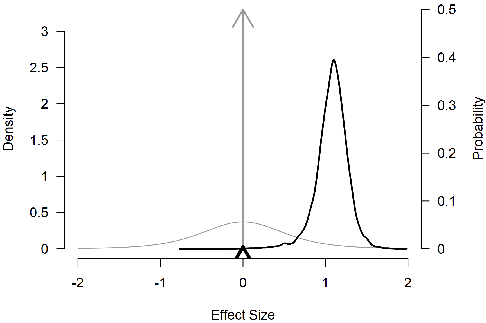
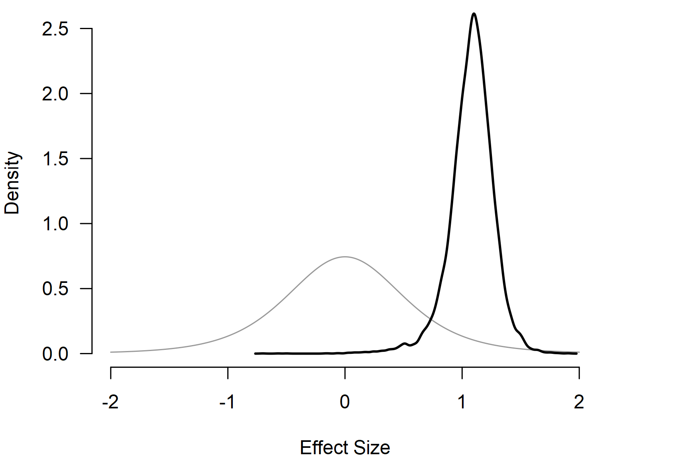
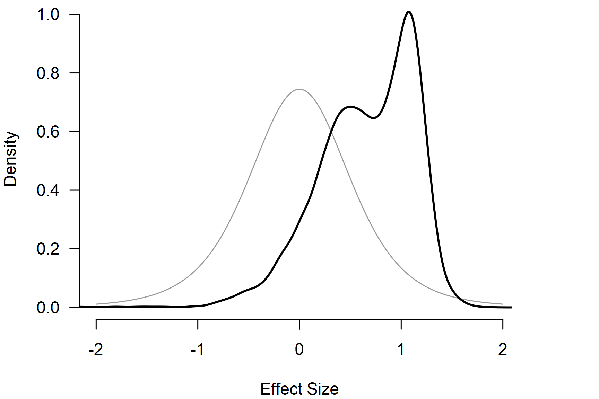

# Informed Bayesian Model-Averaged Meta-Analysis in Medicine

**This vignette accompanies the manuscript [Bayesian Model-Averaged
Meta-Analysis in Medicine](https://doi.org/10.1002/sim.9170) published
at *Statistics in Medicine* ([Bartoš et al.,
2021](#ref-bartos2021bayesian)).**

Bayesian model-averaged meta-analysis lets researchers incorporate prior
information from the literature into the analysis ([Bartoš et al.,
2021](#ref-bartos2021bayesian); [Gronau et al.,
2017](#ref-gronau2017bayesian), [2021](#ref-gronau2020primer)). This
vignette illustrates how to do this with an example from Bartoš et al.
([2021](#ref-bartos2021bayesian)), who developed informed prior
distributions for meta-analyses of continuous outcomes based on the
Cochrane database of systematic reviews. Then, we extend the example by
incorporating publication-bias adjustment with robust Bayesian
meta-analysis ([Bartoš et al., 2023](#ref-bartos2021no); [Maier et al.,
2023](#ref-maier2020robust)).

## Reproducing Informed Bayesian Model-Averaged Meta-Analysis (BMA)

We illustrate how to fit the informed BMA (not adjusting for publication
bias) using the `RoBMA` R package. For this purpose, we reproduce the
dentine hypersensitivity example from Bartoš et al.
([2021](#ref-bartos2021bayesian)), who reanalyzed five studies with a
tactile outcome assessment that were subjected to a meta-analysis by
Poulsen et al. ([2006](#ref-poulsen2006potassium)).

We load the dentine hypersensitivity data included in the package.

``` r

library(RoBMA)

data("Poulsen2006", package = "RoBMA")
Poulsen2006
#>           d        se               study
#> 1 0.9073050 0.2720456     STD-Schiff-1994
#> 2 0.7207589 0.1977769  STD-Silverman-1996
#> 3 1.3305829 0.2721648   STD-Sowinski-2000
#> 4 1.7688872 0.2656483 STD-Schiff-2000-(2)
#> 5 1.3286828 0.3582617     STD-Schiff-1998
```

To reproduce the analysis from the example, we need to set informed
empirical prior distributions for the effect sizes ($`\mu`$) and
heterogeneity ($`\tau`$) parameters that Bartoš et al.
([2021](#ref-bartos2021bayesian)) obtained from the Cochrane database of
systematic reviews. The current interface allows us to request these
prior distributions directly in the model call:

``` r

fit_BMA <- BMA(
  yi = d, sei = se, measure = "SMD",
  prior_informed_field    = "medicine",
  prior_informed_subfield = "Oral Health",
  data = Poulsen2006, slab = study,
  seed = 1, parallel = TRUE
)
```

with `prior_informed_field = "medicine"` and
`prior_informed_subfield = "Oral Health"` corresponding to the
$`\delta \sim T(0,0.51,5)`$ and $`\tau \sim InvGamma(1.79,0.28)`$
informed prior distributions for the “oral health” subfield when the
`measure = "SMD"` argument is specified. Use
`print(BayesTools::prior_informed_medicine_names)` to check names of all
available medical subfields or use
[`?prior_informed`](https://fbartos.github.io/RoBMA/reference/prior_informed.md)
for more details regarding the informed prior distributions.

The [`BMA()`](https://fbartos.github.io/RoBMA/reference/BMA.md) function
uses `yi` with either `sei` or `vi`, to specify the effect sizes and
standard errors or sampling variances from the dataset. The specified
prior distributions can be printed by setting the `only_priors = TRUE`
argument.

We obtain the output with the
[`summary()`](https://rdrr.io/r/base/summary.html) function. Adding the
`conditional = TRUE` argument allows us to inspect the conditional
estimates, i.e., the effect size estimate assuming that the models
specifying the presence of the effect are true and the heterogeneity
estimates assuming that the models specifying the presence of
heterogeneity are true$`^1`$.

``` r

summary(fit_BMA, conditional = TRUE, include_mcmc_diagnostics = FALSE)
#> 
#> Bayesian Model-Averaged Random-Effects Model (k = 5)
#> 
#> Component Inclusion
#>               Prior prob. Post. prob. Inclusion BF
#> Effect              0.500       0.996      240.935
#> Heterogeneity       0.500       0.779        3.529
#> 
#> Estimates
#>      Mean    SD 0.025   0.5 0.975
#> mu  1.076 0.203 0.631 1.092 1.423
#> tau 0.236 0.220 0.000 0.206 0.769
#> 
#> Conditional Estimates
#>      Mean    SD 0.025   0.5 0.975
#> mu  1.080 0.191 0.661 1.092 1.424
#> tau 0.303 0.205 0.073 0.257 0.822
```

The output from the [`summary()`](https://rdrr.io/r/base/summary.html)
function has 3 parts. The first one provides a basic summary of the
fitted models by component types (presence of the effect and
heterogeneity). The table summarizes the prior and posterior
probabilities and the inclusion Bayes factors of the individual
components. The results show that the inclusion Bayes factor for the
effect is similar to the one reported in Bartoš et al.
([2021](#ref-bartos2021bayesian)), $`\text{BF}_{10} = 240.9`$ and
$`\text{BF}_{\text{rf}} = 3.53`$ (minor differences are a consequence of
the product-space estimation algorithm in the new version of the
package).

The second part under the ‘Model-averaged estimates’ heading displays
the parameter estimates model-averaged across all specified models
(i.e., including models specifying the effect size to be zero). We move
to the last part.

The third part under the ‘Conditional estimates’ heading displays the
conditional effect size estimate corresponding to the one reported in
Bartoš et al. ([2021](#ref-bartos2021bayesian)), d = 1.080, 95% CI
\[0.661, 1.424\], and a heterogeneity estimate (not reported
previously).

The dedicated helper functions can be used to extract the pooled effect
and heterogeneity estimates directly (assuming the presence of the
effect and heterogeneity respectively):

``` r

pooled_effect(fit_BMA, conditional = TRUE)
#> 
#> Conditional Pooled Effect Size
#>     Mean Median 0.025 0.975
#> mu 1.080  1.092 0.661 1.424
pooled_heterogeneity(fit_BMA, conditional = TRUE)
#> 
#> Conditional Pooled Heterogeneity
#>      Mean Median 0.025 0.975
#> tau 0.303  0.257 0.073 0.822
```

## Visualizing the Results

The `RoBMA` R package provides several options for visualizing the
results. Here, we visualize the prior distribution (grey) and posterior
distribution (black) for the mean parameter.

``` r

par(mar = c(4, 4, 0, 4))
plot(fit_BMA, parameter = "mu", prior = TRUE, xlim = c(-2, 2), lwd = 2)
```



By default, the function plots the model-averaged estimates across all
models; the arrows represent the probability of a spike, and the lines
represent the posterior density under models assuming a non-zero effect.
The secondary y-axis (right) shows the probability of the spike (at
zero) decreasing from 0.50 to 0.005 (also obtainable from the model
summary).

To visualize the conditional effect size estimate, we can add the
`conditional = TRUE` argument,

``` r

par(mar = c(4, 4, 0, 4))
plot(fit_BMA, parameter = "mu", prior = TRUE, conditional = TRUE, xlim = c(-2, 2), lwd = 2)
```

 which
displays only the model-averaged posterior distribution of the effect
size parameter for models assuming the presence of the effect.

For more options provided by the plotting function, see its
documentation by using `?plot.brma()`.

## Adjusting for Publication Bias with Robust Bayesian Meta-Analysis

Finally, we illustrate how to adjust our informed BMA for publication
bias with robust Bayesian meta-analysis ([Bartoš et al.,
2023](#ref-bartos2021no); [Maier et al., 2023](#ref-maier2020robust)).
In short, we specify additional models assuming the presence of the
publication bias and correcting for it by either specifying a selection
model operating on $`p`$-values ([Vevea & Hedges,
1995](#ref-vevea1995general)) or by specifying a publication-bias
adjustment method correcting for the relationship between effect sizes
and standard errors (PET-PEESE) ([Stanley,
2017](#ref-stanley2017limitations); [Stanley & Doucouliagos,
2014](#ref-stanley2014meta)). See Bartoš et al.
([2022](#ref-bartos2020adjusting)) for a tutorial.

To compare results before and after publication-bias adjustment, we
contrast the informed BMA fit above with the publication-bias-adjusted
model.

Now, we fit the publication bias-adjusted model by switching from
[`BMA()`](https://fbartos.github.io/RoBMA/reference/BMA.md) to
[`RoBMA()`](https://fbartos.github.io/RoBMA/reference/RoBMA.md), which
uses the default 36-model RoBMA-PSMA ensemble ([Bartoš et al.,
2023](#ref-bartos2021no)).

``` r

fit_RoBMA <- RoBMA(
  yi = d, sei = se, measure = "SMD",
  prior_informed_field    = "medicine",
  prior_informed_subfield = "Oral Health",
  data = Poulsen2006, slab = study,
  seed = 1, parallel = TRUE
)
```

``` r

summary(fit_RoBMA, conditional = TRUE, include_mcmc_diagnostics = FALSE)
#> 
#> Robust Bayesian Model-Averaged Random-Effects Model (k = 5)
#> 
#> Component Inclusion
#>                  Prior prob. Post. prob. Inclusion BF
#> Effect                 0.500       0.708        2.424
#> Heterogeneity          0.500       0.644        1.806
#> Publication Bias       0.500       0.833        4.974
#> 
#> Estimates
#>      Mean    SD  0.025   0.5 0.975
#> mu  0.464 0.509 -0.267 0.413 1.300
#> tau 0.165 0.190  0.000 0.129 0.623
#> 
#> Conditional Estimates
#>      Mean    SD  0.025   0.5 0.975
#> mu  0.655 0.491 -0.384 0.720 1.330
#> tau 0.257 0.180  0.062 0.214 0.698
#> 
#> Publication Bias
#>                    Mean    SD 0.025   0.5  0.975
#> PET               1.801 2.150 0.000 0.000  5.534
#> PEESE             2.440 4.800 0.000 0.000 15.923
#> omega[0,0.025]    1.000 0.000 1.000 1.000  1.000
#> omega[0.025,0.05] 0.977 0.115 0.590 1.000  1.000
#> omega[0.05,0.5]   0.957 0.164 0.294 1.000  1.000
#> omega[0.5,0.95]   0.950 0.182 0.211 1.000  1.000
#> omega[0.95,0.975] 0.957 0.165 0.283 1.000  1.000
#> omega[0.975,1]    0.975 0.130 0.475 1.000  1.000
#> P-value intervals for publication bias weights omega correspond to one-sided p-values.
#> 
#> Conditional Publication Bias
#>                    Mean    SD 0.025   0.5  0.975
#> PET               3.642 1.624 0.387 3.968  6.348
#> PEESE             9.539 4.729 1.083 9.519 17.695
#> omega[0,0.025]    1.000 0.000 1.000 1.000  1.000
#> omega[0.025,0.05] 0.717 0.296 0.058 0.812  1.000
#> omega[0.05,0.5]   0.481 0.280 0.029 0.479  0.971
#> omega[0.5,0.95]   0.397 0.264 0.019 0.360  0.940
#> omega[0.95,0.975] 0.474 0.278 0.029 0.476  0.968
#> omega[0.975,1]    0.693 0.345 0.049 0.875  1.000
#> P-value intervals for publication bias weights omega correspond to one-sided p-values.
```

We notice the additional values in the ‘Component Inclusion’ table in
the ‘Publication Bias’ row. The model is now extended with 32
publication bias adjustment models that account for 50% of the prior
model probability. When comparing the RoBMA to the second BMA fit, we
notice a large decrease in the inclusion Bayes factor for the presence
of the effect $`\text{BF}_{10} = 2.42`$ vs. $`\text{BF}_{10} = 240.9`$,
which still presents weak evidence for the presence of the effect. We
can further quantify the evidence in favor of the publication bias with
the inclusion Bayes factor for publication bias
$`\text{BF}_{pb} = 4.97`$, which can be interpreted as moderate evidence
in favor of publication bias.

We can also compare the unadjusted and publication-bias-adjusted
conditional effect size estimates. Including models assuming publication
bias into our model-averaged estimate (assuming the presence of the
effect) decreases the estimated effect to d = 0.655, 95% CI \[-0.384,
1.330\] with a much wider credible interval.

``` r

pooled_effect(fit_BMA, conditional = TRUE)
#> 
#> Conditional Pooled Effect Size
#>     Mean Median 0.025 0.975
#> mu 1.080  1.092 0.661 1.424
pooled_effect(fit_RoBMA, conditional = TRUE)
#> 
#> Conditional Pooled Effect Size
#>     Mean Median  0.025 0.975
#> mu 0.655  0.720 -0.384 1.330
```

The same shift is visible in the prior and posterior plot below.

``` r

par(mar = c(4, 4, 0, 4))
plot(fit_RoBMA, parameter = "mu", prior = TRUE, conditional = TRUE, xlim = c(-2, 2), lwd = 2)
```



## Footnotes

$`^1`$ The model-averaged estimates that the `RoBMA` R package returns
by default are model-averaged across all specified models, a different
behavior from the `metaBMA` package that by default returns what we call
“conditional” estimates in the `RoBMA` R package.

## References

Bartoš, F., Gronau, Q. F., Timmers, B., Otte, W. M., Ly, A., &
Wagenmakers, E.-J. (2021). Bayesian model-averaged meta-analysis in
medicine. *Statistics in Medicine*, *40*(30), 6743–6761.
<https://doi.org/10.1002/sim.9170>

Bartoš, F., Maier, M., Quintana, D. S., & Wagenmakers, E.-J. (2022).
Adjusting for publication bias in JASP and R — Selection models,
PET-PEESE, and robust Bayesian meta-analysis. *Advances in Methods and
Practices in Psychological Science*, *5*(3), 1–19.
<https://doi.org/10.1177/25152459221109259>

Bartoš, F., Maier, M., Wagenmakers, E.-J., Doucouliagos, H., & Stanley,
T. D. (2023). Robust Bayesian meta-analysis: Model-averaging across
complementary publication bias adjustment methods. *Research Synthesis
Methods*, *14*(1), 99–116. <https://doi.org/10.1002/jrsm.1594>

Gronau, Q. F., Heck, D. W., Berkhout, S. W., Haaf, J. M., & Wagenmakers,
E.-J. (2021). A primer on Bayesian model-averaged meta-analysis.
*Advances in Methods and Practices in Psychological Science*, *4*(3),
1–19. <https://doi.org/10.1177/25152459211031256>

Gronau, Q. F., Van Erp, S., Heck, D. W., Cesario, J., Jonas, K. J., &
Wagenmakers, E.-J. (2017). A Bayesian model-averaged meta-analysis of
the power pose effect with informed and default priors: The case of felt
power. *Comprehensive Results in Social Psychology*, *2*(1), 123–138.
<https://doi.org/10.1080/23743603.2017.1326760>

Maier, M., Bartoš, F., & Wagenmakers, E.-J. (2023). Robust Bayesian
meta-analysis: Addressing publication bias with model-averaging.
*Psychological Methods*, *28*(1), 107–122.
<https://doi.org/10.1037/met0000405>

Poulsen, S., Errboe, M., Mevil, Y. L., & Glenny, A.-M. (2006). Potassium
containing toothpastes for dentine hypersensitivity. *Cochrane Database
of Systematic Reviews*, *3*.
<https://doi.org/10.1002/14651858.cd001476.pub2>

Stanley, T. D. (2017). Limitations of PET-PEESE and other meta-analysis
methods. *Social Psychological and Personality Science*, *8*(5),
581–591. <https://doi.org/10.1177/1948550617693062>

Stanley, T. D., & Doucouliagos, H. (2014). Meta-regression
approximations to reduce publication selection bias. *Research Synthesis
Methods*, *5*(1), 60–78. <https://doi.org/10.1002/jrsm.1095>

Vevea, J. L., & Hedges, L. V. (1995). A general linear model for
estimating effect size in the presence of publication bias.
*Psychometrika*, *60*(3), 419–435. <https://doi.org/10.1007/BF02294384>
