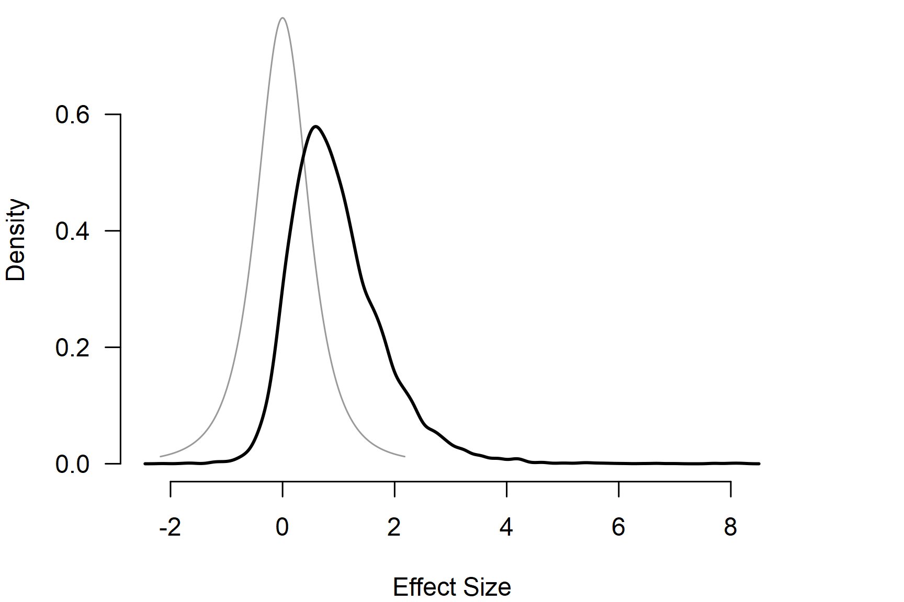

# Informed Bayesian Model-Averaged Meta-Analysis with Binary Outcomes

**This vignette accompanies the manuscript [Empirical Prior
Distributions for Bayesian Meta-Analyses of Binary and Time-to-Event
Outcomes](https://doi.org/10.48550/arXiv.2306.11468) preprinted at
*arXiv* ([Bartoš et al., 2023](#ref-bartos2023empirical)).**

Bayesian model-averaged meta-analysis can be specified using the
binomial likelihood and applied to data with dichotomous outcomes. This
vignette illustrates how to do this with an example from Bartoš et al.
([2023](#ref-bartos2023empirical)), who implemented a binomial-normal
Bayesian model-averaged meta-analytic model and developed informed prior
distributions for meta-analyses of binary and time-to-event outcomes
based on the Cochrane database of systematic reviews. See Bartoš et al.
([2021](#ref-bartos2021bayesian)) for informed prior distributions for
meta-analyses of continuous outcomes, highlighted in the [*Informed
Bayesian Model-Averaged Meta-Analysis in
Medicine*](https://fbartos.github.io/RoBMA/articles/34-bma-norm-medicine.md)
vignette.

## Binomial-Normal Bayesian Model-Averaged Meta-Analysis

We illustrate how to fit the binomial-normal Bayesian model-averaged
meta-analysis using the `RoBMA` R package. For this purpose, we
reproduce the example of adverse effects of honey in treating acute
cough in children from Bartoš et al. ([2023](#ref-bartos2023empirical)),
who reanalyzed two studies with adverse events of nervousness, insomnia,
or hyperactivity in the honey vs. no treatment condition that were
subjected to a meta-analysis by Oduwole et al.
([2018](#ref-oduwole2018honey)).

We load the `RoBMA` R package and specify the number of adverse events
and sample sizes in each arm as described on p. 73 of Oduwole et al.
([2018](#ref-oduwole2018honey)).

``` r
library(RoBMA)

events_experimental        <- c(5, 2)
events_control             <- c(0, 0)
observations_experimental  <- c(35, 40)
observations_control       <- c(39, 40)
study_names                <- c("Paul 2007", "Shadkam 2010")
```

Notice that both studies reported no adverse events in the control
group. Using a normal-normal meta-analytic model with log odds ratios
would require a continuity correction, which might result in bias.
Binomial-normal models allow us to circumvent the issue by modeling the
observed proportions directly (see Bartoš et al.
([2023](#ref-bartos2023empirical)) for more details).

We fit the binomial-normal Bayesian model-averaged meta-analysis using
informed prior distributions based on the `Acute Respiratory Infections`
subfield. We use the
[`BMA.glmm()`](https://fbartos.github.io/RoBMA/reference/BMA.glmm.md)
function and pass in the per-arm event counts (`ai`, `ci`) and sample
sizes (`n1i`, `n2i`); `measure = "OR"` selects the binomial-normal
likelihood. The `prior_informed_field` and `prior_informed_subfield`
arguments request the informed prior distributions for the individual
medical subfields automatically.

``` r
fit_BMA <- BMA.glmm(
  ai = events_experimental, n1i = observations_experimental,
  ci = events_control, n2i = observations_control,
  slab = study_names, measure = "OR",
  prior_informed_field    = "medicine",
  prior_informed_subfield = "Acute Respiratory Infections",
  seed = 1, parallel = TRUE
)
```

with `prior_informed_field = "medicine"` and
`prior_informed_subfield = "Acute Respiratory Infections"` corresponding
to the $`\mu \sim T(0,0.48,3)`$ and $`\tau \sim InvGamma(1.67, 0.45)`$
informed prior distributions on the log-odds-ratio scale (see
[`?prior_informed`](https://fbartos.github.io/RoBMA/reference/prior_informed.md)
for more details regarding the informed prior distributions).

We obtain the output with the
[`summary()`](https://rdrr.io/r/base/summary.html) function. Adding the
`conditional = TRUE` argument allows us to inspect the conditional
estimates, i.e., the effect size estimate assuming that the models
specifying the presence of the effect are true, and the heterogeneity
estimates assuming that the models specifying the presence of
heterogeneity are true. The summary reports parameter estimates on the
log-odds-ratio scale; we use
[`pooled_effect()`](https://fbartos.github.io/RoBMA/reference/pooled_effect.md)
with `transform = "EXP"` to obtain the estimates on the odds-ratio
scale.

``` r
summary(fit_BMA, conditional = TRUE, include_mcmc_diagnostics = FALSE)
#> 
#> Bayesian Model-Averaged Random-Effects Model (k = 2)
#> 
#> Component Inclusion
#>               Prior prob. Post. prob. Inclusion BF
#> Effect              0.500       0.726        2.643
#> Heterogeneity       0.500       0.559        1.269
#> 
#> Estimates
#>      Mean    SD  0.025   0.5 0.975
#> mu  0.704 0.838 -0.180 0.506 2.732
#> tau 0.399 0.734  0.000 0.149 2.487
#> 
#> Conditional Estimates
#>      Mean    SD  0.025   0.5 0.975
#> mu  0.971 0.843 -0.255 0.835 2.933
#> tau 0.713 0.859  0.096 0.412 3.089
```

The output from the [`summary()`](https://rdrr.io/r/base/summary.html)
function has three parts. The first one provides a basic summary of the
fitted models by component types (presence of the effect and
heterogeneity). The table summarizes the prior and posterior
probabilities and the inclusion Bayes factors of the individual
components. The results show that the inclusion Bayes factor for the
effect is similar to the one reported in Bartoš et al.
([2023](#ref-bartos2023empirical)), $`\text{BF}_{10} = 2.63`$ and
$`\text{BF}_{\text{rf}} = 1.30`$ (minor differences are a consequence of
the product-space estimation algorithm in the new version of the
package), giving weak/undecided evidence for the presence of the effect
and heterogeneity.

The second part under the ‘Model-averaged estimates’ heading displays
the parameter estimates model-averaged across all specified models
(i.e., including models specifying the effect size to be zero). These
estimates are shrunk towards the null hypotheses of no effect or no
heterogeneity in accordance with the posterior uncertainty about the
presence of the effect or heterogeneity. We find the model-averaged mean
effect OR = 3.39, 95% CI \[0.84, 15.14\], and a heterogeneity estimate
$`\tau_\text{logOR} = 0.42`$, 95% CI \[0.00, 2.59\].

The third part under the ‘Conditional estimates’ heading displays the
conditional effect size and heterogeneity estimates (i.e., estimates
assuming presence of the effect or heterogeneity) corresponding to the
ones reported in Bartoš et al. ([2023](#ref-bartos2023empirical)), OR =
4.24, 95% CI \[0.78, 17.61\], and a heterogeneity estimate
$`\tau_\text{logOR} = 0.75`$, 95% CI \[0.10, 3.23\].

The dedicated helper functions can be used to extract the pooled effect
and heterogeneity estimates directly on the odds-ratio scale (assuming
the presence of the effect and heterogeneity respectively):

``` r
pooled_effect(fit_BMA, conditional = TRUE, transform = "EXP")
#> 
#> Conditional Pooled Effect Size (odds ratio)
#>     Mean Median 0.025  0.975
#> mu 6.241  2.304 0.775 18.780
#> Effect estimates are summarized on the odds ratio scale using EXP on the log odds ratio measure.
pooled_heterogeneity(fit_BMA, conditional = TRUE)
#> 
#> Conditional Pooled Heterogeneity
#>      Mean Median 0.025 0.975
#> tau 0.713  0.412 0.096 3.089
```

We can also visualize the posterior distributions of the effect size and
heterogeneity parameters using the
[`plot()`](https://rdrr.io/r/graphics/plot.default.html) function. Here,
we set the `conditional = TRUE` argument to display the conditional
effect size estimate and `prior = TRUE` to include the prior
distribution in the plot.

``` r
par(mar = c(4, 4, 0, 4))
plot(fit_BMA, parameter = "mu", prior = TRUE, conditional = TRUE, lwd = 2)
```



Additional visualizations and summaries are demonstrated in the
[*Bayesian
Meta-Analysis*](https://fbartos.github.io/RoBMA/articles/02-bayesian-meta-analysis.md)
and [*Informed Bayesian Model-Averaged Meta-Analysis in
Medicine*](https://fbartos.github.io/RoBMA/articles/34-bma-norm-medicine.md)
vignettes.

## References

Bartoš, F., Gronau, Q. F., Timmers, B., Otte, W. M., Ly, A., &
Wagenmakers, E.-J. (2021). Bayesian model-averaged meta-analysis in
medicine. *Statistics in Medicine*, *40*(30), 6743–6761.
<https://doi.org/10.1002/sim.9170>

Bartoš, F., Otte, W. M., Gronau, Q. F., Timmers, B., Ly, A., &
Wagenmakers, E.-J. (2023). *Empirical prior distributions for Bayesian
meta-analyses of binary and time-to-event outcomes*.
<https://doi.org/10.48550/arXiv.2306.11468>

Oduwole, O., Udoh, E. E., Oyo-Ita, A., & Meremikwu, M. M. (2018). Honey
for acute cough in children. *Cochrane Database of Systematic Reviews*,
*4*. <https://doi.org/10.1002/14651858.CD007094.pub5>
