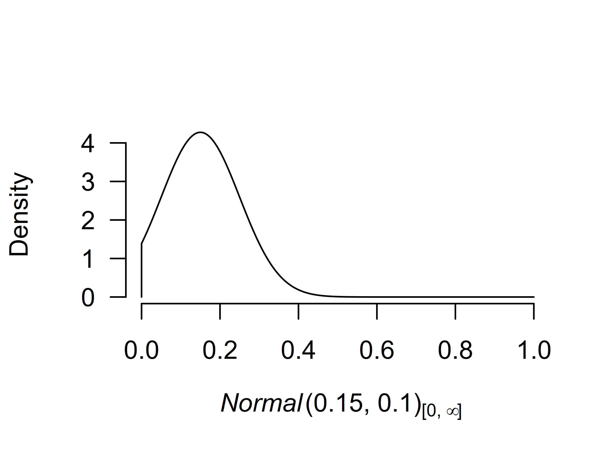
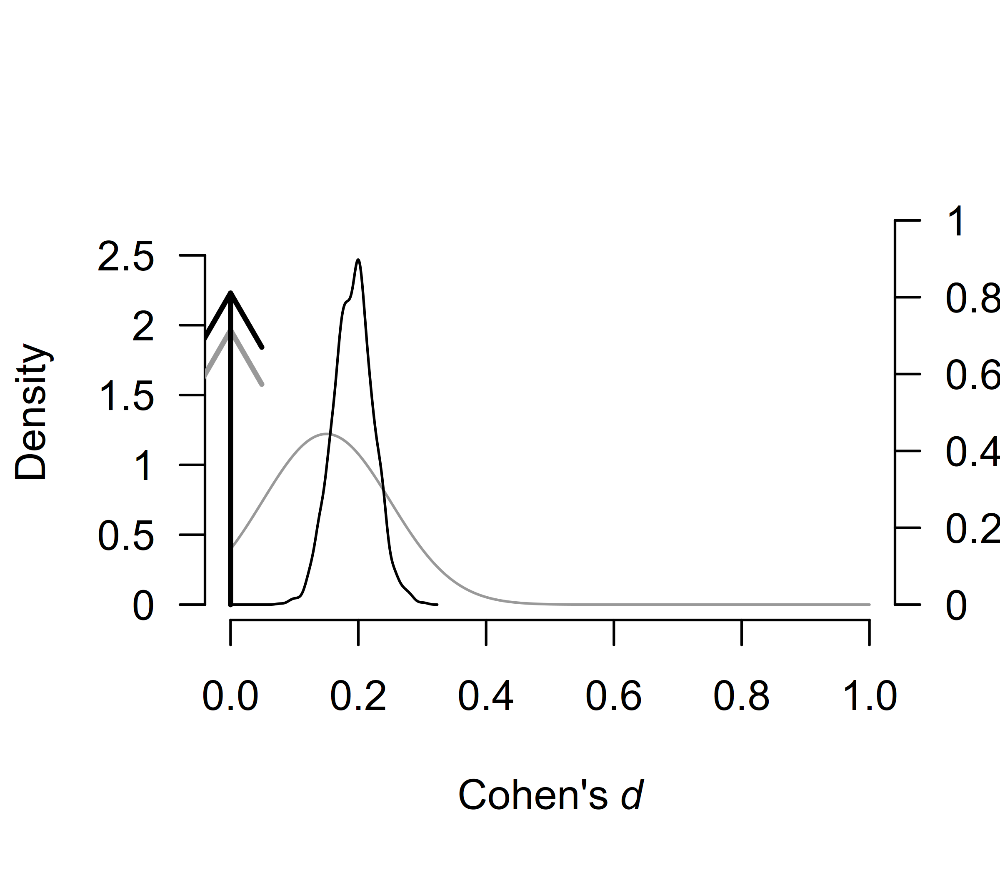
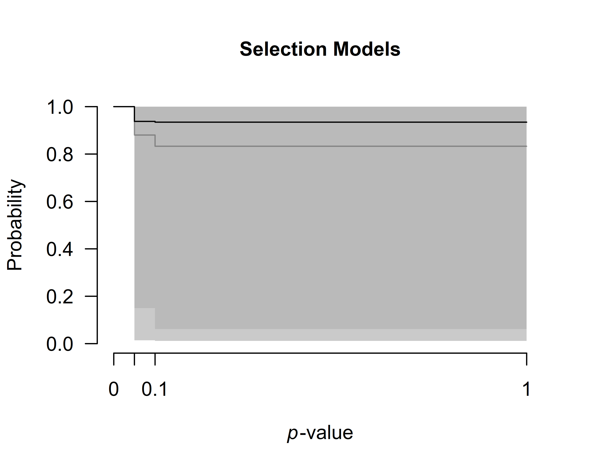
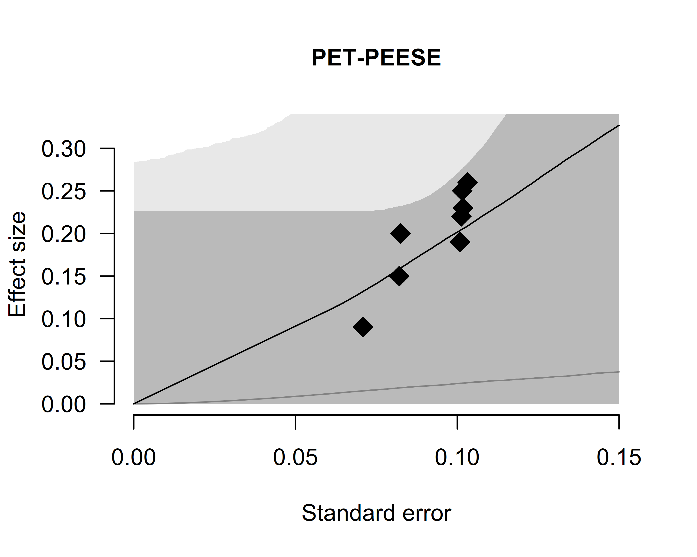

# Fitting Custom Meta-Analytic Ensembles

This vignette provides a step-by-step guide to fitting custom
meta-analytic ensembles using the RoBMA R package. By the end of this
guide, you will be able to construct and evaluate custom meta-analytic
models.

By default, the
[`RoBMA()`](https://fbartos.github.io/RoBMA/reference/RoBMA.md) function
specifies models as a combination of all supplied prior distributions
(across null and alternative specification), with their prior model
weights being equal to the product of prior distributions’ weights. This
results in the 36 meta-analytic models using the default settings
(Bartoš et al., 2023)$`^1`$. In [another
vignette](https://fbartos.github.io/RoBMA/articles/ReproducingBMA.md),
we illustrated that RoBMA can be also utilized for reproducing Bayesian
Model-Averaged Meta-Analysis (BMA) (Bartoš et al., 2021; Gronau et al.,
2017, 2021). However, the package was built as a framework for
estimating highly customized meta-analytic model ensembles. Here, we are
going to illustrate how to do exactly that (see Bartoš et al. (2022) for
a tutorial paper on customizing the model ensemble with JASP).

Please keep in mind that all models should be justified by theory.
Furthermore, the models should be tested to make sure that the ensemble
can perform as intended a priori to drawing inference from it. The
following sections are only for illustrating the functionality of the
package. We provide a complete discussion with the relevant sources in
the Example section of Bartoš et al. (2023).

### The Dataset

To illustrate the custom model building procedure, we use data from the
infamous Bem (2011) “Feeling the future” precognition study. We use
coding of the results as summarized by Bem in one of his later replies
(Bem et al., 2011).

``` r
library(RoBMA)
#> Loading required namespace: runjags
#> Loading required namespace: mvtnorm
#> RoBMA version 3.3 now features spike-and-slab style model-averaging via the 'algorithm = "ss"' argument.
#> See 'vignette("FastRoBMA", package = "RoBMA")' for more details ('algorithm = "ss"' argument will become the default setting in the future major release of the package).

data("Bem2011", package = "RoBMA")
Bem2011
#>      d         se                                        study
#> 1 0.25 0.10155048                  Detection of Erotic Stimuli
#> 2 0.20 0.08246211                Avoidance of Negative Stimuli
#> 3 0.26 0.10323629                        Retroactive Priming I
#> 4 0.23 0.10182427                       Retroactive Priming II
#> 5 0.22 0.10120277  Retroactive Habituation I - Negative trials
#> 6 0.15 0.08210765 Retroactive Habituation II - Negative trials
#> 7 0.09 0.07085372             Retroactive Induction of Boredom
#> 8 0.19 0.10089846                     Facilitation of Recall I
#> 9 0.42 0.14752627                    Facilitation of Recall II
```

### The Custom Ensemble

We consider the following scenarios as plausible explanations for the
data, and decide to include only those models into the meta-analytic
ensemble:

1.  there is absolutely no precognition effect - a fixed effects model
    assuming the effect size to be zero ($`H_{0}^f`$),
2.  the experiments measured the same underlying precognition effect - a
    fixed effects model ($`H_{1}^f`$),
3.  each of the experiments measured a slightly different precognition
    effect - a random effects model ($`H_{1}^r`$),
4.  there is absolutely no precognition effect and the results can be
    explained by publication bias, modeled with one of the following
    publication bias adjustments: - 4.1) one-sided selection operating
    on significant *p*-values ($`H_{1,\text{pb1}}^f`$), - 4.2) one-sided
    selection operating on significant and marginally significant
    *p*-values ($`H_{1,\text{pb2}}^f`$), - 4.3) PET correction for
    publication bias which adjusts for the relationship between effect
    sizes and standard errors ($`H_{1,\text{pb3}}^f`$), - 4.4) PEESE
    correction for publication bias which adjusts for the relationship
    between effect sizes and standard errors squared
    ($`H_{1,\text{pb4}}^f`$).

If we were to fit the ensemble using the
[`RoBMA()`](https://fbartos.github.io/RoBMA/reference/RoBMA.md) function
and specifying all of the priors, we would have ended with 2 (effect or
no effect) \* 2 (heterogeneity or no heterogeneity) \* 5 (no publication
bias or 4 ways of adjusting for publication bias) = 20 models. That is
13 models more than requested. Furthermore, we could not specify
different parameters for the prior distributions for each model. The
following process allows this, though we do not utilize it here.

We start with fitting only the first model using the
[`RoBMA()`](https://fbartos.github.io/RoBMA/reference/RoBMA.md) function
and we will continuously update the fitted object to include all of the
models.

#### Model 1

We initiate the model ensemble by specifying only the first model with
the [`RoBMA()`](https://fbartos.github.io/RoBMA/reference/RoBMA.md)
function. We explicitly specify prior distributions for all components
and set the prior distributions to correspond to the null hypotheses and
set the seed to ensure reproducibility of the results.

``` r
fit <- RoBMA(d = Bem2011$d, se = Bem2011$se, study_names = Bem2011$study,
             priors_effect = NULL, priors_heterogeneity = NULL, priors_bias = NULL,
             priors_effect_null        = prior("spike", parameters = list(location = 0)),
             priors_heterogeneity_null = prior("spike", parameters = list(location = 0)),
             priors_bias_null          = prior_none(),
             seed = 1)
```

We verify that the ensemble contains only the single specified model
with the [`summary()`](https://rdrr.io/r/base/summary.html) function by
setting `type = "models"`.

``` r
summary(fit, type = "models")
#> Call:
#> RoBMA(d = Bem2011$d, se = Bem2011$se, study_names = Bem2011$study, 
#>     priors_effect = NULL, priors_heterogeneity = NULL, priors_bias = NULL, 
#>     priors_effect_null = prior("spike", parameters = list(location = 0)), 
#>     priors_heterogeneity_null = prior("spike", parameters = list(location = 0)), 
#>     priors_bias_null = prior_none(), seed = 1)
#> 
#> Robust Bayesian meta-analysis
#> Models overview:
#>  Model Prior Effect Prior Heterogeneity Prior prob. log(marglik) Post. prob.
#>      1     Spike(0)            Spike(0)       1.000        -3.28       1.000
#>  Inclusion BF
#>           Inf
```

#### Model 2

Before we add the second model to the ensemble, we need to decide on the
prior distribution for the mean parameter. If precognition were to
exist, the effect would be small since all casinos would be bankrupted
otherwise. The effect would also be positive, since any deviation from
randomness could be characterized as an effect. Therefore, we decide to
use a normal distribution with mean = 0.15, standard deviation 0.10, and
truncated to the positive range. This sets the prior density around
small effect sizes. To get a better grasp of the prior distribution, we
visualize it using the `plot())` function (the figure can also be
created using the ggplot2 package by adding `plot_type = "ggplot"`
argument).

``` r
plot(prior("normal", parameters = list(mean = .15, sd = .10), truncation = list(lower = 0)))
```



We add the second model to the ensemble using the
[`update.RoBMA()`](https://fbartos.github.io/RoBMA/reference/update.RoBMA.md)
function. The function can also be used for many other purposes -
updating settings, prior model weights, and refitting failed models.
Here, we supply the fitted ensemble object and add an argument
specifying the prior distributions of each component for the additional
model. Since we want to add Model 2 - we set the prior for the $`\mu`$
parameter to be treated as a prior belonging to the alternative
hypothesis of the effect size component and the remaining priors treated
as belonging to the null hypotheses. If we wanted, we could also specify
`prior_weights` argument, to change the prior probability of the fitted
model but we do not utilize this option here and keep the default value,
which sets the prior weights for the new model to `1`. (Note that the
arguments for specifying prior distributions in
[`update.RoBMA()`](https://fbartos.github.io/RoBMA/reference/update.RoBMA.md)
function are `prior_X` - in singular, in comparison to
[`RoBMA()`](https://fbartos.github.io/RoBMA/reference/RoBMA.md) function
that uses `priors_X` in plural.)

``` r
fit <- update(fit,
              prior_effect             = prior("normal", parameters = list(mean = .15, sd = .10), truncation = list(lower = 0)),
              prior_heterogeneity_null = prior("spike",  parameters = list(location = 0)),
              prior_bias_null          = prior_none())
```

We can again inspect the updated ensemble to verify that it contains
both models. We see that Model 2 notably outperformed the first model
and attained all of the posterior model probability.

``` r
summary(fit, type = "models")
#> Call:
#> RoBMA(d = Bem2011$d, se = Bem2011$se, study_names = Bem2011$study, 
#>     priors_effect = NULL, priors_heterogeneity = NULL, priors_bias = NULL, 
#>     priors_effect_null = prior("spike", parameters = list(location = 0)), 
#>     priors_heterogeneity_null = prior("spike", parameters = list(location = 0)), 
#>     priors_bias_null = prior_none(), seed = 1)
#> 
#> Robust Bayesian meta-analysis
#> Models overview:
#>  Model        Prior Effect       Prior Heterogeneity Prior prob. log(marglik)
#>      1                  Spike(0)            Spike(0)       0.500        -3.28
#>      2 Normal(0.15, 0.1)[0, Inf]            Spike(0)       0.500        14.91
#>  Post. prob. Inclusion BF
#>        0.000        0.000
#>        1.000 79422247.251
```

#### Models 3-4.4

Before we add the remaining models to the ensemble using the
[`update()`](https://rdrr.io/r/stats/update.html) function, we need to
decide on the remaining prior distributions. Specifically, on the prior
distribution for the heterogeneity parameter $`\tau`$, and the
publication bias adjustment parameters $`\omega`$ (for the selection
models’ weightfunctions) and PET and PEESE for the PET and PEESE
adjustment.

For Model 3, we use the usual inverse-gamma(1, .15) prior distribution
based on empirical heterogeneity estimates (Erp et al., 2017) for the
heterogeneity parameter $`\tau`$. For Models 4.1-4.4 we use the default
settings for the publication bias adjustments as outlined in the
Appendix B of (Bartoš et al., 2023).

Now, we just need to add the remaining models to the ensemble using the
[`update()`](https://rdrr.io/r/stats/update.html) function as already
illustrated.

``` r
### adding Model 3
fit <- update(fit,
              prior_effect        = prior("normal", parameters = list(mean = .15, sd = .10), truncation = list(lower = 0)),
              prior_heterogeneity = prior("invgamma", parameters = list(shape = 1, scale = .15)),
              prior_bias_null     = prior_none())

### adding Model 4.1
fit <- update(fit,
              prior_effect_null        = prior("spike",     parameters = list(location = 0)),
              prior_heterogeneity_null = prior("spike",     parameters = list(location = 0)),
              prior_bias               = prior_weightfunction("one.sided", parameters = list(alpha = c(1, 1), steps = c(0.05))))
              
### adding Model 4.2
fit <- update(fit,
              prior_effect_null        = prior("spike",     parameters = list(location = 0)),
              prior_heterogeneity_null = prior("spike",     parameters = list(location = 0)),
              prior_bias               = prior_weightfunction("one.sided", parameters = list(alpha = c(1, 1, 1), steps = c(0.05, 0.10))))
              
### adding Model 4.3
fit <- update(fit,
              prior_effect_null        = prior("spike",     parameters = list(location = 0)),
              prior_heterogeneity_null = prior("spike",     parameters = list(location = 0)),
              prior_bias               = prior_PET("Cauchy", parameters = list(0, 1),  truncation = list(lower = 0)))
              
### adding Model 4.4
fit <- update(fit,
              prior_effect_null        = prior("spike",     parameters = list(location = 0)),
              prior_heterogeneity_null = prior("spike",     parameters = list(location = 0)),
              prior_bias               = prior_PEESE("Cauchy", parameters = list(0, 5),  truncation = list(lower = 0)))
```

We again verify that all of the requested models are included in the
ensemble using the `summary())` function with `type = "models"`
argument.

``` r
summary(fit, type = "models")
#> Call:
#> RoBMA(d = Bem2011$d, se = Bem2011$se, study_names = Bem2011$study, 
#>     priors_effect = NULL, priors_heterogeneity = NULL, priors_bias = NULL, 
#>     priors_effect_null = prior("spike", parameters = list(location = 0)), 
#>     priors_heterogeneity_null = prior("spike", parameters = list(location = 0)), 
#>     priors_bias_null = prior_none(), seed = 1)
#> 
#> Robust Bayesian meta-analysis
#> Models overview:
#>  Model        Prior Effect       Prior Heterogeneity
#>      1                  Spike(0)            Spike(0)
#>      2 Normal(0.15, 0.1)[0, Inf]            Spike(0)
#>      3 Normal(0.15, 0.1)[0, Inf]   InvGamma(1, 0.15)
#>      4                  Spike(0)            Spike(0)
#>      5                  Spike(0)            Spike(0)
#>      6                  Spike(0)            Spike(0)
#>      7                  Spike(0)            Spike(0)
#>                      Prior Bias                     Prior prob. log(marglik)
#>                                                           0.143        -3.28
#>                                                           0.143        14.91
#>                                                           0.143        12.85
#>       omega[one-sided: .05] ~ CumDirichlet(1, 1)          0.143        13.70
#>   omega[one-sided: .1, .05] ~ CumDirichlet(1, 1, 1)       0.143        12.58
#>                         PET ~ Cauchy(0, 1)[0, Inf]        0.143        15.75
#>                       PEESE ~ Cauchy(0, 5)[0, Inf]        0.143        15.65
#>  Post. prob. Inclusion BF
#>        0.000        0.000
#>        0.168        1.210
#>        0.021        0.132
#>        0.050        0.318
#>        0.016        0.100
#>        0.391        3.845
#>        0.353        3.278
```

### Using the Fitted Ensemble

Finally, we use the [`summary()`](https://rdrr.io/r/base/summary.html)
function to inspect the model results. The results from our custom
ensemble indicate weak evidence for the absence of the precognition
effect, $`\text{BF}_{10} = 0.584`$ -\> $`\text{BF}_{01} = 1.71`$,
moderate evidence for the absence of heterogeneity,
$`\text{BF}_{\text{rf}} = 0.132`$ -\> $`\text{BF}_{\text{fr}} = 7.58`$,
and moderate evidence for the presence of the publication bias,
$`\text{BF}_{\text{pb}} = 3.21`$.

``` r
summary(fit)
#> Call:
#> RoBMA(d = Bem2011$d, se = Bem2011$se, study_names = Bem2011$study, 
#>     priors_effect = NULL, priors_heterogeneity = NULL, priors_bias = NULL, 
#>     priors_effect_null = prior("spike", parameters = list(location = 0)), 
#>     priors_heterogeneity_null = prior("spike", parameters = list(location = 0)), 
#>     priors_bias_null = prior_none(), seed = 1)
#> 
#> Robust Bayesian meta-analysis
#> Components summary:
#>               Models Prior prob. Post. prob. Inclusion BF
#> Effect           2/7       0.286       0.189        0.584
#> Heterogeneity    1/7       0.143       0.021        0.132
#> Bias             4/7       0.571       0.811        3.212
#> 
#> Model-averaged estimates:
#>                  Mean Median 0.025  0.975
#> mu              0.036  0.000 0.000  0.226
#> tau             0.002  0.000 0.000  0.000
#> omega[0,0.05]   1.000  1.000 1.000  1.000
#> omega[0.05,0.1] 0.938  1.000 0.014  1.000
#> omega[0.1,1]    0.935  1.000 0.012  1.000
#> PET             0.820  0.000 0.000  2.601
#> PEESE           7.284  0.000 0.000 25.508
#> The estimates are summarized on the Cohen's d scale (priors were specified on the Cohen's d scale).
```

The finalized ensemble can be treated as any other `RoBMA` ensemble
using the [`summary()`](https://rdrr.io/r/base/summary.html),
[`plot()`](https://rdrr.io/r/graphics/plot.default.html),
[`plot_models()`](https://fbartos.github.io/RoBMA/reference/plot_models.md),
[`forest()`](https://fbartos.github.io/RoBMA/reference/forest.md), and
[`diagnostics()`](https://fbartos.github.io/RoBMA/reference/diagnostics.md)
functions. For example, we can use the
[`plot.RoBMA()`](https://fbartos.github.io/RoBMA/reference/plot.RoBMA.md)
with the `parameter = "mu", prior = TRUE` arguments to plot the prior
(grey) and posterior distribution (black) for the effect size. The
function visualizes the model-averaged estimates across all models by
default. The arrows represent the probability mass at the value 0 (a
spike at 0). The secondary y-axis (right) shows the probability mass at
the zero effect size, which increased from the prior probability of 0.71
to the posterior the posterior probability of 0.81.

``` r
plot(fit, parameter = "mu", prior = TRUE)
```



We can also inspect the posterior distributions of the publication bias
adjustments. To visualize the model-averaged weightfunction, we set
`parameter = weightfunction` argument. The resulting figure shows the
light gray prior distribution and the dark gray the posterior
distribution.

``` r
plot(fit, parameter = "weightfunction", prior = TRUE)
```



We can also inspect the posterior estimate of the regression
relationship between the standard errors and effect sizes by setting
`parameter = "PET-PEESE"`.

``` r
plot(fit, parameter = "PET-PEESE", prior = TRUE)
```



### Footnotes

$`^1`$ - The default setting used to produce 12 models in RoBMA versions
\< 2, which corresponded to an earlier an article by Maier et al. (2023)
in which we applied Bayesian model-averaging only across selection
models.

### References

Bartoš, F., Gronau, Q. F., Timmers, B., Otte, W. M., Ly, A., &
Wagenmakers, E.-J. (2021). Bayesian model-averaged meta-analysis in
medicine. *Statistics in Medicine*, *40*(30), 6743–6761.
<https://doi.org/10.1002/sim.9170>

Bartoš, F., Maier, Maximilian, Quintana, D. S., & Wagenmakers, E.-J.
(2022). Adjusting for publication bias in JASP and R — Selection models,
PET-PEESE, and robust Bayesian meta-analysis. *Advances in Methods and
Practices in Psychological Science*, *5*(3), 1–19.
<https://doi.org/10.1177/25152459221109259>

Bartoš, F., Maier, M., Wagenmakers, E.-J., Doucouliagos, H., & Stanley,
T. D. (2023). Robust Bayesian meta-analysis: Model-averaging across
complementary publication bias adjustment methods. *Research Synthesis
Methods*, *14*(1), 99–116. <https://doi.org/10.1002/jrsm.1594>

Bem, D. J. (2011). Feeling the future: Experimental evidence for
anomalous retroactive influences on cognition and affect. *Journal of
Personality and Social Psychology*, *100*(3), 407–425.
<https://doi.org/10.1037/a0021524>

Bem, D. J., Utts, J., & Johnson, W. O. (2011). Must psychologists change
the way they analyze their data? *Journal of Personality and Social
Psychology*, *101*(4), 716–719. <https://doi.org/10.1037/a0024777>

Erp, S. van, Verhagen, J., Grasman, R. P., & Wagenmakers, E.-J. (2017).
Estimates of between-study heterogeneity for 705 meta-analyses reported
in Psychological Bulletin from 1990–2013. *Journal of Open Psychology
Data*, *5*(1), 1–5. <https://doi.org/10.5334/jopd.33>

Gronau, Q. F., Heck, D. W., Berkhout, S. W., Haaf, J. M., & Wagenmakers,
E.-J. (2021). A primer on Bayesian model-averaged meta-analysis.
*Advances in Methods and Practices in Psychological Science*, *4*(3),
1–19. <https://doi.org/10.1177/25152459211031256>

Gronau, Q. F., Van Erp, S., Heck, D. W., Cesario, J., Jonas, K. J., &
Wagenmakers, E.-J. (2017). A Bayesian model-averaged meta-analysis of
the power pose effect with informed and default priors: The case of felt
power. *Comprehensive Results in Social Psychology*, *2*(1), 123–138.
<https://doi.org/10.1080/23743603.2017.1326760>

Maier, M., Bartoš, F., & Wagenmakers, E.-J. (2023). Robust Bayesian
meta-analysis: Addressing publication bias with model-averaging.
*Psychological Methods*, *28*(1), 107–122.
<https://doi.org/10.1037/met0000405>
