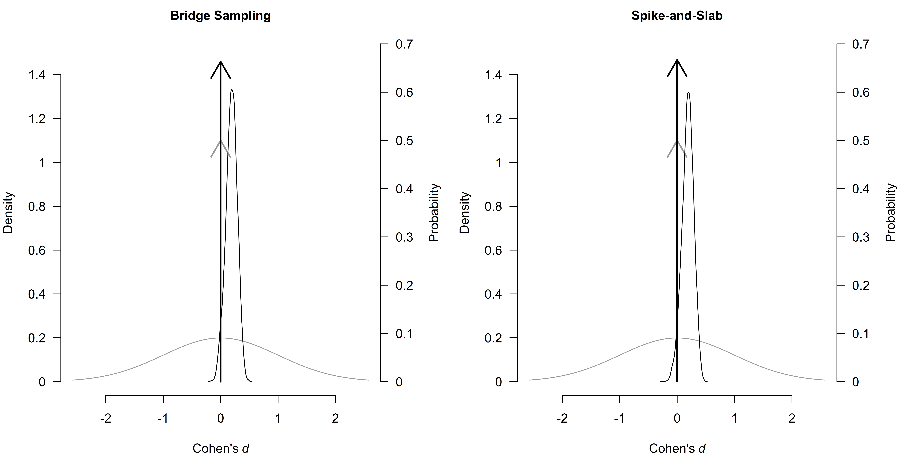
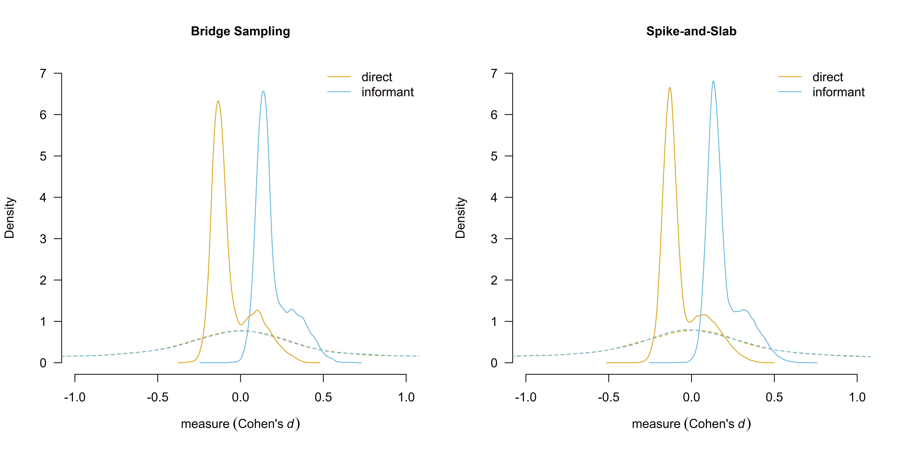

# Fast Robust Bayesian Meta-Analysis via Spike and Slab Algorithm

This vignette demonstrates how to fit a robust Bayesian model-averaged
meta-regression
([`RoBMA.reg()`](https://fbartos.github.io/RoBMA/reference/RoBMA.reg.md))
in the `RoBMA` R package using two different algorithms:

- Bridge sampling (the current default, `algorithm = "bridge"`),
- Spike-and-slab (`algorithm = "ss"`).

We compare both approaches in terms of fitting time, side-by-side
summaries, marginal summaries, and illustrative plots. We then discuss
advantages and disadvantages of the spike-and-slab approach, especially
for complex meta-regression with multiple moderators. We will use the
example from (Bartoš et al., 2025) which focuses on the effect of
household chaos on child executive functions with two moderators:
assessment type (measure: “direct” vs. “informant”) and mean child age
(age). See (Bartoš et al., 2025) and [Robust Bayesian Model-Averaged
Meta-Regression](https://fbartos.github.io/RoBMA/articles/MetaRegression.md)
vignette for in depth discussion of the example and guidance on applying
robust Bayesian model-averaged meta-regression. Here, we show that both
algorithms produce essentially identical results; however,
spike-and-slab can be much faster when many moderators (hence many
models) are present. Note that the spike-and-slab algorithm can be also
applied in the case of hierarchical (3-lvl) models (see [Hierarchical
Bayesian Model-Averaged
Meta-Analysis](https://fbartos.github.io/RoBMA/articles/HierarchicalBMA.md))
which makes hierarchical approximate selection models feasible.

### Fitting Models via Bridge Sampling vs. Spike-and-Slab

Below, we specify and fit the same meta-regression with publication bias
adjustment using the two algorithms. First, we load the package and
inspect the data set.

``` r
library(RoBMA)
data("Andrews2021", package = "RoBMA")
head(Andrews2021)
#>       r         se measure      age
#> 1 0.070 0.04743416  direct 4.606660
#> 2 0.033 0.04371499  direct 2.480833
#> 3 0.170 0.10583005  direct 7.750000
#> 4 0.208 0.08661986  direct 4.000000
#> 5 0.270 0.02641969  direct 4.000000
#> 6 0.170 0.05147815  direct 4.487500
```

Second, we estimate the meta-regression models using the two algorithms.
We use the same formula, data, and settings for both algorithms. The
bridge sampling approach is specified with `algorithm = "bridge"`, while
the spike-and-slab approach is specified with `algorithm = "ss"`. We use
the current default settings for the number of chains, samples, burn-in,
and adaptation settings for the bridge algorithm, however, we
significantly increase the number of chains and samples for the
spike-and-slab algorithm to ensure convergence. This is important as the
spike-and-slab algorithm estimates the complete model-averaged ensemble
within a single MCMC run, while the bridge algorithm estimates each
model separately and then combines them. We also time the estimation
process for comparison using the
[`Sys.time()`](https://rdrr.io/r/base/Sys.time.html) function.

``` r
## Bridge sampling
t1_bridge <- Sys.time()
fit_RoBMA.bridge <- RoBMA.reg(
  formula   = ~ measure + age,
  data      = Andrews2021,
  algorithm = "bridge", 
  chains    = 3, 
  sample    = 5000, 
  burnin    = 2000,
  adapt     = 500,
  parallel  = TRUE
)
t2_bridge <- Sys.time()

## Spike-and-slab
t1_ss <- Sys.time()
fit_RoBMA.ss <- RoBMA.reg(
  formula   = ~ measure + age,
  data      = Andrews2021,
  algorithm = "ss", 
  chains    = 6, 
  sample    = 10000,
  burnin    = 2500,
  adapt     = 2500,
  parallel  = TRUE
)
t2_ss <- Sys.time()
```

Once the models are fitted, we compute the time taken to fit each model.

``` r
bridge_time <- difftime(t2_bridge, t1_bridge, units = "mins")
ss_time     <- difftime(t2_ss, t1_ss, units = "mins")
```

Running on a high-performing laptop with a 6c/12t Intel CPU, the bridge
sampling approach took about 24 minutes, while the spike-and-slab
approach took ~0.58 minutes. This highlights the efficiency advantage of
the spike-and-slab algorithm as the number of moderators (and hence the
number of potential models) grows. This is especially important as the
number of models grows following 36x2^p, where p corresponds the number
of moderators. For example, with 3 moderators, the number of models is
36x2^3 = 288, and with 4 moderators, the number of models is 36x2^4 =
576 (more is essentially unattainable on a consumer PC).

### Comparing Summary Outputs

Below we compare the numeric summaries using the
[`summary()`](https://rdrr.io/r/base/summary.html) for each fitted
object.

``` r
summary(fit_RoBMA.bridge)
#> Call:
#> RoBMA.reg(formula = ~measure + age, data = Andrews2021, algorithm = "bridge", 
#>     chains = 3, sample = 5000, burnin = 2000, adapt = 500, parallel = TRUE)
#> 
#> Robust Bayesian meta-regression
#> Components summary:
#>                Models Prior prob. Post. prob. Inclusion BF
#> Effect         72/144       0.500       0.337 5.080000e-01
#> Heterogeneity  72/144       0.500       1.000 1.043245e+23
#> Bias          128/144       0.500       0.965 2.796700e+01
#> 
#> Meta-regression components summary:
#>         Models Prior prob. Post. prob. Inclusion BF
#> measure 72/144       0.500       0.950       18.955
#> age     72/144       0.500       0.154        0.181
#> 
#> Model-averaged estimates:
#>                    Mean Median 0.025 0.975
#> mu                0.064  0.000 0.000 0.328
#> tau               0.212  0.208 0.149 0.297
#> omega[0,0.025]    1.000  1.000 1.000 1.000
#> omega[0.025,0.05] 0.999  1.000 1.000 1.000
#> omega[0.05,0.5]   0.998  1.000 1.000 1.000
#> omega[0.5,0.95]   0.996  1.000 1.000 1.000
#> omega[0.95,0.975] 0.996  1.000 1.000 1.000
#> omega[0.975,1]    0.997  1.000 1.000 1.000
#> PET               2.046  2.487 0.000 3.292
#> PEESE             1.006  0.000 0.000 9.780
#> The estimates are summarized on the Cohen's d scale (priors were specified on the Cohen's d scale).
#> (Estimated publication weights omega correspond to one-sided p-values.)
#> 
#> Model-averaged meta-regression estimates:
#>                            Mean Median  0.025 0.975
#> intercept                 0.064  0.000  0.000 0.328
#> measure [dif: direct]    -0.125 -0.129 -0.214 0.000
#> measure [dif: informant]  0.125  0.129  0.000 0.214
#> age                       0.000  0.000 -0.044 0.044
#> The estimates are summarized on the Cohen's d scale (priors were specified on the Cohen's d scale).
summary(fit_RoBMA.ss)
#> Call:
#> RoBMA.reg(formula = ~measure + age, data = Andrews2021, algorithm = "ss", 
#>     chains = 6, sample = 10000, burnin = 2500, adapt = 2500, 
#>     parallel = TRUE)
#> 
#> Robust Bayesian meta-regression
#> Components summary:
#>               Prior prob. Post. prob. Inclusion BF
#> Effect              0.500       0.333        0.499
#> Heterogeneity       0.500       1.000          Inf
#> Bias                0.500       0.966       28.340
#> 
#> Meta-regression components summary:
#>         Prior prob. Post. prob. Inclusion BF
#> measure       0.500       0.953       20.307
#> age           0.500       0.151        0.178
#> 
#> Model-averaged estimates:
#>                    Mean Median 0.025  0.975
#> mu                0.062  0.000 0.000  0.331
#> tau               0.211  0.207 0.148  0.297
#> omega[0,0.025]    1.000  1.000 1.000  1.000
#> omega[0.025,0.05] 0.999  1.000 1.000  1.000
#> omega[0.05,0.5]   0.998  1.000 1.000  1.000
#> omega[0.5,0.95]   0.996  1.000 1.000  1.000
#> omega[0.95,0.975] 0.996  1.000 1.000  1.000
#> omega[0.975,1]    0.996  1.000 1.000  1.000
#> PET               2.059  2.504 0.000  3.301
#> PEESE             1.008  0.000 0.000 10.123
#> The estimates are summarized on the Cohen's d scale (priors were specified on the Cohen's d scale).
#> (Estimated publication weights omega correspond to one-sided p-values.)
#> 
#> Model-averaged meta-regression estimates:
#>                            Mean Median  0.025 0.975
#> intercept                 0.062  0.000  0.000 0.331
#> measure [dif: direct]    -0.125 -0.128 -0.214 0.000
#> measure [dif: informant]  0.125  0.128  0.000 0.214
#> age                       0.000  0.000 -0.045 0.043
#> The estimates are summarized on the Cohen's d scale (priors were specified on the Cohen's d scale).
```

The posterior probabilities for each component are very similar. For
example, the posterior probability of including the measure moderator is
≈ 0.95 in both fits, and the probability of including the age moderator
is ≈ 0.15. The posterior mean estimates for mu, tau, and the regression
coefficients are essentially the same (differences are within the 3rd
decimal place). Inclusion Bayes factors differ very slightly (0.499
vs. 0.508, etc.) but not in any meaningful or qualitatively different
way. Hence, both algorithms yield consistent inferences but differ
drastically in computation time when there are many models to evaluate.
Visual inspection of the posterior distributions for the effect size and
the moderators reveals that the two algorithms produce nearly identical
results.

``` r
par(mfrow = c(1, 2), mar = c(4, 4, 2, 5))
plot(fit_RoBMA.bridge, parameter = "mu", prior = TRUE, main = "Bridge Sampling")
plot(fit_RoBMA.ss,     parameter = "mu", prior = TRUE, main = "Spike-and-Slab")
```



Next, we compare the marginal estimates for the moderators at each level
of measure, and age (centered at -1 SD, 0 SD, +1 SD, respectively).
These “marginal means” clarify the estimated model-averaged effect for
each factor level. We use the
[`marginal_summary()`](https://fbartos.github.io/RoBMA/reference/marginal_summary.md)
function to extract these summaries.

``` r
marginal_summary(fit_RoBMA.bridge)
#> Call:
#> RoBMA.reg(formula = ~measure + age, data = Andrews2021, algorithm = "bridge", 
#>     chains = 3, sample = 5000, burnin = 2000, adapt = 500, parallel = TRUE)
#> 
#> Robust Bayesian meta-analysis
#> Model-averaged marginal estimates:
#>                      Mean Median  0.025 0.975 Inclusion BF
#> intercept           0.064  0.000  0.000 0.328        0.508
#> measure[direct]    -0.061 -0.108 -0.208 0.246        0.844
#> measure[informant]  0.188  0.156  0.000 0.458        8.950
#> age[-1SD]           0.064  0.000 -0.030 0.326        0.300
#> age[0SD]            0.064  0.000  0.000 0.328        0.356
#> age[1SD]            0.064  0.000 -0.043 0.335        0.307
#> The estimates are summarized on the Cohen's d scale (priors were specified on the Cohen's d scale).
#> mu_age[0SD]: There is a considerable cluster of posterior samples at the exact null hypothesis values. The Savage-Dickey density ratio is likely to be invalid.
#> mu_age[0SD]: There is a considerable cluster of prior samples at the exact null hypothesis values. The Savage-Dickey density ratio is likely to be invalid.
marginal_summary(fit_RoBMA.ss)
#> Call:
#> RoBMA.reg(formula = ~measure + age, data = Andrews2021, algorithm = "ss", 
#>     chains = 6, sample = 10000, burnin = 2500, adapt = 2500, 
#>     parallel = TRUE)
#> 
#> Robust Bayesian meta-analysis
#> Model-averaged marginal estimates:
#>                      Mean Median  0.025 0.975 Inclusion BF
#> intercept           0.062  0.000  0.000 0.331        0.492
#> measure[direct]    -0.063 -0.108 -0.211 0.241        0.781
#> measure[informant]  0.187  0.154  0.000 0.460        8.639
#> age[-1SD]           0.062  0.000 -0.031 0.328        0.298
#> age[0SD]            0.062  0.000  0.000 0.331        0.310
#> age[1SD]            0.062  0.000 -0.047 0.340        0.296
#> The estimates are summarized on the Cohen's d scale (priors were specified on the Cohen's d scale).
#> mu_age[0SD]: There is a considerable cluster of posterior samples at the exact null hypothesis values. The Savage-Dickey density ratio is likely to be invalid.
#> mu_age[0SD]: There is a considerable cluster of prior samples at the exact null hypothesis values. The Savage-Dickey density ratio is likely to be invalid.
```

Again, the mean estimates differ only in the third decimal place and the
differences in the inclusion BF are qualitatively equal (e.g., 8.950
vs. 8.639 for the inclusion Bayes factor at the measure\[informant\]
level). A visual comparison of the estimated marginal means reveals that
the two algorithms produce nearly identical results.

``` r
par(mfrow = c(1, 2))
marginal_plot(fit_RoBMA.bridge, parameter = "measure", conditional = TRUE, prior = TRUE, xlim = c(-1, 1), ylim = c(0, 7), main = "Bridge Sampling")
marginal_plot(fit_RoBMA.ss,     parameter = "measure", conditional = TRUE, prior = TRUE, xlim = c(-1, 1), ylim = c(0, 7), main = "Spike-and-Slab")
```



### Conclusion

Spike-and-slab (`algorithm = "ss"`) is much faster than bridge sampling
(`algorithm = "bridge"`) for estimating robust Bayesian meta-analysis
model ensembles. This advantage further extends in cases of
meta-regression models involving many predictors. Despite huge
differences in computation time, both algorithms produce nearly
identical inferences for model-averaged effect sizes, moderator effects,
and posterior probabilities. Currently, the `"bridge"` algorithm remains
the default option in the `RoBMA` R package but future major releases
will switch to the `"ss"` algorithms the new default (and modify the
default MCMC settings).

### References

Bartoš, F., Maier, M., Stanley, T., & Wagenmakers, E.-J. (2025). Robust
Bayesian meta-regression: Model-averaged moderation analysis in the
presence of publication bias. *Psychological Methods*.
<https://doi.org/10.1037/met0000737>
