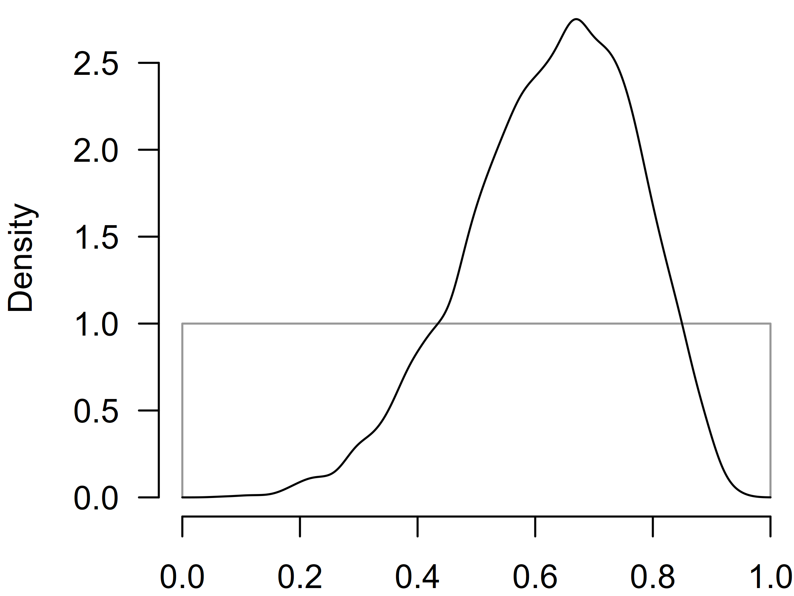

# Hierarchical Bayesian Model-Averaged Meta-Analysis

Hierarchical (or multilevel/3-level) meta-analysis adjusts for the
dependency of effect sizes due to clustering in the data. For example,
effect size estimates from multiple experiments reported in the same
manuscript might be expected to be more similar than effect sizes from a
different paper (Konstantopoulos, 2011). This vignette illustrates how
to deal with such dependencies among effect size estimates (in cases
with simple nested structure) using the Bayesian model-averaged
meta-analysis (BMA) (Bartoš et al., 2021; Gronau et al., 2017, 2021).
(See other vignettes for more details on BMA: [Reproducing
BMA](https://fbartos.github.io/RoBMA/articles/ReproducingBMA.md) or
[Informed BMA in
medicine](https://fbartos.github.io/RoBMA/articles/MedicineBMA.md).)

First, we introduce the example data set. Second, we illustrate the
frequentist hierarchical meta-analysis with the `metafor` R package and
discuss the results. Third, we outline the hierarchical meta-analysis
parameterization. Fourth, we estimate the Bayesian model-averaged
hierarchical meta-analysis. Finally, we conclude by discussing further
extensions and publication bias adjustment.

Note that since version 3.5 of the `RoBMA` package, the hierarchical
meta-analysis and meta-regression can use the spike-and-slab
model-averaging algorithm described in [Fast Robust Bayesian
Meta-Analysis via Spike and Slab
Algorithm](https://fbartos.github.io/RoBMA/articles/FastRoBMA.md). The
spike-and-slab model-averaging algorithm is a more efficient alternative
to the bridge algorithm, which is the current default in the `RoBMA`
package. For non-selection models, the likelihood used in the
spike-and-slab algorithm is equivalent to the bridge algorithm. However,
the likelihood in the selection models is modified since marginalization
of the random-effects is not performed. As such, the selection models
use likelihood that closely approximates the exact selection model
likelihood. In our testing and a simulation study, found that the
approximate selection likelihood performs reasonably well and is better
than the non-hierarchical exact likelihood model when within-study
dependencies are present.

### Example Data Set

We use the `dat.konstantopoulos2011` data set from the `metadat` R
package (Thomas et al., 2019) that is used for the same functionality in
the metafor (Wolfgang, 2010) R package. We roughly follow the example in
the data set’s help file, `?dat.konstantopoulos2011`. The data set
consists of 56 studies estimating the effects of modified school
calendars on students’ achievement. The 56 studies were run in
individual schools, which can be grouped into 11 districts. We might
expect more similar effect size estimates from schools in the same
district – in other words, the effect size estimates from the same
district might not be completely independent. Consequently, we might
want to adjust for this dependency (clustering) between the effect size
estimates to draw a more appropriate inference.

First, we load the data set, assign it to the `dat` object, and inspect
the first few rows.

``` r

data("dat.konstantopoulos2011", package = "metadat")
dat <- dat.konstantopoulos2011

head(dat)
#>   district school study year    yi    vi
#> 1       11      1     1 1976 -0.18 0.118
#> 2       11      2     2 1976 -0.22 0.118
#> 3       11      3     3 1976  0.23 0.144
#> 4       11      4     4 1976 -0.30 0.144
#> 5       12      1     5 1989  0.13 0.014
#> 6       12      2     6 1989 -0.26 0.014
```

In the following analyses, we use the following variables:

- `yi`, standardized mean differences,
- `vi`, sampling variances of the standardized mean differences,
- `district`, district id which distinguishes among the districts,
- and `school`, that distinguishes among different schools within the
  same district.

### Frequentist Hierarchical Meta-Analysis with `metafor`

We follow the data set’s help file and fit a simple random effects
meta-analysis using the `rma()` function from `metafor` package. This
model ignores the dependency between effect size estimates. We use this
simple model as our starting point and as a comparison with the later
models.

``` r

fit_metafor.0 <- metafor::rma(yi = yi, vi = vi, data = dat)
fit_metafor.0
#> 
#> Random-Effects Model (k = 56; tau^2 estimator: REML)
#> 
#> tau^2 (estimated amount of total heterogeneity): 0.0884 (SE = 0.0202)
#> tau (square root of estimated tau^2 value):      0.2974
#> I^2 (total heterogeneity / total variability):   94.70%
#> H^2 (total variability / sampling variability):  18.89
#> 
#> Test for Heterogeneity:
#> Q(df = 55) = 578.8640, p-val < .0001
#> 
#> Model Results:
#> 
#> estimate      se    zval    pval   ci.lb   ci.ub     
#>   0.1279  0.0439  2.9161  0.0035  0.0419  0.2139  ** 
#> 
#> ---
#> Signif. codes:  0 '***' 0.001 '**' 0.01 '*' 0.05 '.' 0.1 ' ' 1
```

The model summary returns a small but statistically significant effect
size estimate $`\mu = 0.128`$ ($`\text{se} = 0.044`$) and a considerable
heterogeneity estimate $`\tau = 0.297`$.

We extend the model to account for the hierarchical structure of the
data, i.e., schools within districts, by using the `rma.mv()` function
from the `metafor` package and extending it with the
`random = ~ school | district` argument.

``` r

fit_metafor <- metafor::rma.mv(yi, vi, random = ~ school | district, data = dat)
fit_metafor
#> 
#> Multivariate Meta-Analysis Model (k = 56; method: REML)
#> 
#> Variance Components:
#> 
#> outer factor: district (nlvls = 11)
#> inner factor: school   (nlvls = 11)
#> 
#>             estim    sqrt  fixed 
#> tau^2      0.0978  0.3127     no 
#> rho        0.6653             no 
#> 
#> Test for Heterogeneity:
#> Q(df = 55) = 578.8640, p-val < .0001
#> 
#> Model Results:
#> 
#> estimate      se    zval    pval   ci.lb   ci.ub    
#>   0.1847  0.0846  2.1845  0.0289  0.0190  0.3504  * 
#> 
#> ---
#> Signif. codes:  0 '***' 0.001 '**' 0.01 '*' 0.05 '.' 0.1 ' ' 1
```

We find that accounting for the hierarchical structure of the data
results in (1) a slightly larger effect size estimate ($`\mu = 0.187`$)
and (2) larger standard error of the effect size estimate
($`\text{se} = 0.085`$). The larger standard error is a natural
consequence of accounting for the dependency between the effect sizes.
Because the effect sizes are dependent, they contribute less additional
information than independent effect sizes would. Specifying the
hierarchical model then accounts for the dependency by estimating
similarity between the estimates from the same cluster (school) and
discounting the information borrowed from each estimate. The estimate of
the similarity among estimates from the same cluster is summarized in
the `\rho = 0.666` estimate.

### Specifications of Hierarchical Meta-Analysis

We specify a simple hierarchical meta-analytic model (see
Konstantopoulos (2011) for an example). Using distributional notation,
we can describe the data generating process as a multi-stage sampling
procedure. In a nutshell, we assume the existence of an overall mean
effect $`\mu`$. Next, we assume that the effect sizes in each district
$`k = 1, \dots, K`$, $`\gamma_k`$, systematically differ from the mean
effect, with the variance of the district-level effects summarized with
heterogeneity $`\tau_{b}`$ (as between). Furthermore, we assume that the
true effects $`\theta_{k,j}`$ of each study $`j = 1, \dots J_k`$
systematically differ from the district-level effect, with the variance
of the study effects from the district-level effect summarized with
heterogeneity $`\tau_{w}`$ (as within). Finally, the observed effect
sizes $`y_{k,j}`$ that differ from the true effects $`y_{k,j}`$ due to
random errors $`\text{se}_{k,j}`$.

Mathematically, we can describe such a model as:
``` math
\begin{aligned}
  \gamma_k     &\sim \text{N}(\mu,          \tau_b^2),\\
  \theta_{k,j} &\sim \text{N}(\gamma_k,     \tau_w^2),\\
   y_{k,j}     &\sim \text{N}(\theta_{k,j}, \text{se}_{k,j}).\\
\end{aligned}
```
Where N() denotes a normal distribution with mean and variance.

Conveniently, and with a bit of algebra, we do not need to estimate the
district-level and true study effects. Instead, we marginalize them out,
and we sample the observed effect sizes from each district $`y_{k,.}`$
directly from a multivariate normal distributions, MN(), with a common
mean $`\mu`$ and covariance matrix S:
``` math
\begin{aligned}
   y_{k,.}  &\sim \text{MN}(\mu, \text{S}),\\
   \text{S} &= \begin{bmatrix} 
      \tau_b^2 + \tau_w^2 + \text{se}_1^2 & \tau_w^2 & \dots & \tau_w^2  \\
      \tau_w^2 & \tau_b^2 + \tau_w^2 + \text{se}_2^2 & \dots & \tau_w^2  \\
      \dots  & \dots & \dots & \dots \\
      \tau_w^2 & \tau_w^2 & \dots & \tau_b^2 + \tau_w^2 + \text{se}_{J_k}^2 & \\
  \end{bmatrix}.
\end{aligned}
```
The random effects marginalization is helpful as it allows us to sample
fewer parameters from the posterior distribution (which significantly
simplifies marginal likelihood estimation via bridge sampling).
Furthermore, the marginalization allows us to properly specify selection
model publication bias adjustment models – the marginalization
propagates the selection process up through all the sampling steps at
once (we cannot proceed with the sequential sampling as the selection
procedure on the observed effect sizes modifies the sampling
distributions of all the preceding levels).

We can further re-parameterize the model by performing the following
substitution,
``` math
\begin{aligned}
   \tau^2 &= \tau_b^2 + \tau_w^2,\\
   \rho   &= \frac{\tau_w^2}{\tau_b^2 + \tau_w^2},
\end{aligned}
```
and specifying the covariance matrix using the inter-study correlation
$`\rho`$, total heterogeneity $`\tau`$, and the standard errors
$`\text{se}_{.}`$:
``` math
\begin{aligned}
   \text{S} &= \begin{bmatrix} 
      \tau^2 + \text{se}_1^2 & \rho\tau^2 & \dots & \rho\tau^2  \\
      \rho\tau^2 & \tau^2 + \text{se}_2^2 & \dots & \rho\tau^2  \\
      \dots  & \dots & \dots & \dots \\
      \rho\tau^2 & \rho\tau^2 & \dots & \tau^2 + \text{se}_{J_k}^2 & \\
  \end{bmatrix}.
\end{aligned}
```
This specification corresponds to the compound symmetry covariance
matrix of random effects, the default settings in the
[`metafor::rma.mv()`](https://wviechtb.github.io/metafor/reference/rma.mv.html)
function. More importantly, it allows us to easily specify prior
distributions on the correlation coefficient $`\rho`$ and the total
heterogeneity $`\tau`$.

### Hierarchical Bayesian Model-Averaged Meta-Analysis with `RoBMA`

Before we estimate the complete Hierarchical Bayesian Model-Averaged
Meta-Analysis (hBMA) with the `RoBMA` package, we briefly reproduce the
simpler models we estimated with the `metafor` package in the previous
section.

#### Bayesian Random Effects Meta-Analysis

First, we estimate a simple Bayesian random effects meta-analysis
(corresponding to `fit_metafor.0`). We use `the RoBMA()` function and
specify the effect sizes and sampling variances via the `d = dat$yi` and
`v = dat$vi` arguments. We set the `priors_effect_null`,
`priors_heterogeneity_null`, and `priors_bias` arguments to null to omit
models assuming the absence of the effect, heterogeneity, and the
publication bias adjustment components.

``` r

fit.0 <- RoBMA(d = dat$yi, v = dat$vi,
               priors_effect_null        = NULL,
               priors_heterogeneity_null = NULL,
               priors_bias               = NULL,
               parallel = TRUE, seed = 1)
```

We generate a complete summary for the only estimated model by adding
the `type = "individual"` argument to the
[`summary()`](https://rdrr.io/r/base/summary.html) function.

``` r

summary(fit.0, type = "individual")
#> Call:
#> RoBMA(d = dat$yi, v = dat$vi, priors_bias = NULL, priors_effect_null = NULL, 
#>     priors_heterogeneity_null = NULL, parallel = TRUE, seed = 1)
#> 
#> Robust Bayesian meta-analysis                                                               
#>  Model              1             Parameter prior distributions
#>  Prior prob.    1.000                    mu ~ Normal(0, 1)     
#>  log(marglik)   17.67                   tau ~ InvGamma(1, 0.15)
#>  Post. prob.    1.000                                          
#>  Inclusion BF     Inf                                          
#> 
#> Parameter estimates:
#>      Mean    SD   lCI Median   uCI error(MCMC) error(MCMC)/SD  ESS R-hat
#> mu  0.126 0.043 0.041  0.127 0.211     0.00044          0.010 9757 1.000
#> tau 0.292 0.033 0.233  0.290 0.364     0.00034          0.010 9678 1.000
#> The estimates are summarized on the Cohen's d scale (priors were specified on the Cohen's d scale).
```

We verify that the effect size, $`\mu = 0.126`$
($`\text{95% CI } [0.041, 0.211]`$), and heterogeneity, $`\tau = 0.292`$
($`\text{95% CI } [0.233, 0.364]`$), estimates closely correspond to the
frequentist results (as we would expect from parameter estimates under
weakly informative priors).

#### Hierarchical Bayesian Random Effects Meta-Analysis

Second, we account for the clustered effect size estimates within
districts by extending the previous function call with the
`cluster = dat$district` argument. This allows us to estimate the
hierarchical Bayesian random effects meta-analysis (corresponding to
`fit_metafor`). We use the default prior distribution for the
correlation parameter `\rho \sim \text{Beta}(1, 1)`, set via the
`priors_hierarchical` argument, which restricts the correlation to be
positive and uniformly distributed on the interval $`(0, 1)`$.

``` r

fit <- RoBMA(d = dat$yi, v = dat$vi, cluster = dat$district,
             priors_effect_null        = NULL,
             priors_heterogeneity_null = NULL,
             priors_bias               = NULL,
             parallel = TRUE, seed = 1)
```

Again, we generate the complete summary for the only estimated model,

``` r

summary(fit, type = "individual")
#> Call:
#> RoBMA(d = dat$yi, v = dat$vi, cluster = dat$district, priors_bias = NULL, 
#>     priors_effect_null = NULL, priors_heterogeneity_null = NULL, 
#>     parallel = TRUE, seed = 1)
#> 
#> Robust Bayesian meta-analysis                                                               
#>  Model              1             Parameter prior distributions
#>  Prior prob.    1.000                    mu ~ Normal(0, 1)     
#>  log(marglik)   25.70                   tau ~ InvGamma(1, 0.15)
#>  Post. prob.    1.000                   rho ~ Beta(1, 1)       
#>  Inclusion BF     Inf                                          
#> 
#> Parameter estimates:
#>      Mean    SD   lCI Median   uCI error(MCMC) error(MCMC)/SD  ESS R-hat
#> mu  0.181 0.083 0.017  0.180 0.346     0.00088          0.011 9041 1.000
#> tau 0.308 0.056 0.223  0.299 0.442     0.00090          0.016 3859 1.000
#> rho 0.627 0.142 0.320  0.641 0.864     0.00219          0.015 4202 1.000
#> The estimates are summarized on the Cohen's d scale (priors were specified on the Cohen's d scale).
```

and verify that our estimates, again, correspond to the frequentist
counterparts, with the estimated effect size, $`\mu = 0.181`$
($`\text{95% CI } [0.017, 0.346]`$), heterogeneity, $`\tau = 0.308`$
($`\text{95% CI } [0.223, 0.442]`$), and correlation, $`\rho = 0.627`$
($`\text{95% CI } [0.320, 0.864]`$).

We can further visualize the prior and posterior distribution of the
$`\rho`$ parameter using the
[`plot()`](https://rdrr.io/r/graphics/plot.default.html) function.

``` r

par(mar = c(2, 4, 0, 0))
plot(fit, parameter = "rho", prior = TRUE)
```



#### Bayesian Model Averaging over Hierarchical Models

Third, we extend the previous model into a model ensemble that also
includes models assuming the absence of the effect and/or heterogeneity
(we do not incorporate models assuming presence of publication bias due
to computational complexity explained in the summary). Including those
additional models allows us to evaluate evidence in favor of the effect
and heterogeneity. Furthermore, specifying all those additional models
allows us to incorporate the uncertainty about the specified models and
weight the posterior distribution according to how well the models
predicted the data. We estimate the remaining models by removing the
`priors_effect_null` and `priors_heterogeneity_null` arguments from the
previous function calls, which include the previously omitted models of
no effect and/or no heterogeneity.

``` r

fit_BMA <- RoBMA(d = dat$yi, v = dat$vi, cluster = dat$district,
                 priors_bias = NULL,
                 parallel = TRUE, seed = 1)
```

Now we generate a summary for the complete model-averaged ensemble by
not specifying any additional arguments in the
[`summary()`](https://rdrr.io/r/base/summary.html) function.

``` r

summary(fit_BMA)
#> Call:
#> RoBMA(d = dat$yi, v = dat$vi, cluster = dat$district, priors_bias = NULL, 
#>     parallel = TRUE, seed = 1)
#> 
#> Robust Bayesian meta-analysis
#> Components summary:
#>               Models Prior prob. Post. prob. Inclusion BF
#> Effect           2/4       0.500       0.478 9.170000e-01
#> Heterogeneity    2/4       0.500       1.000 9.326943e+92
#> Hierarchical     2/4       0.500       1.000 9.326943e+92
#> 
#> Model-averaged estimates:
#>      Mean Median 0.025 0.975
#> mu  0.087  0.000 0.000 0.314
#> tau 0.326  0.317 0.231 0.472
#> rho 0.659  0.675 0.354 0.879
#> The estimates are summarized on the Cohen's d scale (priors were specified on the Cohen's d scale).
```

We find the ensemble contains four models, the combination of models
assuming the presence/absence of the effect/heterogeneity, each with
equal prior model probabilities. Importantly, the models assuming
heterogeneity are also specified with the hierarchical structure and
account for the clustering. A comparison of the specified models reveals
weak evidence against the effect, $`\text{BF}_{10} = 0.917`$, and
extreme evidence for the presence of heterogeneity,
$`\text{BF}_{\text{rf}} = 9.3\times10^{92}`$. Moreover, we find that the
`Hierarchical` component summary has the same values as the
`Heterogeneity` component summary because the default settings specify
that all models assuming the presence of heterogeneity also include the
hierarchical structure.

We also obtain the model-averaged posterior estimates that combine the
posterior estimates from all models according to the posterior model
probabilities, the effect size, $`\mu = 0.087`$
($`\text{95% CI } [0.000, 0.314]`$), heterogeneity, $`\tau = 0.326`$
($`\text{95% CI } [0.231, 0.472]`$), and correlation, $`\rho = 0.659`$
($`\text{95% CI } [0.354, 0.879]`$).

#### Testing the Presence of Clustering

In the previous analyses, we assumed that the effect sizes are indeed
clustered within the districts, and we only adjusted for the clustering.
However, the effect sizes within the same cluster may not be more
similar than effect sizes from different clusters. Now, we specify a
model ensemble that allows us to test this assumption by specifying two
sets of random effect meta-analytic models. The first set of models
assumes that there is indeed clustering and that the correlation of
random effects is uniformly distributed on the $`(0, 1)`$ interval (as
in the previous analyses). The second set of models assumes that there
is no clustering, i.e., the correlation of random effects $`\rho = 0`$,
which simplifies the structured covariance matrix to a diagonal matrix.
Again, we model average across models assuming the presence and absence
of the effect to account for the model uncertainty.

To specify this ‘special’ model ensemble with the
[`RoBMA()`](https://fbartos.github.io/RoBMA/reference/RoBMA.md)
function, we need to modify the previous model call in the following
ways. We removed the fixed effect models by specifying the
`priors_heterogeneity_null = NULL` argument.$`^1`$ Furthermore, we
specify the prior distribution for models assuming the absence of the
hierarchical structure by adding the
`priors_hierarchical_null = prior(distribution = "spike", parameters = list("location" = 0))`
argument.

``` r

hierarchical_test <- RoBMA(d = dat$yi, v = dat$vi, cluster = dat$district,
                           priors_heterogeneity_null = NULL,
                           priors_hierarchical_null = prior(distribution = "spike", parameters = list("location" = 0)),
                           priors_bias = NULL,
                           parallel = TRUE, seed = 1)
```

``` r

summary(hierarchical_test)
#> Call:
#> RoBMA(d = dat$yi, v = dat$vi, cluster = dat$district, priors_bias = NULL, 
#>     priors_heterogeneity_null = NULL, priors_hierarchical_null = prior(distribution = "spike", 
#>         parameters = list(location = 0)), parallel = TRUE, seed = 1)
#> 
#> Robust Bayesian meta-analysis
#> Components summary:
#>               Models Prior prob. Post. prob. Inclusion BF
#> Effect           2/4       0.500       0.478        0.917
#> Heterogeneity    4/4       1.000       1.000          Inf
#> Hierarchical     2/4       0.500       1.000     4624.794
#> 
#> Model-averaged estimates:
#>      Mean Median 0.025 0.975
#> mu  0.087  0.000 0.000 0.314
#> tau 0.326  0.317 0.231 0.472
#> rho 0.659  0.675 0.354 0.879
#> The estimates are summarized on the Cohen's d scale (priors were specified on the Cohen's d scale).
```

We summarize the resulting model ensemble and find out that the
`Hierarchical` component is no longer equivalent to the `Heterogeneity`
component – the new model specification allowed us to compare random
effect models assuming the presence of the hierarchical structure to
random effect models assuming the absence of the hierarchical structure.
The resulting inclusion Bayes factor of the hierarchical structure shows
extreme evidence in favor of clustering of the effect sizes,
$`\text{BF}_{\rho\bar{\rho}} = 4624`$, i.e., there is extreme evidence
that the intervention results in more similar effects within the
districts.

### Summary

We illustrated how to estimate a hierarchical Bayesian model-averaged
meta-analysis using the `RoBMA` package. The hBMA model allows us to
test for the presence vs absence of the effect and heterogeneity while
simultaneously adjusting for clustered effect size estimates. While the
current implementation allows us to draw a fully Bayesian inference,
incorporate prior information, and acknowledge model uncertainty, it has
a few limitations in contrast to the `metafor` package. E.g., the
`RoBMA` package only allows a simple nested random effects (i.e.,
estimates within studies, schools within districts etc). The simple
nesting allows us to break the full covariance matrix into per cluster
block matrices which speeds up the already demanding computation.
Furthermore, the computational complexity significantly increases when
considering selection models as we need to compute an exponentially
increasing number of multivariate normal probabilities with the
increasing cluster size (existence of clusters with more than four
studies makes the current implementation impractical due to the
computational demands). However, these current limitations are not the
end of the road, as we are exploring other approaches (e.g., only
specifying PET-PEESE style publication bias adjustment and other
dependency adjustments) in a future vignette.

### Footnotes

$`^1`$ We could also model-average across the hierarchical structure
assuming fixed effect models, i.e., $`\tau \sim f(.)`$ and $`\rho = 1`$.
However specifying such a model ensemble is a beyond the scope of this
vignette, see [Custom
ensembles](https://fbartos.github.io/RoBMA/articles/CustomEnsembles.md)
vignette for some hints.

### References

Bartoš, F., Gronau, Q. F., Timmers, B., Otte, W. M., Ly, A., &
Wagenmakers, E.-J. (2021). Bayesian model-averaged meta-analysis in
medicine. *Statistics in Medicine*, *40*(30), 6743–6761.
<https://doi.org/10.1002/sim.9170>

Gronau, Q. F., Heck, D. W., Berkhout, S. W., Haaf, J. M., & Wagenmakers,
E.-J. (2021). A primer on Bayesian model-averaged meta-analysis.
*Advances in Methods and Practices in Psychological Science*, *4*(3),
1–19. <https://doi.org/10.1177/25152459211031256>

Gronau, Q. F., Van Erp, S., Heck, D. W., Cesario, J., Jonas, K. J., &
Wagenmakers, E.-J. (2017). A Bayesian model-averaged meta-analysis of
the power pose effect with informed and default priors: The case of felt
power. *Comprehensive Results in Social Psychology*, *2*(1), 123–138.
<https://doi.org/10.1080/23743603.2017.1326760>

Konstantopoulos, S. (2011). Fixed effects and variance components
estimation in three-level meta-analysis. *Research Synthesis Methods*,
*2*(1), 61–76. <https://doi.org/10.1002/jrsm.35>

Thomas, W., Daniel, N., Alistair, S., W. Kyle, H., & Wolfgang, V.
(2019). *metadat: Meta-analysis datasets*.
<https://cran.r-project.org/package=metadat>

Wolfgang, V. (2010). Conducting meta-analyses in R with the metafor
package. *Journal of Statistical Software*, *36*(3), 1–48.
<https://www.jstatsoft.org/v36/i03/>
