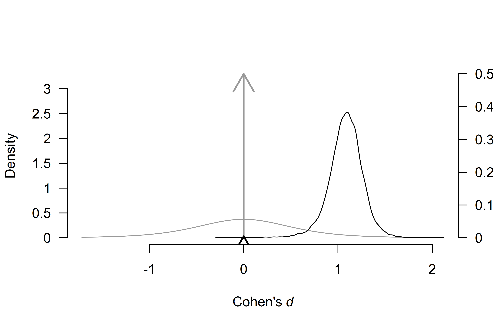
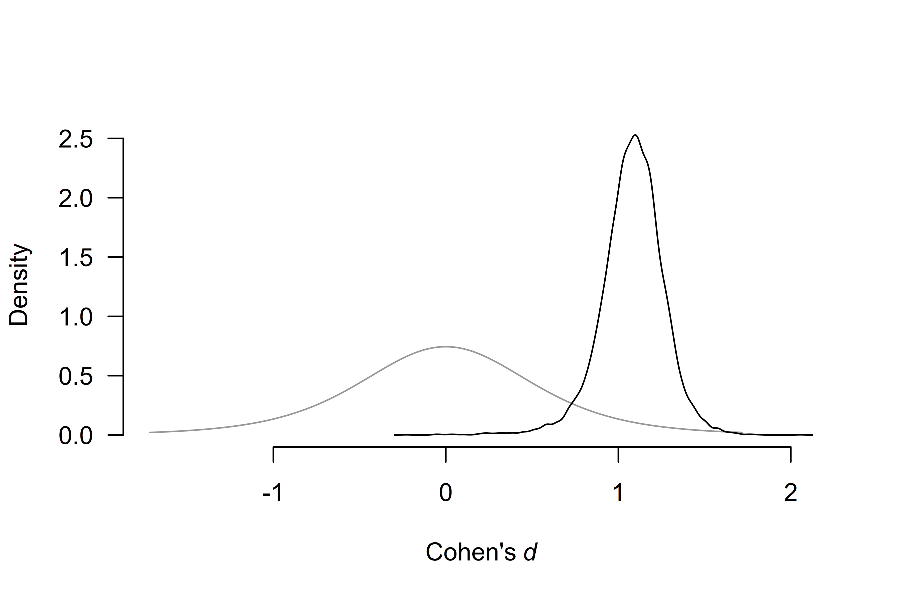
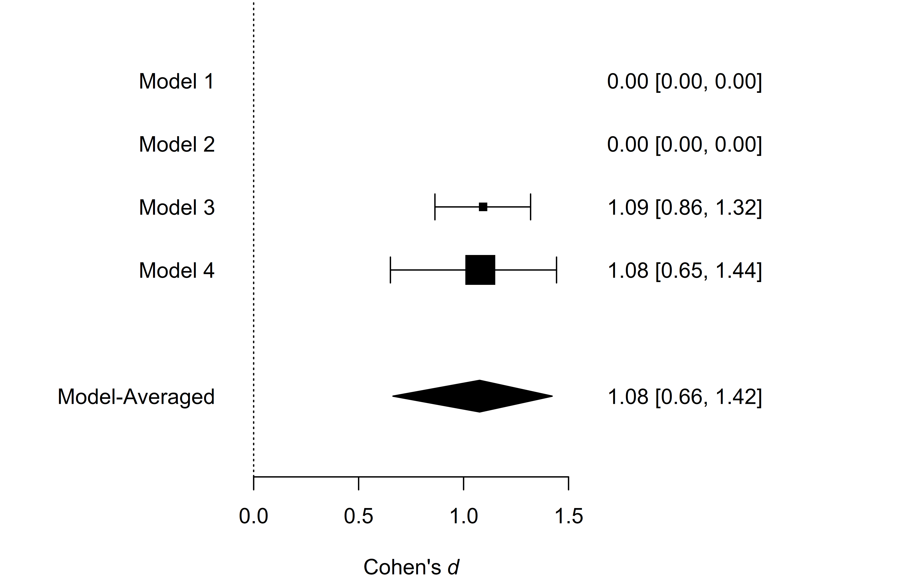
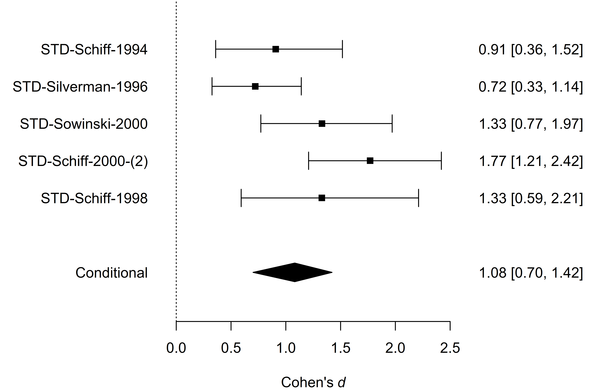
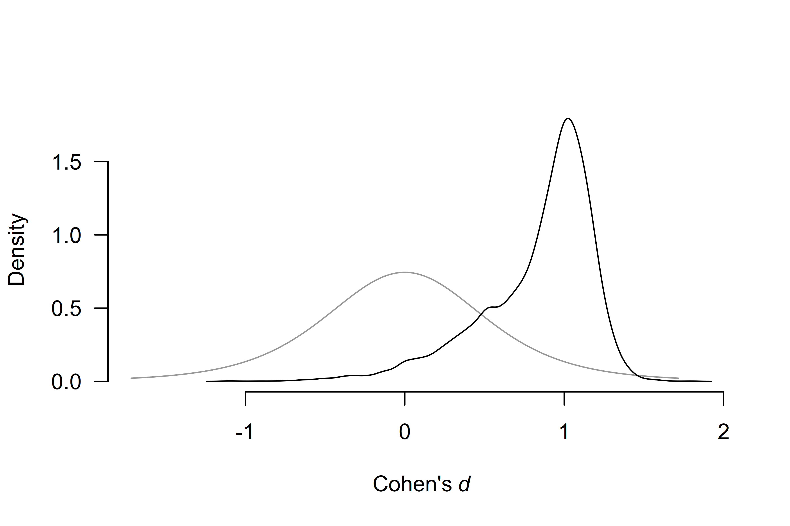

# Informed Bayesian Model-Averaged Meta-Analysis in Medicine

Bayesian model-averaged meta-analysis allows researchers to seamlessly
incorporate available prior information into the analysis (Bartoš et
al., 2021; Gronau et al., 2017, 2021). This vignette illustrates how to
do this with an example from Bartoš et al. (2021), who developed
informed prior distributions for meta-analyses of continuous outcomes
based on the Cochrane database of systematic reviews. Then, we extend
the example by incorporating publication bias adjustment with robust
Bayesian meta-analysis (Bartoš et al., 2023; Maier et al., 2023).

### Reproducing Informed Bayesian Model-Averaged Meta-Analysis (BMA)

We illustrate how to fit the informed BMA (not adjusting for publication
bias) using the `RoBMA` R package. For this purpose, we reproduce the
dentine hypersensitivity example from Bartoš et al. (2021), who
reanalyzed five studies with a tactile outcome assessment that were
subjected to a meta-analysis by Poulsen et al. (2006).

We load the dentine hypersensitivity data included in the package.

``` r
library(RoBMA)

data("Poulsen2006", package = "RoBMA")
Poulsen2006
#>           d        se               study
#> 1 0.9073050 0.2720456     STD-Schiff-1994
#> 2 0.7207589 0.1977769  STD-Silverman-1996
#> 3 1.3305829 0.2721648   STD-Sowinski-2000
#> 4 1.7688872 0.2656483 STD-Schiff-2000-(2)
#> 5 1.3286828 0.3582617     STD-Schiff-1998
```

To reproduce the analysis from the example, we need to set informed
empirical prior distributions for the effect sizes ($`\mu`$) and
heterogeneity ($`\tau`$) parameters that Bartoš et al. (2021) obtained
from the Cochrane database of systematic reviews. We can either set them
manually,

``` r
fit_BMA <- RoBMA(d = Poulsen2006$d, se = Poulsen2006$se, study_names = Poulsen2006$study,
                 priors_effect        = prior(distribution = "t", parameters = list(location = 0, scale = 0.51, df = 5)),
                 priors_heterogeneity = prior(distribution = "invgamma", parameters = list(shape = 1.79, scale = 0.28)),
                 priors_bias          = NULL,
                 transformation = "cohens_d", seed = 1, parallel = TRUE)
```

with `priors_effect` and `priors_heterogeneity` corresponding to the
$`\delta \sim T(0,0.51,5)`$ and $`\tau \sim InvGamma(1.79,0.28)`$
informed prior distributions for the “oral health” subfield and removing
the publication bias adjustment models by setting
`priors_bias = NULL`$`^1`$. Note that the package contains function
[`NoBMA()`](https://fbartos.github.io/RoBMA/reference/NoBMA.md) from
version 3.1 which skips publication bias adjustment directly.

Alternatively, we can utilize the `prior_informed` function that
prepares informed prior distributions for the individual medical
subfields automatically.

``` r
fit_BMA <- RoBMA(d = Poulsen2006$d, se = Poulsen2006$se, study_names = Poulsen2006$study,
                 priors_effect        = prior_informed(name = "oral health", parameter = "effect", type = "smd"),
                 priors_heterogeneity = prior_informed(name = "oral health", parameter = "heterogeneity", type = "smd"),
                 priors_bias          = NULL,
                 transformation = "cohens_d", seed = 1, parallel = TRUE)
```

The `name` argument specifies the medical subfield name (use
`print(BayesTools::prior_informed_medicine_names)` to check names of all
available subfields). The `parameter` argument specifies whether we want
prior distribution for the effect size or heterogeneity. Finally, the
`type` argument specifies what type of measure we use for the
meta-analysis (see
[`?prior_informed`](https://fbartos.github.io/RoBMA/reference/prior_informed.md)
for more details regarding the informed prior distributions).

We obtain the output with the `summary` function. Adding the
`conditional = TRUE` argument allows us to inspect the conditional
estimates, i.e., the effect size estimate assuming that the models
specifying the presence of the effect are true and the heterogeneity
estimates assuming that the models specifying the presence of
heterogeneity are true$`^2`$.

``` r
summary(fit_BMA, conditional = TRUE)
#> Call:
#> RoBMA(d = Poulsen2006$d, se = Poulsen2006$se, study_names = Poulsen2006$study, 
#>     transformation = "cohens_d", priors_effect = prior_informed(name = "oral health", 
#>         parameter = "effect", type = "smd"), priors_heterogeneity = prior_informed(name = "oral health", 
#>         parameter = "heterogeneity", type = "smd"), priors_bias = NULL, 
#>     parallel = TRUE, seed = 1)
#> 
#> Robust Bayesian meta-analysis
#> Components summary:
#>               Models Prior prob. Post. prob. Inclusion BF
#> Effect           2/4       0.500       0.995      217.517
#> Heterogeneity    2/4       0.500       0.778        3.511
#> 
#> Model-averaged estimates:
#>      Mean Median 0.025 0.975
#> mu  1.076  1.088 0.664 1.422
#> tau 0.231  0.208 0.000 0.726
#> The estimates are summarized on the Cohen's d scale (priors were specified on the Cohen's d scale).
#> 
#> Conditional estimates:
#>      Mean Median 0.025 0.975
#> mu  1.082  1.090 0.701 1.422
#> tau 0.297  0.255 0.075 0.779
#> The estimates are summarized on the Cohen's d scale (priors were specified on the Cohen's d scale).
```

The output from the
[`summary.RoBMA()`](https://fbartos.github.io/RoBMA/reference/summary.RoBMA.md)
function has 3 parts. The first one under the ‘Robust Bayesian
Meta-Analysis’ heading provides a basic summary of the fitted models by
component types (presence of the Effect and Heterogeneity). The table
summarizes the prior and posterior probabilities and the inclusion Bayes
factors of the individual components. The results show that the
inclusion Bayes factor for the effect corresponds to the one reported in
Bartoš et al. (2021), $`\text{BF}_{10} = 218.53`$ and
$`\text{BF}_{\text{rf}} = 3.52`$ (up to an MCMC error).

The second part under the ‘Model-averaged estimates’ heading displays
the parameter estimates model-averaged across all specified models
(i.e., including models specifying the effect size to be zero). We
ignore this section and move to the last part.

The third part under the ‘Conditional estimates’ heading displays the
conditional effect size estimate corresponding to the one reported in
Bartoš et al. (2021), $`\delta = 1.082`$, 95% CI \[0.686,1.412\], and a
heterogeneity estimate (not reported previously).

### Visualizing the Results

The `RoBMA` package provides extensive options for visualizing the
results. Here, we visualize the prior (grey) and posterior (black)
distribution for the mean parameter.

``` r
plot(fit_BMA, parameter = "mu", prior = TRUE)
```



By default, the function plots the model-averaged estimates across all
models; the arrows represent the probability of a spike, and the lines
represent the posterior density under models assuming non-zero effect.
The secondary y-axis (right) shows the probability of the spike (at
value 0) decreasing from 0.50, to 0.005 (also obtainable from the
‘Robust Bayesian Meta-Analysis’ field in
[`summary.RoBMA()`](https://fbartos.github.io/RoBMA/reference/summary.RoBMA.md)
function).

To visualize the conditional effect size estimate, we can add the
`conditional = TRUE` argument,

``` r
plot(fit_BMA, parameter = "mu", prior = TRUE, conditional = TRUE)
```

 which displays
only the model-averaged posterior distribution of the effect size
parameter for models assuming the presence of the effect.

We can also visualize the estimates from the individual models used in
the ensemble. We do that with the
[`plot_models()`](https://fbartos.github.io/RoBMA/reference/plot_models.md)
function, which visualizes the effect size estimates and 95% CI of each
specified model included in the ensemble. Model 1 corresponds to the
fixed effect model assuming the absence of the effect,
$`H_0^{\text{f}}`$, Model 2 corresponds to the random effect model
assuming the absence of the effect, $`H_0^{\text{r}}`$, Model 3
corresponds to the fixed effect model assuming the presence of the
effect, $`H_1^{\text{f}}`$, and Model 4 corresponds to the random effect
model assuming the presence of the effect, $`H_1^{\text{r}}`$). The size
of the square representing the mean estimate reflects the posterior
model probability of the model, which is also displayed in the
right-hand side panel. The bottom part of the figure shows the model
averaged-estimate that is a combination of the individual model
posterior distributions weighted by the posterior model probabilities.

``` r
plot_models(fit_BMA)
```

 We see that the
posterior model probability of the first two models decreased to
essentially zero (when rounding to two decimals), completely omitting
their estimates from the figure. Furthermore, the much larger box of
Model 4 (the random effect model assuming the presence of the effect)
shows that Model 4 received the largest share of the posterior
probability, $`P(H_1^{\text{r}}) = 0.77`$)

The last type of visualization that we show here is the forest plot. It
displays the original studies’ effects and the meta-analytic estimate
within one figure. It can be requested by using the
[`forest()`](https://fbartos.github.io/RoBMA/reference/forest.md)
function. Here, we again set the `conditional = TRUE` argument to
display the conditional model-averaged effect size estimate at the
bottom.

``` r
forest(fit_BMA, conditional = TRUE)
```



For more options provided by the plotting function, see its
documentation by using `?plot.RoBMA()`, `?plot_models()`, and
`?forest()`.

### Adjusting for Publication Bias with Robust Bayesian Meta-Analysis

Finally, we illustrate how to adjust our informed BMA for publication
bias with robust Bayesian meta-analysis Maier et al. (2023). In short,
we specify additional models assuming the presence of the publication
bias and correcting for it by either specifying a selection model
operating on $`p`$-values (Vevea & Hedges, 1995) or by specifying a
publication bias adjustment method correcting for the relationship
between effect sizes and standard errors – PET-PEESE (Stanley, 2017;
Stanley & Doucouliagos, 2014). See Bartoš et al. (2022) for a tutorial.

To obtain a proper before and after publication bias adjustment
comparison, we fit the informed BMA model but using the default effect
size transformation (Fisher’s $`z`$).

``` r
fit_BMAb <- RoBMA(d = Poulsen2006$d, se = Poulsen2006$se, study_names = Poulsen2006$study,
                  priors_effect        = prior_informed(name = "oral health", parameter = "effect", type = "smd"),
                  priors_heterogeneity = prior_informed(name = "oral health", parameter = "heterogeneity", type = "smd"),
                  priors_bias          = NULL,
                  seed = 1, parallel = TRUE)
```

``` r
summary(fit_BMAb, conditional = TRUE)
#> Call:
#> RoBMA(d = Poulsen2006$d, se = Poulsen2006$se, study_names = Poulsen2006$study, 
#>     priors_effect = prior_informed(name = "oral health", parameter = "effect", 
#>         type = "smd"), priors_heterogeneity = prior_informed(name = "oral health", 
#>         parameter = "heterogeneity", type = "smd"), priors_bias = NULL, 
#>     parallel = TRUE, seed = 1)
#> 
#> Robust Bayesian meta-analysis
#> Components summary:
#>               Models Prior prob. Post. prob. Inclusion BF
#> Effect           2/4       0.500       0.997      347.932
#> Heterogeneity    2/4       0.500       0.723        2.608
#> 
#> Model-averaged estimates:
#>      Mean Median 0.025 0.975
#> mu  1.045  1.052 0.705 1.344
#> tau 0.186  0.163 0.000 0.623
#> The estimates are summarized on the Cohen's d scale (priors were specified on the Cohen's d scale).
#> 
#> Conditional estimates:
#>      Mean Median 0.025 0.975
#> mu  1.048  1.053 0.720 1.344
#> tau 0.256  0.220 0.064 0.681
#> The estimates are summarized on the Cohen's d scale (priors were specified on the Cohen's d scale).
```

We obtain noticeably stronger evidence for the presence of the effect.
This is a result of placing more weights on the fixed-effect models,
especially the fixed-effect model assuming the presence of the effect
$`H_1^f`$. In our case, the increase in the posterior model probability
of $`H_1^f`$ occurred because this model predicted the data slightly
better after removing the correlation between effect sizes and standard
errors (a consequence of using Fisher’s $`z`$ transformation).
Nevertheless, the conditional effect size estimate stayed almost the
same.

Now, we fit the publication bias-adjusted model by simply removing the
`priors_bias = NULL` argument, which allows us to obtain the default 36
models ensemble called RoBMA-PSMA (Bartoš et al., 2023).

``` r
fit_RoBMA <- RoBMA(d = Poulsen2006$d, se = Poulsen2006$se, study_names = Poulsen2006$study,
                   priors_effect        = prior_informed(name = "oral health", parameter = "effect", type = "smd"),
                   priors_heterogeneity = prior_informed(name = "oral health", parameter = "heterogeneity", type = "smd"),
                   seed = 1, parallel = TRUE)
```

``` r
summary(fit_RoBMA, conditional = TRUE)
#> Call:
#> RoBMA(d = Poulsen2006$d, se = Poulsen2006$se, study_names = Poulsen2006$study, 
#>     priors_effect = prior_informed(name = "oral health", parameter = "effect", 
#>         type = "smd"), priors_heterogeneity = prior_informed(name = "oral health", 
#>         parameter = "heterogeneity", type = "smd"), parallel = TRUE, 
#>     seed = 1)
#> 
#> Robust Bayesian meta-analysis
#> Components summary:
#>               Models Prior prob. Post. prob. Inclusion BF
#> Effect         18/36       0.500       0.858        6.022
#> Heterogeneity  18/36       0.500       0.714        2.502
#> Bias           32/36       0.500       0.697        2.304
#> 
#> Model-averaged estimates:
#>                    Mean Median 0.025  0.975
#> mu                0.722  0.880 0.000  1.283
#> tau               0.202  0.161 0.000  0.799
#> omega[0,0.025]    1.000  1.000 1.000  1.000
#> omega[0.025,0.05] 0.943  1.000 0.329  1.000
#> omega[0.05,0.5]   0.874  1.000 0.071  1.000
#> omega[0.5,0.95]   0.855  1.000 0.042  1.000
#> omega[0.95,0.975] 0.866  1.000 0.050  1.000
#> omega[0.975,1]    0.897  1.000 0.057  1.000
#> PET               0.931  0.000 0.000  4.927
#> PEESE             1.131  0.000 0.000 12.261
#> The estimates are summarized on the Cohen's d scale (priors were specified on the Cohen's d scale).
#> (Estimated publication weights omega correspond to one-sided p-values.)
#> 
#> Conditional estimates:
#>                    Mean Median  0.025  0.975
#> mu                0.838  0.938 -0.035  1.297
#> tau               0.285  0.227  0.064  0.906
#> omega[0,0.025]    1.000  1.000  1.000  1.000
#> omega[0.025,0.05] 0.736  0.829  0.092  1.000
#> omega[0.05,0.5]   0.411  0.373  0.014  0.951
#> omega[0.5,0.95]   0.320  0.249  0.008  0.919
#> omega[0.95,0.975] 0.376  0.311  0.009  0.958
#> omega[0.975,1]    0.518  0.425  0.010  1.000
#> PET               2.909  3.136  0.171  5.614
#> PEESE             7.048  6.034  0.375 18.162
#> The estimates are summarized on the Cohen's d scale (priors were specified on the Cohen's d scale).
#> (Estimated publication weights omega correspond to one-sided p-values.)
```

We notice the additional values in the ‘Components summary’ table in the
‘Bias’ row. The model is now extended with 32 publication bias
adjustment models that account for 50% of the prior model probability.
When comparing the RoBMA to the second BMA fit, we notice a large
decrease in the inclusion Bayes factor for the presence of the effect
$`\text{BF}_{10} = 6.02`$ vs. $`\text{BF}_{10} = 347.93`$, which still,
however, presents moderate evidence for the presence of the effect. We
can further quantify the evidence in favor of the publication bias with
the inclusion Bayes factor for publication bias
$`\text{BF}_{pb} = 2.30`$, which can be interpreted as weak evidence in
favor of publication bias.

We can also compare the publication bias unadjusted and publication
bias-adjusted conditional effect size estimates. Including models
assuming publication bias into our model-averaged estimate (assuming the
presence of the effect) slightly decreases the estimated effect to
$`\delta = 0.838`$, 95% CI \[-0.035, 1.297\] with a much wider
confidence interval, as visualized in the prior and posterior
conditional effect size estimate plot.

``` r
plot(fit_RoBMA, parameter = "mu", prior = TRUE, conditional = TRUE)
```



### Footnotes

$`^1`$ The additional setting `transformation = "cohens_d"` allows us to
get more comparable results with the `metaBMA` R package since RoBMA
otherwise internally transforms the effect sizes to Fisher’s $`z`$ for
the fitting purposes. The `seed = 1` and `parallel = TRUE` options grant
us exact reproducibility of the results and parallelization of the
fitting process.

$`^2`$ The model-averaged estimates that `RoBMA` returns by default
model-averaged across all specified models – a different behavior from
the `metaBMA` package that by default returns what we call “conditional”
estimates in `RoBMA`.

### References

Bartoš, F., Gronau, Q. F., Timmers, B., Otte, W. M., Ly, A., &
Wagenmakers, E.-J. (2021). Bayesian model-averaged meta-analysis in
medicine. *Statistics in Medicine*, *40*(30), 6743–6761.
<https://doi.org/10.1002/sim.9170>

Bartoš, F., Maier, Maximilian, Quintana, D. S., & Wagenmakers, E.-J.
(2022). Adjusting for publication bias in JASP and R — Selection models,
PET-PEESE, and robust Bayesian meta-analysis. *Advances in Methods and
Practices in Psychological Science*, *5*(3), 1–19.
<https://doi.org/10.1177/25152459221109259>

Bartoš, F., Maier, M., Wagenmakers, E.-J., Doucouliagos, H., & Stanley,
T. D. (2023). Robust Bayesian meta-analysis: Model-averaging across
complementary publication bias adjustment methods. *Research Synthesis
Methods*, *14*(1), 99–116. <https://doi.org/10.1002/jrsm.1594>

Gronau, Q. F., Heck, D. W., Berkhout, S. W., Haaf, J. M., & Wagenmakers,
E.-J. (2021). A primer on Bayesian model-averaged meta-analysis.
*Advances in Methods and Practices in Psychological Science*, *4*(3),
1–19. <https://doi.org/10.1177/25152459211031256>

Gronau, Q. F., Van Erp, S., Heck, D. W., Cesario, J., Jonas, K. J., &
Wagenmakers, E.-J. (2017). A Bayesian model-averaged meta-analysis of
the power pose effect with informed and default priors: The case of felt
power. *Comprehensive Results in Social Psychology*, *2*(1), 123–138.
<https://doi.org/10.1080/23743603.2017.1326760>

Maier, M., Bartoš, F., & Wagenmakers, E.-J. (2023). Robust Bayesian
meta-analysis: Addressing publication bias with model-averaging.
*Psychological Methods*, *28*(1), 107–122.
<https://doi.org/10.1037/met0000405>

Poulsen, S., Errboe, M., Mevil, Y. L., & Glenny, A.-M. (2006). Potassium
containing toothpastes for dentine hypersensitivity. *Cochrane Database
of Systematic Reviews*, *3*.
<https://doi.org/10.1002/14651858.cd001476.pub2>

Stanley, T. D. (2017). Limitations of PET-PEESE and other meta-analysis
methods. *Social Psychological and Personality Science*, *8*(5),
581–591. <https://doi.org/10.1177/1948550617693062>

Stanley, T. D., & Doucouliagos, H. (2014). Meta-regression
approximations to reduce publication selection bias. *Research Synthesis
Methods*, *5*(1), 60–78. <https://doi.org/10.1002/jrsm.1095>

Vevea, J. L., & Hedges, L. V. (1995). A general linear model for
estimating effect size in the presence of publication bias.
*Psychometrika*, *60*(3), 419–435. <https://doi.org/10.1007/BF02294384>
