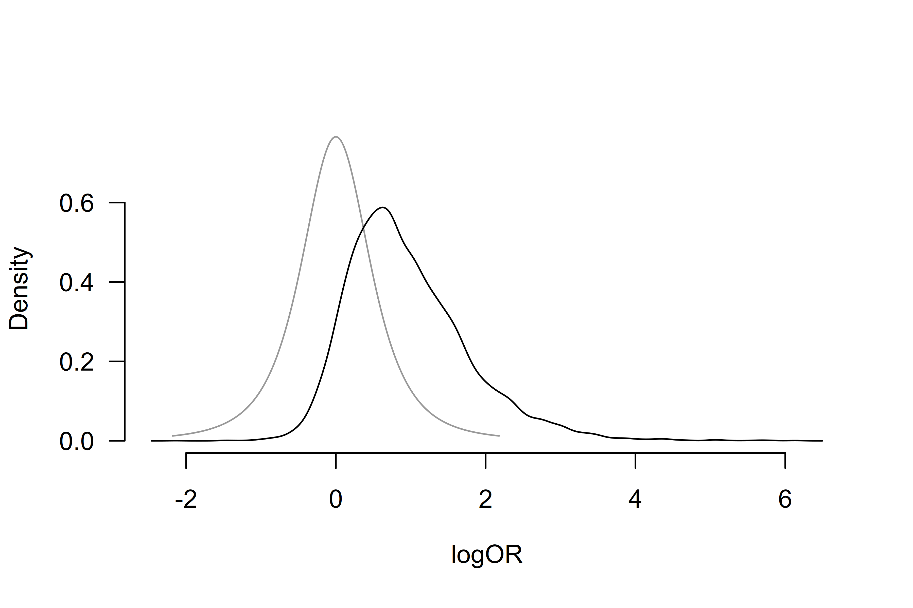

# Informed Bayesian Model-Averaged Meta-Analysis with Binary Outcomes

Bayesian model-averaged meta-analysis can be specified using the
binomial likelihood and applied to data with dichotomous outcomes. This
vignette illustrates how to do this with an example from Bartoš et al.
(2023), who implemented a binomial-normal Bayesian model-averaged
meta-analytic model and developed informed prior distributions for
meta-analyses of binary and time-to-event outcomes based on the Cochrane
database of systematic reviews (see Bartoš et al. (2021) for informed
prior distributions for meta-analyses of continuous outcomes highlighted
in [Informed Bayesian Model-Averaged Meta-Analysis in
Medicine](https://fbartos.github.io/RoBMA/articles/MedicineBMA.md)
vignette.

### Binomial-Normal Bayesian Model-Averaged Meta-Analysis

We illustrate how to fit the binomial-normal Bayesian model-averaged
meta-analysis using the `RoBMA` R package. For this purpose, we
reproduce the example of adverse effects of honey in treating acute
cough in children from Bartoš et al. (2023), who reanalyzed two studies
with adverse events of nervousness, insomnia, or hyperactivity in the
honey vs. no treatment condition that were subjected to a meta-analysis
by Oduwole et al. (2018).

We load the RoBMA package and specify the number of adverse events and
sample sizes in each arm as described on p. 73 (Oduwole et al., 2018).

``` r

library(RoBMA)

events_experimental        <- c(5, 2)
events_control             <- c(0, 0)
observations_experimental  <- c(35, 40)
observations_control       <- c(39, 40)
study_names <- c("Paul 2007", "Shadkam 2010")
```

Notice that both studies reported no adverse events in the control
group. Using a normal-normal meta-analytic model with log odds ratios
would require a continuity correction, which might result in bias.
Binomial-normal models allow us to circumvent the issue by modeling the
observed proportions directly (see Bartoš et al. (2023) for more
details).

First, we fit the binomial-normal Bayesian model-averaged meta-analysis
using informed prior distributions based on the
`Acute Respiratory Infections` subfield. We use the `BiBMA` function and
specify the observed events (`x1` and `x2`) and sample size (`n1` and
`n2`) of adverse events and sample sizes in each arm. We use the
`prior_informed` function to specify the informed prior distributions
for the individual medical subfields automatically.

``` r

fit <- BiBMA(
  x1          = events_experimental,
  x2          = events_control,
  n1          = observations_experimental,
  n2          = observations_control,
  study_names = study_names,
  priors_effect        = prior_informed("Acute Respiratory Infections", type = "logOR", parameter = "effect"),
  priors_heterogeneity = prior_informed("Acute Respiratory Infections", type = "logOR", parameter = "heterogeneity"),
  seed = 1
)
```

with `priors_effect` and `priors_heterogeneity` corresponding to the
$`\mu \sim T(0,0.48,3)`$ and $`\tau \sim InvGamma(1.67, 0.45)`$ prior
distributions (see
[`?prior_informed`](https://fbartos.github.io/RoBMA/reference/prior_informed.md)
for more details regarding the informed prior distributions).

We obtain the output with the `summary` function. Adding the
`conditional = TRUE` argument allows us to inspect the conditional
estimates, i.e., the effect size estimate assuming that the models
specifying the presence of the effect are true, and the heterogeneity
estimates assuming that the models specifying the presence of
heterogeneity are true. We also set the `output_scale = "OR"` argument
to display the effect size estimates on the odds ratio scale.

``` r

summary(fit, conditional = TRUE, output_scale = "OR")
#> Call:
#> BiBMA(x1 = events_experimental, x2 = events_control, n1 = observations_experimental, 
#>     n2 = observations_control, study_names = study_names, priors_effect = prior_informed("Acute Respiratory Infections", 
#>         type = "logOR", parameter = "effect"), priors_heterogeneity = prior_informed("Acute Respiratory Infections", 
#>         type = "logOR", parameter = "heterogeneity"), seed = 1)
#> 
#> Bayesian model-averaged meta-analysis (binomial-normal model)
#> Components summary:
#>               Models Prior prob. Post. prob. Inclusion BF
#> Effect           2/4       0.500       0.725        2.630
#> Heterogeneity    2/4       0.500       0.564        1.296
#> 
#> Model-averaged estimates:
#>      Mean Median 0.025  0.975
#> mu  3.389  1.642 0.842 15.143
#> tau 0.420  0.158 0.000  2.594
#> The effect size estimates are summarized on the OR scale and heterogeneity is summarized on the logOR scale (priors were specified on the log(OR) scale).
#> 
#> Conditional estimates:
#>      Mean Median 0.025  0.975
#> mu  4.242  2.261 0.781 17.613
#> tau 0.747  0.426 0.097  3.233
#> The effect size estimates are summarized on the OR scale and heterogeneity is summarized on the logOR scale (priors were specified on the log(OR) scale).
```

The output from the
[`summary.RoBMA()`](https://fbartos.github.io/RoBMA/reference/summary.RoBMA.md)
function has three parts. The first part, under the ‘Robust Bayesian
Meta-Analysis’ heading provides a basic summary of the fitted models by
component types (presence of the Effect and Heterogeneity). The results
show that the inclusion Bayes factor for the effect corresponds to the
one reported in Bartoš et al. (2023), $`\text{BF}_{10} = 2.63`$ and
$`\text{BF}_{\text{rf}} = 1.30`$ (up to an MCMC error)—weak/undecided
evidence for the presence of the effect and heterogeneity.

The second part, under the ‘Model-averaged estimates’ heading displays
the parameter estimates model-averaged across all specified models
(i.e., including models specifying the effect size to be zero). These
estimates are shrunk towards the null hypotheses of null effect or no
heterogeneity in accordance with the posterior uncertainty about the
presence of the effect or heterogeneity. We find the model-averaged mean
effect OR = 3.39, 95% CI \[0.84, 15.14\], and a heterogeneity estimate
$`\tau_\text{logOR} = 0.42`$, 95% CI \[0.00, 2.59\].

The third part, under the ‘Conditional estimates’ heading displays the
conditional effect size and heterogeneity estimates (i.e., estimates
assuming presence of the effect or heterogeneity) corresponding to the
one reported in Bartoš et al. (2023), OR = 4.24, 95% CI \[0.78, 17.61\],
and a heterogeneity estimate $`\tau_\text{logOR} = 0.75`$, 95% CI
\[0.10, 3.23\].

We can also visualize the posterior distributions of the effect size and
heterogeneity parameters using the
[`plot()`](https://rdrr.io/r/graphics/plot.default.html) function. Here,
we set the `conditional = TRUE` argument to display the conditional
effect size estimate and `prior = TRUE` to include the prior
distribution in the plot.

``` r

plot(fit, parameter = "mu", prior = TRUE, conditional = TRUE)
```



Additional visualizations and summaries are demonstrated in the
[Reproducing
BMA](https://fbartos.github.io/RoBMA/articles/ReproducingBMA.md) and
[Informed Bayesian Model-Averaged Meta-Analysis in
Medicine](https://fbartos.github.io/RoBMA/articles/MedicineBMA.md)
vignettes.

### References

Bartoš, F., Gronau, Q. F., Timmers, B., Otte, W. M., Ly, A., &
Wagenmakers, E.-J. (2021). Bayesian model-averaged meta-analysis in
medicine. *Statistics in Medicine*, *40*(30), 6743–6761.
<https://doi.org/10.1002/sim.9170>

Bartoš, F., Otte, W. M., Gronau, Q. F., Timmers, B., Ly, A., &
Wagenmakers, E.-J. (2023). *Empirical prior distributions for Bayesian
meta-analyses of binary and time-to-event outcomes*.
<https://doi.org/10.48550/arXiv.2306.11468>

Oduwole, O., Udoh, E. E., Oyo-Ita, A., & Meremikwu, M. M. (2018). Honey
for acute cough in children. *Cochrane Database of Systematic Reviews*,
*4*. <https://doi.org/10.1002/14651858.CD007094.pub5>
