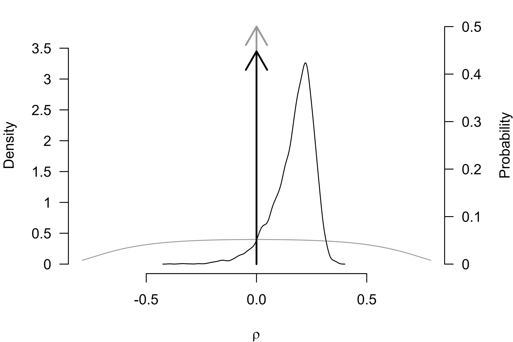

# Tutorial: Adjusting for Publication Bias in JASP and R - Selection Models, PET-PEESE, and Robust Bayesian Meta-Analysis

**This R markdown file accompanies the tutorial [Adjusting for
publication bias in JASP and R: Selection models, PET-PEESE, and robust
Bayesian meta-analysis](https://doi.org/10.1177/25152459221109259)
published in *Advances in Methods and Practices in Psychological
Science* (Bartoš et al., 2022).**

The following R-markdown file illustrates how to:

- Load a CSV file into R,
- Transform effect sizes,
- Perform a random effect meta-analysis,
- Adjust for publication bias with:
  - PET-PEESE (Stanley, 2017; Stanley & Doucouliagos, 2014),
  - Selection models (Iyengar & Greenhouse, 1988; Vevea & Hedges, 1995),
  - Robust Bayesian meta-analysis (RoBMA) (Bartoš et al., 2023; Maier et
    al., 2023).

See the full paper for additional details regarding the data set,
methods, and interpretation.

### Set-up

Before we start, we need to install `JAGS` (which is needed for
installation of the `RoBMA` package) and the R packages that we use in
the analysis. Specifically the `RoBMA`, `weightr`, and `metafor` R
packages.

JAGS can be downloaded from the [JAGS
website](https://sourceforge.net/projects/mcmc-jags/). Subsequently, we
install the R packages with the
[`install.packages()`](https://rdrr.io/r/utils/install.packages.html)
function.

`{r install.packages(c("RoBMA", "weightr", "metafor"))` If you happen to
use the new M1 Mac machines with Apple silicon, see [this
blogpost](https://www.dsquintana.blog/jags-apple-silicon-m1-mac/)
outlining how to install JAGS on M1. In short, you will have to install
Intel version of R (Intel/x86-64) from
[CRAN](https://cran.r-project.org/bin/macosx/), not the Arm64 (Apple
silicon) version. Note that there might have been some changes in the
installation process since the blogpost was written and there might be a
JAGS version compatible with Apple silicon available now.

Once all of the packages are installed, we can load them into the
workspace with the [`library()`](https://rdrr.io/r/base/library.html)
function.

``` r
library("metafor")
#> Warning: package 'Matrix' was built under R version 4.4.3
library("weightr")
library("RoBMA")
```

### Lui (2015)

Lui (2015) studied how the acculturation mismatch (AM) that is the
result of the contrast between the collectivist cultures of Asian and
Latin immigrant groups and the individualist culture in the United
States correlates with intergenerational cultural conflict (ICC). Lui
(2015) meta-analyzed 18 independent studies correlating AM with ICC. A
standard reanalysis indicates a significant effect of AM on increased
ICC, r = 0.250, p \< .001.

#### Data manipulation

First, we load the Lui2015.csv file into R with the
[`read.csv()`](https://rdrr.io/r/utils/read.table.html) function and
inspect the first six data entries with the
[`head()`](https://rdrr.io/r/utils/head.html) function (the data set is
also included in the package and can be accessed via the
`data("Lui2015", package = "RoBMA")` call).

``` r
df <- read.csv(file = "Lui2015.csv")
```

``` r
head(df)
#>      r   n                   study
#> 1 0.21 115 Ahn, Kim, & Park (2008)
#> 2 0.29 283   Basanez et al. (2013)
#> 3 0.22  80         Bounkeua (2007)
#> 4 0.26 109        Hajizadeh (2009)
#> 5 0.23  61            Hamid (2007)
#> 6 0.54 107    Hwang & Wood (2009a)
```

We see that the data set contains three columns. The first column called
`r` contains the effect sizes coded as correlation coefficients, the
second column called `n` contains the sample sizes, and the third column
called `study` contains names of the individual studies.

We can access the individual variables using the data set name and the
dollar (`$`) sign followed by the name of the column. For example, we
can print all of the effect sizes with the `df$r` command.

``` r
df$r
#>  [1]  0.21  0.29  0.22  0.26  0.23  0.54  0.56  0.29  0.26  0.02 -0.06  0.38
#> [13]  0.25  0.08  0.17  0.33  0.36  0.13
```

The printed output shows that the data set contains mostly positive
effect sizes with the largest correlation coefficient r = 0.54.

#### Effect size transformations

Before we start analyzing the data, we transform the effect sizes from
correlation coefficients $`\rho`$ to Fisher’s *z*. Correlation
coefficients are not well suited for meta-analysis because (1) they are
bounded to a range (-1, 1) with non-linear increases near the boundaries
and (2) the standard error of the correlation coefficients is related to
the effect size. Fisher’s *z* transformation mitigates both issues. It
unwinds the (-1, 1) range to ($`-\infty`$, $`\infty`$), makes the
sampling distribution approximately normal, and breaks the dependency
between standard errors and effect sizes.

To apply the transformation, we use the
[`combine_data()`](https://fbartos.github.io/RoBMA/reference/combine_data.md)
function from the `RoBMA` package. We pass the correlation coefficients
into the `r` argument, the sample sizes to the `n` argument, and set the
`transformation` argument to `"fishers_z"` (the `study_names` argument
is optional). The function
[`combine_data()`](https://fbartos.github.io/RoBMA/reference/combine_data.md)
then saves the transformed effect size estimates into a data frame
called `dfz`, where the `y` column corresponds to Fisher’s *z*
transformation of the correlation coefficient and `se` column
corresponds to the standard error of Fisher’s *z*.

``` r
dfz <- combine_data(r = df$r, n = df$n, study_names = df$study, transformation = "fishers_z")
head(dfz)
#>           y         se             study_names cluster weight
#> 1 0.2131713 0.09449112 Ahn, Kim, & Park (2008)        NA     NA
#> 2 0.2985663 0.05976143   Basanez et al. (2013)        NA     NA
#> 3 0.2236561 0.11396058         Bounkeua (2007)        NA     NA
#> 4 0.2661084 0.09712859        Hajizadeh (2009)        NA     NA
#> 5 0.2341895 0.13130643            Hamid (2007)        NA     NA
#> 6 0.6041556 0.09805807    Hwang & Wood (2009a)        NA     NA
```

We can also transform the effect sizes according to Cohen’s *d*
transformation (which we utilize later to fit the selection models).

``` r
dfd <- combine_data(r = df$r, n = df$n, study_names = df$study, transformation = "cohens_d")
head(dfd)
#>           y        se             study_names cluster weight
#> 1 0.4295790 0.1886397 Ahn, Kim, & Park (2008)        NA     NA
#> 2 0.6060437 0.1215862   Basanez et al. (2013)        NA     NA
#> 3 0.4510508 0.2264322         Bounkeua (2007)        NA     NA
#> 4 0.5385205 0.1950065        Hajizadeh (2009)        NA     NA
#> 5 0.4726720 0.2596249            Hamid (2007)        NA     NA
#> 6 1.2831708 0.2123140    Hwang & Wood (2009a)        NA     NA
```

#### Re-analysis with random effect meta-analysis

We now estimate a random effect meta-analysis with the
[`rma()`](https://wviechtb.github.io/metafor/reference/rma.uni.html)
function imported from the `metafor` package (Wolfgang, 2010) and verify
that we arrive at the same results as reported in the Lui (2015) paper.
The `yi` argument is used to pass the column name containing effect
sizes, the `sei` argument is used to pass the column name containing
standard errors, and the `data` argument is used to pass the data frame
containing both variables.

``` r
fit_rma <- rma(yi = y, sei = se, data = dfz)
fit_rma
#> 
#> Random-Effects Model (k = 18; tau^2 estimator: REML)
#> 
#> tau^2 (estimated amount of total heterogeneity): 0.0229 (SE = 0.0107)
#> tau (square root of estimated tau^2 value):      0.1513
#> I^2 (total heterogeneity / total variability):   77.79%
#> H^2 (total variability / sampling variability):  4.50
#> 
#> Test for Heterogeneity:
#> Q(df = 17) = 73.5786, p-val < .0001
#> 
#> Model Results:
#> 
#> estimate      se    zval    pval   ci.lb   ci.ub      
#>   0.2538  0.0419  6.0568  <.0001  0.1717  0.3359  *** 
#> 
#> ---
#> Signif. codes:  0 '***' 0.001 '**' 0.01 '*' 0.05 '.' 0.1 ' ' 1
```

Indeed, we find that the effect size estimate from the random effect
meta-analysis corresponds to the one reported in Lui (2015). It is
important to remember that we used Fisher’s *z* to estimate the models;
therefore, the estimated results are on the Fisher’s *z* scale. To
transform the effect size estimate to the correlation coefficients, we
can use the
[`z2r()`](https://fbartos.github.io/RoBMA/reference/effect_sizes.md)
function from the `RoBMA` package,

``` r
z2r(fit_rma$b)
#>              [,1]
#> intrcpt 0.2484877
```

Transforming the effect size estimate results in the correlation
coefficient $`\rho`$ = 0.25.

### PET-PEESE

The first publication bias adjustment that we perform is PET-PEESE.
PET-PEESE adjusts for the relationship between effect sizes and standard
errors. To our knowledge, PET-PEESE is not currently implemented in any
R-package. However, since PET and PEESE are weighted regressions of
effect sizes on standard errors (PET) or standard errors squared
(PEESE), we can estimate both PET and PEESE models with the
[`lm()`](https://rdrr.io/r/stats/lm.html) function. Inside the
[`lm()`](https://rdrr.io/r/stats/lm.html) function call, we specify that
`y` is the response variable (left hand side of the `~` sign) and `se`
is the predictor (the right-hand side). Furthermore, we specify the
`weights` argument that allows us to weight the meta-regression by
inverse variance and set the `data = dfz` argument, which specifies that
all of the variables come from the transformed, `dfz`, data set.

``` r
fit_PET <- lm(y ~ se, weights = 1/se^2, data = dfz)
summary(fit_PET)
#> 
#> Call:
#> lm(formula = y ~ se, data = dfz, weights = 1/se^2)
#> 
#> Weighted Residuals:
#>     Min      1Q  Median      3Q     Max 
#> -3.8132 -0.9112 -0.0139  0.5166  3.3151 
#> 
#> Coefficients:
#>               Estimate Std. Error t value Pr(>|t|)  
#> (Intercept) -0.0008722  0.1081247  -0.008   0.9937  
#> se           2.8549650  1.3593450   2.100   0.0519 .
#> ---
#> Signif. codes:  0 '***' 0.001 '**' 0.01 '*' 0.05 '.' 0.1 ' ' 1
#> 
#> Residual standard error: 1.899 on 16 degrees of freedom
#> Multiple R-squared:  0.2161, Adjusted R-squared:  0.1671 
#> F-statistic: 4.411 on 1 and 16 DF,  p-value: 0.05192
```

The [`summary()`](https://rdrr.io/r/base/summary.html) function allows
us to explore details of the fitted model. The `(Intercept)` coefficient
refers to the meta-analytic effect size (corrected for the correlation
with standard errors). Again, it is important to keep in mind that the
effect size estimate is on the Fisher’s *z* scale. We obtain the
estimate on correlation scale with the
[`z2r()`](https://fbartos.github.io/RoBMA/reference/effect_sizes.md)
function (we pass the estimated effect size using the
`summary(fit_PET)$coefficients["(Intercept)", "Estimate"]` command,
which extracts the estimate from the fitted model, it is equivalent to
simply pasting the value directly `z2r(-0.0008722083)`).

``` r
z2r(summary(fit_PET)$coefficients["(Intercept)", "Estimate"])
#> [1] -0.000872208
```

Since the Fisher’s *z* transformation is almost linear around zero, we
obtain an almost identical estimate.

More importantly, since the test for the effect size with PET was not
significant at $`\alpha = .10`$, we interpret the PET model. However, if
the test for effect size were significant, we would fit and interpret
the PEESE model. The PEESE model can be fitted in an analogous way, by
replacing the predictor of standard errors with standard errors squared
(we need to wrap the `se^2` predictor in
[`I()`](https://rdrr.io/r/base/AsIs.html) that tells R to square the
predictor prior to fitting the model).

``` r
fit_PEESE <- lm(y ~ I(se^2), weights = 1/se^2, data = dfz)
summary(fit_PEESE)
#> 
#> Call:
#> lm(formula = y ~ I(se^2), data = dfz, weights = 1/se^2)
#> 
#> Weighted Residuals:
#>     Min      1Q  Median      3Q     Max 
#> -3.7961 -0.9581 -0.1156  0.6718  3.4608 
#> 
#> Coefficients:
#>             Estimate Std. Error t value Pr(>|t|)  
#> (Intercept)  0.11498    0.06201   1.854   0.0822 .
#> I(se^2)     15.58064    7.96723   1.956   0.0682 .
#> ---
#> Signif. codes:  0 '***' 0.001 '**' 0.01 '*' 0.05 '.' 0.1 ' ' 1
#> 
#> Residual standard error: 1.927 on 16 degrees of freedom
#> Multiple R-squared:  0.1929, Adjusted R-squared:  0.1425 
#> F-statistic: 3.824 on 1 and 16 DF,  p-value: 0.06821
```

### Selection models

The second publication bias adjustment that we will perform is selection
models. Selection models adjust for the different publication
probabilities in different *p*-value intervals. Selection models are
implemented in `weightr` package
([`weightfunct()`](https://rdrr.io/pkg/weightr/man/weightfunct.html)
function; Coburn et al. (2019)) and newly also in the `metafor` package
([`selmodel()`](https://wviechtb.github.io/metafor/reference/selmodel.html)
function; Wolfgang (2010)). First, we use the `weightr` implementation
and fit the “4PSM” selection model that specifies three distinct
*p*-value intervals: (1) covering the range of significant *p*-values
for effect sizes in the expected direction (0.00-0.025), (2) covering
the range of “marginally” significant *p*-values for effect sizes in the
expected direction (0.025-0.05), and (3) covering the range of
non-significant *p*-values (0.05-1). We use Cohen’s *d* transformation
of the correlation coefficients since it is better at maintaining the
distribution of test statistics. To fit the model, we need to pass the
effect sizes (`dfd$y`) into the `effect` argument and variances
(`dfd$se^2`) into the `v` argument (note that we need to pass the vector
of values directly since the
[`weightfunct()`](https://rdrr.io/pkg/weightr/man/weightfunct.html)
function does not allow us to pass the data frame directly as did the
previous functions). We further set `steps = c(0.025, 0.05)` to specify
the appropriate cut-points (note that the steps correspond to one-sided
*p*-values), and we set `table = TRUE` to obtain the frequency of *p*
values in each of the specified intervals.

``` r
fit_4PSM <- weightfunct(effect = dfd$y, v = dfd$se^2, steps = c(0.025, 0.05), table = TRUE)
#> Warning in weightfunct(effect = dfd$y, v = dfd$se^2, steps = c(0.025, 0.05), :
#> At least one of the p-value intervals contains three or fewer effect sizes,
#> which may lead to estimation problems. Consider re-specifying the cutpoints.
fit_4PSM
#> 
#> Unadjusted Model (k = 18):
#> 
#> tau^2 (estimated amount of total heterogeneity): 0.0920 (SE = 0.0423)
#> tau (square root of estimated tau^2 value):  0.3034
#> 
#> Test for Heterogeneity:
#> Q(df = 17) = 75.4999, p-val = 5.188348e-09
#> 
#> Model Results:
#> 
#>           estimate std.error z-stat      p-val ci.lb  ci.ub
#> Intercept    0.516   0.08473   6.09 1.1283e-09  0.35 0.6821
#> 
#> Adjusted Model (k = 18):
#> 
#> tau^2 (estimated amount of total heterogeneity): 0.1289 (SE = 0.0682)
#> tau (square root of estimated tau^2 value):  0.3590
#> 
#> Test for Heterogeneity:
#> Q(df = 17) = 75.4999, p-val = 5.188348e-09
#> 
#> Model Results:
#> 
#>                  estimate std.error z-stat   p-val   ci.lb  ci.ub
#> Intercept          0.2675    0.2009 1.3311 0.18316 -0.1264 0.6613
#> 0.025 < p < 0.05   0.5008    0.5449 0.9191 0.35803 -0.5671 1.5688
#> 0.05 < p < 1       0.1535    0.1570 0.9777 0.32821 -0.1542 0.4611
#> 
#> Likelihood Ratio Test:
#> X^2(df = 2) = 3.844252, p-val = 0.1463
#> 
#> Number of Effect Sizes per Interval:
#> 
#>                         Frequency
#> p-values <0.025                14
#> 0.025 < p-values < 0.05         1
#> 0.05 < p-values < 1             3
```

Note the warning message informing us about the fact that our data do
not contain a sufficient number of *p*-values in one of the *p*-value
intervals. The model output obtained by printing the fitted model object
`fit_4PSM` shows that there is only one *p*-value in the (0.025, 0.05)
interval. We can deal with this issue by joining the “marginally”
significant and non-significant *p*-value interval, resulting in the
“3PSM” model.

``` r
fit_3PSM <- weightfunct(effect = dfd$y, v = dfd$se^2, steps = c(0.025), table = TRUE)
fit_3PSM
#> 
#> Unadjusted Model (k = 18):
#> 
#> tau^2 (estimated amount of total heterogeneity): 0.0920 (SE = 0.0423)
#> tau (square root of estimated tau^2 value):  0.3034
#> 
#> Test for Heterogeneity:
#> Q(df = 17) = 75.4999, p-val = 5.188348e-09
#> 
#> Model Results:
#> 
#>           estimate std.error z-stat      p-val ci.lb  ci.ub
#> Intercept    0.516   0.08473   6.09 1.1283e-09  0.35 0.6821
#> 
#> Adjusted Model (k = 18):
#> 
#> tau^2 (estimated amount of total heterogeneity): 0.1148 (SE = 0.0577)
#> tau (square root of estimated tau^2 value):  0.3388
#> 
#> Test for Heterogeneity:
#> Q(df = 17) = 75.4999, p-val = 5.188348e-09
#> 
#> Model Results:
#> 
#>               estimate std.error z-stat    p-val     ci.lb  ci.ub
#> Intercept       0.3220    0.1676  1.921 0.054698 -0.006484 0.6504
#> 0.025 < p < 1   0.2275    0.2004  1.135 0.256293 -0.165324 0.6204
#> 
#> Likelihood Ratio Test:
#> X^2(df = 1) = 3.107176, p-val = 0.077948
#> 
#> Number of Effect Sizes per Interval:
#> 
#>                      Frequency
#> p-values <0.025             14
#> 0.025 < p-values < 1         4
```

The new model does not suffer from the estimation problem due to the
limited number of *p*-values in the intervals, so we can now interpret
the results with more confidence. First, we check the test for
heterogeneity that clearly rejects the null hypothesis
`Q(df = 17) = 75.4999, $p$ = 5.188348e-09` (if we did not find evidence
for heterogeneity, we could have proceeded by fitting the fixed effects
version of the model by specifying the `fe = TRUE` argument). We follow
by checking the test for publication bias which is a likelihood ratio
test comparing the unadjusted and adjusted estimate
`X^2(df = 1) = 3.107176, $p$ = 0.077948`. The result of the test is
slightly ambiguous – we would reject the null hypothesis of no
publication bias with $`\alpha = 0.10`$ but not with $`\alpha = 0.05`$.

If we decide to interpret the estimated effect size, we have to again
transform it back to the correlation scale. However, this time we need
to use the
[`d2r()`](https://fbartos.github.io/RoBMA/reference/effect_sizes.md)
function since we supplied the effect sizes as Cohen’s *d* (note that
the effect size estimate corresponds to the second value in the
`fit_3PSM$adj_est` object for the random effect model, alternatively, we
could simply use `d2r(0.3219641)`).

``` r
d2r(fit_3PSM$adj_est[2])
#> [1] 0.1589358
```

Alternatively, we could have conducted the analysis analogously but with
the `metafor` package. First, we would fit a random effect meta-analysis
with the Cohen’s *d* transformed effect sizes.

``` r
fit_rma_d <- rma(yi = y, sei = se, data = dfd)
```

Subsequently, we would have used the `selmodel` function, passing the
estimated random effect meta-analysis object and specifying the
`type = "stepfun"` argument to obtain a step weight function and setting
the appropriate steps with the `steps = c(0.025)` argument.

``` r
fit_sel_d <- selmodel(fit_rma_d, type = "stepfun", steps = c(0.025))
fit_sel_d
#> 
#> Random-Effects Model (k = 18; tau^2 estimator: ML)
#> 
#> tau^2 (estimated amount of total heterogeneity): 0.1148 (SE = 0.0577)
#> tau (square root of estimated tau^2 value):      0.3388
#> 
#> Test for Heterogeneity:
#> LRT(df = 1) = 32.7499, p-val < .0001
#> 
#> Model Results:
#> 
#> estimate      se    zval    pval    ci.lb   ci.ub    
#>   0.3220  0.1676  1.9214  0.0547  -0.0065  0.6504  . 
#> 
#> Test for Selection Model Parameters:
#> LRT(df = 1) = 3.1072, p-val = 0.0779
#> 
#> Selection Model Results:
#> 
#>                      k  estimate      se     zval    pval   ci.lb   ci.ub      
#> 0     < p <= 0.025  14    1.0000     ---      ---     ---     ---     ---      
#> 0.025 < p <= 1       4    0.2275  0.2004  -3.8537  0.0001  0.0000  0.6204  *** 
#> 
#> ---
#> Signif. codes:  0 '***' 0.001 '**' 0.01 '*' 0.05 '.' 0.1 ' ' 1
```

The output verifies the results obtained in the previous analysis.

### Robust Bayesian meta-analysis

The third and final publication bias adjustment that we will perform is
robust Bayesian meta-analysis (RoBMA). RoBMA uses Bayesian
model-averaging to combine inference from both PET-PEESE and selection
models. We use the `RoBMA` R package (and the
[`RoBMA()`](https://fbartos.github.io/RoBMA/reference/RoBMA.md)
function; Bartoš & Maier (2020)) to fit the default 36 model ensemble
(called RoBMA-PSMA) based on an orthogonal combination of models
assuming the presence and absence of the effect size, heterogeneity, and
publication bias. The models assuming the presence of publication bias
are further split into six weight function models and models utilizing
the PET and PEESE publication bias adjustment. To fit the model, we can
directly pass the original correlation coefficients into the `r`
argument and sample sizes into the `n` argument – the
[`RoBMA()`](https://fbartos.github.io/RoBMA/reference/RoBMA.md) function
will internally transform them to the Fisher’s *z* scale and, by
default, return the estimates on a Cohen’s *d* scale which is used to
specify the prior distributions (both of these settings can be changed
with the `prior_scale` and `transformation` arguments, and the output
can be conveniently transformed later). We further set the `model`
argument to `"PSMA"` to fit the 36 model ensemble and use the `seed`
argument to make the analysis reproducible (it uses MCMC sampling in
contrast to the previous methods). We turn on parallel estimation by
setting the `parallel = TRUE` argument (the parallel processing might in
some cases fail, try rerunning the model one more time or turning the
parallel processing off in that case).

``` r
fit_RoBMA <- RoBMA(r = df$r, n = df$n, seed = 1, model = "PSMA", parallel = TRUE)
```

This step can take some time depending on your CPU. For example, this
will take approximately 1 minute on a fast CPU (e.g., AMD Ryzen 3900x
12c/24t) and up to ten minutes or longer on slower CPUs (e.g., 2.7 GHz
Intel Core i5).

We use the [`summary()`](https://rdrr.io/r/base/summary.html) function
to explore details of the fitted model.

``` r
summary(fit_RoBMA)
#> Call:
#> RoBMA(r = df$r, n = df$n, model_type = "PSMA", parallel = TRUE, 
#>     save = "min", seed = 1)
#> 
#> Robust Bayesian meta-analysis
#> Components summary:
#>               Models Prior prob. Post. prob. Inclusion BF
#> Effect         18/36       0.500       0.552        1.231
#> Heterogeneity  18/36       0.500       1.000    19060.032
#> Bias           32/36       0.500       0.844        5.420
#> 
#> Model-averaged estimates:
#>                    Mean Median  0.025  0.975
#> mu                0.195  0.086 -0.008  0.598
#> tau               0.330  0.307  0.166  0.597
#> omega[0,0.025]    1.000  1.000  1.000  1.000
#> omega[0.025,0.05] 0.936  1.000  0.438  1.000
#> omega[0.05,0.5]   0.741  1.000  0.065  1.000
#> omega[0.5,0.95]   0.697  1.000  0.028  1.000
#> omega[0.95,0.975] 0.704  1.000  0.028  1.000
#> omega[0.975,1]    0.713  1.000  0.028  1.000
#> PET               0.828  0.000  0.000  3.291
#> PEESE             0.803  0.000  0.000 10.826
#> The estimates are summarized on the Cohen's d scale (priors were specified on the Cohen's d scale).
#> (Estimated publication weights omega correspond to one-sided p-values.)
```

The printed output consists of two parts. The first table called
`Components summary` contains information about the fitted models. It
tells us that we estimated the ensemble with 18/36 models assuming the
presence of an effect, 18/36 models assuming the presence of
heterogeneity, and 32/36 models assuming the presence of the publication
bias. The second column summarizes the prior model probabilities of
models assuming either presence of the individual components – here, we
see that the presence and absence of the components are balanced a
priori. The third column contains information about the posterior
probability of models assuming the presence of the components – we can
observe that the posterior model probabilities of models assuming the
presence of an effect slightly increased to 0.552. The last column
contains information about the evidence in favor of the presence of any
of those components. Evidence for the presence of an effect is
undecided; the models assuming the presence of an effect are only 1.232
times more likely given the data than the models assuming the absence of
an effect. However, we find overwhelming evidence in favor of
heterogeneity, with the models assuming the presence of heterogeneity
being 19,168 times more likely given the data than models assuming the
absence of heterogeneity, and moderate evidence in favor of publication
bias.

As the name indicates, the second table called
`Model-averaged estimates` contains information about the model-averaged
estimates. The first row labeled `mu` corresponds to the model-averaged
effect size estimate (on Cohen’s *d* scale) and the second row labeled
`tau` corresponds to the model-averaged heterogeneity estimates. Below
are the estimated model-averaged weights for the different *p*-value
intervals and the PET and PEESE regression coefficients. We convert the
estimates to the correlation coefficients by adding the
`output_scale = "r"` argument to the summary function.

``` r
summary(fit_RoBMA, output_scale = "r")
#> Call:
#> RoBMA(r = df$r, n = df$n, model_type = "PSMA", parallel = TRUE, 
#>     save = "min", seed = 1)
#> 
#> Robust Bayesian meta-analysis
#> Components summary:
#>               Models Prior prob. Post. prob. Inclusion BF
#> Effect         18/36       0.500       0.552        1.231
#> Heterogeneity  18/36       0.500       1.000    19060.032
#> Bias           32/36       0.500       0.844        5.420
#> 
#> Model-averaged estimates:
#>                    Mean Median  0.025  0.975
#> mu                0.095  0.043 -0.004  0.286
#> tau               0.165  0.154  0.083  0.299
#> omega[0,0.025]    1.000  1.000  1.000  1.000
#> omega[0.025,0.05] 0.936  1.000  0.438  1.000
#> omega[0.05,0.5]   0.741  1.000  0.065  1.000
#> omega[0.5,0.95]   0.697  1.000  0.028  1.000
#> omega[0.95,0.975] 0.704  1.000  0.028  1.000
#> omega[0.975,1]    0.713  1.000  0.028  1.000
#> PET               0.828  0.000  0.000  3.291
#> PEESE             1.605  0.000  0.000 21.652
#> The effect size estimates are summarized on the correlation scale and heterogeneity is summarized on the Fisher's z scale (priors were specified on the Cohen's d scale).
#> (Estimated publication weights omega correspond to one-sided p-values.)
```

Now, we have obtained the model-averaged effect size estimate on the
correlation scale. If we were interested in the estimates
model-averaging only across the models assuming the presence of an
effect (for the effect size estimate), heterogeneity (for the
heterogeneity estimate), and publication bias (for the publication bias
weights and PET and PEESE regression coefficients), we could have added
the `conditional = TRUE` argument to the summary function. A quick
textual summary of the model can also be generated with the
[`interpret()`](https://fbartos.github.io/RoBMA/reference/interpret.md)
function.

``` r
interpret(fit_RoBMA, output_scale = "r")
#> [1] "Robust Bayesian meta-analysis found weak evidence in favor of the effect, BF_10 = 1.23, with mean model-averaged estimate correlation = 0.095, 95% CI [-0.004,  0.286]. Robust Bayesian meta-analysis found strong evidence in favor of the heterogeneity, BF^rf = 19060.03, with mean model-averaged estimate tau = 0.165, 95% CI [0.083, 0.299]. Robust Bayesian meta-analysis found moderate evidence in favor of the publication bias, BF_pb = 5.42."
```

We can also obtain summary information about the individual models by
specifying the `type = "models"` option. The resulting table shows the
prior and posterior model probabilities and inclusion Bayes factors for
the individual models (we also set the `short_name = TRUE` argument
reducing the width of the output by abbreviating names of the prior
distributions).

``` r
summary(fit_RoBMA, type = "models", short_name = TRUE)
#> Call:
#> RoBMA(r = df$r, n = df$n, model_type = "PSMA", parallel = TRUE, 
#>     save = "min", seed = 1)
#> 
#> Robust Bayesian meta-analysis
#> Models overview:
#>  Model Prior Effect Prior Heterogeneity
#>      1         S(0)                S(0)
#>      2         S(0)                S(0)
#>      3         S(0)                S(0)
#>      4         S(0)                S(0)
#>      5         S(0)                S(0)
#>      6         S(0)                S(0)
#>      7         S(0)                S(0)
#>      8         S(0)                S(0)
#>      9         S(0)                S(0)
#>     10         S(0)         Ig(1, 0.15)
#>     11         S(0)         Ig(1, 0.15)
#>     12         S(0)         Ig(1, 0.15)
#>     13         S(0)         Ig(1, 0.15)
#>     14         S(0)         Ig(1, 0.15)
#>     15         S(0)         Ig(1, 0.15)
#>     16         S(0)         Ig(1, 0.15)
#>     17         S(0)         Ig(1, 0.15)
#>     18         S(0)         Ig(1, 0.15)
#>     19      N(0, 1)                S(0)
#>     20      N(0, 1)                S(0)
#>     21      N(0, 1)                S(0)
#>     22      N(0, 1)                S(0)
#>     23      N(0, 1)                S(0)
#>     24      N(0, 1)                S(0)
#>     25      N(0, 1)                S(0)
#>     26      N(0, 1)                S(0)
#>     27      N(0, 1)                S(0)
#>     28      N(0, 1)         Ig(1, 0.15)
#>     29      N(0, 1)         Ig(1, 0.15)
#>     30      N(0, 1)         Ig(1, 0.15)
#>     31      N(0, 1)         Ig(1, 0.15)
#>     32      N(0, 1)         Ig(1, 0.15)
#>     33      N(0, 1)         Ig(1, 0.15)
#>     34      N(0, 1)         Ig(1, 0.15)
#>     35      N(0, 1)         Ig(1, 0.15)
#>     36      N(0, 1)         Ig(1, 0.15)
#>                   Prior Bias                 Prior prob. log(marglik)
#>                                                    0.125       -74.67
#>            omega[2s: .05] ~ CumD(1, 1)             0.010       -49.60
#>        omega[2s: .1, .05] ~ CumD(1, 1, 1)          0.010       -47.53
#>            omega[1s: .05] ~ CumD(1, 1)             0.010       -41.70
#>      omega[1s: .05, .025] ~ CumD(1, 1, 1)          0.010       -38.04
#>        omega[1s: .5, .05] ~ CumD(1, 1, 1)          0.010       -44.42
#>  omega[1s: .5, .05, .025] ~ CumD(1, 1, 1, 1)       0.010       -40.79
#>                       PET ~ C(0, 1)[0, Inf]        0.031        -5.01
#>                     PEESE ~ C(0, 5)[0, Inf]        0.031       -12.17
#>                                                    0.125        -6.95
#>            omega[2s: .05] ~ CumD(1, 1)             0.010        -5.96
#>        omega[2s: .1, .05] ~ CumD(1, 1, 1)          0.010        -5.10
#>            omega[1s: .05] ~ CumD(1, 1)             0.010         2.72
#>      omega[1s: .05, .025] ~ CumD(1, 1, 1)          0.010         2.93
#>        omega[1s: .5, .05] ~ CumD(1, 1, 1)          0.010         2.90
#>  omega[1s: .5, .05, .025] ~ CumD(1, 1, 1, 1)       0.010         3.30
#>                       PET ~ C(0, 1)[0, Inf]        0.031         3.62
#>                     PEESE ~ C(0, 5)[0, Inf]        0.031         1.63
#>                                                    0.125       -13.17
#>            omega[2s: .05] ~ CumD(1, 1)             0.010       -13.10
#>        omega[2s: .1, .05] ~ CumD(1, 1, 1)          0.010       -12.87
#>            omega[1s: .05] ~ CumD(1, 1)             0.010       -12.76
#>      omega[1s: .05, .025] ~ CumD(1, 1, 1)          0.010       -12.87
#>        omega[1s: .5, .05] ~ CumD(1, 1, 1)          0.010       -13.30
#>  omega[1s: .5, .05, .025] ~ CumD(1, 1, 1, 1)       0.010       -13.25
#>                       PET ~ C(0, 1)[0, Inf]        0.031        -7.04
#>                     PEESE ~ C(0, 5)[0, Inf]        0.031        -7.58
#>                                                    0.125         1.79
#>            omega[2s: .05] ~ CumD(1, 1)             0.010         1.75
#>        omega[2s: .1, .05] ~ CumD(1, 1, 1)          0.010         2.16
#>            omega[1s: .05] ~ CumD(1, 1)             0.010         3.10
#>      omega[1s: .05, .025] ~ CumD(1, 1, 1)          0.010         3.01
#>        omega[1s: .5, .05] ~ CumD(1, 1, 1)          0.010         2.98
#>  omega[1s: .5, .05, .025] ~ CumD(1, 1, 1, 1)       0.010         3.07
#>                       PET ~ C(0, 1)[0, Inf]        0.031         2.74
#>                     PEESE ~ C(0, 5)[0, Inf]        0.031         2.54
#>  Post. prob. Inclusion BF
#>        0.000        0.000
#>        0.000        0.000
#>        0.000        0.000
#>        0.000        0.000
#>        0.000        0.000
#>        0.000        0.000
#>        0.000        0.000
#>        0.000        0.001
#>        0.000        0.000
#>        0.000        0.000
#>        0.000        0.001
#>        0.000        0.001
#>        0.033        3.234
#>        0.040        4.008
#>        0.039        3.894
#>        0.059        5.941
#>        0.243        9.977
#>        0.033        1.059
#>        0.000        0.000
#>        0.000        0.000
#>        0.000        0.000
#>        0.000        0.000
#>        0.000        0.000
#>        0.000        0.000
#>        0.000        0.000
#>        0.000        0.000
#>        0.000        0.000
#>        0.156        1.291
#>        0.012        1.200
#>        0.019        1.824
#>        0.048        4.803
#>        0.044        4.358
#>        0.043        4.242
#>        0.046        4.632
#>        0.101        3.485
#>        0.082        2.785
```

To obtain a summary of the individual model diagnostics, we set the
`type = "diagnostics"` argument. The resulting table provides
information about the maximum MCMC error, relative MCMC error, minimum
ESS, and maximum R-hat when aggregating over the parameters of each
model. As we can see, we obtain acceptable ESS and R-hat diagnostic
values.

``` r
summary(fit_RoBMA, type = "diagnostics")
#> Call:
#> RoBMA(r = df$r, n = df$n, model_type = "PSMA", parallel = TRUE, 
#>     save = "min", seed = 1)
#> 
#> Robust Bayesian meta-analysis
#> Diagnostics overview:
#>  Model Prior Effect Prior Heterogeneity
#>      1     Spike(0)            Spike(0)
#>      2     Spike(0)            Spike(0)
#>      3     Spike(0)            Spike(0)
#>      4     Spike(0)            Spike(0)
#>      5     Spike(0)            Spike(0)
#>      6     Spike(0)            Spike(0)
#>      7     Spike(0)            Spike(0)
#>      8     Spike(0)            Spike(0)
#>      9     Spike(0)            Spike(0)
#>     10     Spike(0)   InvGamma(1, 0.15)
#>     11     Spike(0)   InvGamma(1, 0.15)
#>     12     Spike(0)   InvGamma(1, 0.15)
#>     13     Spike(0)   InvGamma(1, 0.15)
#>     14     Spike(0)   InvGamma(1, 0.15)
#>     15     Spike(0)   InvGamma(1, 0.15)
#>     16     Spike(0)   InvGamma(1, 0.15)
#>     17     Spike(0)   InvGamma(1, 0.15)
#>     18     Spike(0)   InvGamma(1, 0.15)
#>     19 Normal(0, 1)            Spike(0)
#>     20 Normal(0, 1)            Spike(0)
#>     21 Normal(0, 1)            Spike(0)
#>     22 Normal(0, 1)            Spike(0)
#>     23 Normal(0, 1)            Spike(0)
#>     24 Normal(0, 1)            Spike(0)
#>     25 Normal(0, 1)            Spike(0)
#>     26 Normal(0, 1)            Spike(0)
#>     27 Normal(0, 1)            Spike(0)
#>     28 Normal(0, 1)   InvGamma(1, 0.15)
#>     29 Normal(0, 1)   InvGamma(1, 0.15)
#>     30 Normal(0, 1)   InvGamma(1, 0.15)
#>     31 Normal(0, 1)   InvGamma(1, 0.15)
#>     32 Normal(0, 1)   InvGamma(1, 0.15)
#>     33 Normal(0, 1)   InvGamma(1, 0.15)
#>     34 Normal(0, 1)   InvGamma(1, 0.15)
#>     35 Normal(0, 1)   InvGamma(1, 0.15)
#>     36 Normal(0, 1)   InvGamma(1, 0.15)
#>                          Prior Bias                         max[error(MCMC)]
#>                                                                           NA
#>            omega[two-sided: .05] ~ CumDirichlet(1, 1)                0.00025
#>        omega[two-sided: .1, .05] ~ CumDirichlet(1, 1, 1)             0.00299
#>            omega[one-sided: .05] ~ CumDirichlet(1, 1)                0.00015
#>      omega[one-sided: .05, .025] ~ CumDirichlet(1, 1, 1)             0.00331
#>        omega[one-sided: .5, .05] ~ CumDirichlet(1, 1, 1)             0.00034
#>  omega[one-sided: .5, .05, .025] ~ CumDirichlet(1, 1, 1, 1)          0.00313
#>                              PET ~ Cauchy(0, 1)[0, Inf]              0.00237
#>                            PEESE ~ Cauchy(0, 5)[0, Inf]              0.01224
#>                                                                      0.00119
#>            omega[two-sided: .05] ~ CumDirichlet(1, 1)                0.00299
#>        omega[two-sided: .1, .05] ~ CumDirichlet(1, 1, 1)             0.00295
#>            omega[one-sided: .05] ~ CumDirichlet(1, 1)                0.00114
#>      omega[one-sided: .05, .025] ~ CumDirichlet(1, 1, 1)             0.00331
#>        omega[one-sided: .5, .05] ~ CumDirichlet(1, 1, 1)             0.00359
#>  omega[one-sided: .5, .05, .025] ~ CumDirichlet(1, 1, 1, 1)          0.00308
#>                              PET ~ Cauchy(0, 1)[0, Inf]              0.00455
#>                            PEESE ~ Cauchy(0, 5)[0, Inf]              0.02479
#>                                                                      0.00038
#>            omega[two-sided: .05] ~ CumDirichlet(1, 1)                0.00304
#>        omega[two-sided: .1, .05] ~ CumDirichlet(1, 1, 1)             0.00290
#>            omega[one-sided: .05] ~ CumDirichlet(1, 1)                0.00309
#>      omega[one-sided: .05, .025] ~ CumDirichlet(1, 1, 1)             0.00278
#>        omega[one-sided: .5, .05] ~ CumDirichlet(1, 1, 1)             0.00332
#>  omega[one-sided: .5, .05, .025] ~ CumDirichlet(1, 1, 1, 1)          0.00294
#>                              PET ~ Cauchy(0, 1)[0, Inf]              0.03243
#>                            PEESE ~ Cauchy(0, 5)[0, Inf]              0.05226
#>                                                                      0.00090
#>            omega[two-sided: .05] ~ CumDirichlet(1, 1)                0.00308
#>        omega[two-sided: .1, .05] ~ CumDirichlet(1, 1, 1)             0.00294
#>            omega[one-sided: .05] ~ CumDirichlet(1, 1)                0.00483
#>      omega[one-sided: .05, .025] ~ CumDirichlet(1, 1, 1)             0.00342
#>        omega[one-sided: .5, .05] ~ CumDirichlet(1, 1, 1)             0.00640
#>  omega[one-sided: .5, .05, .025] ~ CumDirichlet(1, 1, 1, 1)          0.00501
#>                              PET ~ Cauchy(0, 1)[0, Inf]              0.04083
#>                            PEESE ~ Cauchy(0, 5)[0, Inf]              0.07247
#>  max[error(MCMC)/SD] min(ESS) max(R-hat)
#>                   NA       NA         NA
#>                0.016     4158      1.001
#>                0.016     3793      1.001
#>                0.016     4622      1.000
#>                0.018     3357      1.003
#>                0.018     3509      1.001
#>                0.019     3064      1.003
#>                0.010     9917      1.001
#>                0.010     9589      1.000
#>                0.010     9632      1.001
#>                0.014     5518      1.002
#>                0.015     4565      1.001
#>                0.016     4395      1.001
#>                0.015     4502      1.003
#>                0.019     3206      1.002
#>                0.017     3480      1.003
#>                0.012     7342      1.001
#>                0.012     7051      1.000
#>                0.010     9712      1.001
#>                0.013     5522      1.000
#>                0.015     4382      1.001
#>                0.013     5771      1.000
#>                0.014     4859      1.001
#>                0.015     4430      1.000
#>                0.016     4135      1.001
#>                0.042      565      1.005
#>                0.024     1678      1.001
#>                0.011     7736      1.000
#>                0.014     5254      1.001
#>                0.016     4103      1.001
#>                0.021     2240      1.001
#>                0.020     2527      1.001
#>                0.030     1529      1.007
#>                0.024     1756      1.001
#>                0.038      692      1.001
#>                0.024     1765      1.005
```

Finally, we can also plot the model-averaged posterior distribution with
the [`plot()`](https://rdrr.io/r/graphics/plot.default.html) function.
We set the `prior = TRUE` argument to include the prior distribution as
a grey line (and arrow for the point density at zero) and
`output_scale = "r"` to transform the posterior distribution to the
correlation scale (the default figure output would be on Cohen’s *d*
scale). (The `par(mar = c(4, 4, 1, 4))` call increases the left margin
of the figure, so the secondary y-axis text is not cut off.)

``` r
par(mar = c(4, 4, 1, 4))
plot(fit_RoBMA, prior = TRUE, output_scale = "r", )
```



#### Specifying Different Priors

The `RoBMA` package allows us to fit ensembles of highly customized
meta-analytic models. Here we reproduce the ensemble for the perinull
directional hypothesis test from the Appendix (see the R package
vignettes for more examples and details). Instead of using the fully
pre-specified model with the `model = "PSMA"` argument, we explicitly
specify the prior distribution for models assuming presence of the
effect with the
`priors_effect = prior("normal", parameters = list(mean = 0.60, sd = 0.20), truncation = list(0, Inf))`
argument, which assigns Normal(0.60, 0.20) distribution bounded to the
positive numbers to the $`\mu`$ parameter (note that the prior
distribution is specified on the Cohen’s *d* scale, corresponding to 95%
prior probability mass contained approximately in the $`\rho`$ = (0.10,
0.45) interval). Similarly, we also replace the default prior
distribution for the models assuming absence of the effect with a
perinull hypothesis with the
`priors_effect_null = prior("normal", parameters = list(mean = 0, sd = 0.10))`
argument that sets 95% prior probability mass to values in the $`\rho`$
= (-0.10, 0.10) interval.

``` r
fit_RoBMA2 <- RoBMA(r = df$r, n = df$n, seed = 2, parallel = TRUE,
                    priors_effect      = prior("normal", parameters = list(mean = 0.60, sd = 0.20), truncation = list(0, Inf)),
                    priors_effect_null = prior("normal", parameters = list(mean = 0,    sd = 0.10)))
```

As previously, we can use the
[`summary()`](https://rdrr.io/r/base/summary.html) function to inspect
the model fit and verify that the specified models correspond to the
settings.

``` r
summary(fit_RoBMA2, type = "models")
#> Call:
#> RoBMA(r = df$r, n = df$n, priors_effect = prior("normal", parameters = list(mean = 0.6, 
#>     sd = 0.2), truncation = list(0, Inf)), priors_effect_null = prior("normal", 
#>     parameters = list(mean = 0, sd = 0.1)), parallel = TRUE, 
#>     save = "min", seed = 2)
#> 
#> Robust Bayesian meta-analysis
#> Models overview:
#>  Model       Prior Effect       Prior Heterogeneity
#>      1           Normal(0, 0.1)            Spike(0)
#>      2           Normal(0, 0.1)            Spike(0)
#>      3           Normal(0, 0.1)            Spike(0)
#>      4           Normal(0, 0.1)            Spike(0)
#>      5           Normal(0, 0.1)            Spike(0)
#>      6           Normal(0, 0.1)            Spike(0)
#>      7           Normal(0, 0.1)            Spike(0)
#>      8           Normal(0, 0.1)            Spike(0)
#>      9           Normal(0, 0.1)            Spike(0)
#>     10           Normal(0, 0.1)   InvGamma(1, 0.15)
#>     11           Normal(0, 0.1)   InvGamma(1, 0.15)
#>     12           Normal(0, 0.1)   InvGamma(1, 0.15)
#>     13           Normal(0, 0.1)   InvGamma(1, 0.15)
#>     14           Normal(0, 0.1)   InvGamma(1, 0.15)
#>     15           Normal(0, 0.1)   InvGamma(1, 0.15)
#>     16           Normal(0, 0.1)   InvGamma(1, 0.15)
#>     17           Normal(0, 0.1)   InvGamma(1, 0.15)
#>     18           Normal(0, 0.1)   InvGamma(1, 0.15)
#>     19 Normal(0.6, 0.2)[0, Inf]            Spike(0)
#>     20 Normal(0.6, 0.2)[0, Inf]            Spike(0)
#>     21 Normal(0.6, 0.2)[0, Inf]            Spike(0)
#>     22 Normal(0.6, 0.2)[0, Inf]            Spike(0)
#>     23 Normal(0.6, 0.2)[0, Inf]            Spike(0)
#>     24 Normal(0.6, 0.2)[0, Inf]            Spike(0)
#>     25 Normal(0.6, 0.2)[0, Inf]            Spike(0)
#>     26 Normal(0.6, 0.2)[0, Inf]            Spike(0)
#>     27 Normal(0.6, 0.2)[0, Inf]            Spike(0)
#>     28 Normal(0.6, 0.2)[0, Inf]   InvGamma(1, 0.15)
#>     29 Normal(0.6, 0.2)[0, Inf]   InvGamma(1, 0.15)
#>     30 Normal(0.6, 0.2)[0, Inf]   InvGamma(1, 0.15)
#>     31 Normal(0.6, 0.2)[0, Inf]   InvGamma(1, 0.15)
#>     32 Normal(0.6, 0.2)[0, Inf]   InvGamma(1, 0.15)
#>     33 Normal(0.6, 0.2)[0, Inf]   InvGamma(1, 0.15)
#>     34 Normal(0.6, 0.2)[0, Inf]   InvGamma(1, 0.15)
#>     35 Normal(0.6, 0.2)[0, Inf]   InvGamma(1, 0.15)
#>     36 Normal(0.6, 0.2)[0, Inf]   InvGamma(1, 0.15)
#>                          Prior Bias                         Prior prob.
#>                                                                   0.125
#>            omega[two-sided: .05] ~ CumDirichlet(1, 1)             0.010
#>        omega[two-sided: .1, .05] ~ CumDirichlet(1, 1, 1)          0.010
#>            omega[one-sided: .05] ~ CumDirichlet(1, 1)             0.010
#>      omega[one-sided: .05, .025] ~ CumDirichlet(1, 1, 1)          0.010
#>        omega[one-sided: .5, .05] ~ CumDirichlet(1, 1, 1)          0.010
#>  omega[one-sided: .5, .05, .025] ~ CumDirichlet(1, 1, 1, 1)       0.010
#>                              PET ~ Cauchy(0, 1)[0, Inf]           0.031
#>                            PEESE ~ Cauchy(0, 5)[0, Inf]           0.031
#>                                                                   0.125
#>            omega[two-sided: .05] ~ CumDirichlet(1, 1)             0.010
#>        omega[two-sided: .1, .05] ~ CumDirichlet(1, 1, 1)          0.010
#>            omega[one-sided: .05] ~ CumDirichlet(1, 1)             0.010
#>      omega[one-sided: .05, .025] ~ CumDirichlet(1, 1, 1)          0.010
#>        omega[one-sided: .5, .05] ~ CumDirichlet(1, 1, 1)          0.010
#>  omega[one-sided: .5, .05, .025] ~ CumDirichlet(1, 1, 1, 1)       0.010
#>                              PET ~ Cauchy(0, 1)[0, Inf]           0.031
#>                            PEESE ~ Cauchy(0, 5)[0, Inf]           0.031
#>                                                                   0.125
#>            omega[two-sided: .05] ~ CumDirichlet(1, 1)             0.010
#>        omega[two-sided: .1, .05] ~ CumDirichlet(1, 1, 1)          0.010
#>            omega[one-sided: .05] ~ CumDirichlet(1, 1)             0.010
#>      omega[one-sided: .05, .025] ~ CumDirichlet(1, 1, 1)          0.010
#>        omega[one-sided: .5, .05] ~ CumDirichlet(1, 1, 1)          0.010
#>  omega[one-sided: .5, .05, .025] ~ CumDirichlet(1, 1, 1, 1)       0.010
#>                              PET ~ Cauchy(0, 1)[0, Inf]           0.031
#>                            PEESE ~ Cauchy(0, 5)[0, Inf]           0.031
#>                                                                   0.125
#>            omega[two-sided: .05] ~ CumDirichlet(1, 1)             0.010
#>        omega[two-sided: .1, .05] ~ CumDirichlet(1, 1, 1)          0.010
#>            omega[one-sided: .05] ~ CumDirichlet(1, 1)             0.010
#>      omega[one-sided: .05, .025] ~ CumDirichlet(1, 1, 1)          0.010
#>        omega[one-sided: .5, .05] ~ CumDirichlet(1, 1, 1)          0.010
#>  omega[one-sided: .5, .05, .025] ~ CumDirichlet(1, 1, 1, 1)       0.010
#>                              PET ~ Cauchy(0, 1)[0, Inf]           0.031
#>                            PEESE ~ Cauchy(0, 5)[0, Inf]           0.031
#>  log(marglik) Post. prob. Inclusion BF
#>        -18.84       0.000        0.000
#>        -17.66       0.000        0.000
#>        -17.07       0.000        0.000
#>        -17.35       0.000        0.000
#>        -17.04       0.000        0.000
#>        -18.12       0.000        0.000
#>        -17.69       0.000        0.000
#>         -5.24       0.000        0.000
#>         -7.61       0.000        0.000
#>         -3.20       0.000        0.003
#>         -1.46       0.000        0.022
#>         -0.42       0.001        0.061
#>          3.01       0.020        1.926
#>          3.19       0.024        2.325
#>          3.08       0.021        2.087
#>          3.46       0.031        3.074
#>          3.64       0.112        3.915
#>          2.35       0.031        0.987
#>        -11.84       0.000        0.000
#>        -11.88       0.000        0.000
#>        -11.71       0.000        0.000
#>        -11.54       0.000        0.000
#>        -11.70       0.000        0.000
#>        -12.06       0.000        0.000
#>        -12.06       0.000        0.000
#>         -8.38       0.000        0.000
#>         -7.37       0.000        0.000
#>          3.36       0.338        3.574
#>          3.12       0.022        2.159
#>          3.43       0.030        2.967
#>          4.11       0.060        6.036
#>          3.86       0.047        4.644
#>          3.94       0.051        5.057
#>          3.85       0.046        4.584
#>          3.22       0.074        2.481
#>          3.44       0.092        3.124
```

### References

Bartoš, F., & Maier, M. (2020). *RoBMA: An R package for robust Bayesian
meta-analyses*. <https://CRAN.R-project.org/package=RoBMA>

Bartoš, F., Maier, Maximilian, Quintana, D. S., & Wagenmakers, E.-J.
(2022). Adjusting for publication bias in JASP and R — Selection models,
PET-PEESE, and robust Bayesian meta-analysis. *Advances in Methods and
Practices in Psychological Science*, *5*(3), 1–19.
<https://doi.org/10.1177/25152459221109259>

Bartoš, F., Maier, M., Wagenmakers, E.-J., Doucouliagos, H., & Stanley,
T. D. (2023). Robust Bayesian meta-analysis: Model-averaging across
complementary publication bias adjustment methods. *Research Synthesis
Methods*, *14*(1), 99–116. <https://doi.org/10.1002/jrsm.1594>

Coburn, K. M., Vevea, J. L., & Coburn, M. K. M. (2019). weightr:
Estimating weight-function models for publication bias.
*Https://CRAN.R-Project.org/Package=weightr*.

Iyengar, S., & Greenhouse, J. B. (1988). Selection models and the file
drawer problem. *Statistical Science*, *3*(1), 109–117.
<https://doi.org/10.1214/ss/1177013012>

Lui, P. P. (2015). Intergenerational cultural conflict, mental health,
and educational outcomes among Asian and Latino/a Americans: Qualitative
and meta-analytic review. *Psychological Bulletin*, *141*(2), 404–446.
<https://doi.org/10.1037/a0038449>

Maier, M., Bartoš, F., & Wagenmakers, E.-J. (2023). Robust Bayesian
meta-analysis: Addressing publication bias with model-averaging.
*Psychological Methods*, *28*(1), 107–122.
<https://doi.org/10.1037/met0000405>

Stanley, T. D. (2017). Limitations of PET-PEESE and other meta-analysis
methods. *Social Psychological and Personality Science*, *8*(5),
581–591. <https://doi.org/10.1177/1948550617693062>

Stanley, T. D., & Doucouliagos, H. (2014). Meta-regression
approximations to reduce publication selection bias. *Research Synthesis
Methods*, *5*(1), 60–78. <https://doi.org/10.1002/jrsm.1095>

Vevea, J. L., & Hedges, L. V. (1995). A general linear model for
estimating effect size in the presence of publication bias.
*Psychometrika*, *60*(3), 419–435. <https://doi.org/10.1007/BF02294384>

Wolfgang, V. (2010). Conducting meta-analyses in R with the metafor
package. *Journal of Statistical Software*, *36*(3), 1–48.
<https://www.jstatsoft.org/v36/i03/>
