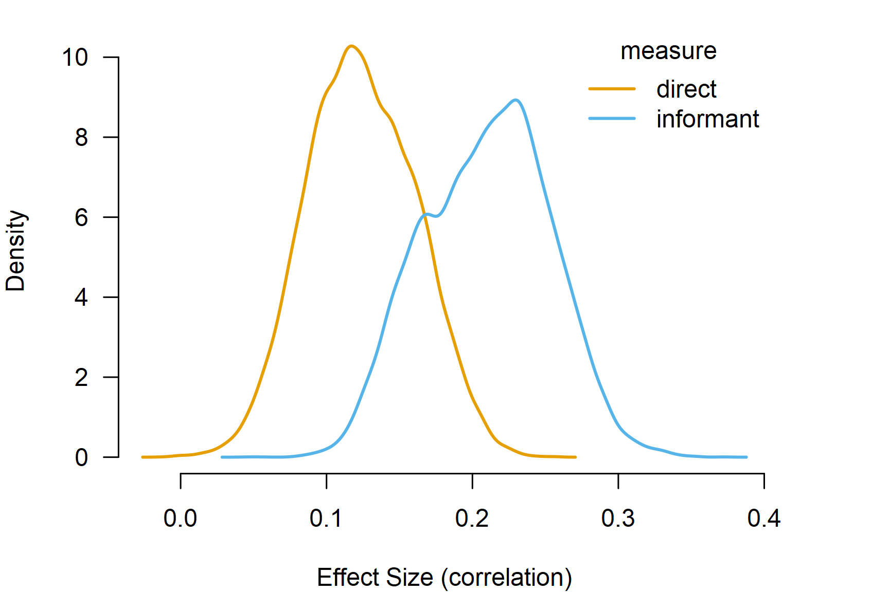
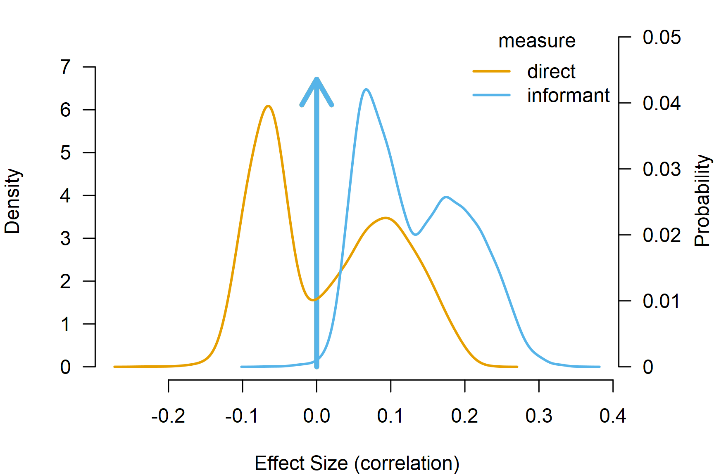

# Robust Bayesian Model-Averaged Meta-Regression

**This vignette accompanies the manuscript [Robust Bayesian
Meta-Regression: Model-Averaged Moderation Analysis in the Presence of
Publication Bias](https://doi.org/10.1037/met0000737) published at
*Psychological Methods* ([Bartoš et al.,
2025](#ref-bartos2023robust)).**

Robust Bayesian model-averaged meta-regression (RoBMA-reg) extends the
robust Bayesian model-averaged meta-analysis (RoBMA) by including
covariates in the meta-analytic model. RoBMA-reg allows for estimating
and testing the moderating effects of study-level covariates on the
meta-analytic effect in a unified framework (e.g., accounting for
uncertainty in the presence vs. absence of the effect, heterogeneity,
and publication bias). This vignette illustrates how to fit a robust
Bayesian model-averaged meta-regression using the `RoBMA` R package. We
reproduce the example from Bartoš et al.
([2025](#ref-bartos2023robust)), who re-analyzed a meta-analysis of the
effect of household chaos on child executive functions with the mean age
and assessment type covariates based on Andrews et al.
([2021](#ref-andrews2021examining))’s meta-analysis.

First, we fit a frequentist meta-regression using the `metafor` package.
Second, we explain the Bayesian meta-regression model specification, the
default prior distributions for continuous and categorical moderators,
and the standardized effect-size input specification. Third, we estimate
Bayesian model-averaged meta-regression (without publication bias
adjustment). Finally, we estimate the complete robust Bayesian
model-averaged meta-regression.

## Data

We start by loading the `Andrews2021` dataset included in the `RoBMA` R
package, which contains 39 source rows from the meta-analysis of the
effect of household chaos on child executive functions. The dataset
includes raw correlation coefficients (`ri`), sample sizes (`ni`), study
labels (`slab`), and study-level moderators such as the type of
executive function assessment (`measure`) and the mean age of the
children (`age`). The analyses below use the 36 rows with complete
effect-size inputs.

``` r

library(RoBMA)
data("Andrews2021", package = "RoBMA")
head(Andrews2021)[,c("slab", "ri", "ni", "measure", "age")]
#>            slab    ri   ni measure      age
#> 1      Hur 2015 0.070  444  direct 4.606660
#> 2 Gaertner 2012 0.033  230  direct 2.480833
#> 3    Lanza 2011 0.170   87  direct 7.750000
#> 4   Hughes 2009 0.208  125  direct 4.000000
#> 5    Berry 2016 0.270 1235  direct 4.000000
#> 6  Schmitt 2015 0.170  359  direct 4.487500
```

We use
[`metafor::escalc()`](https://wviechtb.github.io/metafor/reference/escalc.html)
to compute Fisher’s $`z`$ effect sizes directly from correlation
coefficients and sample sizes which we will use for all the subsequent
analyses.

``` r

Andrews2021_z <- metafor::escalc(
  ri = ri, ni = ni,
  measure = "ZCOR", data = Andrews2021
)
```

## Frequentist Meta-Regression

We start by fitting a frequentist meta-regression using the `metafor`
package ([Viechtbauer, 2010](#ref-metafor)). While Andrews et al.
([2021](#ref-andrews2021examining)) estimated univariate
meta-regressions for each moderator, we directly proceed by analyzing
both moderators simultaneously. The model is estimated on Fisher’s $`z`$
scale and the pooled estimates are transformed to correlation
coefficients only for reporting.

``` r

fit_rma <- metafor::rma(yi, vi, mods = ~ measure + age, data = Andrews2021_z)
fit_rma
#> 
#> Mixed-Effects Model (k = 36; tau^2 estimator: REML)
#> 
#> tau^2 (estimated amount of residual heterogeneity):     0.0151 (SE = 0.0048)
#> tau (square root of estimated tau^2 value):             0.1230
#> I^2 (residual heterogeneity / unaccounted variability): 85.55%
#> H^2 (unaccounted variability / sampling variability):   6.92
#> R^2 (amount of heterogeneity accounted for):            13.72%
#> 
#> Test for Residual Heterogeneity:
#> QE(df = 33) = 225.9817, p-val < .0001
#> 
#> Test of Moderators (coefficients 2:3):
#> QM(df = 2) = 7.1389, p-val = 0.0282
#> 
#> Model Results:
#> 
#>                   estimate      se    zval    pval    ci.lb   ci.ub    
#> intrcpt             0.0906  0.0480  1.8888  0.0589  -0.0034  0.1846  . 
#> measureinformant    0.1197  0.0482  2.4831  0.0130   0.0252  0.2142  * 
#> age                 0.0033  0.0063  0.5243  0.6000  -0.0091  0.0157    
#> 
#> ---
#> Signif. codes:  0 '***' 0.001 '**' 0.01 '*' 0.05 '.' 0.1 ' ' 1
```

The results reveal a statistically significant moderation effect of the
executive function assessment type on the effect of household chaos on
child executive functions (p = 0.013). To explore the moderation effect
further, we estimate the estimated marginal means for the executive
function assessment type using the `emmeans` R package ([Lenth et al.,
2017](#ref-emmeans)) and back-transform the estimates to correlations.

``` r

emm_rma <- emmeans::emmeans(metafor::emmprep(fit_rma), specs = "measure")
emm_rma
#>  measure   emmean     SE  df asymp.LCL asymp.UCL
#>  direct     0.112 0.0315 Inf    0.0502     0.173
#>  informant  0.232 0.0360 Inf    0.1609     0.302
#> 
#> Results are given on the r-to-z (not the response) scale. 
#> Confidence level used: 0.95
metafor::transf.ztor(as.data.frame(emm_rma)[, c("emmean", "asymp.LCL", "asymp.UCL")])
#>      emmean  asymp.LCL asymp.UCL
#> 1 0.1113543 0.05012345 0.1717511
#> 2 0.2274625 0.15955971 0.2932230
```

Studies using the informant-completed questionnaires show a stronger
effect of household chaos on child executive functions, r = 0.227, 95%
CI \[0.160, 0.293\], than the direct assessment, r = 0.111, 95% CI
\[0.050, 0.172\]; both types of studies show statistically significant
effects.

The mean age of the children does not significantly moderate the effect
(p = 0.600) with the estimated regression coefficient of b = 0.003, 95%
CI \[-0.009, 0.016\] on Fisher’s $`z`$ scale. As usual, frequentist
inference only allows us to fail to reject the null hypothesis. Here, we
try to overcome this limitation with Bayesian model-averaged
meta-regression.

## Bayesian Meta-Regression Specification

Before we proceed with the Bayesian model-averaged meta-regression, we
provide a quick overview of the regression model specification. In
contrast to frequentist meta-regression, we need to specify prior
distributions on the regression coefficients, which encode the tested
hypotheses about the presence vs. absence of the moderation (specifying
different prior distributions corresponds to different hypotheses and
results in different conclusions). Importantly, the treatment of
continuous and categorical covariates differs in the Bayesian
model-averaged meta-regression.

### Continuous vs. Categorical Moderators and Prior Distributions

The package automatically standardizes continuous moderators, which
makes the moderator prior distributions scale-invariant and keeps the
intercept prior distribution centered on the grand mean effect. This
setting can be overridden with
`standardize_continuous_predictors = FALSE`.

Categorical moderators use mean-difference contrasts by default for
model-averaged models (`set_contrast_factor_predictors = "meandif"`),
modeling deviations of each category from the grand mean effect. The
`"meandif"` contrasts achieve label invariance and the prior
distribution for the intercept corresponds to the grand mean effect.
Alternatively, `"treatment"` contrasts place prior distributions on
differences from the reference level, with the intercept corresponding
to the effect in that level.

### Prior Distributions

Note that the effect-size and heterogeneity default prior distributions
in the current (4.0) version of the package differ from those used by
`RoBMA` 3.6.1. The current default prior distributions for Bayesian
meta-analyses are calibrated to the unit-information standard deviation
of the effect-size measure, specified via the `measure` argument (see
the [*Prior
Distributions*](https://fbartos.github.io/RoBMA/articles/v01-prior-distributions.md)
vignette).

To reproduce the prior specification used in Bartoš et al.
([2025](#ref-bartos2023robust)), we specify the prior distributions
explicitly below. The old effect-size and heterogeneity prior
distributions, expressed on the fitted Fisher’s $`z`$ scale, are
specified explicitly.[^1]

``` r

prior_effect_361 <- prior("normal", list(mean = 0, sd = 0.5))
prior_heterogeneity_361 <- prior("invgamma", list(shape = 1, scale = 0.075))
```

## Bayesian Model-Averaged Meta-Regression

We fit the Bayesian model-averaged meta-regression using
[`BMA()`](https://fbartos.github.io/RoBMA/reference/BMA.md), which omits
publication-bias adjustment. We specify the Fisher’s $`z`$ effect sizes
as `yi` and their sampling variances as `vi`, and set the `measure`
argument to `"ZCOR"`, which tells
[`BMA()`](https://fbartos.github.io/RoBMA/reference/BMA.md) and
[`RoBMA()`](https://fbartos.github.io/RoBMA/reference/RoBMA.md) how to
interpret the input scale. The moderators are passed via the `mods`
formula, here `~ measure + age`. We also set `parallel = TRUE` to speed
up computation and `seed = 1` for reproducibility.

``` r

fit_BMA <- BMA(
  yi = yi, vi = vi, measure = "ZCOR",
  mods = ~ measure + age,
  prior_effect        = prior_effect_361,
  prior_heterogeneity = prior_heterogeneity_361,
  data = Andrews2021_z, parallel = TRUE, seed = 1
)
```

[`BMA()`](https://fbartos.github.io/RoBMA/reference/BMA.md) specifies
the combination of all models assuming presence vs. absence of the
effect, heterogeneity, moderation by `measure`, and moderation by `age`,
which corresponds to 2\*2\*2\*2=16 models. The new version of the
package uses product-space parameterization, which greatly improves
estimation time by fitting all of the models simultaneously within a
single MCMC.

Once the ensemble is estimated,
[`summary()`](https://rdrr.io/r/base/summary.html) reports
model-averaging results on the fitted Fisher’s $`z`$ scale. Dedicated
effect-summary helpers handle transformations to the correlation scale.

``` r

summary(fit_BMA, include_mcmc_diagnostics = FALSE)
#> 
#> Bayesian Model-Averaged Mixed-Effect Model (k = 36)
#> 
#> Component Inclusion
#>               Prior prob. Post. prob. Inclusion BF
#> Effect              0.500       1.000   >14999.000
#> Heterogeneity       0.500       1.000   >14999.000
#> 
#> Meta-Regression Inclusion
#>         Prior prob. Post. prob. Inclusion BF
#> measure       0.500       0.728        2.677
#> age           0.500       0.108        0.121
#> 
#> Common Estimates
#>      Mean    SD 0.025   0.5 0.975
#> tau 0.125 0.021 0.089 0.124 0.172
#> 
#> Meta-Regression
#>                           Mean    SD  0.025    0.5 0.975
#> intercept                0.166 0.030  0.100  0.167 0.220
#> measure[dif: direct]    -0.044 0.034 -0.105 -0.049 0.000
#> measure[dif: informant]  0.044 0.034  0.000  0.049 0.105
#> age                      0.000 0.003  0.000  0.000 0.009
pooled_effect(fit_BMA, output_measure = "COR")
#> 
#> Pooled Effect Size (correlation)
#>     Mean Median 0.025 0.975
#> mu 0.160  0.160 0.115 0.207
#> Effect estimates are transformed from Fisher's z to correlation.
```

The summary function produces output with multiple sections. The first
section contains the `Components summary` with the hypothesis test
results for the overall effect size and heterogeneity. We find
overwhelming evidence for both with inclusion Bayes factors
(`Inclusion BF`) above 10,000 (the numerical precision of Bayes factors
above 100 is usually limited by the number of posterior samples).

The second section contains the `Meta-regression components summary`
with the hypothesis test results for the moderators. We find weak
evidence for the moderation by the executive function assessment type,
$`\text{BF}_{\text{measure}} = 2.67`$. Furthermore, we find moderate
evidence for the null hypothesis of no moderation by mean age of the
children, $`\text{BF}_{\text{age}} = 0.122`$ (i.e., BF for the null is
1/0.122 = 8.20). These findings extend the frequentist meta-regression
by disentangling the absence of evidence from the evidence of absence.

The third section contains the `Model-averaged estimates` with the
model-averaged estimates for mean effect and between-study
heterogeneity.
[`pooled_effect()`](https://fbartos.github.io/RoBMA/reference/pooled_effect.md)
reports the pooled mean effect on the correlation scale via
`output_measure = "COR"`.

The fourth section contains the
`Model-averaged meta-regression estimates` with the model-averaged
regression coefficient estimates. The main difference from the usual
frequentist meta-regression output is that the categorical predictors
are summarized as a difference from the grand mean for each factor
level. Here, the `intercept` regression coefficient estimate corresponds
to the grand mean effect and the `measure[dif: direct]` regression
coefficient estimate of -0.044, 95% CI \[-0.105, 0.000\] corresponds to
the difference between the direct assessment and the grand mean. As
such, the results suggest that the effect size in studies using direct
assessment is lower in comparison to the grand mean of the studies. The
`age` regression coefficient of 0.000, 95% CI \[-0.000, 0.009\]
corresponds to the increase in the mean effect for a one-unit increase
in mean age of children.

Similarly to the frequentist meta-regression, we can use
[`marginal_means()`](https://fbartos.github.io/RoBMA/reference/marginal_means.md)
and [`summary()`](https://rdrr.io/r/base/summary.html) to obtain the
marginal estimates for each factor level on the correlation scale.

``` r

BMA_marginal <- marginal_means(fit_BMA, output_measure = "COR")
summary(BMA_marginal)
#> 
#> Model-Averaged Marginal Means (correlation):
#>                     Mean    SD 0.025   0.5 0.975 Inclusion BF
#> intercept          0.167 0.024 0.121 0.167 0.214          Inf
#> measure[direct]    0.124 0.037 0.054 0.123 0.196       23.611
#> measure[informant] 0.210 0.043 0.128 0.212 0.289          Inf
#> age[-1SD]          0.166 0.026 0.112 0.166 0.215          Inf
#> age[0SD]           0.167 0.024 0.121 0.167 0.214          Inf
#> age[1SD]           0.169 0.025 0.121 0.169 0.221          Inf
#> Effect estimates are transformed from Fisher's z to correlation.
#> mu_intercept: Posterior samples do not span both sides of the null hypothesis. The Savage-Dickey density ratio is likely to be overestimated.
#> mu_measure[informant]: Posterior samples do not span both sides of the null hypothesis. The Savage-Dickey density ratio is likely to be overestimated.
#> mu_age[-1SD]: Posterior samples do not span both sides of the null hypothesis. The Savage-Dickey density ratio is likely to be overestimated.
#> mu_age[0SD]: Posterior samples do not span both sides of the null hypothesis. The Savage-Dickey density ratio is likely to be overestimated.
#> mu_age[1SD]: Posterior samples do not span both sides of the null hypothesis. The Savage-Dickey density ratio is likely to be overestimated.
```

The estimated marginal means are similar to the frequentist results.
Studies using the informant-completed questionnaires again show a
stronger effect of household chaos on child executive functions, r =
0.210, 95% CI \[0.128, 0.289\], than the direct assessment, r = 0.124,
95% CI \[0.054, 0.196\].

The last column summarizes results from a test against a null hypothesis
of marginal means equals 0. Here, we find extreme evidence that the
effect size for studies using the informant-completed questionnaires
differs from zero, $`\text{BF}_{10} > 10{,}000`$, and strong evidence
that the effect size for studies using direct assessment differs from
zero, $`\text{BF}_{10} = 23.6`$. The test is performed using the change
from prior to posterior distribution at 0 (i.e., the Savage-Dickey
density ratio) assuming the presence of the overall effect or the
presence of difference according to the tested factor. Because the tests
use prior and posterior samples, calculating the Bayes factor can be
problematic when the posterior distribution is far from the tested
value. In such cases, warning messages are printed and
$`\text{BF}_{10} = \infty`$ returned (like here); while the actual Bayes
factor is less than infinity, it is still too large to be computed
precisely given the posterior samples.

The full model-averaged posterior marginal means distribution can be
visualized by the
[`plot()`](https://rdrr.io/r/graphics/plot.default.html) method.

``` r

par(mar = c(4, 4, 1, 4))
plot(BMA_marginal, parameter = "measure", lwd = 2)
```



## Publication-Bias-Adjusted Model-Averaged Meta-Regression

Finally, we adjust the Bayesian model-averaged meta-regression model by
fitting the robust Bayesian model-averaged meta-regression. In contrast
to the previous publication-bias-unadjusted ensemble,
[`RoBMA()`](https://fbartos.github.io/RoBMA/reference/RoBMA.md) extends
the model ensemble with a publication-bias component specified via 6
weight functions and PET-PEESE ([Bartoš et al.,
2023](#ref-bartos2021no)). The estimation time further increases as the
ensemble now contains 144 models.

``` r

fit_RoBMA <- RoBMA(
  yi = yi, vi = vi, measure = "ZCOR",
  mods = ~ measure + age,
  prior_effect        = prior_effect_361,
  prior_heterogeneity = prior_heterogeneity_361,
  data = Andrews2021_z, parallel = TRUE, seed = 1
)
```

``` r

summary(fit_RoBMA, include_mcmc_diagnostics = FALSE)
#> 
#> Robust Bayesian Model-Averaged Mixed-Effect Model (k = 36)
#> 
#> Component Inclusion
#>                  Prior prob. Post. prob. Inclusion BF
#> Effect                 0.500       0.555        1.245
#> Heterogeneity          0.500       1.000   >14999.000
#> Publication Bias       0.500       0.810        4.258
#> 
#> Meta-Regression Inclusion
#>         Prior prob. Post. prob. Inclusion BF
#> measure       0.500       0.842        5.340
#> age           0.500       0.094        0.103
#> 
#> Common Estimates
#>      Mean    SD 0.025   0.5 0.975
#> tau 0.121 0.022 0.085 0.118 0.169
#> 
#> Meta-Regression
#>                           Mean    SD  0.025    0.5 0.975
#> intercept                0.069 0.075 -0.014  0.052 0.199
#> measure[dif: direct]    -0.058 0.034 -0.117 -0.062 0.000
#> measure[dif: informant]  0.058 0.034  0.000  0.062 0.117
#> age                      0.000 0.002 -0.002  0.000 0.006
#> 
#> Publication Bias
#>                    Mean    SD 0.025   0.5  0.975
#> omega[0,0.025]    1.000 0.000 1.000 1.000  1.000
#> omega[0.025,0.05] 0.997 0.026 1.000 1.000  1.000
#> omega[0.05,0.5]   0.992 0.052 0.889 1.000  1.000
#> omega[0.5,0.95]   0.983 0.106 0.739 1.000  1.000
#> omega[0.95,0.975] 0.983 0.105 0.753 1.000  1.000
#> omega[0.975,1]    0.984 0.105 0.787 1.000  1.000
#> PET               1.294 1.214 0.000 1.401  3.087
#> PEESE             2.123 5.506 0.000 0.000 19.927
#> P-value intervals for publication bias weights omega correspond to one-sided p-values.
pooled_effect(fit_RoBMA, output_measure = "COR")
#> 
#> Pooled Effect Size (correlation)
#>     Mean Median  0.025 0.975
#> mu 0.061  0.043 -0.020 0.189
#> Effect estimates are transformed from Fisher's z to correlation.
```

All previously described functions for manipulating the fitted model
work identically with the publication bias adjusted model. As such, we
just briefly mention the main differences found after adjusting for
publication bias.

RoBMA-reg reveals moderate evidence of publication bias
$`\text{BF}_{\text{pb}} = 4.26`$. Furthermore, accounting for
publication bias turns the previously found evidence for the overall
effect into a weak evidence for the effect $`\text{BF}_{10} = 1.25`$ and
notably reduces the mean effect estimate to r = 0.061, 95% CI \[-0.020,
0.189\].

``` r

RoBMA_marginal <- marginal_means(fit_RoBMA, output_measure = "COR")
summary(RoBMA_marginal)
#> 
#> Model-Averaged Marginal Means (correlation):
#>                     Mean    SD  0.025   0.5 0.975 Inclusion BF
#> intercept          0.070 0.074  0.000 0.054 0.196        1.396
#> measure[direct]    0.013 0.088 -0.115 0.000 0.175        0.626
#> measure[informant] 0.128 0.073  0.000 0.116 0.265        6.328
#> age[-1SD]          0.069 0.074 -0.010 0.052 0.196        0.627
#> age[0SD]           0.070 0.074  0.000 0.054 0.196        1.396
#> age[1SD]           0.071 0.075 -0.004 0.055 0.200        0.643
#> Effect estimates are transformed from Fisher's z to correlation.
```

The estimated marginal means now suggest that studies using the
informant-completed questionnaires show a much smaller effect of
household chaos on child executive functions, r = 0.128, 95% CI \[0.000,
0.116\] with moderate evidence in favor of the effect,
$`\text{BF}_{10} = 6.33`$, while studies using direct assessment even
provide weak evidence against the effect of household chaos on child
executive functions, $`\text{BF}_{10} = 0.626`$, with most likely effect
sizes around zero, r = 0.013, 95% CI \[-0.115, 0.175\].

A visual summary of the estimated marginal means highlights the
considerably wider model-averaged posterior distributions of the
marginal means, a consequence of accounting and adjusting for
publication bias.

``` r

par(mar = c(4, 4, 1, 4))
plot(RoBMA_marginal, parameter = "measure", lwd = 2)
```



The Bayesian model-averaged meta-regression models are compatible with
the remaining custom specification, visualization, and summary functions
included in the `RoBMA` R package. For prior customization, see the
[*Prior
Distributions*](https://fbartos.github.io/RoBMA/articles/v01-prior-distributions.md)
vignette; for shared meta-regression plotting and diagnostics, see the
[*Bayesian
Meta-Analysis*](https://fbartos.github.io/RoBMA/articles/v02-bayesian-meta-analysis.md)
vignette.

## References

Andrews, K., Atkinson, L., Harris, M., & Gonzalez, A. (2021). Examining
the effects of household chaos on child executive functions: A
meta-analysis. *Psychological Bulletin*, *147*(1), 16–32.
<https://doi.org/10.1037/bul0000311>

Bartoš, F., Maier, M., Stanley, T., & Wagenmakers, E.-J. (2025). Robust
Bayesian meta-regression: Model-averaged moderation analysis in the
presence of publication bias. *Psychological Methods*.
<https://doi.org/10.1037/met0000737>

Bartoš, F., Maier, M., Wagenmakers, E.-J., Doucouliagos, H., & Stanley,
T. D. (2023). Robust Bayesian meta-analysis: Model-averaging across
complementary publication bias adjustment methods. *Research Synthesis
Methods*, *14*(1), 99–116. <https://doi.org/10.1002/jrsm.1594>

Lenth, R. V., Bolker, B., Buerkner, P., Giné-Vázquez, I., Herve, M.,
Jung, M., Love, J., Miguez, F., Riebl, H., & Singmann, H. (2017).
*emmeans: Estimated marginal means, aka least-squares means*.
<https://cran.r-project.org/package=emmeans>

Viechtbauer, W. (2010). Conducting meta-analyses in R with the metafor
package. *Journal of Statistical Software*, *36*(3), 1–48.
<https://www.jstatsoft.org/v36/i03/>

[^1]: `RoBMA` 3.6.1 used Cohen’s $`d`$ as the prior scale for
    correlation inputs while fitting Fisher’s $`z`$ internally. The
    prior distributions above express the old effect-size and
    heterogeneity scales on Fisher’s $`z`$ using the local approximation
    $`z \approx d / 2`$.
