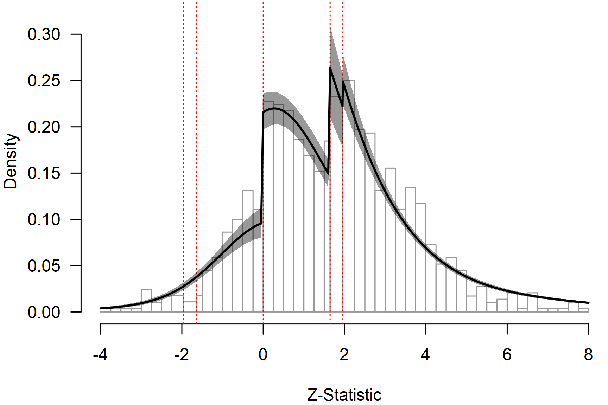

# Multilevel Robust Bayesian Model-Averaged Meta-Regression

**This vignette accompanies the manuscript [Robust Bayesian Multilevel
Meta-Analysis: Adjusting for Publication Bias in the Presence of
Dependent Effect Sizes](https://doi.org/10.31234/osf.io/9tgp2_v1)
preprinted at *PsyArXiv* ([Bartoš et al.,
2026](#ref-bartos2025robust)).**

This vignette reproduces the second example from the manuscript,
re-analyzing data from Havránková et al.
([2025](#ref-havrankova2025beauty)) on the relationship between beauty
and professional success (1,159 effect sizes from 67 studies). We
investigate whether the effect depends on the type of customer contact
(“no”, “some”, or “direct”). For the first example describing a
publication-bias-adjusted multilevel meta-analysis, see the [*Multilevel
Robust Bayesian
Meta-Analysis*](https://fbartos.github.io/RoBMA/articles/v32-robma-multilevel.md)
vignette.

## Rescaling Prior Distributions for Non-Standardized Effect Sizes

The effect sizes in this dataset are not standardized: they are percent
increases in earnings associated with a one-standard-deviation increase
in beauty. Therefore, the prior distributions need to be defined on this
outcome scale. Overly narrow prior distributions would make it difficult
to find evidence for the effect because both models would predict
effects very close to zero. Overly wide prior distributions would bias
the results towards the null hypothesis because alternative models would
predict unrealistically large effects. The 4.0 version of the `RoBMA` R
package handles this automatically by estimating the unit-information
standard deviation (UISD) and rescaling the prior distributions
appropriately (see the [*Prior
Distributions*](https://fbartos.github.io/RoBMA/articles/v01-prior-distributions.md)
vignette).

To reproduce the RoBMA 3.6.1 version results that used different prior
distribution formulation and scaling settings we need to specify the
prior distributions manually.[^1]

``` r

prior_effect_361        <- prior("normal",   list(mean = 0, sd = 25.8))
prior_heterogeneity_361 <- prior("invgamma", list(shape = 1, scale = 0.15 * 25.8))
prior_mods_361          <- list(
  facing_customer = prior_factor("mnormal", list(mean = 0, sd = 0.25 * 25.8), contrast = "meandif")
)
prior_bias_361          <- list(
  prior_weightfunction("two-sided", c(0.05),             wf_cumulative(c(1, 1)),       prior_weights = 1/12),
  prior_weightfunction("two-sided", c(0.05, 0.10),       wf_cumulative(c(1, 1, 1)),    prior_weights = 1/12),
  prior_weightfunction("one-sided", c(0.05),             wf_cumulative(c(1, 1)),       prior_weights = 1/12),
  prior_weightfunction("one-sided", c(0.025, 0.05),      wf_cumulative(c(1, 1, 1)),    prior_weights = 1/12),
  prior_weightfunction("one-sided", c(0.05, 0.5),        wf_cumulative(c(1, 1, 1)),    prior_weights = 1/12),
  prior_weightfunction("one-sided", c(0.025, 0.05, 0.5), wf_cumulative(c(1, 1, 1, 1)), prior_weights = 1/12),
  prior_PET("Cauchy", list(0, 1), list(0, Inf), 1/4),
  prior_PEESE("Cauchy", list(0, 5 / 25.8), list(0, Inf), 1/4)
)
```

We fit the robust Bayesian multilevel meta-regression using the
[`RoBMA()`](https://fbartos.github.io/RoBMA/reference/RoBMA.md)
function. We specify the effect sizes via `yi`, standard errors via
`sei`, and the effect-size scale via the `measure = "GEN"` argument. The
moderator `facing_customer` is specified via the formula syntax using
the `mods` argument. The multilevel structure, i.e., effect sizes nested
within studies `study_id`, is specified using the `cluster` argument.
Finally, we specify the RoBMA 3.6.1 equivalent prior distributions in
the `prior_*` arguments (omitting them would result in a model fit using
the current default prior distributions based on the UISD).

``` r

fit_reg <- RoBMA(
  yi = y, sei = se, measure = "GEN",
  mods = ~ facing_customer,
  cluster = study_id,
  prior_effect              = prior_effect_361,
  prior_heterogeneity       = prior_heterogeneity_361,
  prior_mods                = prior_mods_361,
  prior_bias                = prior_bias_361,
  sample = 20000, burnin = 10000, adapt = 10000,
  thin = 5, parallel = TRUE, seed = 1,
  data = Havrankova2025
)
```

The meta-regression can take more than an hour to run with parallel
processing enabled.

## Interpreting the Results

The [`summary()`](https://rdrr.io/r/base/summary.html) function reports
inclusion Bayes factors and model parameters.

``` r

summary(fit_reg, include_mcmc_diagnostics = FALSE)
#> 
#> Robust Bayesian Model-Averaged Multilevel Mixed-Effect Model (k = 1159, clusters = 67)
#> 
#> Component Inclusion
#>                  Prior prob. Post. prob. Inclusion BF
#> Effect                 0.500       1.000   >59999.000
#> Heterogeneity          0.500       1.000   >59999.000
#> Publication Bias       0.500       1.000   >59999.000
#> 
#> Meta-Regression Inclusion
#>                 Prior prob. Post. prob. Inclusion BF
#> facing_customer       0.500       1.000   >59999.000
#> 
#> Common Estimates
#>      Mean    SD 0.025   0.5 0.975
#> tau 4.525 0.380 3.863 4.495 5.344
#> rho 0.819 0.033 0.748 0.821 0.879
#> 
#> Meta-Regression
#>                                Mean    SD  0.025    0.5  0.975
#> intercept                     3.030 0.556  1.941  3.027  4.123
#> facing_customer[dif: No]     -2.224 0.435 -3.083 -2.222 -1.384
#> facing_customer[dif: Some]    1.010 0.514  0.000  1.006  2.008
#> facing_customer[dif: Direct]  1.214 0.407  0.420  1.211  2.015
#> 
#> Publication Bias
#>                    Mean    SD 0.025   0.5 0.975
#> omega[0,0.025]    1.000 0.000 1.000 1.000 1.000
#> omega[0.025,0.05] 0.891 0.107 0.669 0.905 1.000
#> omega[0.05,0.5]   0.494 0.054 0.395 0.492 0.606
#> omega[0.5,0.95]   0.222 0.038 0.156 0.219 0.305
#> omega[0.95,0.975] 0.222 0.038 0.156 0.219 0.305
#> omega[0.975,1]    0.222 0.038 0.156 0.219 0.305
#> PET               0.000 0.000 0.000 0.000 0.000
#> PEESE             0.000 0.000 0.000 0.000 0.000
#> P-value intervals for publication bias weights omega correspond to one-sided p-values.
```

The effect-size estimates are obtained with dedicated helpers:
[`pooled_effect()`](https://fbartos.github.io/RoBMA/reference/pooled_effect.md)
for the average effect and
[`marginal_means()`](https://fbartos.github.io/RoBMA/reference/marginal_means.md)
for the moderator levels.

The multilevel RoBMA meta-regression finds extreme evidence for the
presence of the average effect, moderation by the degree of consumer
contact, between-study heterogeneity, and publication bias (all BFs \>
10,000).

``` r

pooled_effect(fit_reg)
#> 
#> Pooled Effect Size
#>     Mean Median 0.025 0.975
#> mu 3.230  3.227 2.146 4.319
```

The model-averaged effect estimate is accompanied by considerable
overall heterogeneity and a cluster-level allocation close to 1,
indicating a high degree of similarity among estimates from the same
study. MCMC diagnostics are included in
[`summary()`](https://rdrr.io/r/base/summary.html) by default, and
chain-level checks are available via
[`plot_diagnostic_trace()`](https://fbartos.github.io/RoBMA/reference/plot_diagnostic.md),
[`plot_diagnostic_density()`](https://fbartos.github.io/RoBMA/reference/plot_diagnostic.md),
and
[`plot_diagnostic_autocorrelation()`](https://fbartos.github.io/RoBMA/reference/plot_diagnostic.md).

The average effect is moderated by the degree of consumer contact. To
examine the effect at each level of the moderator, we use the estimated
marginal means.

``` r

mm_reg <- marginal_means(fit_reg)
summary(mm_reg)
#> 
#> Model-Averaged Marginal Means:
#>                          Mean    SD  0.025   0.5 0.975 Inclusion BF
#> intercept               3.030 0.556  1.941 3.027 4.123          Inf
#> facing_customer[No]     0.805 0.712 -0.606 0.807 2.199        0.108
#> facing_customer[Some]   4.040 0.792  2.494 4.037 5.589          Inf
#> facing_customer[Direct] 4.244 0.643  2.992 4.240 5.515          Inf
#> mu_intercept: Posterior samples do not span both sides of the null hypothesis. The Savage-Dickey density ratio is likely to be overestimated.
#> mu_facing_customer[Some]: Posterior samples do not span both sides of the null hypothesis. The Savage-Dickey density ratio is likely to be overestimated.
#> mu_facing_customer[Direct]: Posterior samples do not span both sides of the null hypothesis. The Savage-Dickey density ratio is likely to be overestimated.
```

The estimated marginal means reveal moderate evidence for the absence of
an effect for jobs with no consumer contact and extreme evidence for an
effect for jobs with some or direct consumer contact.

## Visual Fit Assessment

We visualize model fit using the meta-analytic zplot ([Bartoš &
Schimmack, 2025](#ref-bartos2025zcurve)); see the [*Zplot
Publication-Bias
Diagnostics*](https://fbartos.github.io/RoBMA/articles/v36-zplot.md)
vignette for more details. The zplot shows the distribution of the
observed $`z`$-statistics, computed as the effect size divided by the
standard error, with dotted red horizontal lines highlighting the
typical steps on which publication bias operates. These are
$`z = \pm 1.65`$ and $`z = \pm 1.96`$, corresponding to marginally
significant and statistically significant $`p`$-values, and $`z = 0`$,
corresponding to selection on the direction of the effect.

``` r

par(mar = c(4, 4, 0, 0))
zplot(fit_reg, by.hist = 0.25, plot_extrapolation = FALSE, from = -4, to = 8)
```



We can notice clear discontinuities corresponding to selection on the
direction of the effect and marginal significance. The posterior
predictive density from the multilevel RoBMA meta-regression indicates
that the model approximates the observed data reasonably well, capturing
the discontinuities and the proportion of statistically significant
results. This supports the model fit even after adjusting for
publication bias.

## References

Bartoš, F., Maier, M., & Wagenmakers, E.-J. (2026). Robust Bayesian
multilevel meta-analysis: Adjusting for publication bias in the presence
of dependent effect sizes. *Behavior Research Methods*.
<https://doi.org/10.31234/osf.io/9tgp2_v1>

Bartoš, F., & Schimmack, U. (2025). Zplot: A visual diagnostic for
publication bias in meta-analysis. In *arXiv*.
<https://doi.org/10.48550/arXiv.2509.07171>

Havránková, Z., Havránek, T., Bortnikova, K., & Bartoš, F. (2025).
*Meta-analysis of field studies on beauty and professional success*.

[^1]: This reproduces the RoBMA 3.6.1 vignette results. It does not
    match the current default UISD scaling conventions exactly; in
    particular, the current default moderator and PEESE scales differ
    and are therefore specified below.
